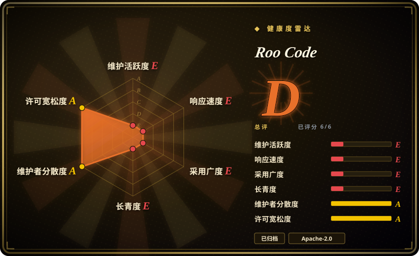
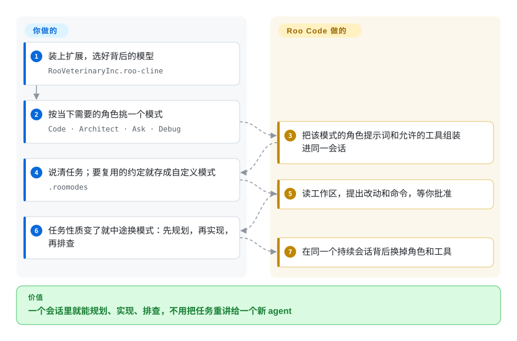

# Roo Code

「按角色分模式」的 agent——Code / Architect / Ask / Debug，加上各自带工具集的自定义模式——就出自这里；仓库已于 2026-05-15 归档，团队同时关停了扩展、云端和 Router，整体转向另一个产品。把它当设计和 `.roomodes` 格式来读，别在它上面开新项目。

## 何时使用

只有两种情形。第一种是你已经在用：仓库里有 `.roomodes`，团队依赖若干自定义模式，而扩展自 2026-05-15 起再没发过版本——那你需要的是迁移方案，不是提需求。第二种是你在设计自己的 agent，想看一个成熟的编辑器扩展怎么把**模式做成一等对象**：slug、角色定义、每个模式自己的自定义指令，以及对工具组（`read`、`edit`、`command`、`mcp`、`modes`、`browser`）的显式白名单——不改会话就能改 agent 的能力边界。这个设计才是本页留在索引里的理由。

至于迁移去哪，项目自己的 sunset 公告已经给了答案：想要模型无关的开源扩展就推荐去 [Cline](cline.zh.md)，怀念云端 agent 的人则被引到 roomote.dev。[Kilo Code](kilocode.zh.md) 是这条血脉上另一个仍在维护的后继。两者都活着，Roo Code 不是。

## 怎么用起来

Roo Code 是一个把模型包进**模式机**的 VS Code 扩展。模式不是提示词预设——它带着角色定义、自己的自定义指令，以及一份允许使用的工具组清单，所以「Architect」能读能规划，而「Code」还能改文件、跑命令，且共用同一个对话。你可以在任务中途切模式：对话继续，但背后的指令和可用工具一起换掉。可复用的模式写在仓库里的 `.roomodes` 文件，让团队约定像 lint 配置一样可评审；它还刻意设计成能与「原版 Cline」扩展并排运行而不是取而代之，这也是很多人两个都装的原因。

<!-- flow-steps:begin (generated from flows/roo-code.json by tools/flow_card.py — do not edit) -->

流程文字版

1. **你**：装上扩展，选好背后的模型 — `RooVeterinaryInc.roo-cline`
2. **你**：按当下需要的角色挑一个模式 — `Code · Architect · Ask · Debug`
3. **Roo Code**：把该模式的角色提示词和允许的工具组装进同一会话
4. **你**：说清任务；要复用的约定就存成自定义模式 — `.roomodes`
5. **Roo Code**：读工作区，提出改动和命令，等你批准
6. **你**：任务性质变了就中途换模式：先规划，再实现，再排查
7. **Roo Code**：在同一个持续会话背后换掉角色和工具

**价值**：一个会话里就能规划、实现、排查，不用把任务重讲给一个新 agent

<!-- flow-steps:end -->

## 何时不用

- **你正在为今天选一个 coding agent。** 仓库已归档、产品已关停，不会再有安全修复和新模型支持。用 [Cline](cline.zh.md)（项目自己的 sunset 公告就推荐它）或 [Kilo Code](kilocode.zh.md)。
- **你的威胁模型要求厂商能响应 CVE。** 一个仍能接触你仓库和 API key 的归档扩展，在安全响应上是死路；无论换成哪个，都要确认它还在持续发版。
- **你在等承诺过的社区接手。** 最后的 changelog 说会有社区团队把它继续做下去，但本次复核没有找到有实质采用度的维护中后继仓库。[未验证] 请把「有人在维护」当作未证实信息。
- **你要的是 CLI 或云端 agent，不是扩展。** 那是另外两个产品（Roo Code Cloud、Roo Code Router），随扩展一起关停；同一个团队的下一站是 Roomote——另一个架构的云端 agent，许可证被 GitHub 标为 `NOASSERTION`。
- **你需要一个稳定的扩展 API 供自动化长期依赖。** 接口冻结在 v3.54.0，之后会与 VS Code 和模型 API 逐渐脱节，钉在它上面的构建有一个已知的到期日。

## 横向对比

| 替代品 | 是否收录 | 我们的评价 | 取舍 |
|---|---|---|---|
| [Cline](cline.zh.md) | ✅ | 选 Cline：Roo Code 自己的 sunset 公告就把它推荐为要迁过去的模型无关开源扩展，它也是这条血脉上更大、仍在发版的上游。 | 你保留了大体形状（开源 VS Code agent、BYOK、逐步批准），换来持续发版；代价是 Roo Code 的模式机没了，得用规则文件和自定义指令自己重建。 |
| [Kilo Code](kilocode.zh.md) | ✅ | 如果你真正看重的是「按角色分模式」的工作流，选 Kilo Code——它是带模式的维护中后继，另加编排层和开源 JetBrains 插件。 | 比 Cline 更贴近 Roo Code 的心智模型，代价是项目更年轻、自己的接口也在快速变。 |
| [Continue](continue.zh.md) | ✅ | 两者都不是活选项：Continue 在最终 2.0.0 之后转为只读。只把它们当设计参考来比——这边是模式，那边是一份共用的 `config.yaml`。 | Continue 的配置驱动模型更适合编辑器与 CLI 共享；Roo Code 的模式在单个编辑器内更丰富。两份代码都已冻结。 |
| Cursor | 非仓库 | 只有在你打算彻底放弃开源扩展时才选 Cursor；它是闭源编辑器，不是 `.roomodes` 工作流的迁移目标。 | 精致且集成度高，但没有按成本 BYOK、agent 不可查看，你的模式变成无法提交入库的专有设置。 |

## 技术栈

- **语言：** TypeScript（GitHub 元数据，2026-09-22）。
- **入口：** 一个 VS Code Marketplace 扩展（`RooVeterinaryInc.roo-cline`），设计为与原版 Cline 扩展并排运行。JetBrains 桥接与云端／Router 是独立仓库，同样已关停。
- **模式模型：** 内置 Code / Architect / Ask / Debug 四种模式加自定义模式；仓库根目录的 `.roomodes` 定义 slug、名称、角色定义、自定义指令和允许的工具组（`read`、`edit`、`command`、`mcp`、`modes`、`browser`）。
- **模型：** 模型无关；早期发行说明提到继承自 Cline 的 `.clinerules` 支持，以及 OpenRouter 压缩等 provider 特性。

## 依赖

- **必需：** VS Code（或兼容 VS Code 的编辑器），以及一个 LLM provider key 或网关。扩展就是唯一运行时。
- **可选：** 想要更多工具就接 MCP server；用 `.roo/` 目录和 `.rooignore` 放项目规则与排除项。
- **没有需要运行的服务。** 曾经配套的云端和 Router 已在 2026-05-15 关停，因此既没有服务端依赖，也不会再有来自那边的修复。

## 运维难度

**跑起来很低，接手却无法挽回。** 安装配置就是普通的扩展活，没有东西需要运维。难点全在退出：代码已冻结，此后每一次 VS Code API 变动、provider 变动或依赖 CVE 都落到你头上。请按「迁移项目」而不是「维护任务」来做预算——`.roomodes` 的定义可以映射到 Cline 的规则文件或 Kilo Code 的模式，但映射是手工的。

## 健康度与可持续性

- **维护活跃度——有意归档。** 仓库于 2026-05-15 归档，最终版本为 v3.54.0；Marketplace 页面自那天起未再更新。这是关停，不是失修。
- **治理集中度——组织把自己改造成了另一个产品。** `RooCodeInc` 现在以 Roomote 示人，博客指向 roomote.dev；sunset 公告明说团队判断 IDE 不是编程的未来。
- **采用广度——留下了一批庞大的存量用户。** GitHub 约 2.43 万 star；VS Code Marketplace 约 200 万装机；sunset 公告自称扩展安装量超过 300 万。搁浅的用户规模，正是迁移指引比代码本身更重要的原因。
- **风险——代码可 fork，但巴士系数归零。** Apache-2.0 意味着法律上可以分叉，事实上也有数千个分叉，但本次没有找到有实质采用度的维护中分叉。[未验证]
- **长青度速读。** 归档时项目约 1.9 岁——还没到 Lindy 先验能帮忙的年龄，而年龄也救不了一个已归档的项目。

## 存疑（未验证）

- [未验证] 未发现有实质采用度的社区后继仓库；最终 changelog 承诺的「社区团队接手」截至 2026-09-22 仍无法证实。
- [推断] 与 Cline 的血脉关系，是从项目自家文档称其为「Roo Cline（现 Roo Code）」并描述为与「原版 Cline」并排运行推断而来——是命名与设计的传承，不是 GitHub fork 关系（该仓库未标记为 fork）。
- [未验证] star 数与 Marketplace 装机量为 2026-09-22 的时点读数；「300 万装机」是 sunset 公告的自述。
- [未验证] Roomote 的许可证被 GitHub 标为 `NOASSERTION`；它是否属于 OSI 意义上的开源未能确定，因此只作为背景提及，不作为已收录的替代品。
- [未验证] 「`.clinerules` 支持继承自 Cline」这一说法依据的是 Roo Code 的发行说明（v2.1.2／v2.1.9），未与 Cline 自身的历史交叉核对。
