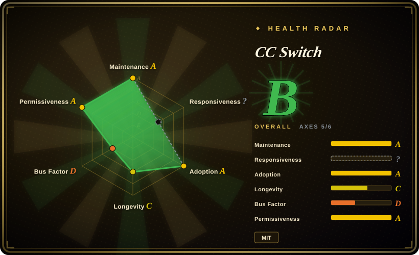
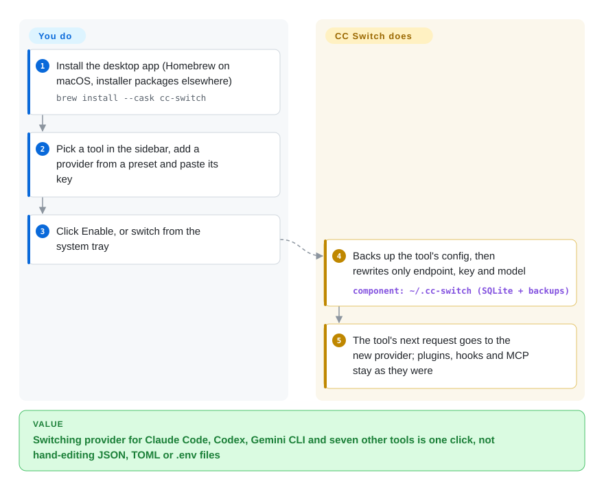

# CC Switch

Moving Claude Code from the official API to a cheaper provider means editing `~/.claude/settings.json`; doing the same for Codex means a TOML file, Gemini CLI a `.env`, and the MCP servers you added have to be re-entered in each tool. CC Switch is a desktop app that holds all your providers, MCP servers, skills and prompts in one place and rewrites each tool's config for you when you click a provider — for Claude Code, Codex, Gemini CLI, OpenCode, OpenClaw, Hermes and four other tools.

## When to use

You use two or three AI coding CLIs on your laptop and keep changing what sits behind them: the official Claude subscription in the morning, a relay or a Kimi/GLM endpoint when you hit the rate limit, an OpenAI key for Codex. Each switch is a hand edit in a different file format, sometimes followed by a broken config because you overwrote the hooks you had added. You reach for CC Switch because it turns that into picking a card in a GUI or the system tray: it stores providers in its own database, writes only the endpoint, key and model into each tool's config (backing up the original first), and keeps MCP servers, skills and `CLAUDE.md`/`AGENTS.md` prompts in one library that it syncs to whichever tools you tick.

Pick it over [Claude Code Router](../../../api-gateway/claude-code-router.md) when you manage several different CLIs and want a GUI with presets, usage stats and session browsing more than rule-based routing for Claude Code. Its optional *Routing* mode also runs a local proxy that converts API formats (so Claude Code can call a GPT model and Codex a Claude model) and fails over between providers.

## How it works

CC Switch is a Tauri desktop app — a Rust backend with a web-based React interface — that keeps everything in a SQLite database under `~/.cc-switch`. **You** add providers (90+ presets, or a custom endpoint), choose which one each tool should use, and pick which MCP servers, skills and prompts go to which tool. **It** does the file work: on switch it backs up the tool's config, rewrites only the connection fields, and leaves everything else alone; Claude Code picks the change up immediately, while Codex, Gemini CLI and Grok Build need a restart. In *Direct* mode the tool talks straight to the provider and CC Switch can even be uninstalled without breaking anything; in *Routing* mode the tool is pointed at `127.0.0.1`, where CC Switch's local proxy translates between Anthropic, OpenAI and Gemini request formats and moves to the next provider in a failover queue when one fails — so in that mode the app must stay running. Think of it as a switchboard operator who rewires each tool's phone line for you, rather than a new phone.

<!-- flow-steps:begin (generated from flows/cc-switch.json by tools/flow_card.py — do not edit) -->

Text version of the flow

1. **You**: Install the desktop app (Homebrew on macOS, installer packages elsewhere) — `brew install --cask cc-switch`
2. **You**: Pick a tool in the sidebar, add a provider from a preset and paste its key
3. **You**: Click Enable, or switch from the system tray
4. **CC Switch**: Backs up the tool's config, then rewrites only endpoint, key and model — component: `~/.cc-switch (SQLite + backups)`
5. **CC Switch**: The tool's next request goes to the new provider; plugins, hooks and MCP stay as they were

**Value**: Switching provider for Claude Code, Codex, Gemini CLI and seven other tools is one click, not hand-editing JSON, TOML or .env files

<!-- flow-steps:end -->

## When NOT to use

- **You only use one tool with one provider.** There is nothing to switch; edit the tool's own config once and skip the extra app and its database.
- **You work on a headless server, over SSH, or in CI.** CC Switch is a GUI app (Linux needs glibc 2.35+ and WebKitGTK 4.1); for terminal-only machines the README itself points to the community CC Switch CLI (not indexed), or use [Claude Code Router](../../../api-gateway/claude-code-router.md), which also ships a Node.js CLI path.
- **You need a shared, governed model gateway for a team.** CC Switch is single-user desktop software with no RBAC, budgets or audit; use [LiteLLM](../../../api-gateway/litellm.md) as a central proxy with virtual keys, spend limits and logging instead.
- **You plan to use its "Accounts" feature or the sponsored relays to stretch subscriptions.** The README warns that using GitHub Copilot, ChatGPT or xAI subscriptions outside their official clients may violate the vendors' terms, and it advertises third-party relays selling discounted access to official models. If ToS compliance or data handling matters, use direct official API keys or your organisation's gateway such as [LiteLLM](../../../api-gateway/litellm.md), not a relay.
- **You want to avoid switching altogether.** If the real need is "use many models", a single model-agnostic agent such as [OpenCode](../terminal-agents/opencode.md) may remove the reason to juggle several CLIs.
- **You need a vendor-backed tool with a deep maintainer bench.** One personal account authors the vast majority of commits; if that is a blocker, prefer [LiteLLM](../../../api-gateway/litellm.md) (company-backed) for the routing part and the tools' own configs for the rest.

## Comparison

| Alternative | In index | Our verdict | Tradeoff |
| --- | --- | --- | --- |
| [Claude Code Router](../../../api-gateway/claude-code-router.md) | ✅ | Pick Claude Code Router when Claude Code is your main tool and you want conditional per-task model routing inside Claude Code, with a CLI path that works without a desktop; pick CC Switch when you juggle several CLIs and want one GUI for providers, MCP, skills and prompts. | Router gives finer per-request routing and a CLI form; CC Switch covers ten tools and config management beyond routing but needs a desktop. |
| [LiteLLM](../../../api-gateway/litellm.md) | ✅ | Pick LiteLLM when a team needs one governed endpoint with virtual keys, budgets and logs; pick CC Switch for one developer switching providers on a laptop. | LiteLLM is a server you deploy and operate, with real access control; CC Switch is zero-server but has no multi-user controls. |
| CC Switch CLI | not indexed | Pick the community CLI for servers and SSH sessions; pick the desktop app when you have a GUI and want tray switching, session browsing and usage charts. | Shares the `~/.cc-switch` data and WebDAV sync with the desktop app, but is a separate project whose supported database version can lag behind. |
| [OpenCode](../terminal-agents/opencode.md) | ✅ | Pick OpenCode if you can standardise on one model-agnostic agent and stop switching CLIs; pick CC Switch when you need to keep using Claude Code, Codex and Gemini CLI side by side. | OpenCode removes the switching problem at the cost of leaving vendor CLIs; CC Switch keeps your tools but adds another app to maintain. |

## Tech stack

- **Tauri 2** desktop framework with a **Rust** backend and a **React 18 + TypeScript** frontend; uses the OS webview.
- **SQLite** (`~/.cc-switch/cc-switch.db`) for providers, MCP servers, prompts, skills, projects and usage records; JSON settings and timed backups alongside.
- **Local routing proxy** converting between Anthropic Messages, OpenAI Chat Completions, OpenAI Responses and Gemini formats, with failover queue and circuit breaker.
- **Sync & integration:** WebDAV or S3-compatible cloud sync, `ccswitch://` deep links, skills.sh / GitHub skill install.

## Dependencies

- A desktop OS: Windows 10+, macOS 12+, or Linux (x86_64/ARM64) with glibc 2.35+ and WebKitGTK 4.1 — RHEL/Rocky/Alma 8–9 are not supported yet.
- The CLIs you want to manage, installed separately (CC Switch's Apps page can also install and upgrade them).
- API keys or subscriptions for each provider; optional WebDAV/S3 storage for cross-device sync.

## Ops difficulty

**Low.** It is a desktop installer (signed and notarized on macOS) with an auto-updater and no server to run; data and backups live in `~/.cc-switch`. The caveats are local: in Routing or Aggregation mode the app must stay running because tools point at `127.0.0.1` (and WSL2 needs mirrored networking to reach it), some tools need restarts after a switch, and releases arrive in quick bursts (v4.0.0 through v4.0.4 shipped in four days), so expect occasional regressions.

## Health & viability

- **Maintenance (2026-10-08):** very active — the v4 line landed in early October 2026 (v4.0.4 stable on 2026-10-07 after four prereleases), with commits most days.
- **Governance:** grade D. A single personal account (`farion1231`, the MIT copyright holder "Jason Young") holds 81.8% of commits and the top three hold 87.8%, across 97 contributors active in the trailing 12 months; there is no organisation or foundation behind it.
- **Backing & funding:** sponsorship from model vendors and API relay resellers, advertised at the top of the README — a revenue source that also biases which providers are promoted.
- **Age / Lindy:** about 14 months old (430 days; created 2025-08), longevity C.
- **Adoption:** grade A from release and Homebrew downloads; ~141k stars.
- **Overall:** radar grade B; responsiveness is not scored (`?`).
- **Risk flags:** MIT, no relicense history; the README insists `ccswitch.io` is the only official website, which suggests look-alike download sites exist — install only from GitHub releases or Homebrew.

## Caveats (unverified)

- [推断] ~141k stars on a 14-month-old desktop utility likely reflects heavy promotion in Chinese developer communities as much as sustained use.
- [推断] The "only official website" warning implies impersonating download sites; none were examined.
- [未验证] The terms-of-service risk of the Accounts feature and of sponsored relays was not assessed against each vendor's current terms; the README's own warning is the source.
- [未验证] Behaviour of the local routing proxy under failure (e.g. partial streams during failover) was not tested.
- [推断] Because CC Switch writes into ten tools' config formats, upstream format changes in any of them can break switching until CC Switch updates.
