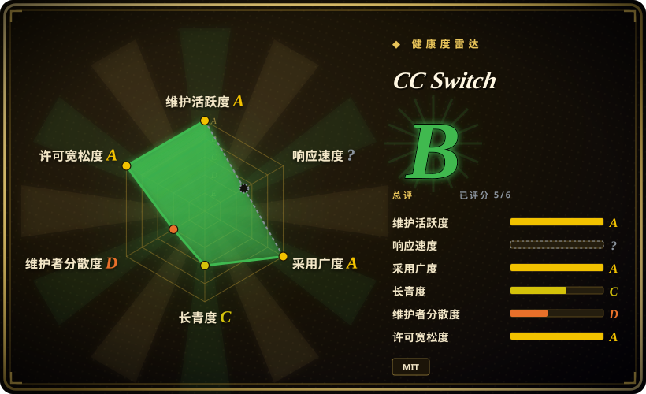
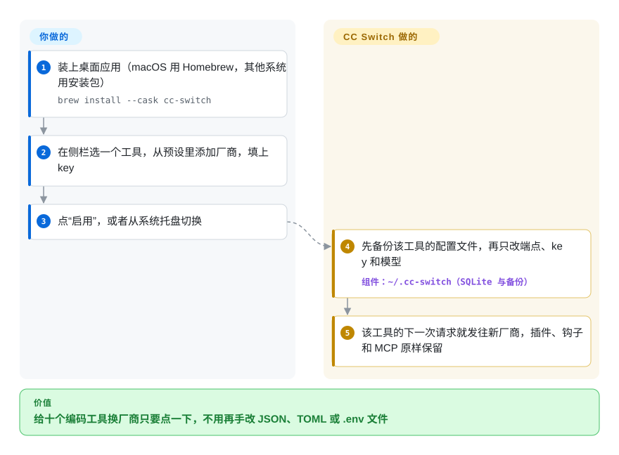

# CC Switch

把 Claude Code 从官方 API 换到更便宜的厂商，要改 `~/.claude/settings.json`；Codex 也换一遍，要改一个 TOML 文件，Gemini CLI 又是 `.env`，你加过的 MCP 服务器还得在每个工具里各填一遍。CC Switch 是一个桌面应用，把你所有的厂商、MCP 服务器、技能和提示词放在一处，你点一下某个厂商，它就替你改写对应工具的配置——支持 Claude Code、Codex、Gemini CLI、OpenCode、OpenClaw、Hermes 等十个工具。

## 何时使用

你的笔记本上装了两三个 AI 编码 CLI，后面接的厂商经常在换：早上用官方 Claude 订阅，撞到限额就切到中转站或者 Kimi/GLM 的端点，Codex 用的又是 OpenAI 的 key。每次切换都是在不同格式的文件里手改一遍，有时还因为覆盖掉了自己加的 hooks 把配置改坏。你选 CC Switch，是因为它把这件事变成在界面或系统托盘里点一张卡片：厂商存在它自己的数据库里，切换时只往各工具的配置里写端点、key 和模型（写之前先备份原文件），MCP 服务器、技能和 `CLAUDE.md`/`AGENTS.md` 提示词集中放在一个库里，你勾选哪些工具就同步到哪些工具。

和 [Claude Code Router](../../../api-gateway/claude-code-router.zh.md) 比，当你要管好几个不同的 CLI，更需要一个带预设、用量统计和会话浏览的图形界面，而不是只给 Claude Code 做规则路由时，选 CC Switch。它可选的“路由”模式还会跑一个本地代理，在不同 API 格式之间转换（于是 Claude Code 能调 GPT 模型、Codex 能调 Claude 模型），并在厂商之间自动故障切换。

## 怎么用起来

CC Switch 是一个 Tauri 桌面应用——Rust 写的后端加一个基于网页技术的 React 界面——所有数据存在 `~/.cc-switch` 下的一个 SQLite 数据库里。**你**负责添加厂商（90 多个预设，或自定义端点），为每个工具选用哪个厂商，再决定哪些 MCP 服务器、技能和提示词发给哪个工具。**它**负责改文件：切换时先备份该工具的配置，只改连接相关的字段，其他内容一概不动；Claude Code 立刻生效，Codex、Gemini CLI 和 Grok Build 需要重启。在“直连”模式下，工具直接连厂商，就算卸载 CC Switch 也不会坏；在“路由”模式下，工具被指向 `127.0.0.1`，由 CC Switch 的本地代理在 Anthropic、OpenAI 和 Gemini 的请求格式之间翻译，某个厂商失败时按故障切换队列换下一个——所以这种模式下应用必须一直开着。可以把它想成一个替你给每部电话改接线路的接线员，而不是一部新电话。

<!-- flow-steps:begin (generated from flows/cc-switch.json by tools/flow_card.py — do not edit) -->

流程文字版

1. **你**：装上桌面应用（macOS 用 Homebrew，其他系统用安装包） — `brew install --cask cc-switch`
2. **你**：在侧栏选一个工具，从预设里添加厂商，填上 key
3. **你**：点“启用”，或者从系统托盘切换
4. **CC Switch**：先备份该工具的配置文件，再只改端点、key 和模型 — 组件：`~/.cc-switch（SQLite 与备份）`
5. **CC Switch**：该工具的下一次请求就发往新厂商，插件、钩子和 MCP 原样保留

**价值**：给十个编码工具换厂商只要点一下，不用再手改 JSON、TOML 或 .env 文件

<!-- flow-steps:end -->

## 何时不用

- **你只用一个工具、一个厂商。** 没什么可切换的；把工具自己的配置改一次就行，省掉多一个应用和它的数据库。
- **你在无界面服务器、SSH 会话或 CI 里工作。** CC Switch 是图形界面应用（Linux 需要 glibc 2.35+ 和 WebKitGTK 4.1）；纯终端机器上，README 自己推荐社区维护的 CC Switch CLI（未收录），或者改用 [Claude Code Router](../../../api-gateway/claude-code-router.zh.md)，它也提供 Node.js 的 CLI 用法。
- **你需要给团队用的、受管控的模型网关。** CC Switch 是单用户桌面软件，没有 RBAC、预算和审计；改用 [LiteLLM](../../../api-gateway/litellm.zh.md) 做中心代理，它有虚拟 key、消费上限和日志。
- **你打算用它的“账号”功能或赞助商中转站来薅订阅。** README 自己警告：在官方客户端之外使用 GitHub Copilot、ChatGPT 或 xAI 的订阅可能违反厂商条款；它还在顶部给以折扣价转售官方模型的第三方中转站打广告。如果服务条款合规或数据去向要紧，用官方 API key 直连或你们组织的网关（比如 [LiteLLM](../../../api-gateway/litellm.zh.md)），不要走中转站。
- **你想干脆不再切换。** 如果真正的需求是“用很多模型”，换成一个不绑定模型的智能体，比如 [OpenCode](../terminal-agents/opencode.zh.md)，也许就没必要同时折腾几个 CLI 了。
- **你需要有厂商背书、维护者梯队厚的工具。** 绝大多数提交出自一个个人账号；如果这是硬伤，路由部分改用有公司支持的 [LiteLLM](../../../api-gateway/litellm.zh.md)，其余部分用各工具自己的配置。

## 横向对比

| 替代品 | 是否收录 | 我们的评价 | 取舍 |
| --- | --- | --- | --- |
| [Claude Code Router](../../../api-gateway/claude-code-router.zh.md) | ✅ | Claude Code 是你的主力工具，想在它内部按任务做条件化的模型路由，而且要能脱离桌面用 CLI 跑，选 Claude Code Router；同时折腾好几个 CLI、想用一个图形界面管厂商、MCP、技能和提示词，选 CC Switch。 | Router 的单请求路由更细，有 CLI 形态；CC Switch 覆盖十个工具，管的不只是路由，但需要桌面环境。 |
| [LiteLLM](../../../api-gateway/litellm.zh.md) | ✅ | 团队需要一个带虚拟 key、预算和日志的受管入口，选 LiteLLM；一个开发者在笔记本上切换厂商，选 CC Switch。 | LiteLLM 是要你部署和运维的服务器，有真正的访问控制；CC Switch 不用服务器，但没有多用户管控。 |
| CC Switch CLI | 未收录 | 服务器和 SSH 会话里用社区版 CLI；有图形界面、想要托盘切换、会话浏览和用量图表，用桌面版。 | 和桌面版共用 `~/.cc-switch` 数据和 WebDAV 同步，但它是独立项目，支持的数据库版本有时落后于桌面版。 |
| [OpenCode](../terminal-agents/opencode.zh.md) | ✅ | 能统一到一个不绑定模型的智能体、不再切换 CLI，选 OpenCode；必须让 Claude Code、Codex、Gemini CLI 并存使用，选 CC Switch。 | OpenCode 从根上消除了切换问题，代价是离开厂商自家的 CLI；CC Switch 保住你现有的工具，但多了一个要维护的应用。 |

## 技术栈

- **Tauri 2** 桌面框架，**Rust** 后端，**React 18 + TypeScript** 前端；使用操作系统自带的 webview。
- **SQLite**（`~/.cc-switch/cc-switch.db`）存厂商、MCP 服务器、提示词、技能、项目和用量记录；旁边是 JSON 设置和定时备份。
- **本地路由代理**：在 Anthropic Messages、OpenAI Chat Completions、OpenAI Responses 和 Gemini 格式之间转换，带故障切换队列和熔断。
- **同步与集成：** WebDAV 或兼容 S3 的云同步，`ccswitch://` 深链接，从 skills.sh / GitHub 安装技能。

## 依赖

- 桌面操作系统：Windows 10+、macOS 12+，或带 glibc 2.35+ 和 WebKitGTK 4.1 的 Linux（x86_64/ARM64）——暂不支持 RHEL/Rocky/Alma 8–9。
- 你要管理的各个 CLI 需单独安装（CC Switch 的“应用”页也能帮你安装和升级）。
- 每个厂商的 API key 或订阅；跨设备同步可选 WebDAV/S3 存储。

## 运维难度

**低。** 它是带自动更新的桌面安装包（macOS 版经过签名和公证），没有服务器要跑；数据和备份都在 `~/.cc-switch`。要注意的都在本机：路由或聚合模式下工具指向 `127.0.0.1`，应用必须一直开着（WSL2 要切到镜像网络模式才能访问到）；有些工具切换后要重启；版本常常集中连发（v4.0.0 到 v4.0.4 四天发完），偶尔出回归要有心理准备。

## 健康度与可持续性

- **维护（2026-10-08）：** 非常活跃——v4 系列在 2026 年 10 月初落地（四个预发布之后，v4.0.4 正式版发布于 2026-10-07），大多数日子都有提交。
- **治理：** 治理集中度 D。一个个人账号（`farion1231`，即 MIT 版权人“Jason Young”）占 81.8% 的提交，前三名占 87.8%，过去 12 个月共有 97 位活跃贡献者；背后没有组织或基金会。
- **背书与资金：** 资金来自模型厂商和 API 中转转售商的赞助，广告就挂在 README 顶部——这是收入来源，也会影响它重点推荐哪些厂商。
- **年龄 / Lindy：** 约 14 个月（430 天，2025-08 创建），长青度 C。
- **采用：** 按发布包和 Homebrew 下载计，采用广度 A；约 14.1 万 star。
- **总评：** 雷达总评 B；响应速度未评分（`?`）。
- **风险信号：** MIT，无改许可历史；README 反复强调 `ccswitch.io` 是唯一官网，说明存在仿冒下载站——只从 GitHub Releases 或 Homebrew 安装。

## 存疑（未验证）

- [推断] 一个 14 个月大的桌面小工具有约 14.1 万 star，很可能既有持续使用，也有在中文开发者社区大量推广的成分。
- [推断] “唯一官网”的提醒意味着存在仿冒下载站；没有逐个查看。
- [未验证] “账号”功能和赞助中转站的服务条款风险没有逐一对照各厂商现行条款评估；依据是 README 自己的警告。
- [未验证] 本地路由代理在故障时的行为（比如故障切换时的半截流式响应）没有测试。
- [推断] CC Switch 要写十个工具的配置格式，其中任何一个上游改格式，都可能在 CC Switch 跟进之前让切换失效。
