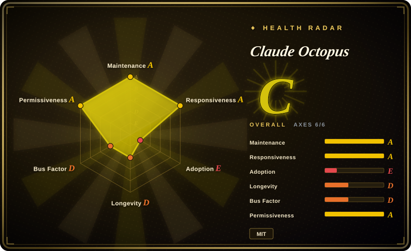
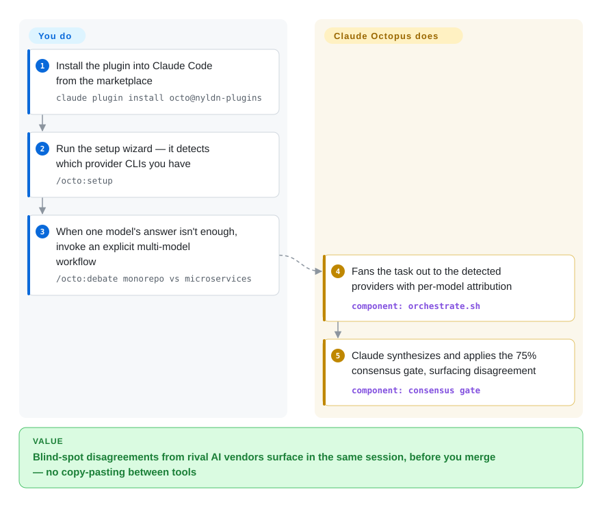

# Claude Octopus

Claude answers confidently and your blind spot ships with it — a security hole it waved through, a design no second model ever saw. Claude Octopus is a Claude Code plugin that reruns the same task through up to 12 external AI providers (Codex, Copilot, Antigravity, Ollama, Perplexity, OpenRouter, Grok, Kimi Code, …) and gates the result on their disagreement: a 75% consensus check surfaces dissent before you merge, driven by `/octo:*` slash commands.

## When to use

You're already living inside Claude Code as your primary agent, and you've been burned by a confident-but-wrong answer that shipped — a security hole Claude waved through, a dependency choice no one cross-checked, a design Claude liked but a second model would have flagged. You don't want to leave your harness and paste prompts into five other tools by hand; you want a second (and third, and thirteenth) opinion *in the same session*. Claude Octopus installs as a plugin and gives you commands like `/octo:research`, `/octo:security`, `/octo:debate`, and `/octo:council` that dispatch the same task to whichever provider CLIs you have installed — twelve external integrations (Codex, Antigravity CLI, Copilot, Qwen, Ollama, Perplexity, OpenRouter, OrcaRouter, OpenCode, Cursor CLI, Grok, Kimi Code) alongside the Claude host — then has Claude synthesize the results and apply a consensus gate so split decisions surface before you merge rather than after.

It fits best when you treat the extra models as a *review/research panel* layered on top of Claude's orchestration, and keep Claude-native for the ordinary path: the project's own stance is "Claude-native first, Octopus for escalation", and installed Octopus stays dormant until you explicitly run `/octo:*`. The structured workflows are the draw — the Double Diamond lifecycle (`/octo:embrace`: Discover → Define → Develop → Deliver), multi-LLM councils with quorum and veto gates (`/octo:council`), adversarial review, and spec-to-software autonomous runs (`/octo:factory`). If you already pay for ChatGPT/Copilot/Cursor subscriptions or run Ollama locally, several seats cost nothing extra — Claude is the only required provider; everything else is auto-detected and optional.

## How it works

Octopus is orchestration by dispatch, not a new model. When you run `/octo:debate`, `/octo:council`, `/octo:review`, etc., `orchestrate.sh` fans your prompt out over the provider CLIs/APIs it detected (each provider is an arm — a `codex`, `agy`, `ollama`, OpenRouter HTTP call, …), collects their answers *with per-provider attribution*, and hands them to Claude for synthesis behind a 75% consensus gate, so disagreement is reported rather than averaged away. What stays yours: installing and authenticating each provider, paying for the tokens (per-run cost projections come from `/octo:costs`), and the final merge decision — Octopus never auto-activates on plain prompts by default; you invoke `/octo:*`, it doesn't reach for itself. Lifecycle hooks attach to Claude Code for state (session start/end, tool use, compaction), results and logs land in `~/.claude-octopus/`, and an MCP server exposes the same workflows to non-Claude-Code hosts like Cursor.

<!-- flow-steps:begin (generated from flows/claude-octopus.json by tools/flow_card.py — do not edit) -->

Text version of the flow

1. **You**: Install the plugin into Claude Code from the marketplace — `claude plugin install octo@nyldn-plugins`
2. **You**: Run the setup wizard — it detects which provider CLIs you have — `/octo:setup`
3. **You**: When one model's answer isn't enough, invoke an explicit multi-model workflow — `/octo:debate monorepo vs microservices`
4. **Claude Octopus**: Fans the task out to the detected providers with per-model attribution — component: `orchestrate.sh`
5. **Claude Octopus**: Claude synthesizes and applies the 75% consensus gate, surfacing disagreement — component: `consensus gate`

**Value**: Blind-spot disagreements from rival AI vendors surface in the same session, before you merge — no copy-pasting between tools

<!-- flow-steps:end -->

<!-- flow-steps:begin (generated from flows/claude-octopus.json by tools/flow_card.py — do not edit) -->
<!-- flow-steps:end -->

## When NOT to use

- **You don't use Claude Code.** This is a Claude Code *plugin* first, not a standalone orchestrator. It requires Claude Code v2.1.14+ as the host (Cursor via MCP server, Codex CLI, and OpenCode installs exist but are secondary surfaces). If your harness is plain LangGraph/AutoGen/DSPy, this gives you nothing — see the comparison below.
- **You want a vendor-neutral multi-agent framework.** Claude is hard-wired as the required orchestrator/synthesizer; the architecture is "Claude conducts, others advise." If you need a framework where any model can be the controller, this is the wrong shape.
- **You want ambient automation.** Default is dormant-by-design: Octopus does nothing until you type `/octo:*`, and the router that inspects ordinary prompts to *suggest* routes is described by the project itself as "legacy opt-in"; the `invoke` mode can dispatch paid providers on your plain prompts. If you wanted an agent harness that cross-checks on its own, that's a different product.
- **You aren't willing to install and authenticate a pile of provider CLIs.** The multi-AI value is proportional to how many of `codex`/`agy`/`qwen`/`ollama`/`grok`/`cursor` you have working, plus keys for Perplexity/OpenRouter/OrcaRouter (`XAI_API_KEY`, `OPENROUTER_API_KEY`, …). With only Claude installed you get personas, workflows, and gates around a single model — real, but not the headline feature.
- **Cost / latency sensitivity.** Fanning one task across many models multiplies token spend and wall-clock time and pulls in paid providers — the project's own illustrative estimates put a council run at $0.50–2.50 and a full multi-provider `embrace` at $1.00–6.00+ in tokens alone (rates checked 2026-09-22; Qwen's free OAuth tier ended 2026-04-15). A consensus run is not cheap.
- **You need reproducible, auditable orchestration logic.** Behavior lives across ~54 slash commands, 31 personas, 63 skills, hooks, and an MCP server, mostly in Shell (~91% of the repo) — a large, fast-moving surface (292 releases; v10 changed `doctor --json` exit codes, v11 made the MCP tools require an absolute `project_root`) you're coupling to. Debugging a bad dispatch means tracing through that plugin layer.
- **Single-vendor / data-egress constraints.** Routing your code and prompts to OpenAI, Google (Antigravity), GitHub, xAI, Moonshot, Perplexity, OpenRouter and others may violate data-handling policy; Ollama-only mode narrows but does not eliminate this. Windows needs WSL — native Git Bash/MSYS2/Cygwin are not supported.

## Comparison

| Alternative | In index | Our verdict | Tradeoff |
|---|---|---|---|
| [oh-my-claudecode](oh-my-claudecode.md) | ✅ | When your bottleneck is *coordinating many Claude agents on one build* (team pipelines, routing, tmux workers), pick oh-my-claudecode; pick Octopus when the bottleneck is *one model's blind spots* and you want rival vendors cross-checking it. | Both are Claude Code plugin layers, but their axis differs: OMC's Team pipeline parallelizes Claude itself; Octopus fans one task across 12 external providers and gates on disagreement. |
| [DSPy](../../workflow-builders/dspy.md) | ✅ | Choose DSPy when you need model-agnostic prompt/pipeline *optimization* you own in Python — compile-style tuning, not an in-harness review panel; it runs outside any coding-agent CLI. | Programmatic prompt/pipeline optimization framework, model-agnostic and library-shaped; you write Python, not slash commands. Different layer entirely — compilation vs. an in-harness review panel. |
| [AgentScope](../../agent-runtimes/agent-sdks/agentscope.md) | ✅ | Choose AgentScope when you're *building* a multi-agent application (your own runtime, any model as controller) rather than adding cross-vendor review to a Claude Code session you already run. | General multi-agent runtime/library you build apps on; not a Claude-Code-bound plugin and not opinionated about "blindspot consensus." |
| [Symphony](../../agent-runtimes/agent-services/symphony.md) | ✅ | Choose Symphony when you want unattended coding-agent runs driven by your Linear board (issue → isolated workspace → Codex run → PR), i.e. *task* orchestration; Octopus is *judgment* orchestration inside one session. | OpenAI's polling orchestrator for Codex runs, Elixir service with tracker integration; vendor-anchored the opposite way (OpenAI conducts) and it runs headless jobs, not a review panel. |
| [openfang](../../agent-runtimes/agent-services/openfang.md) | ✅ | Choose openfang when you need scheduled autonomous agents running 24/7 as a single Rust binary with channel adapters; Octopus only wakes when you type `/octo:*` inside a Claude Code session. | Rust "agent OS" — scheduler, WASM sandbox, persistence, messaging channels; different execution model (always-on hands on a timer vs. explicit in-session fan-out). |
| crystal / claude-squad | 未收录 | Choose crystal or claude-squad when you need multiple parallel Claude Code sessions/worktrees. | Run multiple parallel Claude Code *sessions/worktrees*; parallelism is across Claude instances, not across *different vendors' models* reviewing one task. |

## Tech stack

- **Language:** Shell (~91% of the repo), with TypeScript (~4%, the MCP server), Python, and Go templates (per GitHub language stats, 2026-09-27).
- **Host:** Claude Code plugin — registers `/octo:*` slash commands, lifecycle hooks via `.claude-plugin/hooks.json` (session start/end, prompt submit, tool use, compaction, plan mode, worktrees, task lifecycle, idle, config change, permission events), routines (schedule + GitHub-event automations, shipped disabled), and an MCP server that exposes 12 tools to other clients.
- **Providers (CLI/API-dispatched):** Claude (required, orchestrator/synthesizer) plus 12 external integrations: Codex (OpenAI), Antigravity CLI (`agy`), GitHub Copilot, Qwen, Ollama (local), Perplexity, OpenRouter, OrcaRouter, OpenCode, Cursor CLI, Grok (xAI), Kimi Code — and an optional `claude-sdk` second Anthropic seat. The former Gemini CLI provider is retired.
- **Concepts:** Double Diamond lifecycle (Discover/Define/Develop/Deliver), `/octo:council` (structured 3/5/7-seat deliberation with quorum + critical-veto gates), `/octo:factory` autonomous spec-to-software pipeline, 31 personas, 54 commands, 63 skills, a 75% consensus quality gate, a "reaction engine" for CI/review events on agent PRs, an `octopus` CLI for doctor/repair, and memory integration with claude-mem / agentmemory / deja-vu. [推断] Exact persona/skill/command counts are the project's own framing and shift release-to-release.

## Dependencies

- **Required:** Claude Code v2.1.14+ (v2.1.129+ with an explicit opt-in flag for Anthropic-compatible gateway model discovery), and an Anthropic/Claude entitlement to run the orchestrator. Linux/macOS native; on Windows, inside WSL.
- **Optional provider CLIs (the actual value):** `codex`, `agy`, `qwen`, `ollama`, `grok`, `cursor` (agent), OpenCode, Kimi Code; plus API keys for Perplexity (`PERPLEXITY_API_KEY`), OpenRouter (`OPENROUTER_API_KEY`), xAI (`XAI_API_KEY`), OrcaRouter, and `OPENAI_API_KEY` where OAuth isn't used. "Claude is required; all others are optional and auto-detected."
- **For the MCP server (Cursor/standalone):** Node.js + npm (`npm install` in `mcp-server/`).
- **State:** results in `~/.claude-octopus/results/`, logs in `~/.claude-octopus/logs/`, per-project state in `.octo/`.
- **Install:** `claude plugin marketplace add https://github.com/nyldn/plugins.git` then `claude plugin install octo@nyldn-plugins`, then `/octo:setup` inside a session.

## Ops difficulty

**Low to install, medium-to-high to run well.** Getting the plugin in is one marketplace command plus a setup wizard (`/octo:setup` detects installed providers and walks you through the rest), and with only Claude it works out of the box. Difficulty rises with each provider you actually want contributing: installing and authenticating multiple vendor CLIs, managing several API keys/subscriptions, and reasoning about cost and latency when one command fans out to many models (the plugin ships `/octo:costs` projections, `/octo:usage` attribution, and an `octopus agent-summary` ledger of which providers contributed vs. failed). The large Shell-based surface and fast release cadence (292 releases, last push 2026-09-26, with v10/v11 carrying migration guides) mean you're maintaining against a moving target, and debugging a misfiring dispatch or hook means reading through plugin internals. Data-egress review is on you, since prompts/code leave to third-party providers.

## Health & viability

- **Responsiveness**: Grade A — median first-response time 7.8 hours across 39 qualifying issues/PRs.
- **Maintenance — very active (as of 2026-09).** Last push 2026-09-26, current release v11.9.2 published the same day; 292 releases — the project moved v9 → v10 → v11 in under four months, each with migration docs. Not archived; maintained at a pace that reads as frantic, and the churn is the flip side (see "When NOT to use").
- **Governance & bus factor — single-maintainer / personal repo.** Owned by an individual GitHub account (`nyldn`), not an org or foundation; the health radar measures ~87% of the 12-month commit share on the top contributor. For a tool you wire into every session, that is a bus-factor-of-one risk. [推断]
- **Age & Lindy — young, unproven.** Created 2026-01, ~8 months old (as of 2026-09). High activity but no track record; by the age × still-active heuristic it is "active but unproven," not a Lindy-safe bet — its longevity is undemonstrated, and adoption is thin for its age (radar grade E, no registry package).
- **Risk flags — fan-out surface + data egress.** The value depends on routing prompts/code to third-party providers (OpenAI/Google/Perplexity/OpenRouter/xAI…), and behavior spans a large fast-moving Shell/TS surface that has already broken contracts twice across majors (v10 exit codes, v11 MCP `project_root`); relicense risk is low (MIT) but operational/coupling risk is real.

## Caveats (unverified)

- [未验证] "75% consensus quality gate," "31 personas / 54 commands / 63 skills," and the per-run cost-estimate table are the project's own README claims (rates dated 2026-09-22 there); not independently verified, and counts drift across releases.
- [推断] Real-world quality uplift from multi-model "blindspot" consensus is a design claim; whether disagreement reliably catches bugs/security issues is not demonstrated by an independent benchmark here.
- [推断] The "primary language: Shell" framing reflects line counts; the orchestration semantics also live in TypeScript (MCP) and prompt/skill markdown, so language % understates where logic sits.
- [未验证] Frontier model defaults (Opus 5.5 / GPT-5.6 Sol / Sonnet 5 roster, Fable 5.1 and GPT-6 Astra as explicit-only seats) are the README's current release-notes framing and change quickly; behavior under model churn was not tested.
- [未验证] Provider auth details (Qwen free OAuth tier ended 2026-04-15; which seats fall back to OAuth vs. require keys; Kimi `config.toml` credentials) come from the README and may change.
