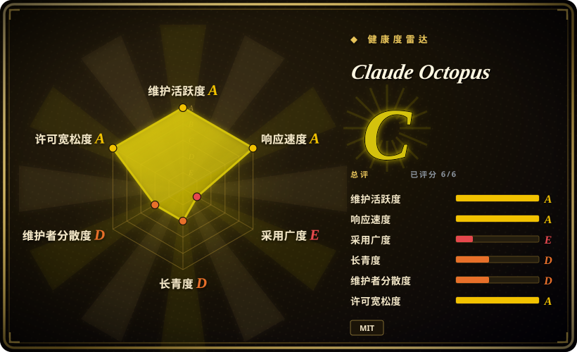
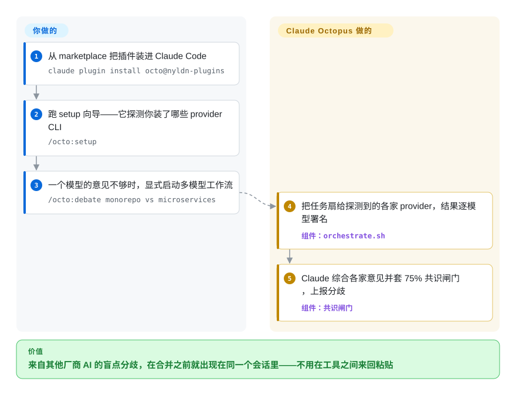

# Claude Octopus

Claude 答得自信，你的盲点就跟着一起上线——它放过的安全漏洞、没人交叉核对的设计。Claude Octopus 是一个 Claude Code 插件，把同一个任务再跑一遍给至多 12 个外部 AI provider（Codex、Copilot、Antigravity、Ollama、Perplexity、OpenRouter、Grok、Kimi Code 等）看，并用它们的分歧来做闸门：75% 共识检查在合并之前就把不一致摆到你面前，全部由 `/octo:*` 斜杠命令驱动。

## 何时使用

你已经把 Claude Code 当作主力 agent，而且被“自信但错误”的答案坑过——Claude 放过的一个安全漏洞、没人交叉核对就拍板的依赖选型、Claude 自己喜欢但换个模型就会质疑的设计。你不想离开自己的 harness、手动把 prompt 粘到另外五个工具里；你想在*同一个会话里*拿到第二（以及第三、第十三个）意见。Claude Octopus 以插件形式安装，给你 `/octo:research`、`/octo:security`、`/octo:debate`、`/octo:council` 这类命令，把同一个任务分发给你已装好的各家 provider CLI——Claude 宿主之外有 12 个外部集成（Codex、Antigravity CLI、Copilot、Qwen、Ollama、Perplexity、OpenRouter、OrcaRouter、OpenCode、Cursor CLI、Grok、Kimi Code）——再由 Claude 汇总结果并套一个共识闸门，让分歧在合并前而不是合并后浮现。

它最适合的用法，是把这些额外模型当成叠在 Claude 编排之上的*评审 / 调研小组*，而把 Claude 原生能力留给日常路径：项目自己的口号就是「Claude 原生优先，Octopus 用于升级处理」，装好之后它默认蛰伏，直到你显式敲 `/octo:*`。结构化工作流才是卖点——Double Diamond 生命周期（`/octo:embrace`：Discover → Define → Develop → Deliver）、带法定人数与一票否决闸门的多家 LLM 议事会（`/octo:council`）、对抗式评审、以及从 spec 直达软件的自治流水线（`/octo:factory`）。如果你本就为 ChatGPT/Copilot/Cursor 订阅付费，或者本地跑 Ollama，好几个席位不多花一分钱——Claude 是唯一必需的 provider，其余都自动探测、可选。

## 怎么用起来

Octopus 的编排靠“分发”，不是新模型。你敲 `/octo:debate`、`/octo:council`、`/octo:review` 这类命令后，`orchestrate.sh` 把你的 prompt 扇给探测到的各家 provider CLI/API（每个 provider 是一条触手——`codex`、`agy`、`ollama`、OpenRouter HTTP 调用……），带着*逐模型署名*收回答案，再交给 Claude 做综合，并套上 75% 共识质量闸门——分歧是被上报的，不是被平均掉的。仍然归你管的：安装并认证每个 provider、付 token 钱（`/octo:costs` 给出跑前花费预估），以及最终合并的决定权——默认它绝不在你的普通 prompt 上自动激活，你敲 `/octo:*`，它不会自己伸手。生命周期 hooks 挂在 Claude Code 上维护状态（会话起止、工具调用、compaction），结果与日志落在 `~/.claude-octopus/`，一个 MCP server 把同样的工作流暴露给 Cursor 等非 Claude Code 宿主。

<!-- flow-steps:begin (generated from flows/claude-octopus.json by tools/flow_card.py — do not edit) -->

流程文字版

1. **你**：从 marketplace 把插件装进 Claude Code — `claude plugin install octo@nyldn-plugins`
2. **你**：跑 setup 向导——它探测你装了哪些 provider CLI — `/octo:setup`
3. **你**：一个模型的意见不够时，显式启动多模型工作流 — `/octo:debate monorepo vs microservices`
4. **Claude Octopus**：把任务扇给探测到的各家 provider，结果逐模型署名 — 组件：`orchestrate.sh`
5. **Claude Octopus**：Claude 综合各家意见并套 75% 共识闸门，上报分歧 — 组件：`共识闸门`

**价值**：来自其他厂商 AI 的盲点分歧，在合并之前就出现在同一个会话里——不用在工具之间来回粘贴

<!-- flow-steps:end -->

<!-- flow-steps:begin (generated from flows/claude-octopus.json by tools/flow_card.py — do not edit) -->
<!-- flow-steps:end -->

## 何时不用

- **你不用 Claude Code。** 这是一个 Claude Code *插件*，不是独立编排器，需要 Claude Code v2.1.14+ 作宿主（Cursor 经 MCP server、Codex CLI、OpenCode 都有替代安装方式，但属次要表面）。如果你的 harness 是纯 LangGraph/AutoGen/DSPy，它给不了你什么——见下方对比。
- **你想要一个厂商中立的多 agent 框架。** Claude 被硬编码为必需的编排器 / 综合者，架构是“Claude 指挥、其他模型建言”。如果你需要任何模型都能当控制器的框架，形状就不对。
- **你想要随身的自动化。** 默认形态就是刻意蛰伏：你不敲 `/octo:*` 它什么都不做，而那个会检视普通 prompt 并*建议*路由的 router，被项目自己称为「legacy opt-in」；`invoke` 模式还可能拿你的普通 prompt 去分发付费 provider。如果你要的是一个会自己交叉核对的 agent harness，那是别的产品。
- **你不愿意安装并认证一堆 provider CLI。** 多 AI 价值与你跑通了多少个 `codex`/`agy`/`qwen`/`ollama`/`grok`/`cursor`、外加 Perplexity/OpenRouter/OrcaRouter 的 key（`XAI_API_KEY`、`OPENROUTER_API_KEY` 等）成正比。只装 Claude 时你拿到的是套在单模型外的人设、工作流和闸门——真实存在，但不是招牌功能。
- **对成本 / 延迟敏感。** 把一个任务扇给多个模型会成倍放大 token 花费和墙钟时间，并拉进付费 provider——按项目自己给出的示意估算，一次 council 约 $0.50–2.50，一次完整多 provider `embrace` 仅 token 就 $1.00–6.00+（费率核对于 2026-09-22；Qwen 的免费 OAuth 档已于 2026-04-15 结束）。一次共识跑下来并不便宜。
- **你需要可复现、可审计的编排逻辑。** 行为分散在约 54 个斜杠命令、31 个 persona、63 个 skill、hooks 和一个 MCP server 里，约九成是 Shell——一个庞大且快速迭代的表面（292 次发布；v10 改了 `doctor --json` 退出码，v11 让 MCP 工具必须传绝对 `project_root`），你会被它绑定。排查一次错误分发意味着穿过这层插件内部。
- **单厂商 / 数据出域约束。** 把你的代码和 prompt 路由给 OpenAI、Google（Antigravity）、GitHub、xAI、Moonshot、Perplexity、OpenRouter 等，可能违反数据处理政策；仅用 Ollama 模式能收窄但消除不了这点。Windows 需要 WSL——原生 Git Bash/MSYS2/Cygwin 不受支持。

## 横向对比

| 替代品 | 是否收录 | 我们的评价 | 取舍 |
|---|---|---|---|
| [oh-my-claudecode](oh-my-claudecode.zh.md) | ✅ | 瓶颈是*让多个 Claude agent 协同干一个大活*（team 流水线、路由、tmux worker）时，选 oh-my-claudecode；瓶颈是*一个模型的盲点*、要让别的厂商来交叉核对时，选 Octopus。 | 两者都是 Claude Code 插件层，但轴向不同：OMC 的 Team 流水线并行的是 Claude 自己；Octopus 把一个任务扇给 12 个外部 provider 并以分歧为闸门。 |
| [DSPy](../../workflow-builders/dspy.zh.md) | ✅ | 需要自己用 Python 掌握的、模型无关的 prompt / pipeline*优化*（编译式调参）时选 DSPy——它跑在任何 coding-agent CLI 之外，不是会话内评审组。 | 程序化 prompt / pipeline 优化框架，模型无关、库形态；你写 Python 而非斜杠命令。层次完全不同——是编译，而非 harness 内的评审小组。 |
| [AgentScope](../../agent-runtimes/agent-sdks/agentscope.zh.md) | ✅ | 当你要*构建*一个多 agent 应用（自己的运行时、任何模型都能当控制器），而不是给已有的 Claude Code 会话加跨厂商评审时，选 AgentScope。 | 通用多 agent 运行时 / 库，你在其上构建应用；不绑 Claude Code，也不对“盲点共识”持立场。 |
| [Symphony](../../agent-runtimes/agent-services/symphony.zh.md) | ✅ | 要无人值守、由 Linear 看板驱动的 coding-agent 运行（issue → 隔离工作区 → Codex 执行 → PR），即*任务*编排时选 Symphony；Octopus 做的是单个会话内的*判断*编排。 | OpenAI 出品的 Codex 轮询编排器（Elixir 服务、接 tracker）；厂商锚定正好相反（OpenAI 指挥），跑的是无人值守作业而非评审小组。 |
| [openfang](../../agent-runtimes/agent-services/openfang.zh.md) | ✅ | 需要按计划 7×24 自主跑动的 agent（单个 Rust 二进制、自带消息通道适配）时选 openfang；Octopus 只在你在 Claude Code 会话里敲 `/octo:*` 时才醒。 | Rust「agent 操作系统」——调度器、WASM 沙箱、持久化、消息通道；执行模型完全不同（常驻定时的 Hand vs. 会话内显式扇出）。 |
| crystal / claude-squad | 未收录 | 需要并行跑多个 Claude Code 会话/worktree 时，选 crystal 或 claude-squad。 | 并行跑多个 Claude Code *会话/worktree*；并行发生在多个 Claude 实例之间，而非*不同厂商模型*评审同一个任务。 |

## 技术栈

- **语言：** Shell（约占仓库 91%），TypeScript（约 4%，即 MCP server）、Python 与 Go 模板（据 GitHub 语言统计，2026-09-27）。
- **宿主：** Claude Code 插件——注册 `/octo:*` 斜杠命令、经 `.claude-plugin/hooks.json` 挂生命周期 hooks（会话起止、prompt 提交、工具调用、compaction、plan 模式、worktree、任务生命周期、idle、配置变更、权限事件）、routines（定时 + GitHub 事件自动化，默认全部关闭），以及一个对外暴露 12 个工具的 MCP server。
- **Providers（经 CLI/API 分发）：** Claude（必需，编排器 / 综合者），外加 12 个外部集成：Codex（OpenAI）、Antigravity CLI（`agy`）、GitHub Copilot、Qwen、Ollama（本地）、Perplexity、OpenRouter、OrcaRouter、OpenCode、Cursor CLI、Grok（xAI）、Kimi Code——另有一个可选的 `claude-sdk` 第二席 Anthropic。原 Gemini CLI provider 已退役。
- **概念：** Double Diamond 生命周期（Discover/Define/Develop/Deliver）、`/octo:council`（3/5/7 席结构化议事，带法定人数与关键一票否决闸门）、`/octo:factory` 从 spec 到软件的自治流水线、31 个 persona、54 个命令、63 个 skill、75% 共识质量闸门、用于 agent PR 的 CI/review 事件“reaction engine”、做体检与修复的 `octopus` CLI，以及 claude-mem / agentmemory / deja-vu 的记忆集成。[推断] persona/skill/命令的确切数量是项目自己的表述，会随版本变化。

## 依赖

- **必需：** Claude Code v2.1.14+（用 Anthropic 兼容网关的模型发现需 v2.1.129+ 且显式开启），以及运行编排器所需的 Anthropic/Claude 权限。Linux/macOS 原生；Windows 需在 WSL 内运行。
- **可选 provider CLI（真正的价值所在）：** `codex`、`agy`、`qwen`、`ollama`、`grok`、`cursor`（agent）、OpenCode、Kimi Code；外加 Perplexity（`PERPLEXITY_API_KEY`）、OpenRouter（`OPENROUTER_API_KEY`）、xAI（`XAI_API_KEY`）、OrcaRouter 的 API key，以及不走 OAuth 时的 `OPENAI_API_KEY`。“Claude 必需，其余全部可选并自动探测。”
- **MCP server（Cursor/独立）：** Node.js + npm（在 `mcp-server/` 里 `npm install`）。
- **状态：** 结果在 `~/.claude-octopus/results/`，日志在 `~/.claude-octopus/logs/`，逐项目状态在 `.octo/`。
- **安装：** `claude plugin marketplace add https://github.com/nyldn/plugins.git`，再 `claude plugin install octo@nyldn-plugins`，然后在会话内 `/octo:setup`。

## 运维难度

**安装低，跑好则中到高。** 装插件就是一条 marketplace 命令加一个 setup 向导（`/octo:setup` 会探测已装 provider 并带你补齐配置），只用 Claude 时开箱即用。难度随你真正想让其贡献的 provider 数量上升：要安装并认证多个厂商 CLI、管理多份 API key/订阅，还要在一条命令扇给多模型时权衡成本与延迟（插件自带 `/octo:costs` 预估、`/octo:usage` 归因，以及记录哪些 provider 真正贡献 / 失败的 `octopus agent-summary` 台账）。庞大的 Shell 表面和快速发版节奏（292 次发布，最后推送 2026-09-26，v10/v11 都带迁移指南）意味着你在对着一个移动靶维护，排查分发或 hook 故障要读插件内部。数据出域审查得你自己来，因为 prompt/代码会发往第三方 provider。

## 健康度与可持续性

- **响应速度**：Grade A——中位首次响应时间 7.8 小时，基于 39 个 qualifying issues/PRs。
- **维护——非常活跃（截至 2026-09）。** 最后推送 2026-09-26，当前发布 v11.9.2 当天落地；共 292 次发布——不到四个月走完 v9 → v10 → v11 三个大版本，且每个都带迁移文档。未归档。维护速度快到近乎狂飙，其反面就是「何时不用」里点到的频繁变动。
- **治理与 bus factor——单维护者 / 个人仓库。** 由个人 GitHub 账号（`nyldn`）持有，而非组织或基金会；健康度雷达测得 12 个月提交量约 87% 集中在头号贡献者身上。对一个你接进每次会话的工具来说，这是 bus-factor 为一的风险。[推断]
- **年龄与 Lindy——年轻、未经证明。** 2026-01 创建，约 8 个月（截至 2026-09）。活跃度高但无历史沉淀；按「年龄 × 仍活跃」的启发式，它是「活跃但未经证明」，而非 Lindy 意义上的安全押注——其寿命尚未被证明，采用面也偏薄（雷达 E 档，无注册表包）。
- **风险信号——扇出面 + 数据出域。** 其价值取决于把 prompt / 代码路由给第三方 provider（OpenAI/Google/Perplexity/OpenRouter/xAI……），且行为分布在庞大、快速变动的 Shell/TS 表面上——大版本间已两次破坏契约（v10 退出码、v11 MCP `project_root`）；重许可风险低（MIT），但运维 / 耦合风险是真实的。

## 存疑（未验证）

- [未验证]「75% 共识质量闸门」「31 persona / 54 命令 / 63 skill」以及按次成本估算表都是项目自身 README 口径（其中费率标注核对于 2026-09-22）；未经独立核实，且数量随版本漂移。
- [推断] 多模型“盲点”共识带来的真实质量提升是设计主张；分歧是否能可靠地抓出 bug/安全问题，这里没有独立基准证明。
- [推断] “主语言 Shell”的口径反映行数；编排语义也分布在 TypeScript（MCP）与 prompt/skill markdown 中，语言占比低估了逻辑真正所在的位置。
- [未验证] 前沿模型默认阵容（Opus 5.5 / GPT-5.6 Sol / Sonnet 5，Fable 5.1 与 GPT-6 Astra 仅限显式点将）是 README 当前版本的发布说明口径，变化很快；模型更替下的实际行为未做测试。
- [未验证] provider 认证细节（Qwen 免费 OAuth 档于 2026-04-15 结束、哪些席位走 OAuth、哪些必须用 key、Kimi 的 `config.toml` 凭据）源自 README，可能变动。
