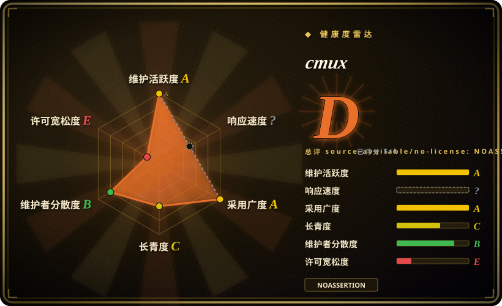
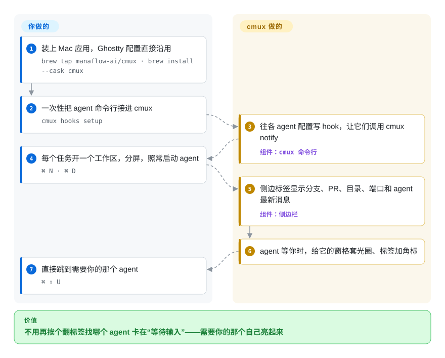

# cmux

你在分屏里同时开着六个 Claude Code 和 Codex，可每条 macOS 通知都只写“Claude is waiting for your input”，你只好一个个标签翻回去看，找到底是哪个停下来了。cmux 是一个原生 macOS 终端（Swift 应用里嵌着 Ghostty 的渲染引擎）：侧边栏列出每个工作区的分支、PR 和 agent 最新一句话，哪个 agent 在等你，哪个窗格就亮起来。

## 何时使用

你在 Mac 上并行跑好几个命令行编码 agent——Claude Code 做重构，Codex 补测试，OpenCode 改前端——各占 Ghostty 或 iTerm 的一个分屏。难的不是把它们跑起来，而是注意到它们：系统通知的正文没有上下文，标签超过八个标题就截得只剩省略号，一个卡在权限确认上二十分钟的 agent，看上去和还在干活的那个一模一样。你选 cmux，是因为它直接替换终端应用本身，而不是在终端里再套一层：执行一次 `cmux hooks setup`，它把各家 agent 的 hook 接到自己的通知命令上；之后谁在等你，谁的窗格就套上蓝色光圈，竖排标签里出现未读角标，同一个标签还显示 git 分支、关联的 PR 号、工作目录和监听端口，按 `⌘ ⇧ U` 直接跳过去。终端旁边还能分出一个真浏览器窗格，agent 自己就能操作它（抓快照、点击、填表、执行 JS）来检查自己改的网页。

决定性的取舍是 **原生 GUI 终端、终端内多路复用器、编排器 三选一**。对比 [herdr](herdr.zh.md) 或 [TUIOS](tuios.zh.md) 这类在你现有终端里运行、Linux 和 SSH 上也能用的多路复用器，cmux 给的是一个能用鼠标操作、自带浏览器和系统通知的 Mac 应用，代价是只支持 macOS。对比 [Agent Orchestrator](../../../agent-tooling/supervision-surfaces/agent-orchestrator.zh.md) 这类桌面编排器，cmux 故意不替你决定怎么拆分工作：README 自己说它是“a primitive, not a solution”——给你窗格、通知和一套 CLI/socket，怎么串由你自己写脚本。

## 怎么用起来

cmux 是一个 Swift/AppKit 应用，内嵌 libghostty——Ghostty 终端的渲染库，用法就像普通应用内嵌 WebKit 来显示网页（cmux 用的是自己打了少量补丁的分支）——并直接读取你现有的 `~/.config/ghostty/config` 里的字体、主题和快捷键。通知有两条来路：一是标准终端转义序列（OSC 9/99/777，即程序打印出来请终端弹提醒的那几个控制码），二是各家 agent 自带的 hook 机制。`cmux hooks setup` 替你改好这些 hook：往 `~/.codex/hooks.json`、`~/.gemini/settings.json` 这类文件里写入条目，Claude Code 则走 cmux 的包装器，于是每个 hook 都会调用 `cmux notify`，并把 agent 的会话 ID 记到 `~/.cmuxterm/` 下。你启动 agent 的方式完全不变；窗口、侧边栏和提醒的分发归 cmux 管，重新打开时它先重建布局，再对每个支持的 agent 执行它自己的 `--resume <id>` 命令。它**不会**在退出后保住进程——要保活得主动开 `cmux local-tmux`，它会在底下起一个 tmux 服务。界面上能看到的一切也都能通过 `cmux` 命令行和一个 Unix socket 脚本化（建工作区、分屏、发按键、读屏幕、操作浏览器），agent 正是靠这个把队友开成看得见的窗格。

<!-- flow-steps:begin (generated from flows/cmux.json by tools/flow_card.py — do not edit) -->

流程文字版

1. **你**：装上 Mac 应用，Ghostty 配置直接沿用 — `brew tap manaflow-ai/cmux · brew install --cask cmux`
2. **你**：一次性把 agent 命令行接进 cmux — `cmux hooks setup`
3. **cmux**：往各 agent 配置写 hook，让它们调用 cmux notify — 组件：`cmux 命令行`
4. **你**：每个任务开一个工作区，分屏，照常启动 agent — `⌘ N · ⌘ D`
5. **cmux**：侧边标签显示分支、PR、目录、端口和 agent 最新消息 — 组件：`侧边栏`
6. **cmux**：agent 等你时，给它的窗格套光圈、标签加角标
7. **你**：直接跳到需要你的那个 agent — `⌘ ⇧ U`

**价值**：不用再挨个翻标签找哪个 agent 卡在“等待输入”——需要你的那个自己亮起来

<!-- flow-steps:end -->

## 何时不用

- **你不在 macOS 上。** 应用是 Swift + AppKit 写的，README 的 FAQ 写着“macOS only, for now”。仓库里另有一个 Rust 写的 `cmux-tui` 多路复用器，但一个未关闭的 issue（#17040，2026-10-02）记录了一位 Linux 用户说它“basically unusable”。在 Linux 或纯 SSH 环境下，用能跑在任何终端里的 [herdr](herdr.zh.md) 或 [TUIOS](tuios.zh.md)；如果并不在乎 agent 感知，就用 [tmux](../../../terminal-ui/tmux.zh.md)。
- **agent 跑在远程机器上，终端得在你合上笔记本后继续活着。** cmux 重开后能恢复布局和 agent 会话，但不会保住任意进程；要真正保活，得主动用 `cmux local-tmux`（注销、重启就没了）或 `cmux ssh-tmux` / `mosh-tmux`。如果硬性要求是“Mac 合上了 agent 也照跑”，就在服务器上跑 [tmux](../../../terminal-ui/tmux.zh.md) 或 [herdr](herdr.zh.md)，本地终端只当查看器。
- **你想让工具替你规划和分发任务。** cmux 不会为每个任务建 worktree，不会把 CI 失败回传给 agent，也不会合并结果——它让你看见 agent，但不管理 agent。要按 worktree 隔离分发并回传反馈，选 [Agent Orchestrator](../../../agent-tooling/supervision-surfaces/agent-orchestrator.zh.md)；要 harness 层面的流水线，选 [oh-my-claudecode](oh-my-claudecode.zh.md)。
- **你要给团队一台台机器配一个稳定、无聊的终端。** 它从 2026 年 1 月起一直是 v0.x，截至 2026-10-09 的 30 天里有约 6.6k 次提交，未关闭 issue 1,655 个，其中包括内存涨到数 GB 的报告（#2962、#11627）。如果终端是不能频繁变动的基础设施，继续用 Ghostty 本体，或 [Alacritty](../../../terminal-ui/alacritty.zh.md) + [tmux](../../../terminal-ui/tmux.zh.md)，提醒交给 agent 自己的 hook。
- **你不能接受默认开启的遥测，或一个会替你往 agent 里打字的应用。** `app.sendAnonymousTelemetry` 默认是 `true`（可在设置里关，或用 MDM 的 `DisableTelemetry`）；`automation.agentAutoResume` 默认是 `true`，遇到可重试的上游错误时会给 cmux 启动的 agent 发 `continue`；重开时恢复会话也会自动重跑 agent 命令。三项都能关，但在受管控或要审计的环境里必须有意识地关掉——或者用什么都不做的 [tmux](../../../terminal-ui/tmux.zh.md)。
- **你打算自托管或转卖服务端。** 应用、CLI 和 `cmux-tui` 是 GPL-3.0-or-later，但 `web/`、Cloudflare workers 和 relay 服务是 BUSL-1.1，且没有额外使用授权——生产使用或自托管需要向 Manaflow 买商业许可；外部贡献还要签 CLA。要一个能嵌进产品或分叉的宽松许可 agent 多路复用器，选 [herdr](herdr.zh.md)（Apache-2.0）或 [TUIOS](tuios.zh.md)（MIT）。
- **你要的是自带 agent 的 AI 终端。** cmux 只承载你自己跑的命令行 agent，开源应用里没有自己的 agent（“cmux AI”是 Founder's Edition 的抢先体验项）。如果你想让终端本身就是 agent，看 [Warp](../../../terminal-ui/warp.zh.md)——但要知道 Warp 的 agent 跑在它的闭源服务器上。

## 横向对比

| 替代品 | 是否收录 | 我们的评价 | 取舍 |
|---|---|---|---|
| [herdr](herdr.zh.md) | ✅ | 如果你在 Mac 上盯 agent，想要带浏览器窗格和系统通知的图形界面，选 cmux；如果 agent 在 Linux 服务器或 SSH 那头、断开后还得活着，选 herdr，因为它的服务进程会保住进程，而且能跑在任何终端里。 | cmux：原生 Mac 应用，内嵌浏览器，鼠标优先，只支持 macOS。herdr：单个 Rust 二进制，跨平台，有供 agent 互相控制的 `agent wait` API，Apache-2.0，但它是 TUI，没有浏览器。 |
| [tmux](../../../terminal-ui/tmux.zh.md) | ✅ | 共享服务器上要长期挂着的 shell，选 tmux；只有当瓶颈是“看出本地哪个 agent 在等我”时才选 cmux，因为 tmux 对 agent 一无所知。 | tmux：约 20 年的稳定行为，任何系统都能用，自带进程保活。cmux：agent 光圈、侧边栏信息和会话恢复集成，但保活要手动开启，项目才 8 个月大。 |
| Ghostty | 未收录 | 如果你只想要一个快的原生 GPU 终端，同时跑的 agent 不多，选 Ghostty；需要在同一个渲染器之上看到每个 agent 的提醒和侧边栏时，选 cmux。 | 真实仓库（ghostty-org/ghostty，MIT，约 62k 星，2026-10）；cmux 读同一份配置，通过打过补丁的分支内嵌它的库，多了 agent 功能，也多了 GPL/BUSL 许可和快得多的变动。本批未收录。 |
| [Warp](../../../terminal-ui/warp.zh.md) | ✅ | 想要在 macOS、Linux、Windows 上都用、终端里自带 agent，选 Warp；想继续用自己的命令行 agent（Claude Code、Codex 等），只需要终端告诉你哪个在等，选 cmux。 | Warp：按块组织输出，自带 agent，但 agent 和同步跑在闭源服务器上。cmux：没有内置 agent，能承载任何命令行 agent，只支持 macOS。 |
| [Agent Orchestrator](../../../agent-tooling/supervision-surfaces/agent-orchestrator.zh.md) | ✅ | 想让工具把任务分发给多个 agent、各自隔离在 worktree 里并回传 CI 和评审反馈，选 Agent Orchestrator；想把这套流程留在自己的脚本里、只需要一个更好的地方看 agent，选 cmux。 | Orchestrator：有主见的控制平面，任务路由归它。cmux：不带主见的基础件（窗格、通知、CLI/socket），流程上的每个决定都留给你。 |

## 技术栈

- **Swift + AppKit** 原生 macOS 应用（不是 Electron）；按 `CONTRIBUTING.md`（2026-10-09 读取），锁定的工具链是 Xcode 26。
- **libghostty**（Zig）负责终端渲染，来自 `manaflow-ai/ghostty` 分支子模块；`scripts/setup.sh` 会下载校验和锁定的预编译 `GhosttyKit.xcframework`，失败时用 Zig 从源码编译。
- **Rust** 写内置的 `cmux-cua` 电脑操作引擎和独立的 `cmux-tui` 多路复用器；**Go** 写 SSH 工作区用的 `cmuxd-remote` 守护进程（`daemon/remote/go.mod`）。
- **TypeScript / bun** 写 webview 和 `web/` 站点与后端（Vercel、Cloudflare workers）；用 **Sparkle** 做应用内自动更新。
- GitHub languages API（2026-10-09）：Swift 源码约 104 MB，其次是 Rust、TypeScript、Python——这是一个大型多语言单体仓库，不是一个小应用。

## 依赖

- **macOS**（贡献者需要 macOS 14+）；用 DMG 安装，或 `brew tap manaflow-ai/cmux` + `brew install --cask cmux`。
- **你的 agent 命令行工具**要另外装（claude、codex、opencode、gemini 等）；`cmux hooks setup` 只配置它在 `PATH` 上找得到的那些。
- **可选：** tmux（用于 `cmux local-tmux` 和附着远程 tmux）、zellij（`cmux local-zellij`）、OpenSSH（`cmux ssh` 工作区；每个版本都附带远程端的 `cmuxd-remote` 二进制）。
- **网络：** Sparkle 检查更新；不关就有匿名遥测；付费的云端 VM 和 iOS 功能要连 Manaflow 以 BUSL 许可的服务端。

## 运维难度

**一个人用：低，但有一块配置面要自己管。** 用 DMG 或 Homebrew cask 安装，会自动更新，Ghostty 配置直接沿用。要自己承担的：`cmux hooks setup` 会写入好几个 agent 的全局配置文件（`~/.codex/hooks.json`、`~/.gemini/settings.json`、OpenCode 插件等），如果你用 dotfiles 管理配置，这些改动要跟踪；要撤回可以用 `cmux hooks uninstall <agent>`。socket 默认是 `cmuxOnly`（只允许自带的 CLI 连接）；源码把放宽到 `allowAll` 标注为“developer-only”。发布节奏非常快（nightly 渠道加频繁的 v0.6x 版本），更新之间行为有变化是常态。受管 Mac 可以用 MDM 策略键（如 `DisableTelemetry`）。

## 健康度与可持续性

- **维护（2026-10-09）。** 极其活跃：2026-10-05 发布 v0.65.0，往前到 v0.39.0（2026-02-18）的稳定版间隔从几天到六周不等，另有 nightly 渠道；最近 30 天约 6.6k 次提交（自 2026-01-22 首次提交以来约 19.9k 次）。这个提交速度看起来是大量借助 agent 开发 [推断]；把它当作速度，而不是稳定性的证据。
- **治理与巴士系数。** 公司项目（Manaflow, Inc.，GitHub 组织账号）。大部分工作压在两位维护者身上——lawrencecchen 约 7.5k、austinywang 约 7.3k 次贡献，另有两人超过 1.7k（contributors API，2026-10-09）。外部贡献要签 CLA（`CLA.md` v2.2），这让 Manaflow 能对它掌控的部分提供商业条款。
- **背后支持与寿命。** Founder's Edition、云端 VM 和 BUSL 服务端都暗示是创投式经营，但这里没有核实到融资信息。项目约 8.5 个月大——拿不到 Lindy 加分；它年轻，变化快。
- **采用度。** 约 28.1k 星、2.5k fork；仅 v0.65.0 的 `cmux-macos.dmg` 在四天内就被下载约 41k 次，`appcast.xml` 被拉取约 426k 次（release assets API，2026-10-09）。生态：有 `cmux-skills` 仓库、同组织下的侧边栏插件、约 18 个 agent 命令行工具的集成。issue 压力大：未关闭 issue 1,655 个、未合并 PR 1,531 个，已关闭 issue 3,021 个（search API，2026-10-09）。
- **风险信号。** 许可拆分（客户端 GPL-3.0-or-later + 服务端 BUSL-1.1）并要求 CLA，是常见的开放核心结构；遥测默认开启；只支持 macOS；有未关闭的多窗格内存暴涨报告；免费应用旁边是收费部分（Founder's Edition、云端 VM、iOS 测试版）。截至 2026-10-09 没有发布过 GitHub 安全公告。

## 存疑（未验证）

- [推断] “大量借助 agent 开发”——依据是 30 天约 6.6k 次提交、却只有两位主要人类作者；仓库本身没有这样表述过。
- [未验证] Manaflow 是否有外部融资：README 在卖 Founder's Edition 和云端 VM，但没有查证融资公告。
- [未验证] `cmux-tui` 和 nightly 版在 Linux 上的情况——只读了 issue 报告（#17040、#17041、#12897），没有实际跑 Linux 版。
- [未验证] 内存暴涨报告（#2962 “70+ GB”、#11627 “25 秒内 7.8GB”）只读了 issue 标题和正文，没有测试当前 v0.65.0 是否还能复现。
- [未验证] 默认开启的匿名遥测具体收集什么——只读了设置键和默认值（`app.sendAnonymousTelemetry: true`），没有看事件内容。
- [推断] socket 模式 `cmuxOnly` 的含义（“只允许自带的 cmux CLI 连接”）取自源码枚举的注释；没有追到它是靠检查对端进程还是靠令牌来实现。
- [推断] 付费的云端 VM 和 iOS 功能依赖以 BUSL 许可的 `web/` 和 worker 代码——依据是 LICENSE 把这些目录列为“the cmux server software”；没有追踪实际请求路径。
- [未验证] 星数、fork、提交、下载和 issue 数都是 2026-10-09 的 GitHub API 输出；下载数包含自动更新的流量。
- [推断] 放在 `orchestration-and-review`、与 herdr 和 TUIOS 并列：cmux 首先是个终端应用，放进终端 UI 分类也说得通；这里按它直接的 agent 监督同类来归类。
- [推断] 健康度雷达里 `risk_license: E` 和 D 封顶，来自评分器读到 GitHub 的 `NOASSERTION` 并在根目录 LICENSE 里匹配到 BUSL 文字；实际上根 LICENSE 给应用、CLI 和 `cmux-tui` 的是 GPL-3.0-or-later，BUSL-1.1 只限服务端目录，所以对只装 Mac 应用的人来说，这个封顶高估了风险。`responsiveness: ?`（no_window_signal）在 GraphQL 配额充足的情况下跑了两次都一样（2026-10-09）——最近的 issue 大多是维护者自己提的，能计算首次响应时间的第三方 issue 很少。采用度一轴把 npm 上的 `cmux` 当成正牌包，没有核实它就是本项目；该轴的等级实际取自 Homebrew 和 release 下载量。
