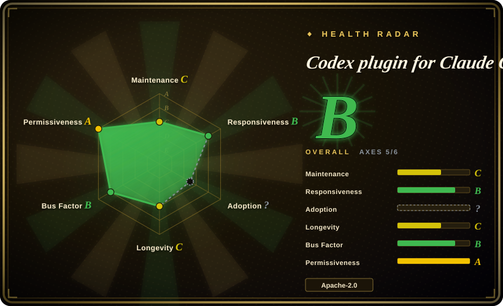
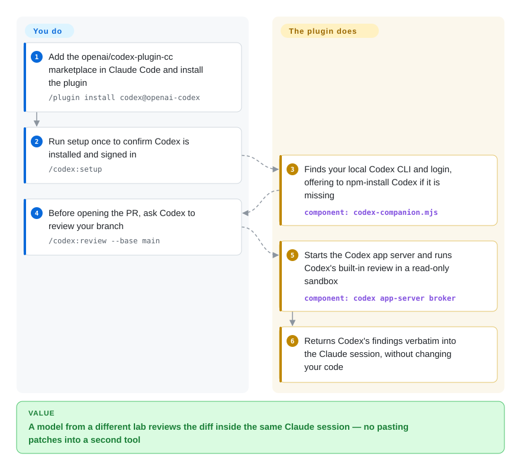

# Codex plugin for Claude Code

Claude wrote the change, Claude reviewed the change, and the bug both passes missed ships anyway — getting a different model to look means pasting diffs into another tool. OpenAI's own Claude Code plugin adds `/codex:*` commands that hand your current diff, or a whole task, to the Codex CLI already installed on your machine and bring Codex's findings or edits back into the same Claude session.

## When to use

You do most of your coding in Claude Code, and you also have a ChatGPT plan (or an OpenAI API key) whose Codex allowance mostly sits unused. Claude just told you "all 214 tests pass, ready to merge" on a branch whose migration renames `user_id` to `account_id` without backfilling the old rows — and the same model that wrote it was the one that reviewed it. You want a reviewer trained by a different lab to read that diff before you open the PR, without leaving the session or copying patches into a second terminal. You install this plugin, type `/codex:review --base main`, and Codex's built-in reviewer — the same one behind `/review` inside Codex — reads the branch read-only and its findings land back in Claude's transcript; `/codex:adversarial-review --base main challenge whether this was the right caching and retry design` points it at one decision instead. When Claude is going in circles on a failing test, `/codex:rescue investigate why the tests started failing` hands the problem to Codex in the background and you check in with `/codex:status` and `/codex:result`.

You pick it over its neighbours because it is narrow and first-party: one extra vendor, built by that vendor, riding your existing Codex login and `~/.codex/config.toml` rather than a new set of API keys. [Claude Octopus](claude-octopus.md) fans one task out to a dozen providers and votes on the disagreement, which is more coverage but far more setup and spend; a multi-provider MCP server such as PAL lets Claude consult Gemini or OpenAI models over API keys instead of your ChatGPT plan; and running `codex` yourself in another terminal works, but you re-explain the context every time (the plugin's `/codex:transfer` exists precisely to carry a Claude session over into Codex).

## How it works

The plugin contains no model of its own. It is a set of Claude Code slash commands, one subagent, three skills and three hooks around a Node script, `codex-companion.mjs`, which starts your locally installed `codex app-server` — Codex's background service that takes JSON-RPC requests (small request/response messages over a local socket or named pipe) — behind a per-session broker process and asks it to do one of two things. `/codex:review` sends a native review request in a read-only sandbox (Codex can read the repo but not write to it) and Claude is instructed to print the result verbatim and fix nothing. `/codex:adversarial-review` and `/codex:rescue` send ordinary Codex turns; rescue goes through the `codex-rescue` subagent, which only forwards your text and by default asks for a `workspace-write` sandbox with no approval prompts, so Codex edits files in your checkout directly. Think of a contractor from another firm on call: for a review you hand over the folder and get a memo back; for a rescue you hand over the keys to the workshop. Jobs (foreground or background) are tracked per repository in the plugin's data directory, and each result carries a Codex session ID you can reopen with `codex resume`. What stays yours: installing and signing in to Codex, the Codex usage it consumes, deciding when to call it, and deciding what to do with what comes back — an optional Stop hook (`/codex:setup --enable-review-gate`) can make the review automatic at the end of each Claude turn, but it is off by default and the README warns it can loop and drain usage.

<!-- flow-steps:begin (generated from flows/codex-plugin-cc.json by tools/flow_card.py — do not edit) -->

Text version of the flow

1. **You**: Add the openai/codex-plugin-cc marketplace in Claude Code and install the plugin — `/plugin install codex@openai-codex`
2. **You**: Run setup once to confirm Codex is installed and signed in — `/codex:setup`
3. **Codex plugin for Claude Code**: Finds your local Codex CLI and login, offering to npm-install Codex if it is missing — component: `codex-companion.mjs`
4. **You**: Before opening the PR, ask Codex to review your branch — `/codex:review --base main`
5. **Codex plugin for Claude Code**: Starts the Codex app server and runs Codex's built-in review in a read-only sandbox — component: `codex app-server broker`
6. **Codex plugin for Claude Code**: Returns Codex's findings verbatim into the Claude session, without changing your code

**Value**: A model from a different lab reviews the diff inside the same Claude session — no pasting patches into a second tool

<!-- flow-steps:end -->

## When NOT to use

- **You have no Codex entitlement, or you need a reviewer that isn't OpenAI.** Every command runs on your Codex login (ChatGPT plan, including Free, or an API key) and counts against Codex usage limits; code and prompts go to OpenAI. For a second opinion from Gemini, a local Ollama model or several vendors at once, use [Claude Octopus](claude-octopus.md) or the PAL MCP server (not indexed) instead.
- **You want a panel, not one extra reviewer.** This plugin adds exactly one vendor and reports its findings as-is; it does not compare models or vote. If the point is cross-vendor disagreement as a merge gate, [Claude Octopus](claude-octopus.md) is built for that.
- **You want team-visible review on every pull request.** Findings land in one developer's Claude session, not as PR comments, and nothing runs in CI. For per-PR review your whole team sees, use [PR-Agent](../../../ai-code-review/pr-agent.md) (or, for security-only passes, [Claude Code Security Review](../../../ai-code-review/claude-code-security-review.md)).
- **You run many Claude Code sessions in parallel, or leave them running for days.** As of 2026-10 the open issue list is dominated by process-lifecycle bugs: app-server brokers that never exit (#543 reports 272 orphaned processes and ~2.2 GB of RAM), ending one Claude session killing a broker other sessions share so their jobs stay "running" forever (#540), and background workers with no stall timeout (#520). For fleet-style or unattended delegation, drive Codex directly with `codex exec` in its own process — see [Codex](../terminal-agents/codex.md) — or use [oh-my-claudecode](oh-my-claudecode.md)'s tmux workers, which start a Codex CLI per task and let it exit.
- **You are on native Windows.** Open, unfixed reports include `/codex:transfer` always failing (#618), every command leaking a broker that makes the workspace directory undeletable (#718), and the SessionStart hook growing the env file until Bash breaks at the 8191-character limit (#528). Use it under WSL, or call the Codex CLI directly on Windows.
- **You need every file edit approved.** `/codex:rescue` defaults to write mode (`workspace-write` sandbox, approval policy `never`), and the rescue subagent's description tells Claude to use it *proactively* when it is stuck — so Claude may hand Codex a writing task you never typed. If edits must be reviewed first, stay with the read-only `/codex:review` / `/codex:adversarial-review`, pass read-only intent explicitly, or run Codex yourself under its own approval policy.
- **You want an automatic review gate you can leave alone.** The Stop-hook gate runs a Codex review at the end of every Claude turn and blocks the stop on findings; the README warns it "can create a long-running Claude/Codex loop and may drain usage limits quickly", and #548 reports it looping until Claude Code's stop-hook cap because it ignores `stop_hook_active`. Run `/codex:review` by hand instead.
- **You need the bridge to keep pace with new Codex models.** No PR has been merged since 2026-07-08 while issues keep arriving (#468: the plugin does not handle the gpt-5.6 model family). The [Codex](../terminal-agents/codex.md) CLI itself ships near-daily, so for the newest models go to it directly.

## Comparison

| Alternative | In index | Our verdict | Tradeoff |
|---|---|---|---|
| [Codex](../terminal-agents/codex.md) | ✅ | When you are willing to switch windows, or need parallel or unattended runs, use the Codex CLI directly (`codex`, `codex review`, `codex exec`); pick this plugin when the value is staying inside the Claude Code session that already holds the context. | Direct use avoids the plugin's broker and job-state bugs and gets new Codex features first, but you carry context across by hand; the plugin is a thin, slower-moving wrapper over that same binary and login. |
| [Claude Octopus](claude-octopus.md) | ✅ | When you want several vendors to cross-check one task and surface their disagreement, pick Claude Octopus; when one second opinion from OpenAI is enough and you want the vendor's own integration, pick this plugin. | Octopus buys breadth (up to 12 providers, consensus gate, workflows) at the cost of installing and paying for many CLIs and a large single-maintainer surface; this plugin is one vendor, eight commands, OpenAI-owned. |
| [oh-my-claudecode](oh-my-claudecode.md) | ✅ | When the job is orchestrating a team of agents — staged pipelines, tmux workers that may include Codex — pick oh-my-claudecode; for an ad-hoc Codex review or rescue from an ordinary session, this plugin is the lighter install. | OMC treats Codex as one worker type inside a whole orchestration layer with fast churn; this plugin does nothing but the Codex hand-off, so less to learn but no pipeline. |
| PAL MCP Server (BeehiveInnovations/pal-mcp-server, formerly zen-mcp-server) | not indexed | When you want Claude to consult models from several providers through MCP tools on your own API keys, PAL fits; when your OpenAI access is a ChatGPT plan and you want Codex's own reviewer, pick this plugin. | Provider-agnostic and works in any MCP host, but billed per API key; as of 2026-10 its last push was 2025-12-15 and GitHub reports its license as NOASSERTION. Not added in this tab batch. |
| [PR-Agent](../../../ai-code-review/pr-agent.md) | ✅ | When review must happen on every PR where the whole team sees it, pick PR-Agent; this plugin is a private, on-demand review inside one developer's session. | PR-Agent runs in CI with the model you pay for and posts comments on the PR; this plugin needs no CI setup but leaves no trace on the PR. |

## Tech stack

- **Language/runtime:** plain Node.js ES modules (`.mjs`), Node ≥ 18.18; TypeScript is used only to type-check the app-server protocol bindings at build time (`tsc`), and the package has no runtime npm dependencies (devDependencies: `typescript`, `@types/node`).
- **Host format:** a Claude Code plugin served from a one-plugin marketplace (`.claude-plugin/marketplace.json` → `plugins/codex`): 8 slash commands, the `codex-rescue` subagent (pinned to `model: sonnet`, `Bash` only), three skills (`codex-cli-runtime`, `codex-result-handling`, `gpt-5-4-prompting`), and `SessionStart` / `SessionEnd` / `Stop` hooks.
- **Codex integration:** spawns `codex app-server` and talks JSON-RPC to it (`review/start` for native review, thread/turn requests for tasks) through a broker on a Unix socket or Windows named pipe; review output for adversarial review is constrained by a bundled JSON schema.
- **State:** per-repository `state.json` plus `jobs/` (last 50 jobs) under `CLAUDE_PLUGIN_DATA`, falling back to `$TMPDIR/codex-companion`.
- **Tests:** `node --test` suites against a fake Codex fixture; GitHub Actions runs tests and the type-check build on pull requests only.

## Dependencies

- **Claude Code** with plugin marketplace support (`/plugin marketplace add`, `/reload-plugins`).
- **Codex CLI** (`npm install -g @openai/codex`, or let `/codex:setup` install it when npm is present), signed in with `codex login` via a ChatGPT account or an OpenAI API key; it reads your existing `~/.codex/config.toml` and trusted project `.codex/config.toml` for model and reasoning effort.
- **Node.js ≥ 18.18** on the machine running Claude Code.
- **Network egress to OpenAI** (or to whatever `openai_base_url` your Codex config points at) for every review and task.

## Ops difficulty

**Low to install, medium to keep healthy.** Installing is three slash commands plus `/codex:setup`, and there is nothing to host. The work shows up later: background jobs and per-session broker processes can outlive their Claude session, so on a long-lived workstation you may need to find and kill orphaned `codex app-server` processes and clear stale "running" jobs by hand (see the lifecycle issues above); usage is metered against your Codex limits, which the optional review gate can burn quickly; and rescue's default write mode means you should commit or stash before delegating. Because nothing has been merged since July 2026, expect to live with these rather than wait for fixes.

## Health & viability

- **Maintenance — stalled after a fast start (as of 2026-10-09).** Seven releases in its first 14 weeks (v1.0.0 on 2026-03-30 to v1.0.6 on 2026-07-08), then no release, no default-branch commit and no merged PR for three months, while 281 issues and 247 PRs sit open — many of them detailed community fixes for the lifecycle bugs. Only 28 PRs have ever been merged. [推断] The pattern reads as a launch-and-coast vendor project, not an abandoned one: the lead maintainer was still commenting on issues in August 2026.
- **Governance & bus factor — vendor-owned, one main maintainer.** The repo lives in the `openai` organization and the Apache-2.0 copyright is OpenAI's, but the commit history is concentrated in one OpenAI developer (`dkundel-openai`, 11 commits; no other contributor has more than 5, most have 1); the roadmap is OpenAI's alone.
- **Age & Lindy — young.** About 6 months old (created 2026-03-30). By the age × still-active prior it is unproven, and its continued life depends on OpenAI's interest in courting Claude Code users rather than on a community.
- **Adoption — very high attention, thin engineering throughput.** ~34.0k stars and ~2.4k forks in six months is strong interest, likely amplified by the OpenAI-ships-a-plugin-for-Anthropic's-CLI story; [推断] stars here measure curiosity more than production use. The 247:28 open-to-merged PR ratio is the more telling number.
- **Risk flags.** Single-vendor dependency on both sides (it breaks if Claude Code's plugin/hook contract or Codex's app-server protocol changes, and the app-server types are regenerated from the installed Codex at build time); write-by-default delegation; known process leaks. License is clean Apache-2.0 with a NOTICE file.

## Caveats (unverified)

- [推断] "Launch-and-coast rather than abandoned" is inferred from the maintainer's August 2026 issue comments and the lack of an archive notice; OpenAI has published no statement about the plugin's roadmap.
- [推断] Stars reflecting curiosity rather than production use is a judgment from the star/fork counts versus the merged-PR count; there is no install telemetry to check, and the plugin is not published to npm (the package is `private: true`).
- [未验证] Issue reports cited in When NOT to use (#540, #543, #520, #548, #618, #718, #528, #468) are user reports open as of 2026-10-09; they were read but not reproduced here, and a newer Codex CLI may change some of them (#468 in particular may be a Codex-side version requirement).
- [未验证] The README's claim that `/codex:review` gives "the same quality of code review as running `/review` inside Codex directly" — the code does call the app server's native `review/start`, but review quality was not compared.
- [未验证] The health radar's adoption axis is `?` (reason `ambiguous`): the plugin ships through a Claude Code marketplace, not a package registry, and the only registry hit is an auto-indexed Go-proxy entry with no counts — so there is no install number to grade, and the B overall rests on 5 of 6 axes.
- [未验证] Whether Claude actually invokes the `codex-rescue` subagent unprompted in practice depends on Claude Code's agent-selection behaviour; the "use proactively" wording is in the subagent file, the frequency was not measured.
