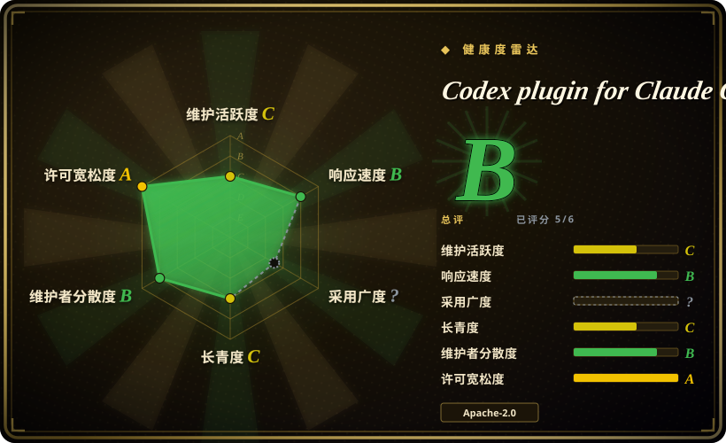
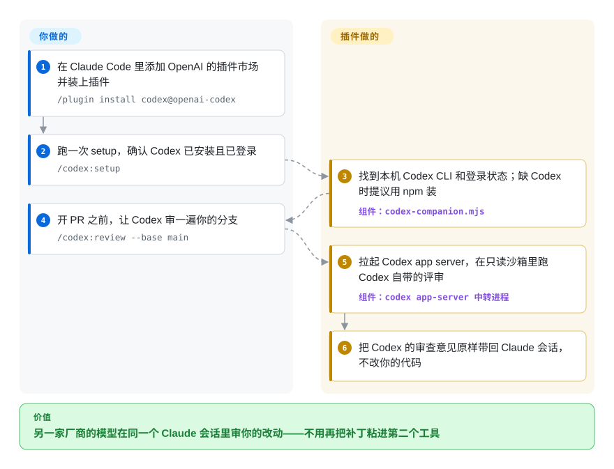

# Codex plugin for Claude Code

代码是 Claude 写的，审查也是 Claude 做的，两遍都没看出来的 bug 照样上线；想让另一个模型看一眼，就得把 diff 复制到别的工具里。这是 OpenAI 官方做的 Claude Code 插件：加上一组 `/codex:*` 命令，把当前改动或整件任务交给你本机已装的 Codex CLI，再把 Codex 的审查意见或改动带回同一个 Claude 会话。

## 何时使用

你平时主要在 Claude Code 里写代码，手上还有一个 ChatGPT 订阅（或 OpenAI API key），里面的 Codex 额度基本闲着。Claude 刚说完“214 个测试全过，可以合并”，可这个分支的迁移脚本把 `user_id` 改名成 `account_id`，旧数据一行都没回填——而写这段代码的模型和审这段代码的是同一个。你想在开 PR 之前，让另一家实验室训练的模型读一遍这个 diff，又不想离开当前会话、也不想把补丁粘到第二个终端里。装上这个插件，敲 `/codex:review --base main`，Codex 自带的评审器（和在 Codex 里跑 `/review` 是同一个）以只读方式读完分支，意见直接落回 Claude 的对话；想让它专盯某个决定，就用 `/codex:adversarial-review --base main challenge whether this was the right caching and retry design`。Claude 在一个失败的测试上原地打转时，`/codex:rescue investigate why the tests started failing` 把问题丢给 Codex 在后台查，你再用 `/codex:status`、`/codex:result` 看进展和结果。

选它而不选邻居，是因为它窄而且是厂商自己做的：只多一家厂商，由这家厂商出品，用的是你现成的 Codex 登录和 `~/.codex/config.toml`，不用另配一套 API key。[Claude Octopus](claude-octopus.zh.md) 把一个任务扇给十几家 provider 再按分歧投票，覆盖面更广，但安装和花费都多得多；PAL 这类多 provider 的 MCP 服务器让 Claude 用 API key 去问 Gemini 或 OpenAI 的模型，走的是按量计费而不是你的 ChatGPT 订阅；自己在另一个终端里跑 `codex` 当然也行，但每次都要重新交代上下文（插件的 `/codex:transfer` 就是专门把 Claude 会话搬进 Codex 用的）。

## 怎么用起来

插件本身不带模型。它是一组 Claude Code 斜杠命令、一个子代理、三个技能和三个钩子，围着一个 Node 脚本 `codex-companion.mjs` 转：这个脚本拉起你本机装好的 `codex app-server`（Codex 的后台服务，接收 JSON-RPC 请求，也就是通过本地 socket 或命名管道来回传的小段请求/应答消息），前面挂一个每个会话一份的中转进程（broker），然后让它做两类事之一。`/codex:review` 发的是原生评审请求，跑在只读沙箱里（Codex 能读仓库、不能写），Claude 被要求原样输出结果、什么都不改。`/codex:adversarial-review` 和 `/codex:rescue` 发的是普通的 Codex 对话轮次；rescue 经过 `codex-rescue` 子代理，它只负责转发你的原话，默认申请 `workspace-write` 沙箱且不弹审批，所以 Codex 会直接改你工作区里的文件。打个比方：这像随叫随到的外包顾问——做评审时你把卷宗交给他，他写一份意见书回来；做 rescue 时你是把车间钥匙交给了他。任务（前台或后台）按仓库记在插件的数据目录里，每个结果都带一个 Codex 会话 ID，可以用 `codex resume` 接着做。留给你的是：安装并登录 Codex、承担它消耗的 Codex 用量、决定什么时候叫它、以及决定拿回来的东西怎么处理。还有一个可选的 Stop 钩子（`/codex:setup --enable-review-gate`）能在 Claude 每轮结束时自动评审，但默认关闭，README 也提醒它可能陷入循环、很快耗光额度。

<!-- flow-steps:begin (generated from flows/codex-plugin-cc.json by tools/flow_card.py — do not edit) -->

流程文字版

1. **你**：在 Claude Code 里添加 OpenAI 的插件市场并装上插件 — `/plugin install codex@openai-codex`
2. **你**：跑一次 setup，确认 Codex 已安装且已登录 — `/codex:setup`
3. **Codex plugin for Claude Code**：找到本机 Codex CLI 和登录状态；缺 Codex 时提议用 npm 装 — 组件：`codex-companion.mjs`
4. **你**：开 PR 之前，让 Codex 审一遍你的分支 — `/codex:review --base main`
5. **Codex plugin for Claude Code**：拉起 Codex app server，在只读沙箱里跑 Codex 自带的评审 — 组件：`codex app-server 中转进程`
6. **Codex plugin for Claude Code**：把 Codex 的审查意见原样带回 Claude 会话，不改你的代码

**价值**：另一家厂商的模型在同一个 Claude 会话里审你的改动——不用再把补丁粘进第二个工具

<!-- flow-steps:end -->

## 何时不用

- **你没有 Codex 额度，或者需要非 OpenAI 的评审者。** 每条命令都走你的 Codex 登录（ChatGPT 订阅，含免费档，或 API key），计入 Codex 用量上限，代码和提示词都会发给 OpenAI。想要 Gemini、本地 Ollama 模型或多家同时给第二意见，改用 [Claude Octopus](claude-octopus.zh.md) 或 PAL MCP 服务器（未收录）。
- **你要的是评审团，不是多一个评审者。** 这个插件只多接一家厂商，意见原样转述，不做模型间比较也不投票。如果你要的是把跨厂商的分歧当合并闸门，[Claude Octopus](claude-octopus.zh.md) 才是为此设计的。
- **你需要整个团队都能看到的、每个 PR 都跑的评审。** 意见只落在某个开发者的 Claude 会话里，不是 PR 评论，也不在 CI 里跑。要按 PR 做全队可见的评审，用 [PR-Agent](../../../ai-code-review/pr-agent.zh.md)（只看安全问题则用 [Claude Code Security Review](../../../ai-code-review/claude-code-security-review.zh.md)）。
- **你同时开很多个 Claude Code 会话，或者一开好几天。** 截至 2026-10，未关闭的 issue 里最多的是进程生命周期问题：app-server 中转进程从不退出（#543 报告了 272 个孤儿进程、约 2.2 GB 内存），结束一个 Claude 会话会杀掉其他会话共用的中转进程，它们的任务从此一直显示“running”（#540），后台 worker 没有卡死超时（#520）。要批量或无人值守地委派，直接在独立进程里用 `codex exec` 驱动 Codex（见 [Codex](../terminal-agents/codex.zh.md)），或者用 [oh-my-claudecode](oh-my-claudecode.zh.md) 的 tmux worker——每个任务起一个 Codex CLI，做完就退出。
- **你在原生 Windows 上。** 仍未修复的报告包括：`/codex:transfer` 在 Windows 上必然失败（#618），每条命令都泄漏一个中转进程、导致工作区目录删不掉（#718），SessionStart 钩子不停往环境文件里追加内容，直到 Bash 撞上 8191 字符上限而失效（#528）。在 WSL 里用，或者在 Windows 上直接调 Codex CLI。
- **你要求每次改文件都先经你批准。** `/codex:rescue` 默认是写模式（`workspace-write` 沙箱，审批策略 `never`），而且 rescue 子代理的描述要求 Claude 在卡住时*主动*调用它——所以 Claude 可能把一件你从没下过指令的写代码任务交给 Codex。如果改动必须先审，就只用只读的 `/codex:review`、`/codex:adversarial-review`，或明确说明只读，或者自己在 Codex 里按它的审批策略跑。
- **你想要一个装上就不用管的自动评审闸门。** Stop 钩子闸门会在 Claude 每轮结束时跑一次 Codex 评审，发现问题就拦住结束；README 自己警告它“可能形成长时间运行的 Claude/Codex 循环，并很快耗光用量”，#548 还报告它因为不检查 `stop_hook_active`，会一直循环到 Claude Code 的 stop 钩子上限。改为手动跑 `/codex:review`。
- **你需要这座桥跟上新的 Codex 模型。** 自 2026-07-08 以来没有合并过任何 PR，issue 却一直在来（#468：插件不支持 gpt-5.6 系列模型）。[Codex](../terminal-agents/codex.zh.md) CLI 本身几乎每天发版，要用最新模型就直接用它。

## 横向对比

| 替代品 | 是否收录 | 我们的评价 | 取舍 |
|---|---|---|---|
| [Codex](../terminal-agents/codex.zh.md) | 已收录 | 如果你愿意切窗口，或者需要并行、无人值守地跑，直接用 Codex CLI（`codex`、`codex review`、`codex exec`）；如果价值在于留在已经装着上下文的 Claude Code 会话里，选这个插件。 | 直接用能避开插件的中转进程和任务状态 bug，新功能也最先拿到，但上下文要你手工搬；插件只是包在同一个二进制和登录之上的薄层，更新也慢。 |
| [Claude Octopus](claude-octopus.zh.md) | 已收录 | 想让多家厂商交叉检查同一个任务并把分歧摆出来，选 Claude Octopus；只要 OpenAI 给一个第二意见、并且想用厂商自己的集成，选这个插件。 | Octopus 换来的是广度（最多 12 家 provider、共识闸门、成套工作流），代价是安装并付费多个 CLI、依赖一个单人维护的大型代码面；这个插件只接一家、八条命令、归 OpenAI 所有。 |
| [oh-my-claudecode](oh-my-claudecode.zh.md) | 已收录 | 如果要编排一整队 agent（分阶段流水线、可以包含 Codex 的 tmux worker），选 oh-my-claudecode；在普通会话里临时让 Codex 审一下或救个场，这个插件装起来更轻。 | OMC 把 Codex 当成一整套编排层里的一种 worker，而且变化很快；这个插件只做把活交给 Codex 这一件事，要学的少，但没有流水线。 |
| PAL MCP Server（BeehiveInnovations/pal-mcp-server，原名 zen-mcp-server） | 未收录 | 如果你想让 Claude 通过 MCP 工具、用你自己的 API key 去问多家 provider 的模型，PAL 合适；如果你的 OpenAI 权益是 ChatGPT 订阅、并且要的是 Codex 自带的评审器，选这个插件。 | 不绑厂商、任何 MCP 宿主都能用，但按 API key 计费；截至 2026-10，它最后一次推送是 2025-12-15，GitHub 显示其许可证为 NOASSERTION。本批次未收录。 |
| [PR-Agent](../../../ai-code-review/pr-agent.zh.md) | 已收录 | 评审必须在每个 PR 上发生、并且全队都看得到时，选 PR-Agent；这个插件是某个开发者会话里私下、按需的评审。 | PR-Agent 在 CI 里用你付费的模型跑，结果以评论形式发到 PR 上；这个插件不用配 CI，但在 PR 上不留任何痕迹。 |

## 技术栈

- **语言/运行时：** 纯 Node.js ES 模块（`.mjs`），Node ≥ 18.18；TypeScript 只在构建时用来对 app-server 协议绑定做类型检查（`tsc`），包没有任何运行时 npm 依赖（devDependencies 只有 `typescript`、`@types/node`）。
- **宿主格式：** 一个从单插件 marketplace 分发的 Claude Code 插件（`.claude-plugin/marketplace.json` → `plugins/codex`）：8 条斜杠命令、`codex-rescue` 子代理（固定 `model: sonnet`，只给 `Bash`）、三个技能（`codex-cli-runtime`、`codex-result-handling`、`gpt-5-4-prompting`），以及 `SessionStart` / `SessionEnd` / `Stop` 三个钩子。
- **与 Codex 的集成：** 启动 `codex app-server`，经由 Unix socket 或 Windows 命名管道上的中转进程用 JSON-RPC 与它通信（原生评审用 `review/start`，任务用 thread/turn 请求）；对抗式评审的输出由随包的 JSON schema 约束。
- **状态：** 每个仓库一份 `state.json` 加 `jobs/` 目录（保留最近 50 个任务），放在 `CLAUDE_PLUGIN_DATA` 下，没有时退回 `$TMPDIR/codex-companion`。
- **测试：** 用 `node --test` 对着一个假 Codex 夹具跑；GitHub Actions 只在 PR 上跑测试和类型检查构建。

## 依赖

- **Claude Code**，需支持插件 marketplace（`/plugin marketplace add`、`/reload-plugins`）。
- **Codex CLI**（`npm install -g @openai/codex`，或在有 npm 时让 `/codex:setup` 代装），用 `codex login` 以 ChatGPT 账号或 OpenAI API key 登录；模型和推理强度读你现有的 `~/.codex/config.toml` 以及受信任项目里的 `.codex/config.toml`。
- 运行 Claude Code 的机器上要有 **Node.js ≥ 18.18**。
- 每次评审和任务都需要**能连到 OpenAI**（或你 Codex 配置里 `openai_base_url` 指向的地址）。

## 运维难度

**安装低，长期保持干净是中等。** 安装就是三条斜杠命令加一次 `/codex:setup`，没有任何东西需要托管。麻烦出现在之后：后台任务和每个会话的中转进程可能比 Claude 会话活得更久，所以在长期开着的工作站上，你可能要手动找出并杀掉孤儿 `codex app-server` 进程、清理卡在“running”的任务（见上面的生命周期 issue）；用量计入 Codex 额度，可选的评审闸门会很快把它烧掉；rescue 默认写模式，委派之前最好先 commit 或 stash。由于 2026 年 7 月之后没有合并过任何东西，这些问题要做好自己扛、而不是等修复的准备。

## 健康度与可持续性

- **维护——起步很快，随后停滞（截至 2026-10-09）。** 头 14 周发了七个版本（2026-03-30 的 v1.0.0 到 2026-07-08 的 v1.0.6），之后三个月没有新版本、默认分支没有新提交、也没有合并任何 PR，而 281 个 issue 和 247 个 PR 处于打开状态，其中不少是社区针对生命周期 bug 写得很细的修复。历史上一共只合并过 28 个 PR。[推断] 这更像厂商项目“发布后滑行”，而不是被放弃：主维护者 2026 年 8 月仍在 issue 里回复。
- **治理与巴士因子——厂商所有，一位主力维护者。** 仓库在 `openai` 组织下，Apache-2.0 的版权方是 OpenAI，但提交高度集中在一位 OpenAI 开发者（`dkundel-openai`，11 次提交；其他贡献者都不超过 5 次，多数只有 1 次），路线图完全由 OpenAI 决定。
- **年龄与 Lindy——很年轻。** 约 6 个月（创建于 2026-03-30）。按“年龄 × 仍活跃”的先验它尚未经过检验，能活多久取决于 OpenAI 是否还想争取 Claude Code 用户，而不是靠社区。
- **采用——关注度极高，工程吞吐很薄。** 半年约 3.4 万星、约 2400 个 fork，说明兴趣很大，大概率被“OpenAI 给 Anthropic 的 CLI 做插件”这个话题放大了；[推断] 这里的星数更多反映好奇而不是生产使用。打开的 PR 与已合并 PR 之比 247:28 才是更说明问题的数字。
- **风险信号。** 两头都依赖单一厂商（Claude Code 的插件/钩子契约或 Codex 的 app-server 协议一变它就会坏，而且 app-server 类型是在构建时从本机装的 Codex 重新生成的）；委派默认可写；已知的进程泄漏。许可证是干净的 Apache-2.0，附 NOTICE 文件。

## 存疑（未验证）

- [推断] “发布后滑行而非放弃”是根据维护者 2026 年 8 月的 issue 回复以及仓库没有归档声明推断的；OpenAI 没有发布任何关于这个插件路线图的说明。
- [推断] “星数反映好奇而非生产使用”是对比星数、fork 数和已合并 PR 数得出的判断；没有安装量数据可查，插件也没有发布到 npm（包是 `private: true`）。
- [未验证] 何时不用中引用的 issue（#540、#543、#520、#548、#618、#718、#528、#468）是截至 2026-10-09 仍打开的用户报告；已阅读但未在本地复现，更新的 Codex CLI 可能改变其中一部分（尤其 #468 可能是 Codex 一侧的版本要求）。
- [未验证] README 说 `/codex:review` 与在 Codex 里直接跑 `/review` 质量相同——代码确实调用了 app server 原生的 `review/start`，但评审质量没有做过对比。
- [未验证] 健康度雷达的采用度一轴是 `?`（原因 `ambiguous`）：插件通过 Claude Code 的 marketplace 分发，不走包仓库，唯一命中的是一个自动收录、没有任何计数的 Go 代理条目——所以没有安装量可评，总评 B 只基于 6 轴中的 5 轴。
- [未验证] Claude 实际上会不会在没被要求时调用 `codex-rescue` 子代理，取决于 Claude Code 的代理选择行为；“主动使用”的措辞写在子代理文件里，实际频率没有测量。
