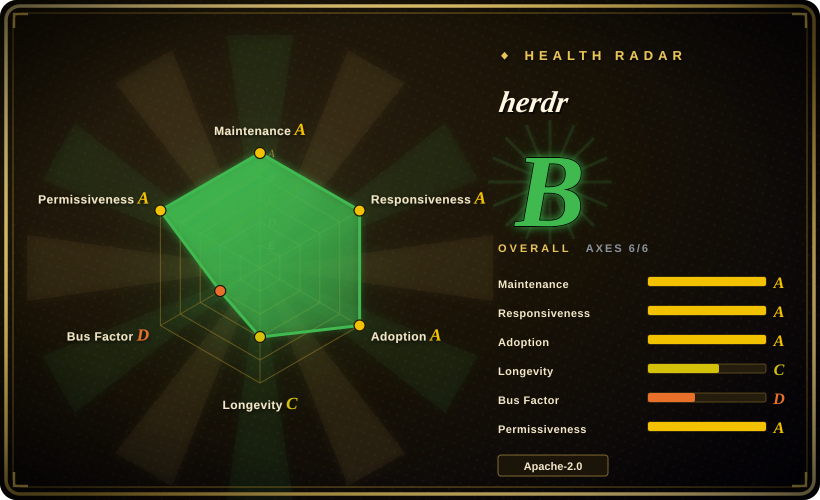
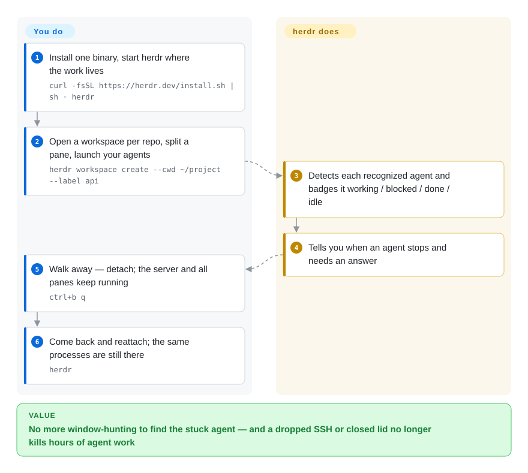

# herdr

You run Claude Code, Codex and opencode in a dozen terminal panes, and the moment your SSH drops — or you just close the lid — hours of agent work die, and when you come back you have no idea which of the agents stopped to ask you a question. herdr is a terminal multiplexer built for exactly that workload: a background server keeps every pane's process alive, each pane is badged `working` / `blocked` / `done` / `idle`, and the agents themselves can spawn and wait on other agents through herdr's CLI and socket API.

## When to use

You're supervising several coding agents in parallel — Claude Code on the API refactor, Codex on the test batch, opencode on the frontend — and the bottleneck is not running them but *watching* them: you tab through panes looking for the one that froze on an approval prompt, and a dropped SSH connection kills whatever was mid-run. You reach for herdr because it owns the terminals the agents live in (it does not wrap or replace the agents) and adds the three things tmux and zellij don't have: agent-aware state badges (`blocked` means "an agent is waiting for a human right now"), detach/reattach with supported agents even resuming their own conversation sessions after a full server restart, and an automation surface — `herdr agent start / prompt / wait / read` — so one orchestrating agent or script can create a reviewer pane, send it a prompt, and block until it is genuinely done or blocked.

That third point is the deciding tradeoff against the alternatives: against [tmux](../../../terminal-ui/tmux.md) and [zellij](../../../terminal-ui/zellij.md), herdr trades their decades/multi-year maturity for an API *designed for agents to drive agents*; against browser cockpits like [CloudCLI](../../../agent-tooling/supervision-surfaces/claudecodeui.md) or the [Agent Orchestrator](../../../agent-tooling/supervision-surfaces/agent-orchestrator.md) desktop app, herdr stays inside your terminal — no Electron, no web service, one Rust binary — and exposes the same control to scripts instead of to a GUI. It also federates saved SSH machines into one combined agent list with independent reconnects, so "30 windows across 3 boxes" collapses into one window.

## Q&A

- **"Isn't this just something that manages my existing tmux windows?"** No — herdr replaces the multiplexer, it does not sit on top of tmux. Your panes move from tmux's server to herdr's server. What it adds over tmux is the agent layer: working/blocked/idle badges, `herdr agent wait --until blocked`, and APIs agents can call on each other.
- **"Can it do what my capture-pane polling loop did — tell me which worker is stuck?"** Yes, that's the built-in case: each pane is badged working / blocked / done / idle from process and screen detection, and blocked panes raise notifications, so no scraping loop. Deeper: an orchestrator can `herdr agent read reviewer --source recent-unwrapped` to inspect the stuck pane's text.
- **"After a machine restart, are my running processes back?"** Not the processes — herdr restores the saved layout and restarts shells in their saved directories; only agents with a native session reference resume their conversation (via `claude --resume <id>`-style commands), which is a state reconstruction, not process resurrection.

## How it works

herdr is a client/server terminal multiplexer in the tmux lineage: a background server owns real PTY processes (via a vendored `portable-pty`) and renders terminal content with a vendored Ghostty `vt` emulator crate; your terminal runs a client that attaches to it, `ctrl+b q` detaches, `herdr` reattaches, and the agents never notice. The new part is the *agent* layer sitting above panes: herdr classifies each recognized agent (23 kinds — claude, codex, opencode, kilo, cursor…) as `working` / `blocked` / `done` / `idle` by combining foreground-process checks, screen-state manifests per agent UI, and optional installed integrations (`herdr integration install <agent>`), then surfaces a combined agent list across workspaces and saved SSH machines. Persistence has graded tiers, and the boundary matters: live detach never stops processes; a server *restart* does — herdr then restores the layout, can replay pane screen history (off by default, since output may contain secrets), and restarts supported agents via their own `--resume <session-id>` mechanism using session references the integrations reported. Everything is scriptable over a CLI that prints JSON and an NDJSON socket API (`~/.config/herdr/herdr.sock`), where one agent can `agent start` another, prompt it, and `agent wait --until blocked` before replying — plus git-worktree helpers that create/open/remove worktrees as workspaces.

<!-- flow-steps:begin (generated from flows/herdr.json by tools/flow_card.py — do not edit) -->

Text version of the flow

1. **You**: Install one binary, start herdr where the work lives — `curl -fsSL https://herdr.dev/install.sh | sh · herdr`
2. **You**: Open a workspace per repo, split a pane, launch your agents — `herdr workspace create --cwd ~/project --label api`
3. **herdr**: Detects each recognized agent and badges it working / blocked / done / idle
4. **herdr**: Tells you when an agent stops and needs an answer
5. **You**: Walk away — detach; the server and all panes keep running — `ctrl+b q`
6. **You**: Come back and reattach; the same processes are still there — `herdr`

**Value**: No more window-hunting to find the stuck agent — and a dropped SSH or closed lid no longer kills hours of agent work

<!-- flow-steps:end -->

## When NOT to use

- **You need a bet you can make for a decade.** herdr shipped v0.1.0 on 2026-03-27 and is at v0.9.1 — 6 months old, and the docs themselves mark live handoff as experimental. If the multiplexer is infrastructure your team can't churn, use [tmux](../../../terminal-ui/tmux.md) — ~20 years of behavior you can cite — or [zellij](../../../terminal-ui/zellij.md) for a 6-year-old human-first workspace. herdr's agent-layer payoff is only worth taking if you accept pre-1.0 API churn.
- **Your agents' harness already owns orchestration.** If parallel workers are managed via tmux panes scripted by your own control plane (an [oh-my-claudecode](oh-my-claudecode.md)-style pipeline), or you want a desktop app that isolates each agent in a worktree and routes CI feedback ([Agent Orchestrator](../../../agent-tooling/supervision-surfaces/agent-orchestrator.md)), herdr is a second control plane to learn, not a gap-filler — it pays off when supervision and agent-to-agent waiting are the pain, not when task routing is.
- **You want a browser/phone cockpit.** herdr's UI is a TUI inside a real terminal (plus remote attach over SSH); if your story is "drive sessions from my phone's browser," [CloudCLI](../../../agent-tooling/supervision-surfaces/claudecodeui.md) or [Hermes Workspace](../../../agent-tooling/supervision-surfaces/hermes-workspace.md) serve a web console; zellij also ships a built-in authenticated web client. herdr does not run a web server.
- **Screen-based detection can be fooled and must keep up.** State badges come from screen manifests and process detection; when a CLI agent redesigns its TUI, herdr's detection lags until a manifest/integration update ships, and `unknown` state (which waits must be told to accept explicitly) becomes the honest answer. If a wrong "idle" badge has real cost for you, plain [tmux](../../../terminal-ui/tmux.md) plus your own verification has a smaller failure surface. [推断]
- **You run mostly non-agent terminals.** For shells, builds and log tails with zero interest in agent state, tmux/zellij are the boring, complete tools; herdr's extra machinery (integrations, manifests, session references) buys you nothing there.
- **Windows is still a beta path.** The docs route Windows support through a "windows-beta" page and the CHANGELOG (2026-09) still flags an unresolved Git Bash detach report; if Windows is your daily driver, weigh that.
- **You must never persist screen contents.** After-restart screen replay writes pane history to `session-history.json`; it's off by default precisely because pane output carries secrets/tokens — but that also means the *restored* experience is weaker than "same screen as before" unless you accept the file or use live handoff (experimental).

## Comparison

| Alternative | In index | Our verdict | Tradeoff |
|---|---|---|---|
| [tmux](../../../terminal-ui/tmux.md) | ✅ | Pick herdr when what you supervise is coding agents and you want blocked/working badges plus agent-facing wait/prompt APIs; pick tmux when you need two decades of stable behavior, a C-level footprint, and scripts everyone on the box already has muscle memory for. | herdr: agent-state layer, session restore, machine federation, at the cost of a 6-month-old pre-1.0 codebase. tmux: does one job forever-stably, knows nothing about agents. |
| [zellij](../../../terminal-ui/zellij.md) | ✅ | Choose herdr over zellij for the agent layer; choose zellij for a discoverable human-first workspace (modes with on-screen hints, layouts, WASM plugins, built-in web client) that doesn't care what's running in the pane. | zellij: 6 years old, 6-year release cadence, MIT, browser access included. herdr: younger, but badges the difference between "agent finished" and "agent needs you". |
| [CloudCLI (Claude Code UI)](../../../agent-tooling/supervision-surfaces/claudecodeui.md) | ✅ | Pick CloudCLI when the cockpit must be a browser/PWA for Claude Code-family sessions on a machine you don't want to live a TUI in; pick herdr when your cockpit *is* the terminal and agents need to drive panes programmatically. | CloudCLI: web/mobile surface, AGPL-3.0-or-later. herdr: in-terminal, Apache-2.0, richer agent-to-agent API. |
| [Agent Orchestrator](../../../agent-tooling/supervision-surfaces/agent-orchestrator.md) | ✅ | Use Agent Orchestrator for a desktop control plane fanning work out to N agents in isolated worktrees with CI/review feedback routing; use herdr when you want the agents in your own terminal workflow, driving each other through a socket API it also uses to draw the UI. | Orchestrator: opinionated task fan-out, Electron-shaped. herdr: infrastructure under whatever workflow you script. |
| GNU Screen | not indexed | Only reach for Screen where tmux isn't packaged (very old systems); for this workload it predates both tmux's ergonomics and herdr's agent layer. | Real repo but essentially frozen in feature terms; deliberately left unindexed — tmux covers the same ground better maintained. |

## Tech stack

- **Rust**, one binary, no Electron; Rust 2021 edition per `Cargo.toml` (read 2026-09-27).
- **TUI:** `ratatui` 0.30 + `crossterm` 0.29; **terminal emulation:** `ghostty-vt` — a workspace crate vendored in-tree from Ghostty's vt layer; **PTY:** `portable-pty` (pinned via `[patch.crates-io]` to a vendored copy).
- **Server/runtime:** `tokio` (multi-thread), `interprocess` for the Unix-socket / Windows-named-pipe JSON API; `serde`/`schemars` generate the published JSON Schema (`herdr api schema`); `tracing` for logs.
- **Platform glue:** `zbus` logind delay-inhibitor on Linux (save before host shutdown kills panes); `windows-sys` + SDDL security descriptors for the named pipe on Windows; ConPTY runtime shipped in the Windows package.
- **Distribution:** shell one-liner, Homebrew, mise, Nix flake, Windows PowerShell one-liner; GitHub releases with date-stamped preview builds.

## Dependencies

- **Nothing a user must run**: single static-ish binary; the server is a detached process herdr manages itself.
- **The agents are separate installs** (claude, codex, opencode, kilo, …) — herdr owns their terminals, not their runtimes; unclaimed pane content means unclaimed state badges.
- **OpenSSH** for remote attach and saved SSH machines (`herdr --remote workbox`); the remote host gets a herdr server binary installed automatically (interactive) or you set `HERDR_REMOTE_BINARY`.
- Optional per-agent **integrations** (`herdr integration install <agent>`) for richer state reporting and native session restore; detection otherwise falls back to process + screen manifests.

## Ops difficulty

**Low to start, with a new kind of standing tax.** Install one binary, run `herdr` where the work lives; detach/reattach is tmux-shaped (`ctrl+b q`). The server keeps running until `herdr server stop`. What adds burden: the detection layer must track 20+ CLI agents' UI changes (remotely-updated agent manifests exist — `server.agent_manifests` reports their versions), releases ship fast (preview builds; breaking behavior between 0.x versions is realistic), and the persistence tiers are each slightly different (live detach ≠ server restart ≠ `--handoff`), so "what survived?" needs to be thought about rather than assumed. No database, no port exposed by default; the socket is a local Unix socket / named pipe.

## Health & viability

- **Maintenance (2026-09).** Very fast: first release v0.1.0 (2026-03-27, same day as repo creation), latest stable v0.9.1 (2026-09-16), preview builds and same-week fixes through master push 2026-09-27; 1,752 commits; 374 open issues — heavy usage and heavy churn in equal measure.
- **Governance / bus factor.** `owner.type` is an Organization but `orgs/herdrdev/members` is **empty** — the org page is effectively the solo author: ogulcancelik (Ogulcan Celik) holds 1,265 of ~1,752 commits (~72% lifetime); the 12-month window is even tighter, top author = **82.3%** of contributions (health scorer, 2026-09-27). No SECURITY.md or GOVERNANCE found in the root listing (CONTRIBUTING.md exists). Single-maintainer risk, explicit.
- **Backing (2026-09).** Indie-shaped: SPONSORS.md + an enterprise/partnership email (hey@herdr.dev), the author's blog oddbit.ai, and visible community PR throughput (CHANGELOG thanks several external contributors, incl. repeated Windows fixes). High-profile names appear in the contributors list (e.g. dhh, 6 contributions) [未验证: interpretation of those contributions].
- **Age × Lindy (2026-09).** 6 months old with ~41k stars (40,969 via API 2026-09-27): maximum hype, zero Lindy credit. Star velocity on a young repo is a risk flag by this index's own heuristic, not proof — and the field (terminal mux for agents) is exactly where paradigm churn happens. [推断]
- **Adoption & ecosystem.** Homebrew formula (50,512 installs/90d and 1,051,148 cumulative release-asset downloads measured 2026-09-27 — real pull, not vibes), plugin marketplace (herdr-plugin-examples under the same account), agent-skill doc, docs in EN/JP/ZH; integrations for 18 agents with native session restore, 23 kinds launchable. No citable named production dependents yet.
- **Risk flags.** Pre-1.0 with rapid schema/CLI evolution (mitigated by a published JSON Schema and "endpoint generation" client/server compatibility); Windows path still beta; screen-history persistence is off by default (security-aware, but the restore story weakens); roadmap = one person's judgment.

## Caveats (unverified)

- [未验证] The socket API / named-pipe access control: docs show SDDL descriptors on Windows but do not state the Unix-socket permission model; "local socket ⇒ same-user processes can control agents" was not tested.
- [推断] "Detection lags when an agent redesigns its TUI" — inferred from the manifest/integration version machinery (`server.agent_manifests`, minimum integration versions per agent); no actual misdetection was reproduced here.
- [推断] Reading "374 open issues" as heavy-churn rather than neglect — based on release cadence and CHANGELOG activity, not a per-issue review.
- [未验证] Star count, commit counts, contributor shares are GitHub API outputs dated 2026-09-27; squash-merge and bot commits (akbash-bot, kangal-bot appear in the list) can skew per-author attribution.
- [未验证] Performance/scale ceilings beyond the documented handoff batching (>64 panes) were not measured; "works fine with 30 panes" is an assumption.
- [推断] "Agents barely notice herdr" — the docs' claim of owning the terminals without wrapping the agents; read as a design statement, not benchmarked under load.
- [未验证] dhh's 6 contributions to herdr — the number is from the contributors API; what they are was not inspected.
- [推断] Placement in `orchestration-and-review`: herdr is a multiplexer *for* coding agents (control-plane-ish), while its raw functionality would also justify a terminal-multiplexer category alongside tmux/zellij.
