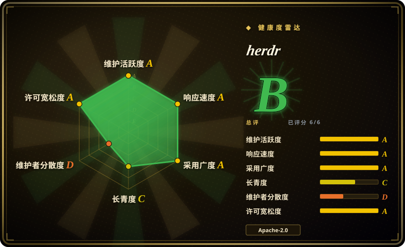
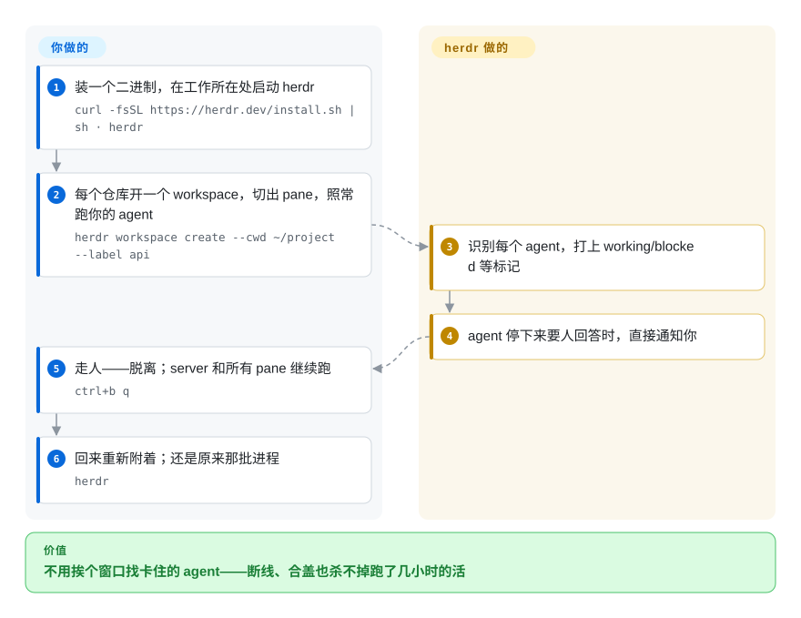

# herdr

你在一堆终端分屏里同时跑着 Claude Code、Codex 和 opencode，SSH 一断（或者只是合上笔记本盖子），跑了几小时的 agent 就全死了；回来还得挨个窗口翻，不知道哪个 agent 停下来在等你点确认。herdr 就是为这种负载造的终端多路复用器：后台 server 让每个 pane 的进程活着，每个 pane 打上 `working` / `blocked` / `done` / `idle` 标记，agent 自己还能通过 herdr 的 CLI 和 socket API 去开 pane、等另一个 agent 真正卡住。

## 何时使用

你同时在盯好几个编程 agent——Claude Code 在改 API 重构、Codex 在跑测试批次、opencode 在动前端——瓶颈不是跑它们而是*看住*它们：你要逐个窗口切过去，找那个卡在审批提示上的；SSH 一掉线，跑到一半的活就没了。你会想到 herdr，因为它掌管 agent 们住的终端（不包装、不替代 agent 本身），并补上了 tmux 和 zellij 没有的三件事：agent 感知的状态标记（`blocked` 意思是“这个 agent 此刻正在等人类回答”）；断开重连之外，服务器整机重启后受支持的 agent 还能接回自己的会话；以及一层自动化接口——`herdr agent start / prompt / wait / read`——让一个编排脚本或编排 agent 开出评审 pane、发提示、然后阻塞等待对方真正完成或卡住。

这正是相对替代品的决定性取舍：对比 [tmux](../../../terminal-ui/tmux.zh.md) 和 [zellij](../../../terminal-ui/zellij.zh.md)，herdr 拿它们多年/十几年的成熟度，换一层*为 agent 互相驱动而设计*的 API；对比浏览器驾驶舱 [CloudCLI](../../../agent-tooling/supervision-surfaces/claudecodeui.zh.md) 或桌面应用 [Agent Orchestrator](../../../agent-tooling/supervision-surfaces/agent-orchestrator.zh.md)，herdr 留在终端里——没有 Electron、不跑 web 服务、单个 Rust 二进制——并把同样的控制权暴露给脚本而不是 GUI。它还能把保存过的 SSH 机器联合进一个统一的 agent 列表、各自独立重连，“三台机器 30 个窗口”塌缩成一个窗口。

## 快问快答

- **「它是不是就是把我现有的 tmux 窗口管起来？」** 不是——herdr 是*替代*多路复用器本身，不是骑在 tmux 上面。你的 pane 从 tmux 的 server 搬到 herdr 的 server。相对 tmux 多出来的是 agent 层：working/blocked/idle 标记、`herdr agent wait --until blocked`、以及 agent 之间互相调用的 API。
- **「它能顶替我那个 capture-pane 轮询脚本——告诉我哪个 worker 卡住了吗？」** 能，这正是它的内置场景：每个 pane 的状态由进程和屏幕检测打标记，blocked 会弹通知，不用自己爬屏。更进一步：编排方可以 `herdr agent read reviewer --source recent-unwrapped` 直接读卡住窗口的文字。
- **「机器重启后，正在跑的进程能回来吗？」** 进程回不来——herdr 恢复保存的布局、在原目录重开 shell；只有带原生会话引用的 agent 能通过自己的 `--resume` 机制接回对话，这是*状态重建*，不是*进程复活*。
- **「名字和产品功能什么关系？」** herdr 是 *herder*（牧羊人）去掉了元音，羊群就是你的 coding agents——项目自己也在坐实这个隐喻：博客副标题是 "Notes from the herd."，logo 是一只眼睛为终端提示符的羊头，README 结尾署名 🐑。功能清单就是牧羊人的岗位说明：你不在时羊群继续走、哪只停下来了打标记、需要回答时把你叫回来。

## 怎么用起来

herdr 是 tmux 血统的 client/server 终端多路复用器：后台 server 掌管真实的 PTY 进程（内置 `portable-pty`），用 vendored 进仓库的 Ghostty `vt` 终端仿真 crate 渲染屏幕内容；你的终端里跑的是附着到 server 的 client，`ctrl+b q` 脱离、`herdr` 重连，agent 全程无感。新的部分是 pane 之上的*agent* 层：herdr 用前台进程判断、各 agent TUI 的屏幕状态清单（manifest）、外加可选安装的集成（`herdr integration install <agent>`），把识别出的 agent（23 种——claude、codex、opencode、kilo、cursor……）分类成 `working` / `blocked` / `done` / `idle`，再把各 workspace 和已保存 SSH 机器的 agent 汇成一个列表。持久化是分档的，边界要拎清：实时脱离不停进程；server *重启*会停——之后 herdr 恢复布局、可回放 pane 屏幕历史（默认关闭，因为屏里可能有 secret），并用集成上报的会话引用以 agent 自己的 `--resume <session-id>` 重启受支持的 agent。一切都能脚本化：CLI 输出 JSON，socket API 是 NDJSON（`~/.config/herdr/herdr.sock`），一个 agent 可以 `agent start` 另一个、发提示、再 `agent wait --until blocked`；还带 git worktree 增删开的辅助命令。

<!-- flow-steps:begin (generated from flows/herdr.json by tools/flow_card.py — do not edit) -->

流程文字版

1. **你**：装一个二进制，在工作所在处启动 herdr — `curl -fsSL https://herdr.dev/install.sh | sh · herdr`
2. **你**：每个仓库开一个 workspace，切出 pane，照常跑你的 agent — `herdr workspace create --cwd ~/project --label api`
3. **herdr**：识别每个 agent，打上 working/blocked 等标记
4. **herdr**：agent 停下来要人回答时，直接通知你
5. **你**：走人——脱离；server 和所有 pane 继续跑 — `ctrl+b q`
6. **你**：回来重新附着；还是原来那批进程 — `herdr`

**价值**：不用挨个窗口找卡住的 agent——断线、合盖也杀不掉跑了几小时的活

<!-- flow-steps:end -->

## 何时不用

- **你要的是能押十年的基建。** herdr 首个版本 v0.1.0 发布于 2026-03-27，现在 v0.9.1——6 个月大，文档自己把 live handoff 标为实验性。如果多路复用器是全团队不能折腾的底座，用 [tmux](../../../terminal-ui/tmux.zh.md)——约 20 年可以引用的行为——或者要人本位工作区就用 6 岁的 [zellij](../../../terminal-ui/zellij.zh.md)。herdr 的 agent 层收益，只有你接受 pre-1.0 API 动荡时才值。
- **你的编排层已经 own 了调度。** 如果并行 worker 已经由你自己的控制面在 tmux pane 里脚本化管理（[oh-my-claudecode](oh-my-claudecode.zh.md) 那类流水线），或者你要的是把每个 agent 关进 worktree、把 CI/评审反馈路由回来的桌面应用（[Agent Orchestrator](../../../agent-tooling/supervision-surfaces/agent-orchestrator.zh.md)），herdr 是第二套要学的控制面，不是补缺口的——它的甜点是“看住 agent、等 agent”这个痛点，不是任务路由。
- **你要浏览器/手机驾驶舱。** herdr 的界面是真实终端里的 TUI（外加 SSH 远程附着）；如果诉求就是“在手机浏览器里开会话”，[CloudCLI](../../../agent-tooling/supervision-surfaces/claudecodeui.zh.md)、[Hermes Workspace](../../../agent-tooling/supervision-surfaces/hermes-workspace.zh.md) 提供 web 控制台，zellij 也自带鉴权 web client。herdr 不跑 web 服务。
- **屏幕检测会被骗、也必须追版本。** 状态标记来自屏幕 manifest 和进程检测；某个 CLI agent 改版 TUI 后，herdr 的检测要等下一次 manifest/集成更新才跟上，期间 `unknown`（等待命令要显式声明才接受它）才是诚实答案。如果“错误地显示 idle”对你代价很大，纯 [tmux](../../../terminal-ui/tmux.zh.md) 加自己的核验，故障面更小。[推断]
- **你跑的大多是普通终端。** shell、构建、日志这类不关心 agent 状态的负载，tmux/zellij 是无聊但完整的工具；herdr 的额外机器（集成、manifest、会话引用）在这里一分钱收益都不买。
- **Windows 还是 beta 路线。** 文档把 Windows 支持挂在 “windows-beta” 页面下，CHANGELOG（2026-09）还标注 Git Bash 脱离问题未解决；Windows 是主力机的话，掂量。
- **你不能容忍持久化屏幕内容。** 重启后的屏幕回放会把 pane 历史写进 `session-history.json`；它默认关闭，恰恰因为屏里带 secret/token——但这也意味着不开它，*恢复*后的体验就不等于“屏幕原样还在”，除非用（实验性的）live handoff。

## 横向对比

| 替代品 | 是否收录 | 我们的评价 | 取舍 |
|---|---|---|---|
| [tmux](../../../terminal-ui/tmux.zh.md) | ✅ | 你盯的是编程 agent、要 blocked/working 标记和面向 agent 的 wait/prompt API 时选 herdr；需要二十年稳定行为、C 级资源占用、以及全机器人人肌肉记忆时选 tmux。 | herdr：agent 状态层、会话恢复、多机联邦，代价是 6 个月大的 pre-1.0 代码。tmux：一件事做到老，但对 agent 一无所知。 |
| [zellij](../../../terminal-ui/zellij.zh.md) | ✅ | 为 agent 层选 herdr；为人本位的易上手工作区（模式提示条、声明式布局、WASM 插件、内置 web client）、且不在乎 pane 里跑的是什么，选 zellij。 | zellij：6 岁、发布节奏稳、MIT、自带浏览器接入。herdr：更年轻，但能区分“agent 干完了”和“agent 在等你”。 |
| [CloudCLI (Claude Code UI)](../../../agent-tooling/supervision-surfaces/claudecodeui.zh.md) | ✅ | 驾驶舱必须是浏览器/PWA、跑的是 Claude Code 系会话、又不想常驻 TUI，选 CloudCLI；驾驶舱*就是*终端、且 agent 需要程序化驱动 pane，选 herdr。 | CloudCLI：web/移动界面，AGPL-3.0-or-later。herdr：终端内，Apache-2.0，agent 互驱 API 更强。 |
| [Agent Orchestrator](../../../agent-tooling/supervision-surfaces/agent-orchestrator.zh.md) | ✅ | 要桌面控制面把活扇给 N 个 worktree 隔离的 agent、并路由 CI/评审反馈，选 Agent Orchestrator；要 agent 待在你自己的终端流程里、彼此通过一个 socket API 互驱（UI 也吃这个 API），选 herdr。 | Orchestrator：主张任务派发、Electron 形态。herdr：你自己写的工作流下面的基础设施。 |
| GNU Screen | 未收录 | 只有在 tmux 都装不出来的老系统上才值得用 Screen；对这个负载，它在人体工学上落后 tmux、在 agent 层上根本没有概念。 | 真实仓库但功能上近乎冻结；有意不收录——tmux 维护得更好、覆盖同样场景。 |

## 技术栈

- **Rust**，单一二进制、无 Electron；edition 2021（`Cargo.toml`，2026-09-27 读取）。
- **TUI：** `ratatui` 0.30 + `crossterm` 0.29；**终端仿真：** `ghostty-vt`——从 Ghostty 的 vt 层 vendored 进仓库的 workspace crate；**PTY：** `portable-pty`（经 `[patch.crates-io]` 锁到 vendored 副本）。
- **服务端：** `tokio`（多线程），`interprocess` 承担 Unix socket / Windows 命名管道的 JSON API；`serde`/`schemars` 生成对外发布的 JSON Schema（`herdr api schema`）；`tracing` 出日志。
- **平台胶水：** Linux 上用 `zbus` 挂 logind delay-inhibitor（宿主关机前保存，免得 panes 被杀）；Windows 上用 `windows-sys` + SDDL 描述符保护命名管道，发行包含自带 ConPTY 运行时。
- **分发：** shell 一行脚本、Homebrew、mise、Nix flake、Windows PowerShell 一行脚本；GitHub releases，配日期戳的 preview 构建。

## 依赖

- **用户不需要额外跑任何东西**：单二进制；server 是 herdr 自己管理的脱离进程。
- **agent 是各自独立安装的**（claude、codex、opencode、kilo……）——herdr 掌管它们的终端，不管它们的运行时；认不出来的 pane 就没有状态标记。
- **OpenSSH** 用于远程附着与已保存的 SSH 机器（`herdr --remote workbox`）；远端主机可由交互式安装自动铺上 herdr server 二进制，或设 `HERDR_REMOTE_BINARY`。
- 可选的按 agent **集成**（`herdr integration install <agent>`）换取更准的状态上报与原生会话恢复；没有集成时退回进程 + 屏幕 manifest 检测。

## 运维难度

**起步很轻，但有一笔新性质的长期税。** 装一个二进制，在工作所在处跑 `herdr`；脱离/重连是 tmux 式的（`ctrl+b q`）；server 一直活着直到 `herdr server stop`。增加负担的是：检测层要追着 20 多个 CLI agent 的界面改动（存在远程更新的 agent manifest——`server.agent_manifests` 报告它们的版本），发布节奏极快（preview 构建；0.x 之间出现破坏性行为变化是现实预期），且持久化分档各不相同（实时脱离 ≠ server 重启 ≠ `--handoff`），“什么活下来了”要靠想而不是靠默认。没有数据库，默认不监听端口，API 走本地 Unix socket / 命名管道。

## 健康度与可持续性

- **维护（2026-09）。** 极快：首版 v0.1.0 在 2026-03-27（与建仓同日），最新稳定 v0.9.1（2026-09-16），preview 构建与当周修复持续到 2026-09-27 的 master push；1,752 commits；374 个 open issues——高使用量和高动荡并存。
- **治理 / bus factor。** `owner.type` 是 Organization，但 `orgs/herdrdev/members` 为**空**（2026-09-27）——组织页实际仍是单作者：ogulcancelik（Can Celik）占约 1,752 commits 中的 1,265（约 72%，终身口径）；近 12 个月窗口更紧，头部作者占 **82.3%**（health scorer，2026-09-27）。根目录未见 SECURITY.md 或 GOVERNANCE（有 CONTRIBUTING.md）。作者已宣布（博客 2026-09-08）种子轮资金将用于*组建团队*——正在招聘，走的是终端原生渠道——这条画像预计会变；在那之前，单维护者风险明示。
- **后盾（2026-09）。** 已是有融资的公司，不再是独立开发者形态：**加入 Y Combinator**（2026-08-06 官宣），并完成 **Bessemer Venture Partners 领投的 600 万美元种子轮**，YC、e2vc 及天使跟投，天使包括 Tobi Lütke（Shopify CEO）、Dane Knecht（Cloudflare CTO）、Görkem Yurtseven（fal 联合创始人）（博客 2026-09-08）。官网页脚署 "© 2026 Herdr, Inc."；作者的书面承诺是*运行时保持开源*（Apache-2.0），商业化方向指向托管的 Herdr Cloud（博客 2026-09-07）。SPONSORS.md 与企业/合作联系渠道仍在。
- **年龄 × Lindy（2026-09）。** 6 个月、约 41k stars（API 读数 40,969，2026-09-27）：热度拉满，Lindy 积累为零。按本索引自己的启发式，年轻仓库的高星是风险信号而非证明——而“给 agent 用的终端复用器”恰是范式最容易翻桌的领域。[推断]
- **采用度与生态。** Homebrew formula（2026-09-27 实测：90 天安装 50,512 次、release 资产累计下载 1,051,148——真实拉力，不是玄学）、插件市场（同账号下的 herdr-plugin-examples）、agent-skill 文档、英/日/中三语文档；18 种 agent 有原生会话恢复、23 种可 `agent start`。尚无点名的生产采用者清单。
- **风险信号。** pre-1.0 且 schema/CLI 快速演化（已发布的 JSON Schema 与 "endpoint generation" 的 client/server 兼容机制算缓解）；Windows 路线仍 beta；屏幕历史持久化默认关闭（安全意识，但恢复体验因此打折）；商业化方向是开源运行时旁边的托管 Herdr Cloud（博客 2026-09-07）——今天是一句“运行时保持开源”的承诺，明天是一条要盯着的 open-core 边界；而在种子轮之前，路线图一直是一个人的判断。

## 存疑（未验证）

- [未验证] socket API / 命名管道的访问控制：文档展示了 Windows 侧 SDDL 描述符，但没写 Unix socket 的权限模型；“本地 socket ⇒ 同用户进程即可控制 agent”未实测。
- [推断] “agent 改版 TUI 后检测会滞后”——由 manifest/集成的版本机制（`server.agent_manifests`、各 agent 的最低集成版本）推出；本次未复现任何误检。
- [推断] 把“374 个 open issues”读成高动荡而非疏于管理——依据发布节奏与 CHANGELOG 活跃度，没有逐 issue 审读。
- [未验证] star 数、commit 数、贡献占比均为 2026-09-27 的 GitHub API 输出；squash-merge 与机器人提交（名单里有 akbash-bot、kangal-bot）会扭曲按人归因。
- [未验证] 文档化的 handoff 分批（>64 panes）之外的性能/规模上限未实测；“30 个 pane 没问题”是假设。
- [推断] “agent 几乎无感”——来自文档“不包装 agent、只掌管其终端”的说法；按设计陈述理解，未做负载测试。
- [推断] herdr = "herder" 的命名隐喻——有官方物料佐证（博客副标题 "Notes from the herd."、眼睛是终端提示符的羊头 logo、README 结尾的 🐑）；但“为什么把拼法去掉元音”，在仓库代码搜索与博客目录里都没有作者自述（2026-09-27 查）。
- [推断] 归类放在 `orchestration-and-review`：herdr 是*面向*编程 agent 的复用器（偏控制面）；按功能本可以与 tmux/zellij 同归终端复用类，此处以场景归位。
