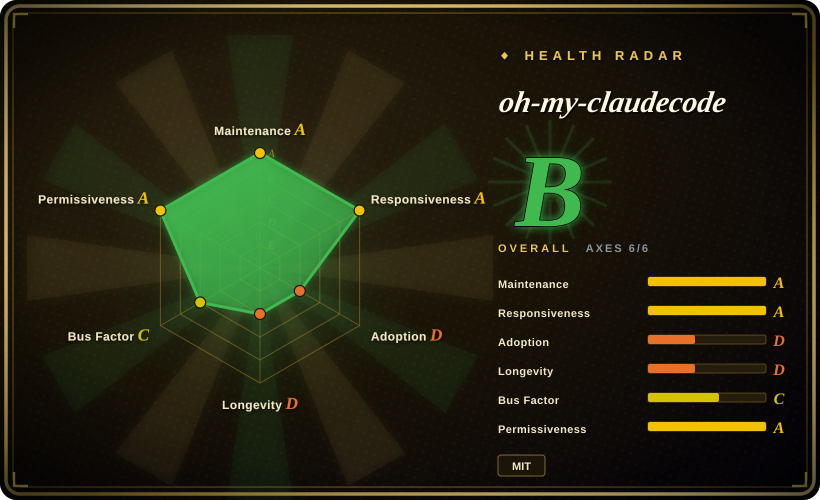
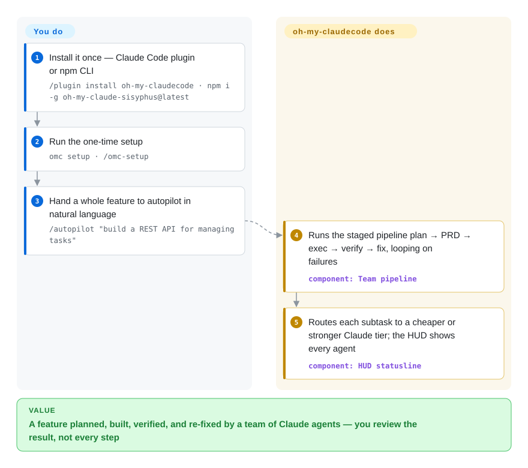

# oh-my-claudecode

A single Claude Code session hits its ceiling on a big feature — you're hand-copying context between agents and babysitting each step. oh-my-claudecode (OMC) layers a team of specialized agents on top of the CLI: it plans, PRDs, executes in parallel, verifies and loops on failures, and routes simple subtasks to cheaper Claude models — installed as a plugin, no configuration to start.

## When to use

You're a developer who lives in Claude Code and keeps hitting the ceiling of a single agent on bigger work: a multi-file feature where you want one pass to plan, another to write the PRD, parallel workers to implement, and a separate reviewer/tester to verify — all without hand-copying context between chat sessions or babysitting each step. You also notice you're burning Opus tokens on trivial edits that Haiku could handle. OMC sits on top of Claude Code and gives you a canonical "team" pipeline (`team-plan → team-prd → team-exec → team-verify → team-fix`) plus model routing that pushes simple work to cheaper tiers and reserves the expensive model for hard reasoning, with a HUD statusline so you can watch what each agent is doing.

You reach for it specifically when you want orchestration *inside the Claude Code ecosystem you already pay for* — your Max/Pro subscription or API key — rather than standing up a separate Python agent framework with its own runtime. You install it as a plugin (`/plugin install oh-my-claudecode`) or via npm (`oh-my-claude-sisyphus`), run `/omc-setup` or `omc setup`, and from then on drive it in natural language or via slash commands (`/team`, `/autopilot`, `/ralph`); for terminal-launched tmux workers — including external Codex/Gemini/Antigravity/Grok/Cursor CLIs — you use `omc team`. It's a good fit when your bottleneck is *coordinating Claude agents*, not building a general-purpose multi-LLM application.

## How it works

OMC turns your Claude Code session into a lead-plus-team runtime. `/team` (or `/autopilot` for the end-to-end autonomous variant) runs the canonical staged pipeline `team-plan → team-prd → team-exec → team-verify → team-fix`, looping the fix stage until verification passes; the in-session `/team` rides Claude Code's native agent-teams feature (an experimental env flag in `~/.claude/settings.json`), and OMC falls back to non-team execution if you haven't enabled it. A router assigns each subtask an Anthropic model tier (Haiku for simple edits, Opus for hard reasoning), and a HUD statusline plus session/replay artifacts show which agent did what. The separate `omc` terminal CLI (npm package `oh-my-claude-sisyphus`) spawns real worker panes under tmux — `omc team 2:codex "…"` runs parallel Codex/Gemini/Antigravity/Grok/Cursor/Claude CLIs that spawn on demand and die when done — and `omc ask` does one-shot advisor queries. What stays yours: the Claude entitlement and spend, tmux itself, and reviewing/approving the output; the learned-pattern skills (`.omc/skills/`) and notification hooks are optional layers you choose to maintain.

<!-- flow-steps:begin (generated from flows/oh-my-claudecode.json by tools/flow_card.py — do not edit) -->

Text version of the flow

1. **You**: Install it once — Claude Code plugin or npm CLI — `/plugin install oh-my-claudecode · npm i -g oh-my-claude-sisyphus@latest`
2. **You**: Run the one-time setup — `omc setup · /omc-setup`
3. **You**: Hand a whole feature to autopilot in natural language — `/autopilot "build a REST API for managing tasks"`
4. **oh-my-claudecode**: Runs the staged pipeline plan → PRD → exec → verify → fix, looping on failures — component: `Team pipeline`
5. **oh-my-claudecode**: Routes each subtask to a cheaper or stronger Claude tier; the HUD shows every agent — component: `HUD statusline`

**Value**: A feature planned, built, verified, and re-fixed by a team of Claude agents — you review the result, not every step

<!-- flow-steps:end -->

<!-- flow-steps:begin (generated from flows/oh-my-claudecode.json by tools/flow_card.py — do not edit) -->
<!-- flow-steps:end -->

## When NOT to use

- **You're not on Claude Code.** OMC is a Claude Code plugin / companion CLI with no provider-agnostic core — no VS Code extension ships with it, and the Agent SDK helpers (`createOmcSession()`) target Claude Agent SDK scripts specifically. If you orchestrate agents with arbitrary LLM providers in your own app, you want a general framework ([DSPy](../../workflow-builders/dspy.md), [AgentScope](../../agent-runtimes/agent-sdks/agentscope.md)), not a Claude-Code-bound layer. (The author maintains a Codex-CLI twin, oh-my-codex, for the other ecosystem.)
- **You can't run tmux.** The `omc team` workers and rate-limit auto-resume (`omc wait`) require tmux; Windows has a native path via psmux, but the surface is still uneven — named autopilot workflow profiles, for example, currently require Linux with `flock`. Treat cross-platform parallelism as not-yet-settled.
- **You need a stable, slow-moving API to build a product on.** The project ships aggressively (v5.5.0 with 252 releases, multiple a month) and has renamed or removed load-bearing surfaces across majors: the `swarm` keyword is gone (use `team`), the Codex/Gemini MCP servers were removed in v4.4.0 in favor of CLI tmux workers, `plan this` keyword triggers were dropped, and `omc autoresearch` is a hard-deprecated shim. That velocity is great for a power user but is churn you'd be coupling to.
- **You want one auditable, deterministic agent loop.** A staged multi-agent pipeline with automatic model routing and parallel workers is inherently harder to reason about and reproduce than a single-agent script; debugging "which agent did what at which tier" adds surface area (the project's own guidance warns against running the interactive slash modes in CI).
- **You're a single-vendor, single-lead bet.** The README names one Creator & Lead with a handful of maintainers/collaborators; the health radar measures ~79% of 12-month commits on the top contributor. Bus-factor and long-term support are real considerations for anything load-bearing at 39k-star visibility. [推断]
- **Cost is fully predictable already.** The "saves 30-50% on tokens" claim is the project's own framing and depends entirely on your workload; if you already control model selection by hand, the routing buys you less.

## Comparison

| Alternative | In index | Our verdict | Tradeoff |
|---|---|---|---|
| [DSPy](../../workflow-builders/dspy.md) | ✅ | Choose DSPy when you need a provider-agnostic Python framework for programming/optimizing LLM pipelines you embed in your own app; OMC only makes sense once Claude Code is already your runtime. | Provider-agnostic Python framework; you build the app yourself. OMC is narrower: orchestration *inside Claude Code*, no model-program compilation. |
| [AgentScope](../../agent-runtimes/agent-sdks/agentscope.md) | ✅ | Choose AgentScope when you're building a hosted multi-agent application with any model; OMC orchestrates Claude agents in your editor session and owns nothing below the CLI. | General multi-agent platform (any model, message-passing, visual studio); a full framework you host. OMC rides on Claude Code instead of being a standalone runtime. |
| [claude-octopus](claude-octopus.md) | ✅ | When the problem is *coordinating many workers on one build* (pipelines, routing, tmux), pick OMC; when it's *one model's blind spots*, pick claude-octopus, which fans the same task to 12 external providers and gates on their disagreement. | Both are Claude Code plugin layers: OMC's axis is team/parallel execution with model-tier routing; Octopus's is cross-vendor consensus review. OMC does call external CLIs via `omc team`/`/ask`, but without consensus gates. |
| [Symphony](../../agent-runtimes/agent-services/symphony.md) | ✅ | Choose Symphony when runs should be driven headless from your Linear board (issue → workspace → Codex run → PR) instead of interactively from a Claude Code session. | OpenAI's polling orchestrator for Codex runs, an Elixir service; different vendor anchor and a queue-driven rather than session-driven model. |
| [openfang](../../agent-runtimes/agent-services/openfang.md) | ✅ | Choose openfang when you want scheduled autonomous agents running 24/7 as a single Rust binary with messaging-channel integrations; OMC's work only starts when you prompt a Claude Code session. | Rust "agent OS" (scheduler, WASM sandbox, channel adapters) vs. a plugin layer on Claude Code; almost no overlap beyond the word "agent". |
| claude-flow | 未收录 | Choose claude-flow when you want the older, broader Claude-Code swarm/orchestration layer with its own memory/topology stack. | Overlapping problem space (Claude Code multi-agent); different abstractions and a much larger config surface — read both before committing. |
| Claude Code subagents (built-in) | 未收录 | If native subagents plus Claude Code's experimental agent-teams already cover your workflow, use them directly; OMC is exactly the bet that the raw primitives need a team pipeline, routing, HUD, and learnable skills on top. | Anthropic's native subagent/parallel features cover part of OMC's value without a third-party dependency; note OMC's `/team` mode *depends* on the native experimental flag being enabled. |

## Tech stack

- **Language:** TypeScript (~59%) + JavaScript (~40%) per GitHub language stats 2026-09-27.
- **Host:** Anthropic Claude Code CLI — distributed as a Claude Code marketplace plugin and as an npm CLI package (`oh-my-claude-sisyphus`, installing both `oh-my-claudecode` and `omc` commands).
- **Orchestration substrate:** Claude Code's native (experimental) agent-teams env flag for in-session `/team`; tmux worker panes for terminal `omc team` (supports `claude`/`codex`/`gemini`/`agy`/`grok`/`cursor-agent` CLIs; Windows via psmux).
- **Model routing:** assigns work across Anthropic model tiers (e.g. Haiku for simple, Opus for hard reasoning), with a published model×agent compatibility matrix [未验证] exact routing rules.
- **Extras:** HUD statusline, persistent learned skills (`.omc/skills/`, auto-injected on trigger match), session/replay artifacts, notification callbacks (Telegram/Discord/Slack/OpenClaw gateway), `better-sqlite3` native storage in the CLI.

## Dependencies

- **Required:** Claude Code CLI; a Claude Max/Pro subscription **or** an Anthropic API key; Node.js (for the npm install path); **tmux** for `omc team` and `omc wait` (Windows: psmux via winget).
- **Install (plugin):** `/plugin marketplace add https://github.com/Yeachan-Heo/oh-my-claudecode` → `/plugin install oh-my-claudecode` → `/omc-setup` (slash commands run one at a time inside a session).
- **Install (CLI):** `npm i -g oh-my-claude-sisyphus@latest` → `omc setup`.
- **Optional:** Codex/Gemini/Antigravity/Grok/Cursor CLIs for cross-vendor workers and advisors; notification webhooks/tokens.

## Ops difficulty

**Low to medium.** The happy path is genuinely easy: install the plugin, run setup, and drive it in natural language — "zero configuration" with intelligent defaults is a stated design goal. Difficulty rises to **medium** once you depend on the tmux-backed workers (terminal environment matters; named autopilot profiles need Linux `flock`, Windows rides on psmux), wire up external CLIs or notification channels, or try to pin behavior across a 252-release cadence where surfaces have been renamed and MCP providers removed outright. Updates are manual unless you enable marketplace auto-update (`/plugin marketplace update omc` then re-run `/omc-setup`; `/omc-doctor` clears a stale plugin cache). The npm CLI carries a known upstream deprecation warning from `better-sqlite3`'s dependency chain (tracked upstream, not an install failure). Because it's a thin-ish layer over Claude Code, most "ops" is really Claude Code's auth/rate-limit reality plus keeping the plugin/npm version current.

## Health & viability

- **Responsiveness**: Grade A — median first-response time 0.8 hours across 33 qualifying issues/PRs.
- **Maintenance — very active (as of 2026-09).** Last push 2026-09-27, current release v5.5.0 (2026-09-22), 252 releases; not archived. Actively maintained, but the velocity is itself the churn flagged under "When NOT to use."
- **Governance & bus factor — single lead with a small team, huge-star mismatch.** The README names one Creator & Lead (`Yeachan-Heo`) plus a handful of maintainers and top collaborators; radar measures ~79% of 12-month commits on the top contributor out of ~99 active in 12 months. A `User`-owned repo carrying ~39k stars is still a bus-factor flag for anything load-bearing. [推断]
- **Age & Lindy — young, unproven.** Created 2026-01, ~8 months old (as of 2026-09). High activity but no track record; active-but-unproven, not Lindy-safe — longevity and single-lead continuity are undemonstrated.
- **Risk flags — fast-moving surface + thin layer.** MIT-licensed, low relicense risk, but it's a thin, fast-evolving layer over Claude Code that has already broken naming (swarm→team) and removed provider MCP servers once; the native agent-teams feature it builds on is itself experimental.

## Caveats (unverified)

- [未验证] "Saves 30-50% on tokens," "zero configuration," and "19 specialized agents" are the project's own README framing; actual savings and agent count depend on workload and version and were not independently benchmarked.
- [未验证] Exact model-routing rules (which tier gets which task) and the model×agent compatibility matrix come from README/docs descriptions, not verified against code.
- [未验证] The mode set (Team, Autopilot, Ralph, Execute, Verify, deep-interview, Ultragoal) and keyword triggers is per README; precise behavior/availability shifts release-to-release.
- [推断] Single primary maintainer / concentrated bus factor — inferred from the README's maintainer list and the radar's commit share; a real contributor team exists, so "solo" would overstate it, and "well-distributed" would understate the concentration.
- [推断] Classifying it as `framework` is a judgment call — it is simultaneously a Claude Code plugin and a CLI; "orchestration framework on top of Claude Code" is the closest fit.
