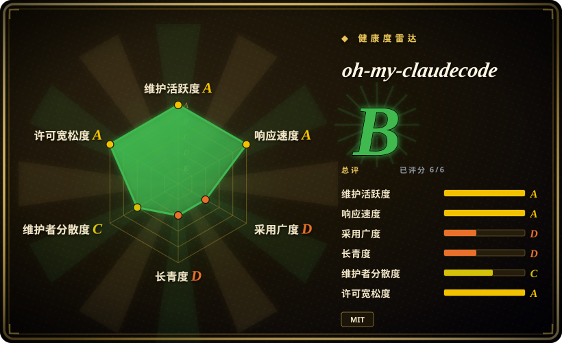
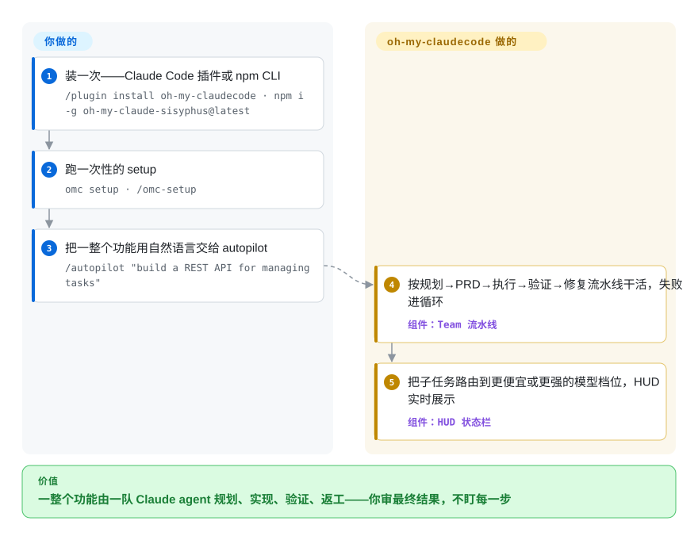

# oh-my-claudecode

单个 Claude Code 会话在大功能上会撞天花板——你在 agent 之间手抄上下文、每一步都得盯着。oh-my-claudecode（OMC）在 CLI 之上叠了一支专职 agent 团队：它做规划、写 PRD、并行实现、验证并在失败时返工，还把简单子任务路由给更便宜的 Claude 档位——以插件安装，起步零配置。

## 何时使用

你是个开发者，日常住在 Claude Code 里，却不断撞上「单个 agent 干不了大活」的天花板：一个多文件功能，你希望有一遍专门做规划、一遍写 PRD、并行的 worker 去实现、另有 reviewer/tester 来验证——全部不用在对话之间手抄上下文或逐步盯梢。你还注意到自己把 Opus 的 token 烧在了 Haiku 就能干的琐碎改动上。OMC 架在 Claude Code 之上，给你一条主干「team」流水线（`team-plan → team-prd → team-exec → team-verify → team-fix`）加模型路由：简单活推向便宜档位、贵模型留给硬推理，再用 HUD 状态栏让你看得见每个 agent 在干什么。

你选它，具体是因为想要编排发生在*你已经在付费的 Claude Code 生态内部*——你的 Max/Pro 订阅或 API key——而不是另起一个带独立运行时的 Python agent 框架。你以插件安装（`/plugin install oh-my-claudecode`）或走 npm（`oh-my-claude-sisyphus`），跑 `/omc-setup` 或 `omc setup`，之后用自然语言或斜杠命令驱动（`/team`、`/autopilot`、`/ralph`）；要终端里 tmux 拉起的 worker（含外部 Codex/Gemini/Antigravity/Grok/Cursor CLI），用 `omc team`。当你的瓶颈是*协调 Claude agent*、而不是构建通用多 LLM 应用时，它很合适。

## 怎么用起来

OMC 把你的 Claude Code 会话变成「领队 + 团队」运行时。`/team`（端到端自动化的变体是 `/autopilot`）跑主干分阶段流水线 `team-plan → team-prd → team-exec → team-verify → team-fix`，验证不过就回到 fix 阶段循环；会话内 `/team` 骑在 Claude Code 原生的 agent-teams 能力上（`~/.claude/settings.json` 里的一个实验性环境变量），没开启时 OMC 会回退到非 team 执行。路由器给每个子任务分配 Anthropic 模型档位（简单编辑给 Haiku，硬推理给 Opus），HUD 状态栏加会话/回放工件展示哪个 agent 干了什么。独立的 `omc` 终端 CLI（npm 包 `oh-my-claude-sisyphus`）能在 tmux 下拉起真实 worker 面板——`omc team 2:codex "…"` 并行跑 Codex/Gemini/Antigravity/Grok/Cursor/Claude CLI，用时拉起、干完就退——`omc ask` 则做单发顾问咨询。仍然归你管的：Claude 的订阅与花费、tmux 本身、以及对产出的 review/批准；可复用 skills（`.omc/skills/`）与通知 hook 是你选择维护的可选层。

<!-- flow-steps:begin (generated from flows/oh-my-claudecode.json by tools/flow_card.py — do not edit) -->

流程文字版

1. **你**：装一次——Claude Code 插件或 npm CLI — `/plugin install oh-my-claudecode · npm i -g oh-my-claude-sisyphus@latest`
2. **你**：跑一次性的 setup — `omc setup · /omc-setup`
3. **你**：把一整个功能用自然语言交给 autopilot — `/autopilot "build a REST API for managing tasks"`
4. **oh-my-claudecode**：按规划→PRD→执行→验证→修复流水线干活，失败进循环 — 组件：`Team 流水线`
5. **oh-my-claudecode**：把子任务路由到更便宜或更强的模型档位，HUD 实时展示 — 组件：`HUD 状态栏`

**价值**：一整个功能由一队 Claude agent 规划、实现、验证、返工——你审最终结果，不盯每一步

<!-- flow-steps:end -->

<!-- flow-steps:begin (generated from flows/oh-my-claudecode.json by tools/flow_card.py — do not edit) -->
<!-- flow-steps:end -->

## 何时不用

- **你不在 Claude Code 上。** OMC 是 Claude Code 插件 / 伴侣 CLI，没有供应商无关内核——它不提供 VS Code 扩展，Agent SDK 助手（`createOmcSession()`）也只面向 Claude Agent SDK 脚本。如果你在自己的应用里编排任意 LLM provider，你该选通用框架（[DSPy](../../workflow-builders/dspy.zh.md)、[AgentScope](../../agent-runtimes/agent-sdks/agentscope.zh.md)），不是一个绑在 Claude Code 上的层。（作者另维护了面向 Codex CLI 的孪生项目 oh-my-codex。）
- **你跑不了 tmux。** `omc team` worker 与限速自动恢复（`omc wait`）都要求 tmux；Windows 有经 psmux 的原生路径，但这个表面仍未磨平——比如具名 autopilot 工作流档位目前就要求带 `flock` 的 Linux。跨平台并行性请当作「未定型的在途工作」。
- **你需要一个稳定、慢节奏的 API 去构建产品。** 项目发版极猛（v5.5.0、共 252 次发布、常一月数个），且大版本间动过承重的命名与表面：`swarm` 关键词已移除（改用 `team`）、Codex/Gemini 的 MCP server 在 v4.4.0 被删并换成 CLI tmux worker、`plan this` 关键词触发被去掉、`omc autoresearch` 成了硬性废弃的壳。这种速度对高级用户是福音，但你要把团队标准化在它上面的话，耦合的就是这份 churn。
- **你想要单条可审计、确定性的 agent 循环。** 带自动模型路由与并行 worker 的分阶段多 agent 流水线，天然比单 agent 脚本更难推理和复现；排查「哪个 agent 在哪档位干了什么」本身就是额外表面（项目自己的文档也警告交互式 slash 模式不要进 CI）。
- **你在赌单一厂商、单一领队。** README 列名了一位 Creator & Lead 加少量维护者 / 协作者；健康度雷达测得 12 个月提交量约 79% 集中在头号贡献者身上。对 39k star 的可见度而言，bus factor 与长期支持仍是承重采用前必须掂量的事。[推断]
- **成本本就可预测。** 「省 30-50% token」是项目自己的表述，完全取决于工作负载；你若已经手动控制好模型选择，路由给你的增益就有限。

## 横向对比

| 替代品 | 是否收录 | 我们的评价 | 取舍 |
|---|---|---|---|
| [DSPy](../../workflow-builders/dspy.zh.md) | ✅ | 需要供应商无关、嵌在你自己应用里的 Python prompt / pipeline 编程与优化框架时选 DSPy；OMC 只有当 Claude Code 已经是你运行的东西时才成立。 | 供应商无关的 Python 框架，应用由你自己搭。OMC 更窄：Claude Code 会话内的编排，没有模型程序编译。 |
| [AgentScope](../../agent-runtimes/agent-sdks/agentscope.zh.md) | ✅ | 当你在构建可自托管、任意模型的多 agent 应用时选 AgentScope；OMC 只在你的编辑器会话里协调 Claude agent，CLI 以下什么都不拥有。 | 通用多 agent 平台（任意模型、消息传递、可视化开发）；你要自托管的完整框架。OMC 寄居于 Claude Code 而非独立运行时。 |
| [claude-octopus](claude-octopus.zh.md) | ✅ | 问题是*让多个 worker 协同交付一个构建*（流水线、路由、tmux）时选 OMC；问题是*单个模型的盲点*时选 claude-octopus——它把同一任务扇给 12 个外部 provider 并以分歧为闸门。 | 两者都是 Claude Code 插件层：OMC 的轴向是 team/并行执行加模型档位路由；Octopus 的是跨厂商共识评审。OMC 也能经 `omc team`/`/ask` 调外部 CLI，但没有共识闸门。 |
| [Symphony](../../agent-runtimes/agent-services/symphony.zh.md) | ✅ | 当运行应由 Linear 看板无人值守驱动（issue → 隔离工作区 → Codex 执行 → PR）、而非在 Claude Code 会话里交互发起时，选 Symphony。 | OpenAI 出品的 Codex 轮询编排器（Elixir 服务）；厂商锚点不同，且是队列驱动而非会话驱动。 |
| [openfang](../../agent-runtimes/agent-services/openfang.zh.md) | ✅ | 需要按计划 7×24 自主跑动的 agent（单个 Rust 二进制、带消息通道集成）时选 openfang；OMC 的活要在你唤起 Claude Code 会话之后才开始。 | Rust「agent 操作系统」（调度器、WASM 沙箱、通道适配器）vs. Claude Code 之上的插件层；除了「agent」一词几乎没有重叠。 |
| claude-flow | 未收录 | 想要更老、更庞大的 Claude Code swarm/编排层（自带 memory/拓扑栈）时选 claude-flow。 | 问题域重叠（Claude Code 多 agent）；抽象不同、配置面大得多——动手前两边都读。 |
| Claude Code 原生 subagents | 未收录 | 原生 subagents 加实验性 agent-teams 已覆盖你的工作流就直接用它们；选 OMC 恰恰是赌这些原始原语需要 team 流水线、路由、HUD 与可学习 skills 往上叠。 | Anthropic 原生 subagent/并行能力覆盖 OMC 价值的一部分且无第三方依赖；注意 OMC 的 `/team` 模式*依赖*原生实验开关被打开。 |

## 技术栈

- **语言：** TypeScript（约 59%）+ JavaScript（约 40%），据 GitHub 语言统计 2026-09-27。
- **宿主：** Anthropic Claude Code CLI——以 Claude Code marketplace 插件分发，也有 npm CLI 包（`oh-my-claude-sisyphus`，同时装出 `oh-my-claudecode` 与 `omc` 两个命令）。
- **编排底座：** 会话内 `/team` 用 Claude Code 原生（实验性）agent-teams 环境变量；终端 `omc team` 用 tmux worker 面板（支持 `claude`/`codex`/`gemini`/`agy`/`grok`/`cursor-agent` CLI；Windows 经 psmux）。
- **模型路由：** 在 Anthropic 模型档位间分派工作（简单给 Haiku、硬推理给 Opus），另有公开的模型 × agent 兼容矩阵 [未验证] 确切路由规则。
- **附加件：** HUD 状态栏、可持久学习的 skills（`.omc/skills/`，命中触发词自动注入）、会话/回放工件、通知回调（Telegram/Discord/Slack/OpenClaw 网关）、CLI 内 `better-sqlite3` 原生存储。

## 依赖

- **必需：** Claude Code CLI；一个 Claude Max/Pro 订阅**或** Anthropic API key；Node.js（npm 安装路径）；**tmux**（`omc team` 与 `omc wait` 需要；Windows 经 winget 装 psmux）。
- **安装（插件）：** `/plugin marketplace add https://github.com/Yeachan-Heo/oh-my-claudecode` → `/plugin install oh-my-claudecode` → `/omc-setup`（slash 命令要在会话内逐条输入）。
- **安装（CLI）：** `npm i -g oh-my-claude-sisyphus@latest` → `omc setup`。
- **可选：** Codex/Gemini/Antigravity/Grok/Cursor CLI（跨厂商 worker 与顾问）；通知 webhook/token。

## 运维难度

**低到中。** 快乐路径确实简单：装插件、跑 setup、用自然语言驱动——「零配置、智能默认」是项目自述的设计目标。一旦依赖 tmux worker（终端环境很重要；具名 autopilot 档位要 Linux `flock`、Windows 靠 psmux）、接外部 CLI 或通知通道、或想在 252 次发布的节奏上钉住行为（命名改过、MCP provider 整个删过），难度升到**中**。不开 marketplace 自动更新就得手动升级（`/plugin marketplace update omc` 后重跑 `/omc-setup`；`/omc-doctor` 清旧插件缓存）。npm CLI 有一条来自 `better-sqlite3` 依赖链的已知上游 deprecation 警告（上游在跟，不代表安装失败）。因为它是对 Claude Code 的薄层，多数「运维」其实是 Claude Code 的鉴权/限速现实，外加保持插件/npm 版本新鲜。

## 健康度与可持续性

- **响应速度**：Grade A——中位首次响应时间 0.8 小时，基于 33 个 qualifying issues/PRs。
- **维护——非常活跃（截至 2026-09）。** 最后推送 2026-09-27，当前发布 v5.5.0（2026-09-22），共 252 次发布；未归档。在被积极维护，但这份速度本身就是「何时不用」里点到的 churn。
- **治理与 bus factor——单一领队带小团队 + 巨量 star 错位。** README 列名一位 Creator & Lead（`Yeachan-Heo`）与少量维护者 / 头号协作者；雷达测得 12 个月约 99 名活跃贡献者中 79% 的提交集中在头号贡献者身上。一个 `User` 持有的仓库背着约 39k star，对承重场景仍是 bus-factor 信号。[推断]
- **年龄与 Lindy——年轻、未经证明。** 2026-01 创建，约 8 个月（截至 2026-09）。活跃度高但无历史沉淀；活跃但未经证明，不是 Lindy 意义上的安全押注——寿命与单领队连续性都未被证明。
- **采用度 — 有实测但量小。** npm 包以另一个名字发布（`oh-my-claude-sisyphus`，经仓库自身 `package.json` 回链核实）：每月约 1.67 万次下载（npm 统计月，2026-09-28），注册表零依赖方——雷达 D。
- **风险信号——快速变动的表面 + 薄层。** MIT 许可、重许可风险低，但它是对 Claude Code 的薄且快变的层：命名已破过一次契约（swarm→team）、provider MCP server 删过一轮；它所依托的原生 agent-teams 能力自己还在实验开关后面。

## 存疑（未验证）

- [未验证]「省 30-50% token」「零配置」「19 个专职 agent」都是项目自己的 README 表述；实际节省与 agent 数取决于工作负载和版本，未经独立基准测试。
- [未验证] 确切的模型路由规则（哪个档位接哪种任务）与模型 × agent 兼容矩阵来自 README/文档描述，未对照代码核实。
- [未验证] 模式集合（Team、Autopilot、Ralph、Execute、Verify、deep-interview、Ultragoal）与关键词触发均据 README；精确行为/可用性随版本变动。
- [推断] 单一主维护者 / bus factor 集中——由 README 维护者名单与雷达提交占比推断；确实存在一支贡献者团队，说「独自一人」会夸大，说「充分分散」会低估这份集中。
- [推断] 把它归为 `framework` 是判断——它同时是 Claude Code 插件和 CLI；「架在 Claude Code 之上的编排框架」是最贴近的归类。
