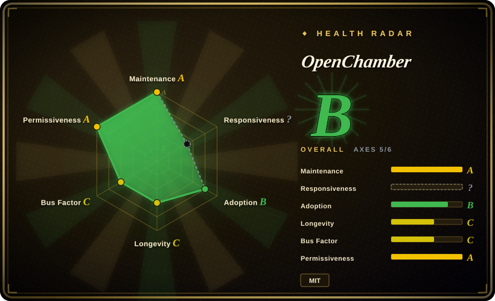
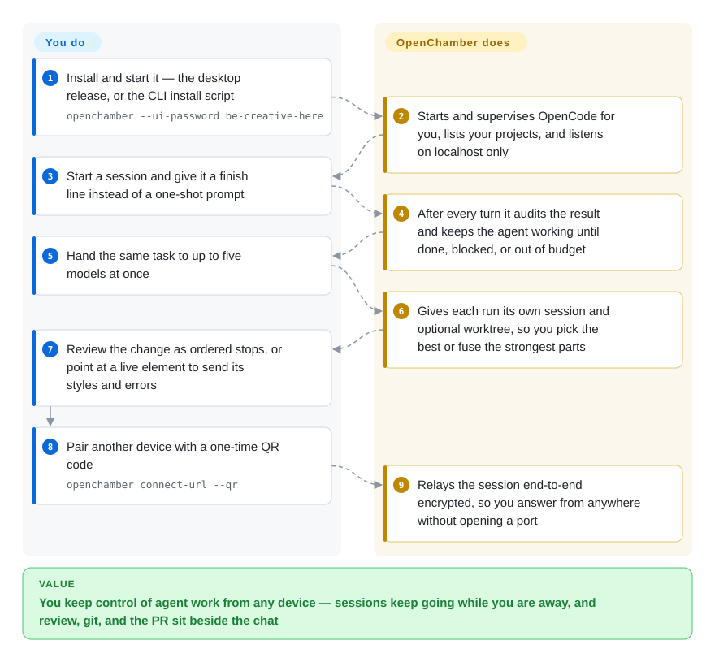

# OpenChamber

A cross-device operator workspace — desktop, web/PWA, VS Code, iOS/Android — for the OpenCode agent runtime: multi-model runs with optional git worktrees, sessions that are audited turn by turn until an objective completes, a diff walkthrough, and the git/GitHub surface beside the chat.

## When to use

You already run OpenCode as your coding agent and it does the work, but the terminal is the ceiling: one session per window, nothing survives moving to another machine, comparing two models means two terminals and eyeballing two diffs, and reviewing a large change means scrolling a path-sorted patch. You want the work to be listable, resumable, reviewable, and reachable from a phone — while staying on OpenCode.

Pick OpenChamber over a multi-agent switcher such as [T3 Code](../terminal-agents/t3code.md) or [CC Switch](cc-switch.md) because those unify *several* CLIs and mostly stop at launching them; here the depth is inside one runtime — a session carries an objective and is audited after every turn until it completes, one prompt can go to five models at once with a worktree each, and the result returns as an ordered walkthrough plus a git/PR panel. Pick it over hand-rolling tmux plus shell scripts because the cross-device half (pair a phone, reach the server over an end-to-end encrypted relay with no open port) and the review UI are the parts you would otherwise build and maintain yourself. The deciding tradeoff: you accept a young, fast-moving, single-vendor app locked to one agent runtime, and in exchange you get an operator surface no CLI gives you.

## How it works

OpenChamber is the operator layer *around* OpenCode, not another agent. It starts and supervises the OpenCode CLI and serves a workspace — a Node server that the desktop app hosts in-process, and that the CLI serves for a browser tab; sessions, goals, walkthroughs, and device tokens live in that server, not in your browser. What stays yours is the judgement: which project, what "finished" means for a session, which models to race, and the final read of the diff before you ship. What it takes over is the loop around that judgement — it re-prompts the agent whenever an audit says the objective is not met, fans one prompt out to several sessions (each optionally in its own git worktree) and keeps the one you keep, regroups a diff into reading order, and carries the session to another paired device through a relay your machine dials outbound, so nothing on the machine listens for the internet. Everything on a timer runs in the server: the goal keeps working when your tab is closed, and stops if the server stops.

<!-- flow-steps:begin (generated from flows/openchamber.json by tools/flow_card.py — do not edit) -->

Text version of the flow

1. **You**: Install and start it — the desktop release, or the CLI install script — `openchamber --ui-password be-creative-here`
2. **OpenChamber**: Starts and supervises OpenCode for you, lists your projects, and listens on localhost only
3. **You**: Start a session and give it a finish line instead of a one-shot prompt
4. **OpenChamber**: After every turn it audits the result and keeps the agent working until done, blocked, or out of budget
5. **You**: Hand the same task to up to five models at once
6. **OpenChamber**: Gives each run its own session and optional worktree, so you pick the best or fuse the strongest parts
7. **You**: Review the change as ordered stops, or point at a live element to send its styles and errors
8. **You**: Pair another device with a one-time QR code — `openchamber connect-url --qr`
9. **OpenChamber**: Relays the session end-to-end encrypted, so you answer from anywhere without opening a port

**Value**: You keep control of agent work from any device — sessions keep going while you are away, and review, git, and the PR sit beside the chat

<!-- flow-steps:end -->

## When NOT to use

- **You are not on OpenCode — or you refuse to be.** The UI talks to the OpenCode API (`@opencode-ai/sdk/v2`), so the runtime is not swappable; driving Claude Code or Codex means going through third-party provider plugins such as [`opencode-claude`](https://github.com/openchamber/opencode-claude), not a native path. If what you want is one GUI over *whatever CLIs you already authenticated*, use [T3 Code](../terminal-agents/t3code.md) (Codex, Claude, Cursor, OpenCode) or [CC Switch](cc-switch.md) for configuration-level management, because those are built around plural runtimes. [推断]
- **You cannot accept a browser-reachable machine-control surface.** `SECURITY.md` names what is exposed: UI authentication and JWT, tunnels, PTY terminal sessions, git credentials and SSH keys, and filesystem operations — and the shipped `docker-compose.yml` mounts `./data/ssh` into the container and binds `0.0.0.0` with a mandatory `OPENCHAMBER_UI_PASSWORD`. It defaults to `127.0.0.1` and the relay is opt-in, but "expose the workspace" really does mean "expose a terminal and your keys". If your environment forbids that, keep the agent in the CLI over SSH or in a local terminal multiplexer (tmux), because those add no HTTP auth surface to attack; if you must reach it remotely, self-host [`openchamber-relay`](https://github.com/openchamber/openchamber-relay) instead of using the shared relay.
- **You need to pin a version and have it supported.** There is no LTS and no backport policy (`SECURITY.md`: fixes land on the latest release only), releases ship every 1–3 days, and a v2 line is already in preview against OpenCode v2 — so a minor bump can move behaviour under you. If you need a frozen control-plane contract, pin an image/version and own the upgrade yourself, or stay on the agent's own CLI, because OpenChamber makes no compatibility promise across versions.
- **You run one session on one machine.** Every expensive part — relay, phone pairing, multi-run, walkthrough, browser panel — buys you nothing if the work never moves and you never compare models. Use the [OpenCode](../terminal-agents/opencode.md) TUI/CLI directly, because it is the same agent without a server, a password, and a second UI to keep updated.
- **You need the browser panel in a web tab or inside VS Code.** Annotating a page and letting the agent drive it are desktop-app-only, and the VS Code extension ships no browser panel at all; in a plain browser tab the panel displays a page but cannot look inside it. For agent-driven browsing without the desktop app, use a browser-automation tool such as [BrowserSkill](../../../web-automation/agent-browser-tools/browserskill.md), because that works headless and over an existing logged-in browser. [未验证]
- **You need organizational governance.** There is no RBAC, no audit log, no SSO, no admin/tenant layer — it is a single-operator tool. If you need policy, seats, and an audit trail for agents, pick a governed platform such as [Dify](../../workflow-builders/dify.md), because OpenChamber's only access control is a password, passkeys, and revocable per-device tokens.
- **You need a store-distributed mobile app today.** The install docs give exactly two paths: an iOS TestFlight beta and an Android APK from the latest release — no App Store or Play Store listing is documented. Install the PWA from the browser instead if a store listing is the requirement — the native apps are extra convenience over the same server, not a different product.

## Comparison

| Alternative | In index | Our verdict | Tradeoff |
| --- | --- | --- | --- |
| [T3 Code](../terminal-agents/t3code.md) | ✅ | Choose T3 Code when the point is one GUI over several already-authenticated CLIs (Codex, Claude, Cursor, OpenCode); choose OpenChamber when you are committed to OpenCode and want the deeper loop — goal-audited sessions, five-model runs with worktrees, walkthrough, phone access. | T3 Code is runtime-plural and lighter, but stays a launch/session shell; OpenChamber goes deeper into one runtime at the cost of being useless if you leave OpenCode. |
| [CC Switch](cc-switch.md) | ✅ | Choose CC Switch to manage provider/CLI configurations across many agents from a desktop app; choose OpenChamber when the gap is not configuration but operating and reviewing agent work itself. | They overlap only at the shell level: CC Switch swaps what the agent *is*, OpenChamber runs and reviews what the agent *did*. |
| [OpenCode](../terminal-agents/opencode.md) | ✅ | Choice is additive, not either/or: install OpenCode either way; add OpenChamber when you want multi-device, multi-model, and review surfaces, and skip it while a single terminal session is enough. | OpenChamber adds a server, a UI, a password, and an update treadmill on top of an agent that already works alone. |
| [OpenHands](openhands.md) | ✅ | Choose OpenHands when you want a self-hosted agent platform with its own sandboxed runtime and issue-driven autonomy; choose OpenChamber when the runtime is settled (OpenCode) and the missing piece is the operator/review surface. | OpenHands owns the whole stack (heavier, its own agent); OpenChamber owns only the layer above someone else's agent (lighter, dependent). |
| tmux + git worktree + agent CLI (DIY) | 未收录 | Choose DIY when you want the same parallelism with no unvetted dependency, no update treadmill, and no exposed HTTP surface; choose OpenChamber when the phone pairing, the ordered diff walkthrough, and the element-annotation loop are worth a packaged app. | DIY costs you building the cross-device and review pieces (and you will, eventually); OpenChamber costs you a 12-month-old single-maintainer dependency and the exposure decision. |

## Tech stack

- **Monorepo (Bun workspaces, `bun@1.4.2`, Node ≥ 22):** `packages/web` (server, API, CLI, OpenCode lifecycle), `packages/ui` (shared React UI — used by web, desktop, and VS Code), `packages/electron` (desktop shell), `packages/vscode`, `packages/mobile` (Capacitor iOS/Android), `packages/sdk` (guest contract for third-party panels), `packages/extensions`, `packages/docs`.
- **UI / build:** TypeScript + React, Vite; VS Code extension hosts the shared UI in a webview; Electron hosts the backend in-process rather than as a sidecar.
- **Transport:** official OpenCode APIs through `@opencode-ai/sdk/v2`; streaming over WebSocket/SSE; the relay path is an E2EE handshake plus a tunnel codec under `packages/ui/src/lib/relay/`.
- **State:** local files under the OpenChamber config dir — no database, no external queue.
- **Distribution:** desktop installers (macOS `.dmg`/`.zip`, Windows `.exe`, Linux `.AppImage`), a CLI/PWA path, a VS Code Marketplace extension, a Docker image, and mobile release artifacts (an iOS TestFlight beta and Android `.apk`/`.aab` on the release page).
- **Testing:** a large in-repo test surface (≈830 `*.test.*`/`*.spec.*` files counted from the git tree at verification), plus `type-check` / `lint` (oxlint) across workspaces.

## Dependencies

- **The agent runtime:** OpenCode CLI. The install docs list it as a prerequisite ("OpenChamber runs on top of it"); the desktop build bundles a matching OpenCode CLI, and the web/CLI path can also attach to an existing OpenCode server via `OPENCODE_HOST`.
- **At least one model provider** configured in OpenCode (API key or device-flow sign-in; OpenAI-compatible endpoints, Ollama, LiteLLM and gateways are supported through custom providers).
- **Runtime for the server path:** Node ≥ 22 (root `engines`), Bun 1.4.2 for building; `git` for worktree-isolated runs; `gh` is optional (GitHub device-flow sign-in is the primary path).
- **Optional infra:** Cloudflare tunnel (`cloudflared`) to expose a public URL; the self-hosted relay (Cloudflare Worker, Docker, or bare Node ≥ 22.5) if you will not use the shared relay endpoint.
- **Mobile:** the iOS TestFlight build or the Android APK, paired to an existing server; no separate backend.

## Ops difficulty

**Medium.** Trying it is genuinely small — one process, no database, localhost by default, and a compose file if you prefer containers, with the whole state living in mounted config/data directories. The burden is not standing it up but keeping it safe and current: it hands whoever reaches the UI a terminal, your repositories, and (with the shipped compose mounts) your SSH directory, so the exposure decision is the real operational work — password before binding anywhere but localhost, passkeys, per-device tokens you revoke, and self-hosted relay if the traffic may not cross the vendor's. On top of that, releases land every 1–3 days with no LTS and no backports, a v2 line is in flight, and goal-driven sessions only continue while the server process stays up — so pin what you deploy and expect to re-read release notes rather than trust that an upgrade is a no-op.

## Health & viability

- **Maintenance — active, fast, and release-driven (as of 2026-09-20).** Pushed the same day; ~1,600 issues filed with ~1,190 closed and 251 closed in the trailing week against 107 opened, and 69 PRs merged in the same window. High velocity, and the backlog is shrinking rather than rotting — but "every 1–3 days" is the kind of cadence that implies churn, not a stable surface.
- **Responsiveness — not scorable from the radar's window, but the raw throughput is not the bottleneck.** The health block reports `?` (no qualifying first-response sample in the window), because first response here is dominated by the maintainer's own triage rather than support replies; the trailing-week close/open ratio (251 vs 107) and 69 merges are the observable substitute. Read it as a busy solo queue that is being drained, not as a support SLA.
- **Governance / bus factor — one person owns the critical path.** 225 contributors (including anonymous) across ~3,698 recorded contributions, but the top contributor holds ~64% of commits and the radar's 12-month window puts top-1 at 0.678 and top-3 at 0.742; the org (`openchamber`, created 2026-03) has 7 public repos and the copyright is held by a single person. An active community files fixes — the changelog credits outside contributors every release — yet the roadmap, merge queue, and release notes are his alone. [推断]
- **Adoption — a real install base in one channel, but a thin dependency graph.** The radar grades this axis **E** because it scores dependent repos (0) and dependency-graph tier, and the only registry package it found is the VS Code extension (`FedaykinDev/openchamber`) — which still reports 244,743 downloads in the last month on Open VSX. Treat the axis grade as "not a library, nobody depends on it in code" and the download figure as the actual usage signal, with the usual caveat that extension downloads are inflated by auto-updates. [未验证]
- **Backing & longevity — no foundation, no vendor, no LTS.** Not under a foundation or a company with a track record; funding is a Patreon, and the security policy explicitly declines backports. There is no continuity instrument other than the public repo. [未验证]
- **Age & Lindy — young and heavily starred; the prior cuts against it.** ~12 months old with ~10.1k stars and ~1.1k forks. Per this index's Lindy prior, high stars on a young repo is a risk flag rather than proof of durability, and the fork/star ratio is consistent with broad curiosity as much as production use. [推断]
- **Coupling risk — the ceiling is the upstream API.** The product is a front-end to OpenCode's `sdk/v2`; a v2 preview against OpenCode 2.0.x already exists, so an upstream refactor becomes OpenChamber's migration. Value and fragility both come from that single dependency. [推断]
- **Legal — clean.** MIT, no relicensing history, no open-core feature gate in the main repo; the separately-hosted relay repo reports no standard SPDX license (`NOASSERTION`) even though it is published as self-hostable. [推断]

## Caveats (unverified)

- [未验证] ~10.1k stars in ~12 months may be inflated by promotion or bot activity rather than organic adoption; star counts are attention signals, not reliability evidence.
- [未验证] The end-to-end-encryption and "the relay cannot read your traffic" claims are the project's own documentation; the client-side handshake/relay code exists in-repo, but I did not audit the cryptography or the hosted relay.
- [未验证] `opencode-claude` claims the official Claude CLI performs authentication and the plugin never copies or forwards credentials; this is a compliance-sensitive self-description that I did not verify, and whether such proxying fits Anthropic's terms is out of scope here.
- [未验证] The ~830 test files are a count of files matching test naming patterns in the git tree; their pass rate and real coverage were not run or measured.
- [推断] The README says a goal "can continue after you close the app", while the Session Goals doc says the loop lives in the server and "the server must stay running" — with the desktop app hosting the backend in-process, what survives which kind of close is not confirmed by the docs I read.
- [推断] Whether a v1.24.x release targets OpenCode v1 while `v2-preview` targets OpenCode v2 is inferred from the preview release notes ("bundling OpenCode 2.0.8", branch `opencode-v2-refactoring`), not confirmed across the stable branch.
- [未验证] The separate `openchamber-relay` repository reports no recognizable SPDX license; self-hosting it may still carry terms I did not read.
- [未验证] Mobile maturity: iOS is distributed through TestFlight and Android as a release APK; real-device behaviour and store plans were not verified.
- [推断] The install docs call OpenCode a prerequisite while the README says the desktop build bundles the matching OpenCode CLI; which path needs a separate install is not stated consistently.
- [推断] The verified exposure facts are `SECURITY.md`'s own scope list (UI auth/JWT, tunnels, PTY sessions, git credentials and SSH keys, filesystem operations) and the shipped compose file mounting `./data/ssh` while binding `0.0.0.0`; that this makes remote exposure a security decision rather than a convenience feature is my reading of those two documents, not a statement the project makes.
- [推断] "No LTS plus 1–3-day releases" is verified, but whether any particular patch is behaviour-changing was not tested; the recommendation to pin the deployed version is my inference from the cadence, not a documented compatibility policy.
- [未验证] Recommending [BrowserSkill](../../../web-automation/agent-browser-tools/browserskill.md) as the headless substitute for the desktop-only browser panel is a substitution I reasoned from each project's own docs (this one's panel is desktop-only; BrowserSkill's README describes agent-driven browsing); I did not run BrowserSkill against this workflow.
