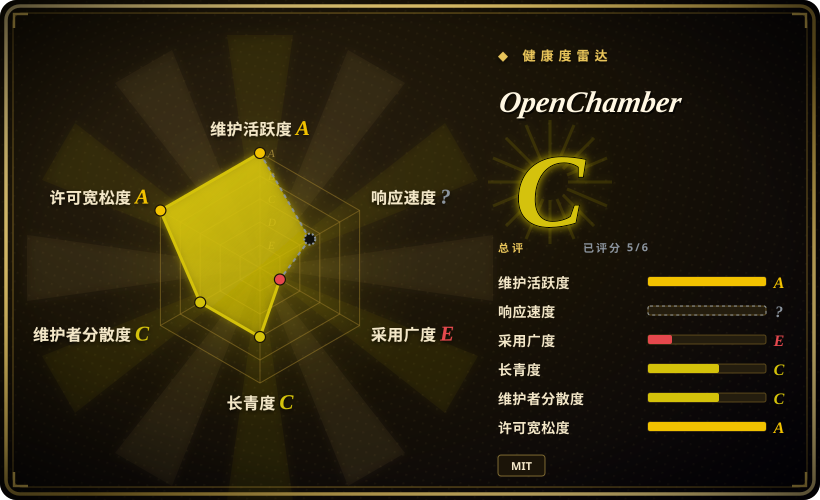
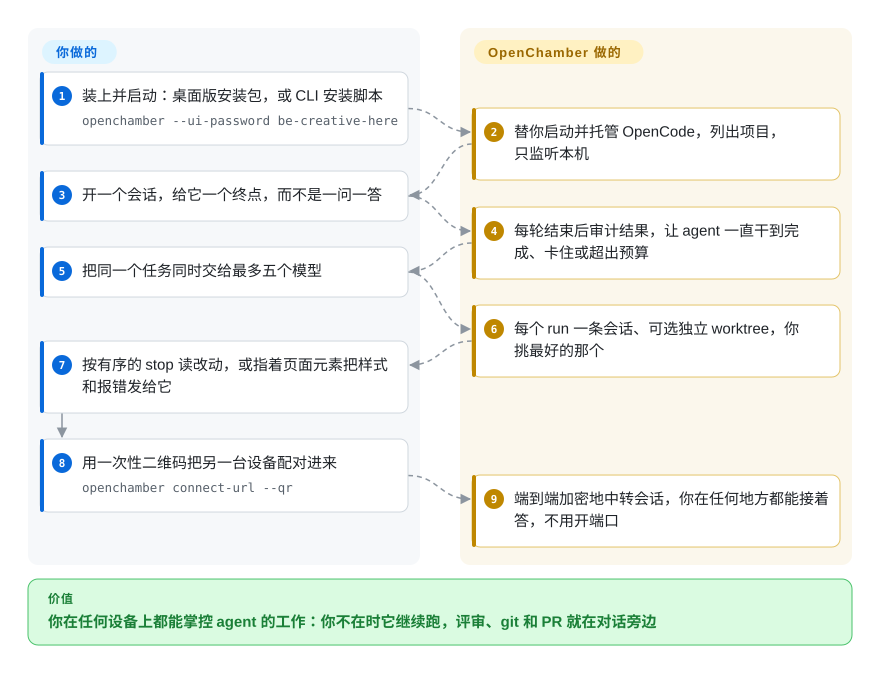

# OpenChamber

跨设备（桌面、Web/PWA、VS Code、iOS/Android）的 OpenCode agent 运行台：多模型并行跑（可各带独立 git worktree）、按目标逐轮审计直到完成的会话、变更讲解，以及紧挨对话的 git / GitHub 面板。

## 何时使用

你已经在用 OpenCode 干活、它也确实能干，但终端形态成了天花板：一个窗口一个会话，换台机器就断，想比两个模型就得开两个终端对眼瞪着两份 diff，看一个大改动只能顺着按路径排序的补丁往下滚。你希望这些活变成可列、可续、可 review、能在手机上接着处理的——同时不离开 OpenCode。

此时选 OpenChamber，而不是 [T3 Code](../terminal-agents/t3code.zh.md) 或 [CC Switch](cc-switch.zh.md) 这类多 agent 切换器：那些项目是把**多个** CLI 统一起来、多数止步于把它启动起来；OpenChamber 的深度在**一个** runtime 内部——会话带一个目标并逐轮被审计直到完成，一条提示词可以同时发给五个模型（各自拥有 worktree），结果以有序讲解加 git/PR 面板交回来。也不要自己拿 tmux 加脚本拼：跨设备那一半（配对手机、经端到端加密 relay 在外网访问而本机不开端口）和 review 界面，恰恰是你自己得写、还得自己维护的部分。决定性取舍是：你接受一个年轻、变动快、单一厂商、只绑一个 agent runtime 的应用，换来 CLI 给不了的运行界面。

## 怎么用起来

OpenChamber 是 OpenCode **外面**的运行层，不是另一个 agent。它负责启动并托管 OpenCode CLI，并提供一个工作台：桌面版把这个 Node 服务跑在进程内，CLI 形态则用同一个服务供浏览器标签页使用；会话、目标、讲解和配对令牌都放在这个服务里，不在你的浏览器里。留给你的始终是判断：开哪个项目、一个会话怎样才算“完成”、让哪几个模型来比、以及提交前自己读一遍 diff。它接过去的是围绕这些判断的循环：审计说目标没达成它就继续把提示词发回去；把同一条提示词铺成多个会话（可各自独立 git worktree）并留下你选中的那个；把 diff 重新排成阅读顺序；再把会话经 relay 送到另一台已配对的设备，而 relay 由你的机器主动向外拨号，所以本机没有为公网监听的入口。凡是带定时的都跑在服务里：标签页关掉，目标还在跑；服务停掉，它就停。

<!-- flow-steps:begin (generated from flows/openchamber.json by tools/flow_card.py — do not edit) -->

流程文字版

1. **你**：装上并启动：桌面版安装包，或 CLI 安装脚本 — `openchamber --ui-password be-creative-here`
2. **OpenChamber**：替你启动并托管 OpenCode，列出项目，只监听本机
3. **你**：开一个会话，给它一个终点，而不是一问一答
4. **OpenChamber**：每轮结束后审计结果，让 agent 一直干到完成、卡住或超出预算
5. **你**：把同一个任务同时交给最多五个模型
6. **OpenChamber**：每个 run 一条会话、可选独立 worktree，你挑最好的那个
7. **你**：按有序的 stop 读改动，或指着页面元素把样式和报错发给它
8. **你**：用一次性二维码把另一台设备配对进来 — `openchamber connect-url --qr`
9. **OpenChamber**：端到端加密地中转会话，你在任何地方都能接着答，不用开端口

**价值**：你在任何设备上都能掌控 agent 的工作：你不在时它继续跑，评审、git 和 PR 就在对话旁边

<!-- flow-steps:end -->

## 何时不用

- **你不用 OpenCode，或者不愿被它绑住。**这个 UI 说的是 OpenCode 的 API（`@opencode-ai/sdk/v2`），runtime 换不掉；要驱动 Claude Code 或 Codex，得走第三方 provider 插件（如 [`opencode-claude`](https://github.com/openchamber/opencode-claude)），不是原生路径。如果你要的是“一个 GUI 罩住我**已经登录过的那几个** CLI”，改用 [T3 Code](../terminal-agents/t3code.zh.md)（Codex、Claude、Cursor、OpenCode）或用 [CC Switch](cc-switch.zh.md) 做配置层管理，因为它们是围绕多个 runtime 设计的。[推断]
- **你无法接受一个浏览器可达的“机器控制面”。**`SECURITY.md` 自己列了暴露面：UI 认证与 JWT、隧道、PTY 终端会话、git 凭据与 SSH key、文件系统操作；而仓库自带的 `docker-compose.yml` 把 `./data/ssh` 挂进容器，并以强制 `OPENCHAMBER_UI_PASSWORD` 绑定 `0.0.0.0`。它默认只听 `127.0.0.1`、relay 也是按需开启，但“把这个工作台暴露出去”真实含义就是“把终端和你的密钥暴露出去”。如果环境不允许，就让 agent 留在 SSH 后面的 CLI 里、或用本机终端复用器（tmux），因为那些不额外引入 HTTP 认证面；若必须远程访问，请自托管 [`openchamber-relay`](https://github.com/openchamber/openchamber-relay)，而不是走项目方的共享 relay。
- **你需要钉住版本并有人长期支持。**没有 LTS，也没有回移策略（`SECURITY.md`：修复只落在最新版本），发布节奏是每 1–3 天一次，而且已经有一条面向 OpenCode v2 的 v2 预览线——所以一个小版本升级就可能在你脚下挪动行为。需要冻结控制面契约的话，请自己钉住镜像/版本并自行承担升级，或继续用 agent 自带的 CLI，因为 OpenChamber 不承诺跨版本兼容。
- **你只在一台机器上跑一个会话。**那么继电器、手机配对、多模型 run、变更讲解、浏览器面板这些最贵的能力一样也用不上。直接用 [OpenCode](../terminal-agents/opencode.zh.md) 的 TUI/CLI，因为那是同一个 agent，但没有多出来的服务、密码和第二个要跟着更新的 UI。
- **你需要在网页标签页里、或在 VS Code 里用浏览器面板。**标注页面元素和让 agent 自己操作面板都只在桌面版可用，VS Code 扩展干脆没有浏览器面板；在普通浏览器标签页里面板只能显示页面、看不进去。没有桌面版又要 agent 驱动浏览器，改用 [BrowserSkill](../../../web-automation/agent-browser-tools/browserskill.zh.md) 这类浏览器自动化工具，因为它可以无头运行、也能借用你已登录的浏览器。[未验证]
- **你需要组织级治理。**没有 RBAC、没有审计日志、没有 SSO、没有管理员/多租户层，它是单人操作的工具。需要席位、策略和 agent 审计轨迹的话，选 [Dify](../../workflow-builders/dify.zh.md) 这类有治理层的平台，因为 OpenChamber 的全部访问控制就是密码、passkey 和可撤销的按设备令牌。
- **你今天就需要商店分发的手机 App。**安装文档只给了两条路：iOS 的 TestFlight 测试版，以及从最新 Release 下载的 Android APK——没有文档给出 App Store 或 Play Store 的商店页面。如果“上架商店”是硬要求，就用浏览器装 PWA——原生 App 只是同一个服务上的额外便利，不是另一个产品。

## 横向对比

| 替代品 | 是否收录 | 我们的评价 | 取舍 |
| --- | --- | --- | --- |
| [T3 Code](../terminal-agents/t3code.zh.md) | ✅ | 要点是“一个 GUI 罩住多个已登录 CLI”（Codex、Claude、Cursor、OpenCode）时选 T3 Code；你已锁定 OpenCode、想要更深的循环——按目标审计的会话、五模型并行加 worktree、变更讲解、手机接管——时选 OpenChamber。 | T3 Code 支持多 runtime、更轻，但停在“启动 + 会话壳”这一层；OpenChamber 在一个 runtime 里挖得更深，代价是离开 OpenCode 就毫无用处。 |
| [CC Switch](cc-switch.zh.md) | ✅ | 要在桌面端管理多个 agent 的 provider/CLI 配置时选 CC Switch；缺的不是配置而是“跑 agent、审 agent 产出”本身时选 OpenChamber。 | 两者只在壳这一层重叠：CC Switch 换的是 agent **是什么**，OpenChamber 跑并审 agent **做了什么**。 |
| [OpenCode](../terminal-agents/opencode.zh.md) | ✅ | 这是叠加关系而非二选一：两条路都要装 OpenCode；想要多设备、多模型和 review 界面时再加 OpenChamber，单个终端会话够用时就不必加。 | OpenChamber 在一个本来就能独立工作的 agent 之上，多加了服务、UI、密码和一条升级跑步机。 |
| [OpenHands](openhands.zh.md) | ✅ | 想要一个自带沙箱 runtime、能按 issue 自主推进的自托管 agent 平台时选 OpenHands；runtime 已定（OpenCode）、缺的只是运行与评审界面时选 OpenChamber。 | OpenHands 拥有整条栈（更重，agent 是自己的）；OpenChamber 只拥有别人 agent 之上的那一层（更轻，也依赖别人）。 |
| tmux + git worktree + agent CLI（自研） | 未收录 | 要同样的并行、又不想引入未经检验的依赖、升级压力和暴露的 HTTP 面时，选自研；手机配对、有序 diff 讲解、点选元素回传这条链值得一个打包好的应用时，选 OpenChamber。 | 自研的成本是你得把跨设备和评审这两块造出来（迟早要造）；OpenChamber 的成本是依赖一个 12 个月大、单人主控的项目，以及那个暴露决策。 |

## 技术栈

- **Monorepo（Bun workspaces，`bun@1.4.2`，Node ≥ 22）：**`packages/web`（服务端、API、CLI、OpenCode 生命周期）、`packages/ui`（Web/桌面/VS Code 共用的 React UI）、`packages/electron`（桌面壳）、`packages/vscode`、`packages/mobile`（Capacitor iOS/Android）、`packages/sdk`（第三方面板的 guest 契约）、`packages/extensions`、`packages/docs`。
- **界面与构建：**TypeScript + React，Vite；VS Code 扩展用 webview 承载共用 UI；Electron 把后端跑在进程内而不是另起 sidecar。
- **传输：**经 `@opencode-ai/sdk/v2` 调官方 OpenCode API；流式走 WebSocket/SSE；relay 路径是 E2EE 握手加隧道编解码，代码在 `packages/ui/src/lib/relay/`。
- **状态：**落在 OpenChamber 配置目录的本地文件——没有数据库，也没有外部队列。
- **分发：**桌面安装包（macOS `.dmg`/`.zip`、Windows `.exe`、Linux `.AppImage`）、CLI/PWA 路径、VS Code Marketplace 扩展、Docker 镜像，以及手机端发布产物（iOS 的 TestFlight 测试版、Android 的 `.apk`/`.aab`）。
- **测试：**仓库内测试面很大（按 git tree 统计的命名匹配文件约 830 个），并有跨 workspace 的 `type-check` / `lint`（oxlint）。

## 依赖

- **agent runtime：**OpenCode CLI。安装文档把它列为前置（“OpenChamber runs on top of it”）；桌面版打包了配套的 OpenCode CLI，Web/CLI 形态也可以通过 `OPENCODE_HOST` 接到已有的 OpenCode 服务上。
- **至少一个模型 provider**，在 OpenCode 里配置（API key 或设备码登录；OpenAI 兼容端点、Ollama、LiteLLM 和各类网关都可通过自定义 provider 接入）。
- **服务端形态的运行环境：**Node ≥ 22（根 `engines`）、构建用 Bun 1.4.2；worktree 隔离要 `git`；`gh` 可选（GitHub 设备码登录是主路径）。
- **可选基础设施：**Cloudflare 隧道（`cloudflared`）用于暴露公网地址；不愿用共享 relay 时自托管 relay（Cloudflare Worker、Docker 或裸 Node ≥ 22.5）。
- **手机端：**iOS 用 TestFlight 包、Android 用 APK，配对到已有服务；不需要另建后端。

## 运维难度

**中等。**试起来的成本确实很小——单进程、没有数据库、默认只听本机，偏好容器的话还有 compose 文件，全部状态都在挂载出去的配置/数据目录里。负担不在起服务，而在**管住暴露面和跟上版本**：它把终端、你的仓库、以及（按自带 compose 的挂载）你的 SSH 目录交给了任何能摸到 UI 的人，所以暴露决策才是真正的运维工作——绑定到本机以外之前先设密码、上 passkey、用可随时撤销的按设备令牌，若流量不能经过厂商就自托管 relay。再加上每 1–3 天一次发布、没有 LTS 也没有回移、v2 线在推进，而按目标跑的会话只在服务进程活着时继续——所以要钉住你部署的版本，并预期每次升级都得读 release notes，而不是假定它是无副作用的。

## 健康度与可持续性

- **维护——活跃、快、发布驱动（截至 2026-09-20）。**当天有推送；累计约 1,600 个 issue、已关约 1,190，近一周关闭 251 个而新增 107 个，同期合并 69 个 PR。速度快，且积压在收缩而非腐烂——但“每 1–3 天一次”这种节奏意味着 churn，而不是稳定的接口面。
- **响应能力——雷达窗口内无法评分，但原始吞吐不是瓶颈。**健康度块给出 `?`（窗口内没有合格的首响应样本），因为这里的“首响应”主要是维护者自己的分类处理，而不是支持性答复；可观察的替代指标是近一周的关/开比（251 对 107）与 69 次合并。把它读成一条正在被清空的单人队列，而不是服务等级承诺。
- **治理 / bus factor——关键路径由一个人掌握。**225 位贡献者（含匿名）累计约 3,698 次贡献，但第一位约占**64%** 的提交，雷达的 12 个月窗口算出的 top-1 是 0.678、top-3 是 0.742；组织 `openchamber`（创建于 2026-03）有 7 个公开仓，版权归单一个人。社区确实在提交修复——每版 changelog 都在致谢外部贡献者——但路线图、合并队列和发布说明只由他一人决定。[推断]
- **采用度——单一渠道有真实装机量，但依赖图很薄。**雷达把这一轴评为 **E**，因为它评的是依赖仓库数（0）和依赖图层级，唯一找到的注册表包是 VS Code 扩展（`FedaykinDev/openchamber`）——而它上个月在 Open VSX 上仍有 244743 次下载。把轴等级读成“不是库、代码里没人依赖它”，把下载量读成真正的使用信号，并保留那个常见警告：扩展下载数会被自动更新放大。[未验证]
- **背书与长期性——没有基金会、没有厂商、没有 LTS。**不在任何基金会或有过往记录的公司的伞下；资金是 Patreon，安全策略也明确不做回移。除公开仓库本身，没有别的延续性安排。[未验证]
- **年龄与 Lindy——年轻且 star 很高，先验方向不利。**约 12 个月大，约 10.1k stars、约 1.1k forks。按本索引的 Lindy 先验，年轻仓库上的高 star 是风险信号而不是耐久性证明；fork/star 比例也符合“广泛好奇”而非生产采用。[推断]
- **耦合风险——天花板就是上游 API。**它是 OpenCode `sdk/v2` 的前端，而面向 OpenCode 2.0.x 的 v2 预览已经存在，因此上游一次重构就变成 OpenChamber 的迁移。价值与脆弱性来自同一个依赖。[推断]
- **法律——干净。**MIT、无改许可史、主仓库没有 open-core 功能门；另开的 relay 仓库没有可识别的标准 SPDX 许可（`NOASSERTION`），尽管它是按可自托管发布的。[推断]

## 存疑（未验证）

- [未验证] 约 12 个月拿到约 10.1k stars 可能被推广或刷量放大，而非自然采用；star 数是注意力信号，不是可靠性证据。
- [未验证] “端到端加密”“relay 无法读取你的流量”是项目自己的文档；客户端握手/relay 代码确实在仓库里，但我没有审计其密码学实现，也没有审计托管 relay。
- [未验证] `opencode-claude` 声称由官方 Claude CLI 完成认证、插件不复制也不转发凭据；这是合规敏感的自述，我未核验，这种代理方式是否符合 Anthropic 条款也超出本页范围。
- [未验证] 约 830 个测试文件是按命名模式从 git tree 统计的文件数；未运行测试，也未测量真实覆盖率。
- [推断] README 说目标在“关掉 app 之后仍能继续”，而 Session Goals 文档说循环在服务里、“服务必须保持运行”——桌面版把后端跑在进程内，究竟哪种“关闭”之后还能续跑，我读到的文档没有确认。
- [推断] v1.24.x 面向 OpenCode v1、`v2-preview` 面向 OpenCode v2 这一点，是从预览版发布说明（“bundling OpenCode 2.0.8”、分支 `opencode-v2-refactoring`）推出，未在稳定分支逐处确认。
- [未验证] 独立的 `openchamber-relay` 仓库没有可识别的 SPDX 许可；自托管它可能仍带我没读过的条款。
- [未验证] 手机端成熟度：iOS 走 TestFlight、Android 走 Release APK；真机表现与是否计划上架都未验证。
- [推断] 安装文档把 OpenCode 列为前置，README 却说桌面构建打包了配套的 OpenCode CLI；哪条路径需要单独安装，文档之间说法不一致。
- [推断] 已核实的事实是 `SECURITY.md` 自列的暴露面（UI 认证/JWT、隧道、PTY 会话、git 凭据与密钥、文件系统操作），以及自带 compose 挂载 `./data/ssh` 又绑定 `0.0.0.0`；由此判断“远程暴露是安全决策而不是便利功能”是我对这两份文档的解读，不是项目自己的表述。
- [推断] “没有 LTS + 每 1–3 天一次发布”是核实过的，但某个具体补丁是否会改变行为我没有测；建议钉住部署版本是我由这个节奏推出的，不是有文档背书的兼容策略。
- [未验证] 把 [BrowserSkill](../../../web-automation/agent-browser-tools/browserskill.zh.md) 当作桌面版浏览器面板的无头替代，是我按两个项目各自文档推出来的替代关系（本项目面板仅桌面版；BrowserSkill 的 README 描述 agent 驱动的浏览）；我没有实际用 BrowserSkill 跑过这条工作流。
