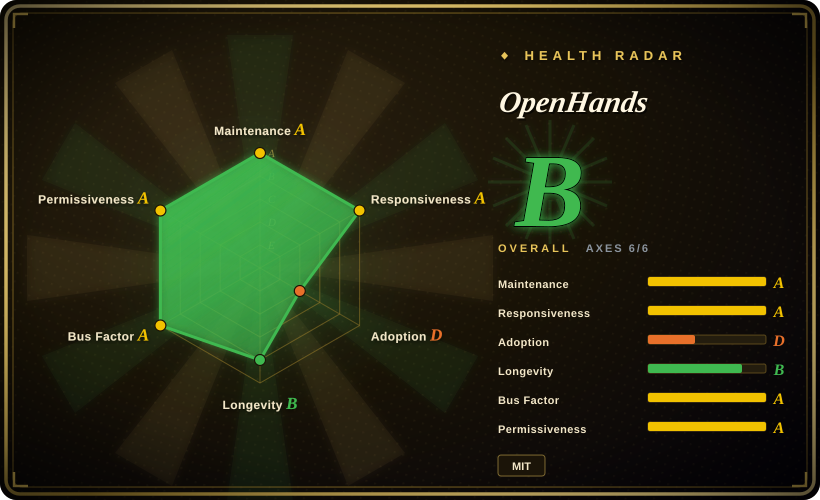
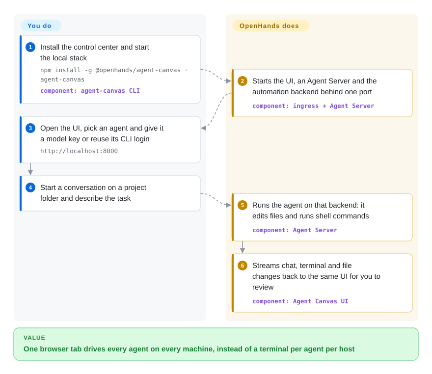

# OpenHands

Your coding agents are scattered: a `claude` session in one terminal tab, `codex` over SSH on a spare server, and a crontab line that was meant to triage new issues every morning but died silently last week. OpenHands (since mid-2026 shipped from this repo as **Agent Canvas**) is one self-hosted browser control center that starts conversations with OpenHands, Claude Code, Codex or Gemini CLI on whichever machine you choose, and runs scheduled or webhook-triggered agent jobs.

## When to use

You're a developer or small-team lead who already uses coding agents every day, but each one lives in its own terminal on its own machine. You want to fire off "update the dependencies in repo X" against the always-on box in the closet, check on it from your laptop's browser, and have a job that every weekday morning splits new GitHub issues into tasks and posts a summary to Slack — without gluing `cron`, `ssh` and three CLIs together yourself. You install `@openhands/agent-canvas`, point it at one or more *agent backends* (an Agent Server process on your laptop, in Docker, on a VM, or on OpenHands Cloud), and drive all of them from one UI.

Pick it over [T3 Code](../terminal-agents/t3code.md) when you need remote backends and scheduled/webhook automations, not just a local GUI over CLIs you're already signed into; over [Background Agents (Open-Inspect)](background-agents.md) when you are one developer or a small team who wants to start on a laptop rather than stand up an organization-wide sandbox control plane; and over [gh-aw](gh-aw.md) when your automations should reach Slack, Linear or your own servers instead of living only inside GitHub Actions. The deciding tradeoff: one MIT, self-hosted UI that is agent-agnostic (it speaks ACP, the Agent Client Protocol, so third-party CLIs plug in), paid for by running a young beta product whose agent server has real shell access to the machine you put it on.

## How it works

Three pieces run together. The **Agent Server** (from the separate `OpenHands/software-agent-sdk` repo, Python) is a REST service on one host that actually runs agents: either the built-in OpenHands agent with whatever LLM you configure, or an ACP agent — Agent Canvas spawns that agent's own CLI (Claude Code, Codex, Gemini CLI) as a subprocess and relays each turn over JSON-RPC, so that CLI keeps its own login and model. **Agent Canvas** (this repo, React/TypeScript) is the browser UI that renders the chat, terminal, file and browser panes and can switch between several Agent Servers. An optional **Automation Server** decides *when* work runs — on a schedule or on a webhook — and dispatches a conversation to an Agent Server. The project gives you the launcher, UI, sandbox options and the agent loop; you supply the machine, the model keys or CLI logins, the firewall and API key if you expose it, and the review of whatever the agents change. Think of it as a dispatch desk: the desk tracks every job and every worker's radio channel, but the workers (and their tools) are whoever you hire.

<!-- flow-steps:begin (generated from flows/openhands.json by tools/flow_card.py — do not edit) -->

Text version of the flow

1. **You**: Install the control center and start the local stack — `npm install -g @openhands/agent-canvas · agent-canvas` — component: `agent-canvas CLI`
2. **OpenHands**: Starts the UI, an Agent Server and the automation backend behind one port — component: `ingress + Agent Server`
3. **You**: Open the UI, pick an agent and give it a model key or reuse its CLI login — `http://localhost:8000`
4. **You**: Start a conversation on a project folder and describe the task
5. **OpenHands**: Runs the agent on that backend: it edits files and runs shell commands — component: `Agent Server`
6. **OpenHands**: Streams chat, terminal and file changes back to the same UI for you to review — component: `Agent Canvas UI`

**Value**: One browser tab drives every agent on every machine, instead of a terminal per agent per host

<!-- flow-steps:end -->

## When NOT to use

- **You want the classic OpenHands agent as a Python app or library.** The repo was cleared for the Agent Canvas migration on 2026-07-27; the old `openhands-ai` PyPI package stops at 1.11.0 (2026-07). For an embeddable agent, use `OpenHands/software-agent-sdk` (not indexed) directly, or a terminal agent such as [OpenCode](../terminal-agents/opencode.md) / [Codex](../terminal-agents/codex.md) — guides and blog posts about `openhands-ai` describe a codebase this repo no longer contains.
- **You need a stable, long-term-supported control plane today.** The README badge says **beta**, releases arrive every few days (v1.21–v1.25 in two weeks), and the Agent Canvas codebase has lived in this repo only since late July 2026. If you only need a local GUI over CLIs you already use, [T3 Code](../terminal-agents/t3code.md) is smaller; if you need org-wide, attributed background PRs, evaluate [Background Agents (Open-Inspect)](background-agents.md).
- **You cannot give an agent shell access to a real machine.** The "without a sandbox" install runs the Agent Server directly on your host, and the README warns the agent gets full filesystem access. Use the Docker-sandbox options (Option 2/3), or keep agents inside CI with [gh-aw](gh-aw.md), whose agent job runs read-only behind a network firewall.
- **You plan to expose it on the internet without hardening.** Anyone who can reach the Agent Server can run commands as the agent; `SELF_HOSTING.md` asks for a firewall, `--public` mode, a strong `LOCAL_BACKEND_API_KEY` and TLS. If you can't operate that, run it on loopback only or use the hosted OpenHands Cloud (not a repo).
- **You only ever use one agent in one terminal.** The control center adds Node.js 24, `uv`, ports and a web UI to what a single [Codex](../terminal-agents/codex.md) or [Gemini CLI](../terminal-agents/gemini-cli.md) session already gives you.

## Comparison

| Alternative | In index | Our verdict | Tradeoff |
|---|---|---|---|
| [T3 Code](../terminal-agents/t3code.md) | ✅ | If you want a local GUI over Codex/Claude/OpenCode CLIs you're already signed into, pick T3 Code; pick OpenHands when you also need remote backends and scheduled or webhook automations. | T3 Code is lighter and stays a thin wrapper; OpenHands adds an Agent Server, Docker sandboxes and an Automation Server at the cost of more moving parts and beta churn. |
| [Background Agents (Open-Inspect)](background-agents.md) | ✅ | For one trusted organization that wants cloud sandboxes started from Slack/Linear/Sentry and attributed PRs across many repos, pick Open-Inspect; for a developer or small team starting on a laptop, pick OpenHands. | Open-Inspect is built around org-scale sandbox lifecycle and integrations; OpenHands starts on one machine and grows by adding backends, with less built-in org plumbing. |
| [gh-aw](gh-aw.md) | ✅ | If your recurring agent chores are all GitHub-repo chores and you want them firewalled inside Actions, pick gh-aw; pick OpenHands when jobs must reach Slack, Linear or your own hosts. | gh-aw inherits GitHub's runners, permissions and audit trail but is GitHub-only; OpenHands runs anywhere but you own the host security. |
| [OpenChamber](openchamber.md) | ✅ | If OpenCode is your only agent and you want cross-device sessions with multi-model diffs, pick OpenChamber; pick OpenHands when you mix OpenHands, Claude Code, Codex and Gemini CLI. | OpenChamber goes deeper on one runtime's review workflow; OpenHands is broader across agents via ACP but shallower per agent. |
| `OpenHands/software-agent-sdk` | not indexed | When you are embedding an agent loop in your own Python service, use the SDK directly; use this repo only if you want the ready-made UI and launchers on top. | The SDK is the engine with no UI; Agent Canvas adds the control center but also Node.js and a browser surface to secure. |

## Tech stack

- **Agent Canvas (this repo):** TypeScript, React 19, React Router 7, Vite, Tailwind, Zustand/React Query; also packaged as an npm library and an Electron desktop build.
- **Agent Server:** Python service from `OpenHands/software-agent-sdk`, launched by the CLI via `uv`/`uvx`; LLM access through LiteLLM-style model settings [推断].
- **Automation Server:** separate `OpenHands/automation` service for schedules, webhooks and run history.
- **Agent integration:** ACP (Agent Client Protocol, JSON-RPC over stdio) for Claude Code, Codex and Gemini CLI.
- **Packaging:** npm package `@openhands/agent-canvas` (CLI `agent-canvas`), Docker image `ghcr.io/openhands/agent-canvas`, a Helm chart directory in the repo.

## Dependencies

- **Node.js ≥ 24** and **`uv`** for the npm/source launchers; **Docker** (Desktop or Engine) for the sandboxed options.
- **Model access:** an LLM API key for the built-in OpenHands agent, or an existing subscription login / API key for each ACP agent (Claude Code, Codex, Gemini CLI).
- **Optional:** an always-on host (VM, Mac Mini), nginx + TLS for remote access, Slack/GitHub/Linear credentials for automations, an OpenHands Cloud account for hosted backends.
- **Telemetry:** the frontend bundles `posthog-js`; check the settings for an opt-out before deploying in a restricted network [未验证].

## Ops difficulty

**Low to start, medium to run for a team.** On a laptop it is `npm install -g @openhands/agent-canvas && agent-canvas`, bound to loopback. Running it as the "always-on team" the README pitches means operating a host that executes agent shell commands: firewall, `--public` mode with `LOCAL_BACKEND_API_KEY`, TLS via nginx, Docker sandboxes per conversation, and keeping three version-coupled services (Canvas, Agent Server, Automation Server) upgraded together on a release train that moves several times a week.

## Health & viability

- **Maintenance (2026-10-08):** very active — pushed today, releases v1.21.0–v1.25.0 between 2026-09-22 and 2026-10-06. Velocity is high because the product was rebuilt in July 2026; treat that churn as a stability cost, not only as a health signal.
- **Governance / bus factor:** owned by the `OpenHands` organization (the company behind OpenHands Cloud/Enterprise); about 50 active contributors in the past year and no single person dominates. The roadmap is the company's, and the system is split across several repos (`software-agent-sdk`, `automation`, `enterprise`).
- **Age / Lindy:** the repo dates from 2024-03 (it started as OpenDevin), but the current Agent Canvas codebase only moved in at the end of July 2026. The repo's age says the *team* lasts; it says little about this *product's* stability.
- **Adoption:** ~90k stars, largely earned by the earlier agent app. The radar's adoption axis is scored from PyPI downloads of `openhands-ai` (435,732 last month), a package frozen since 2026-07 — read that grade with care.
- **Risk flags:** MIT `LICENSE` in this repo; commercial Cloud/Enterprise tiers sit alongside (open-core shape). A product pivot within a single repo has already happened once, so pin versions.

## Caveats (unverified)

- [未验证] Whether every Agent Canvas feature works fully offline from OpenHands Cloud was not tested; the docs list Cloud APIs as an optional runtime service.
- [未验证] `posthog-js` is a frontend dependency; whether telemetry is on by default and how to disable it was not checked.
- [推断] The Agent Server's LLM access goes through LiteLLM-style model settings, inferred from the "use with any LLM" docs link and OpenHands' history; not read in `software-agent-sdk` source.
- [推断] The radar's adoption grade reflects the frozen `openhands-ai` PyPI package rather than `@openhands/agent-canvas` on npm, so it may misstate current adoption.
- [未验证] The ~90k star count and contributor figures are from the GitHub API on 2026-10-08 and include the pre-pivot history.
