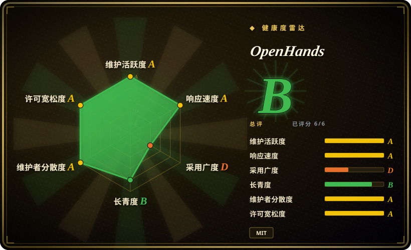
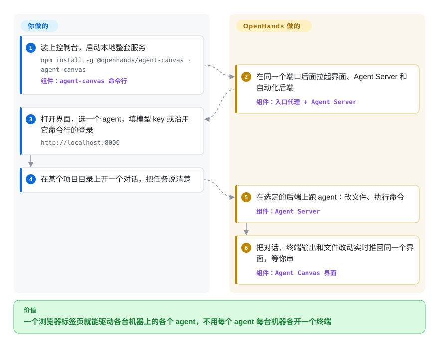

# OpenHands

你的编码 agent 散落各处：一个终端标签页开着 `claude`，另一台闲置服务器上通过 SSH 跑着 `codex`，还有一行本该每天早上整理新 issue 的 crontab，上周已经悄悄挂了。OpenHands（2026 年年中起，这个仓库发布的是 **Agent Canvas**）是一个自托管的浏览器控制台：在你指定的机器上和 OpenHands、Claude Code、Codex 或 Gemini CLI 开对话，并按定时或 webhook 触发 agent 任务。

## 何时使用

你是每天都在用编码 agent 的开发者或小团队负责人，但每个 agent 都住在各自机器的各自终端里。你想把“把仓库 X 的依赖升一下”丢给柜子里那台常开的机器，用笔记本浏览器随时看进度；还想要一个每个工作日早上把新 GitHub issue 拆成任务、再把摘要发到 Slack 的任务——而不是自己用 `cron`、`ssh` 和三个命令行工具拼起来。你装上 `@openhands/agent-canvas`，把它接到一个或多个 *agent 后端*（跑在笔记本、Docker、虚拟机或 OpenHands Cloud 上的 Agent Server 进程），然后在一个界面里驱动它们。

如果你需要远程后端和定时 / webhook 自动化，而不只是给已登录的命令行工具套一层本地图形界面，选它而不是 [T3 Code](../terminal-agents/t3code.zh.md)；如果你是一个人或小团队，想先在笔记本上跑起来，而不是搭一套全组织的沙箱控制平面，选它而不是 [Background Agents（Open-Inspect）](background-agents.zh.md)；如果自动化要触达 Slack、Linear 或你自己的服务器，而不是只活在 GitHub Actions 里，选它而不是 [gh-aw](gh-aw.zh.md)。决定性的取舍：一个 MIT 许可、自托管、不绑定具体 agent 的界面（它支持 ACP，即 Agent Client Protocol，第三方命令行 agent 可以直接接入），代价是用的是一个年轻的 beta 产品，而且它的 agent 服务在你部署的机器上有真实的 shell 权限。

## 怎么用起来

它由三部分一起跑。**Agent Server**（来自独立仓库 `OpenHands/software-agent-sdk`，Python 写的）是一台主机上的 REST 服务，真正负责跑 agent：要么是内置的 OpenHands agent，用你配置的大模型；要么是 ACP agent——它把那个 agent 自己的命令行（Claude Code、Codex、Gemini CLI）作为子进程拉起来，每一轮对话通过 JSON-RPC 转发过去，所以那个命令行沿用自己的登录和模型。**Agent Canvas**（就是本仓库，React/TypeScript）是浏览器界面，显示对话、终端、文件和浏览器面板，并能在多个 Agent Server 之间切换。可选的 **Automation Server** 决定*什么时候*干活——按定时或收到 webhook——再把一段对话派给某个 Agent Server。项目替你提供启动器、界面、沙箱选项和 agent 循环；机器、模型 key 或命令行登录、对外暴露时的防火墙和 API key、以及审查 agent 改了什么，都得你自己来。打个比方：它是一张调度台，台上记着每一单活和每个工人的对讲频道，但工人（以及他们手里的工具）是你自己请的。

<!-- flow-steps:begin (generated from flows/openhands.json by tools/flow_card.py — do not edit) -->

流程文字版

1. **你**：装上控制台，启动本地整套服务 — `npm install -g @openhands/agent-canvas · agent-canvas` — 组件：`agent-canvas 命令行`
2. **OpenHands**：在同一个端口后面拉起界面、Agent Server 和自动化后端 — 组件：`入口代理 + Agent Server`
3. **你**：打开界面，选一个 agent，填模型 key 或沿用它命令行的登录 — `http://localhost:8000`
4. **你**：在某个项目目录上开一个对话，把任务说清楚
5. **OpenHands**：在选定的后端上跑 agent：改文件、执行命令 — 组件：`Agent Server`
6. **OpenHands**：把对话、终端输出和文件改动实时推回同一个界面，等你审 — 组件：`Agent Canvas 界面`

**价值**：一个浏览器标签页就能驱动各台机器上的各个 agent，不用每个 agent 每台机器各开一个终端

<!-- flow-steps:end -->

## 何时不用

- **你要的是经典的 OpenHands agent，作为 Python 应用或库来用。** 这个仓库在 2026-07-27 为迁移到 Agent Canvas 被清空重建；旧的 `openhands-ai` PyPI 包停在 1.11.0（2026-07）。要嵌入一个 agent，直接用 `OpenHands/software-agent-sdk`（未收录），或者用 [OpenCode](../terminal-agents/opencode.zh.md) / [Codex](../terminal-agents/codex.zh.md) 这类终端 agent——网上讲 `openhands-ai` 的教程和文章，描述的已经不是这个仓库里的代码。
- **你现在就需要一个稳定、长期支持的控制平面。** README 徽章写着 **beta**，发版间隔只有几天（两周内从 v1.21 到 v1.25），Agent Canvas 的代码 2026 年 7 月底才搬进这个仓库。如果你只需要给现有命令行工具套个本地界面，[T3 Code](../terminal-agents/t3code.zh.md) 更小；如果你要全组织范围、带署名的后台 PR，去评估 [Background Agents（Open-Inspect）](background-agents.zh.md)。
- **你不能让 agent 拿到一台真实机器的 shell。** “不带沙箱”的安装方式把 Agent Server 直接跑在你的主机上，README 明确警告 agent 会拥有完整的文件系统访问权。改用 Docker 沙箱方式（Option 2/3），或者把 agent 关在 CI 里用 [gh-aw](gh-aw.zh.md)，它的 agent 作业只读运行、外网被防火墙拦着。
- **你打算不加固就直接暴露到公网。** 任何能连上 Agent Server 的人都能以 agent 身份执行命令；`SELF_HOSTING.md` 要求防火墙、`--public` 模式、强 `LOCAL_BACKEND_API_KEY` 和 TLS。运维不了这些，就只绑回环地址，或者用托管的 OpenHands Cloud（非仓库）。
- **你永远只在一个终端里用一个 agent。** 这个控制台会在单个 [Codex](../terminal-agents/codex.zh.md) 或 [Gemini CLI](../terminal-agents/gemini-cli.zh.md) 会话已有的能力之上，再加 Node.js 24、`uv`、端口和一个网页界面。

## 横向对比

| 替代品 | 是否收录 | 我们的评价 | 取舍 |
|---|---|---|---|
| [T3 Code](../terminal-agents/t3code.zh.md) | 已收录 | 如果你只想给已经登录好的 Codex/Claude/OpenCode 命令行套一个本地图形界面，选 T3 Code；如果还需要远程后端和定时或 webhook 自动化，选 OpenHands。 | T3 Code 更轻，始终只是一层薄包装；OpenHands 多了 Agent Server、Docker 沙箱和 Automation Server，代价是组件更多、beta 期变动大。 |
| [Background Agents（Open-Inspect）](background-agents.zh.md) | 已收录 | 一个受信任的组织要从 Slack/Linear/Sentry 拉起云端沙箱、跨多个仓库提带署名的 PR，选 Open-Inspect；一个人或小团队从笔记本起步，选 OpenHands。 | Open-Inspect 围绕组织级沙箱生命周期和集成来设计；OpenHands 从一台机器起步、靠加后端扩展，内置的组织级配套更少。 |
| [gh-aw](gh-aw.zh.md) | 已收录 | 如果你的周期性 agent 杂活全是 GitHub 仓库里的事，并希望它们在 Actions 里被防火墙隔离，选 gh-aw；任务要触达 Slack、Linear 或你自己的主机时，选 OpenHands。 | gh-aw 继承 GitHub 的 runner、权限和审计记录，但只能在 GitHub 上；OpenHands 哪里都能跑，主机安全归你。 |
| [OpenChamber](openchamber.zh.md) | 已收录 | 如果 OpenCode 是你唯一的 agent，想要跨设备会话和多模型对比 diff，选 OpenChamber；如果你混用 OpenHands、Claude Code、Codex 和 Gemini CLI，选 OpenHands。 | OpenChamber 在单一运行时的评审流程上做得更深；OpenHands 借助 ACP 覆盖更多 agent，但对每个 agent 的支持更浅。 |
| `OpenHands/software-agent-sdk` | 未收录 | 如果你要把 agent 循环嵌进自己的 Python 服务，直接用 SDK；只有想要现成的界面和启动器时才用本仓库。 | SDK 是没有界面的引擎；Agent Canvas 加上了控制台，也多了 Node.js 和一个需要加固的浏览器入口。 |

## 技术栈

- **Agent Canvas（本仓库）：**TypeScript、React 19、React Router 7、Vite、Tailwind、Zustand/React Query；同时打包成 npm 库和 Electron 桌面版。
- **Agent Server：**来自 `OpenHands/software-agent-sdk` 的 Python 服务，由命令行通过 `uv`/`uvx` 拉起；大模型接入走 LiteLLM 风格的模型配置 [推断]。
- **Automation Server：**独立的 `OpenHands/automation` 服务，负责定时、webhook 和运行历史。
- **Agent 接入：**ACP（Agent Client Protocol，基于 stdio 的 JSON-RPC），用于 Claude Code、Codex 和 Gemini CLI。
- **分发形态：**npm 包 `@openhands/agent-canvas`（命令 `agent-canvas`）、Docker 镜像 `ghcr.io/openhands/agent-canvas`，仓库里还有 Helm chart 目录。

## 依赖

- **Node.js ≥ 24** 和 **`uv`**（npm / 源码启动方式需要）；带沙箱的方式需要 **Docker**（Desktop 或 Engine）。
- **模型访问：**内置 OpenHands agent 需要一个大模型 API key；每个 ACP agent（Claude Code、Codex、Gemini CLI）需要已有的订阅登录或 API key。
- **可选：**一台常开主机（虚拟机、Mac Mini）、远程访问用的 nginx + TLS、自动化要用的 Slack/GitHub/Linear 凭据、托管后端要用的 OpenHands Cloud 账号。
- **遥测：**前端打包了 `posthog-js`，在受限网络里部署前先确认设置里有没有关闭开关 [未验证]。

## 运维难度

**起步低，给团队长期跑是中等。**在笔记本上就是 `npm install -g @openhands/agent-canvas && agent-canvas`，只绑回环地址。要把它当成 README 宣传的“常驻团队”来跑，就意味着要运维一台会执行 agent shell 命令的主机：防火墙、带 `LOCAL_BACKEND_API_KEY` 的 `--public` 模式、nginx 上的 TLS、每个对话一个 Docker 沙箱，还要让三个版本互相耦合的服务（Canvas、Agent Server、Automation Server）一起升级，而发版节奏是一周好几次。

## 健康度与可持续性

- **维护（2026-10-08）：**非常活跃——今天还有 push，2026-09-22 到 2026-10-06 之间发了 v1.21.0–v1.25.0。速度快是因为产品在 2026 年 7 月重做过；这种变动要算作稳定性成本，不只是健康信号。
- **治理与 bus factor：**归 `OpenHands` 组织所有（也就是做 OpenHands Cloud/Enterprise 的公司）；过去一年约 50 位活跃贡献者，没有哪一个人占绝对多数。路线图由公司掌握，整个系统拆在多个仓库里（`software-agent-sdk`、`automation`、`enterprise`）。
- **年龄与 Lindy：**仓库创建于 2024-03（最早叫 OpenDevin），但现在的 Agent Canvas 代码 2026 年 7 月底才搬进来。仓库年龄说明*团队*能持续，却说明不了*这个产品*的稳定性。
- **采用度：**约 9 万 star，大部分是早期 agent 应用积累的。从 2026-10-09 起，雷达图的采用度一轴改按本仓库现在发布的 npm 包 `@openhands/agent-canvas` 打分（上月下载 17,583 次，D）；已冻结的 PyPI 包 `openhands-ai` 靠旧安装每月仍有约 46.1 万次下载。名字虽然响，当前这代产品的采用还在早期。
- **风险信号：**本仓库 `LICENSE` 是 MIT；旁边有商业的 Cloud/Enterprise 版本（开源核心 + 商业版的形态）。同一个仓库里已经发生过一次产品转向，所以要锁定版本。

## 存疑（未验证）

- [未验证] 没有实测 Agent Canvas 的所有功能能否完全脱离 OpenHands Cloud 运行；文档把 Cloud API 列为可选运行时服务。
- [未验证] `posthog-js` 是前端依赖；遥测是否默认开启、怎么关闭，没有核实。
- [推断] Agent Server 的大模型接入走 LiteLLM 风格的模型配置，这是根据“可用任意大模型”的文档链接和 OpenHands 的历史推断的，没有去读 `software-agent-sdk` 的源码。
- [推断] 雷达图的采用度只统计 npm 上的 `@openhands/agent-canvas`；通过其他方式（托管服务或容器镜像）使用 Agent Canvas 的人不在其中，所以 D 可能低估了当前使用量。
- [未验证] 约 9 万 star 和贡献者数字取自 2026-10-08 的 GitHub API，包含转向之前的历史。
