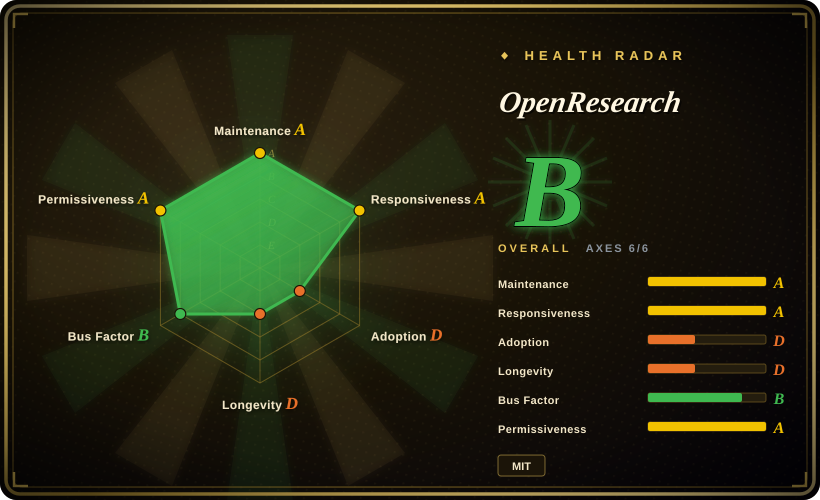
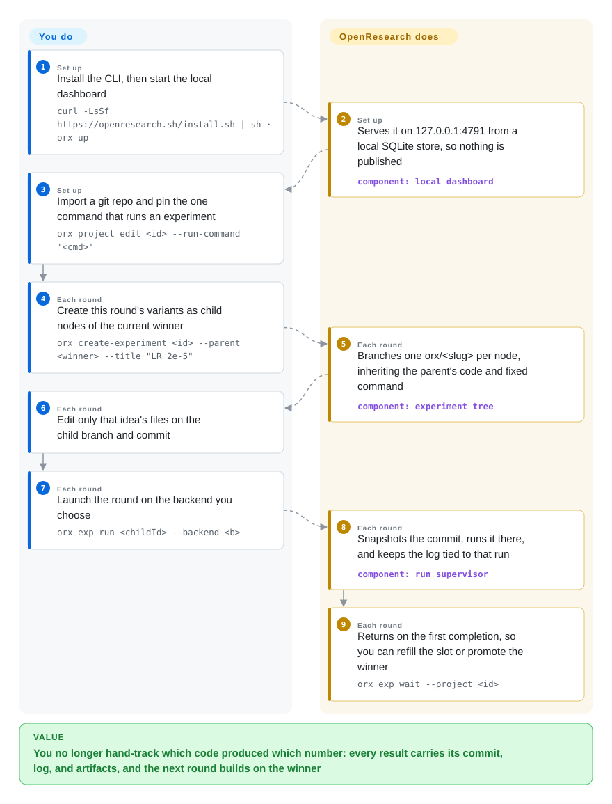

# OpenResearch

Your coding agent can edit training code, but nothing ties a number back to the code that produced it: parallel attempts overwrite each other, a good result is unreproducible next week, and moving to a GPU host means leaving the loop. OpenResearch turns the agent you already have (Claude Code, Codex, OpenCode, Cursor, Google Antigravity) into a research agent — each direction gets its own git worktree, the project is kept as a tree of experiments where every run is pinned to an immutable commit, and runs are dispatched to whatever compute you name.

## When to use

You have a repo with a training or evaluation script and a hunch worth testing — a different learning rate, a wider MLP, another schedule — plus a coding agent that can make the edit. What you lack is something that keeps the attempts honest: variant A runs on your laptop while B sits in a branch, the number in your notes no longer matches any commit, and when a bigger GPU appears you rebuild the launch and copy logs back by hand. You also do not want a pipeline that decides the research questions for you.

Reach for OpenResearch when the agent and the compute are settled and the missing layer is the bookkeeping between them. It imports the repository locally, models the project as a tree of experiment nodes — each node a git branch with one fixed run command, so the only thing differing between the runs you compare is the committed code — and its CLI (`orx`) snapshots a node's commit, runs that snapshot on the backend you name (this machine, SSH, Slurm, Kubernetes, Ray, Hugging Face Jobs, Modal, Tinker, or alphaXiv's managed compute), and files the output as that run's log. Choose it over hand-rolling `git worktree` + `tmux` + a spreadsheet because the snapshot/launch/supervise path is the part that rots; choose it over a fixed autonomous-science pipeline such as AI-Scientist when the questions should stay yours and the agent should stay a worker.

## How it works

OpenResearch is the workspace *around* your coding agent, not another agent. It keeps a project as a normal git repository plus a tree of experiment nodes: the root is your baseline code with a single fixed run command, and each child is a git branch that inherits its parent's code and that command — which is what makes two runs comparable, since only the committed code may differ. When you launch a node, `orx` takes an immutable snapshot of that commit, extracts it into an isolated run directory on the machine you chose (your laptop, an SSH host, a Slurm/Kubernetes/Ray cluster, Hugging Face Jobs, Modal, or alphaXiv's managed compute), runs the same command, and keeps the log attached to that run. Chats are separate git worktrees of the same project, and each session receives a playbook injected through its harness's own channel — Claude Code via `--append-system-prompt-file`, Codex via `developerInstructions`, OpenCode via its config `instructions` — so the agent knows the rules of the tree (never edit a node a run has answered; vary code, not the command). What stays yours: which project, the run command, what each round tests, and which winner to descend onto. What it takes over: the branch-per-node bookkeeping, the commit snapshot, launching and supervising across backends, and the archive that ties a number to the code and log behind it.

<!-- flow-steps:begin (generated from flows/openresearch.json by tools/flow_card.py — do not edit) -->

Text version of the flow

1. **You** (Set up): Install the CLI, then start the local dashboard — `curl -LsSf https://openresearch.sh/install.sh | sh · orx up`
2. **OpenResearch** (Set up): Serves it on 127.0.0.1:4791 from a local SQLite store, so nothing is published — component: `local dashboard`
3. **You** (Set up): Import a git repo and pin the one command that runs an experiment — `orx project edit <id> --run-command '<cmd>'`
4. **You** (Each round): Create this round's variants as child nodes of the current winner — `orx create-experiment <id> --parent <winner> --title "LR 2e-5"`
5. **OpenResearch** (Each round): Branches one orx/<slug> per node, inheriting the parent's code and fixed command — component: `experiment tree`
6. **You** (Each round): Edit only that idea's files on the child branch and commit
7. **You** (Each round): Launch the round on the backend you choose — `orx exp run <childId> --backend <b>`
8. **OpenResearch** (Each round): Snapshots the commit, runs it there, and keeps the log tied to that run — component: `run supervisor`
9. **OpenResearch** (Each round): Returns on the first completion, so you can refill the slot or promote the winner — `orx exp wait --project <id>`

**Value**: You no longer hand-track which code produced which number: every result carries its commit, log, and artifacts, and the next round builds on the winner

<!-- flow-steps:end -->

## When NOT to use

- **Your experiment cannot be expressed as one command that prints its result.** Comparability rests on a fixed run command per node, so an interactive notebook, a pipeline with manual data-prep steps, or a workflow you drive by hand fights the model — a node that "answered nothing" gets repaired rather than compared. Use an experiment tracker such as MLflow (not indexed) over your own scripts, because it logs arbitrary code without imposing a command contract.
- **The task is literature or web research rather than experiments.** `orx discover` / `orx paper` are retrieval primitives the agent calls against alphaXiv, OpenAlex and bioRxiv; nothing here searches the web, synthesizes a report and attaches citations. Use [Local Deep Research](../../../deep-research/local-deep-research.md) or [GPT Researcher](../../../deep-research/gpt-researcher.md) for a self-hosted cited report, because those own the search→read→synthesize loop.
- **You want the pipeline to choose the research agenda.** The tree is yours to shape: the agent proposes a round, but you own the run command, the rounds, and the repair cap. If "give it a topic, get a paper" is the requirement, use [The AI Scientist](../../../ml-research/ai-scientist.md) or [Agent Laboratory](../../../ml-research/agent-laboratory.md), because a lab-automation pipeline with its own templates is what you actually want.
- **You need a stable versioned platform, or Windows-first support.** Windows support is beta — the CLI needs Git for Windows for `bash`/coreutils and rejects the WSL launcher in `System32` — and releases land every day or two with no documented LTS or backport policy. If you need a frozen contract, drive your agent's own CLI directly ([Codex](../terminal-agents/codex.md), [OpenCode](../terminal-agents/opencode.md)) and keep your scripts, because the agent is the part that works without this layer.
- **You cannot run a loopback HTTP service on a shared machine.** `orx up --remote user@host` puts the workspace next to remote GPUs, and the README states the remote service binds to loopback with no application-level authentication, so other users on that host can reach it. Keep it on a single-user box or inside an SSH tunnel; if several people must share one deployment under governance, use a platform built for that such as [OpenHands](openhands.md).
- **You refuse a closed companion service.** Accounts, organizations and managed compute live at openresearch.sh, which is not part of this repository; the local half runs without an account, but that half is MIT while the rest is not yours to self-host. If everything must be self-hosted, drive your own cluster through the Slurm/Kubernetes backends directly, or use [SwarmForge](swarm-forge.md).
- **You will not hand a browser cookie to the app.** The Overleaf integration imports your Overleaf editor session cookie from the local browser store, decrypting Chromium's store with the Keychain-held key, so live paper sync needs no pasting. If that boundary is unacceptable, keep the paper path local: `orx paper` drafts and compiles LaTeX you upload yourself.

## Comparison

| Alternative | In index | Our verdict | Tradeoff |
|---|---|---|---|
| [OpenHands](openhands.md) | ✅ | Choose OpenResearch when the harness and the compute are already yours and only the experiment bookkeeping is missing; choose OpenHands when you want one platform that also owns the agent and its sandbox. | OpenHands is a full self-hosted agent platform with its own runtime and sandboxes — heavier, but nothing left to wire up; OpenResearch owns only the layer above whatever agent you bring, so it is lighter and dependent on that harness remaining supported. |
| [SwarmForge](swarm-forge.md) | ✅ | Choose SwarmForge when the deliverable is shipped software and you want role handoffs (spec→code→clean→architect→harden→QA), each role in its own worktree; choose OpenResearch when the deliverable is a scored experiment tree you descend. | The same worktree-per-agent instinct pointed at the opposite goal: SwarmForge pipelines SDLC roles and ships no license and no releases; OpenResearch is MIT and release-driven but has no review/QA pipeline and expects you to name the run command. |
| [autoresearch](../../../ml-research/autoresearch.md) | ✅ | Choose autoresearch when you want one GPU, one metric, a single editable `train.py` and an agent iterating overnight under a fixed time budget; choose OpenResearch when you need any repo, several backends, and a persistent tree of experiments. | autoresearch is a small reference scaffold you fork and point an agent at; OpenResearch is an installed app with a store, a dashboard, skills and compute routing — far more machinery, and a project to maintain rather than a file to read. |
| [The AI Scientist](../../../ml-research/ai-scientist.md) | ✅ | Choose The AI Scientist when you want a pipeline that invents the ideas, runs them and drafts the paper; choose OpenResearch when the questions are yours and the agent is only a worker. | The pipeline owns the agenda and the write-up, with its own templates and topic constraints; OpenResearch supplies no agenda at all — research taste stays with you, which is the point and also the cost. Repo state checked 2026-09-22: ~14.6k stars, last push 2025-12. |
| [Agent Laboratory](../../../ml-research/agent-laboratory.md) | ✅ | Choose Agent Laboratory for an opinionated multi-role research assistant (literature review → experiment → report) out of the box; choose OpenResearch to keep your own harness and route real GPU jobs. | Also an LLM-role pipeline rather than a workspace: no git-native experiment lineage, no per-run commit snapshot, no multi-backend compute routing. Repo state checked 2026-09-22: ~5.9k stars, last push 2025-08. |

## Tech stack

- **Rust CLI + local dashboard server:** `orx` is a Rust binary (edition 2021, `tokio`, `clap`, `reqwest` with rustls, bundled `rusqlite`, `axum`/`hyper` for the dashboard, `rust-embed` to bake the UI into the binary). Distribution is cargo-dist: static musl Linux, macOS (arm64/x64), Windows x86_64 (beta), with shell and PowerShell installers.
- **UI:** a TypeScript + React 19 app (Vite, TanStack Router/Query, Tailwind 4, xterm.js terminals, `react-diff-view`, KaTeX/remark for markdown and math); the built assets are committed under `ui/dist` and embedded into release builds.
- **The parts that matter for selection** live in `src/local/`: `harness/` (claude, codex, opencode/opencode_v2, cursor, antigravity), compute backends (`slurm`, `k8s`, `ray`, `hf`, `modal`, `ssh`, `tinker`, `localrun`), `git.rs` for worktrees and the experiment tree, `latex`/`overleaf` for paper artifacts, `browser_cookies.rs` for the Overleaf session import.
- **Agent integration:** bundled `SKILL.md` modules under `agent-skills/orx-*` are installed into the session worktree (`orx install-skills`), and `SYSTEM_PROMPT.md` is the per-session playbook injected through each harness's native channel.
- **State:** a local SQLite store under the `orx` data directory, git for experiment lineage, files for run logs and artifacts. No server database, no queue service.

## Dependencies

- **A supported coding agent, installed and authenticated:** Claude Code (the default), Codex, OpenCode, Cursor, or Google Antigravity. OpenResearch drives it; it does not include a model.
- **`git` and a repository** — the project is a repo and every node is a branch. On Windows, Git for Windows is required for `bash`/coreutils, and the `bash.exe` in `System32` (the WSL launcher) is rejected.
- **Whatever the experiment itself needs:** Python/`uv`, CUDA, datasets, model weights.
- **Compute:** either this machine, or working credentials/configuration for the remote backend you pick (SSH host, Slurm, Kubernetes, Ray, Hugging Face Jobs, Modal, Tinker). Managed OpenResearch compute, organizations and account settings require an openresearch.sh account and login.
- **Optional:** an Overleaf account for live paper sync; network access for paper retrieval (alphaXiv/OpenAlex/bioRxiv) and for `orx` itself (official builds also send opt-out usage analytics).
- **Build-only:** Rust toolchain to build the binary, Node 22 + pnpm to rebuild the UI.

## Ops difficulty

**Low to try, medium to own.** Starting is one install command and `orx up`; there is no server to operate, no external database, and the state sits in a local data directory you can back up or delete. The recurring burdens are: keeping one of five agent harnesses authenticated and current on every machine you run on; a release train of one to two versions a day with no documented LTS, which turns "upgrade" into a decision rather than a routine; local runs that share your own CPU/RAM/GPU with everything else; run logs and artifacts that accumulate per node; and remote mode, which is a real exposure decision because the remote service has no application-level authentication. Telemetry is on by default in official builds and off with `orx telemetry off`.

## Health & viability

- **Maintenance — very active (as of 2026-09-22).** Pushed the same day; at least 100 commits in the trailing 30 days (the API page cap, not necessarily the total); releases went v0.2.3 → v0.2.8 within six days. CI runs `fmt, clippy, test` on PRs and `main`, and releases are gated on `ci`, a build-channel verification job and a telemetry-contract job — stronger release discipline than the average young app.
- **Responsiveness — grade A on the radar.** Median first response was 12.8 hours across 15 qualifying issues/PRs in the scoring window, and issues do get closed: three opened on 2026-09-18/19 were closed on 2026-09-20, 09-21 and 09-22. For a repository this young that is a working triage surface, not a bare repo.
- **Governance / bus factor — org-owned, but concentrated.** The repo belongs to the [alphaXiv](https://github.com/alphaXiv) organization (an org, not a personal account; ~119 public repos), so there is an entity behind it. Contribution is nonetheless top-heavy: the radar's 12-month window puts top-1 at 0.596 and top-3 at 0.953 across 17 active contributors (grade B), and the leading contributor has ~217 commits against ~69 and ~65 for the next two. There is no `CONTRIBUTING.md`, `SECURITY.md`, `GOVERNANCE.md` or `CHANGELOG.md` in the repo, so there is no documented vulnerability-reporting or contribution path. [推断]
- **Backing & longevity — vendor-backed, open-core by boundary.** alphaXiv (the arXiv discussion platform) owns the roadmap; the open repository is the local CLI/dashboard half, while accounts, organizations and managed compute live in a companion service whose source is not published. That is a deliberate open-core split: the local-first half is MIT and independent, and the service half is not. [推断]
- **Age & Lindy — young and heavily starred; the prior cuts against it.** Created 2026-06-07 (~3.5 months old) with ~5.5k stars, 339 forks and a GitHub-Trending #1 badge. Per this index's Lindy prior, that combination is an attention signal and a risk flag, not evidence of durability — the same counts read very differently on a five-year-old project. [推断]
- **Adoption — visible but not yet verifiable in production.** Stars, forks and the topic's fashionability are all visible; there is no package-registry footprint to measure and no public list of teams running it, so treat usage as curiosity-heavy until you see otherwise. [未验证]
- **Risk flags — cadence, telemetry, and the closed half.** Near-daily releases with no backports mean pinning is on you; official builds send opt-out coarse usage events; the Overleaf integration reads a browser session cookie; and a handful of enormous single-file modules (`src/commands/up.rs` ≈ 340 KB, `src/local/store.rs` ≈ 197 KB, `src/local/harness/codex.rs` ≈ 252 KB) raise the cost of reviewing or patching those paths. License is clean MIT with no relicensing history found. [推断]

## Caveats (unverified)

- [未验证] Star/fork counts (~5.5k stars, 339 forks), release versions, and the comparison rows' figures for AI-Scientist (~14.6k stars, last push 2025-12) and Agent Laboratory (~5.9k stars, last push 2025-08) are read from the GitHub API on 2026-09-22; they are date-sensitive and stars in particular are not evidence of reliability.
- [未验证] "At least 100 commits in the trailing 30 days" comes from a single paginated API call capped at 100 results; the true count may be higher, and it was not deduplicated or audited.
- [未验证] The telemetry description (opt-out coarse usage events tied to a random installation ID, excluding code, prompts, file contents and paths) is the README's own claim; I saw that a `telemetry-contract` CI job exists but did not read or run it.
- [未验证] Whether the release binaries/dmg are code-signed and notarized was not checked; the docs only state platform minimums.
- [推断] The open-core reading — MIT local half, closed companion service for accounts/orgs/managed compute — is inferred from `AGENTS.md` describing `openresearch.sh` as the companion service plus the absence of that source from this repository and organization; no terms page was read.
- [未验证] Whether the alphaXiv retrieval endpoints behind `orx discover` / `orx paper` are free of rate limits or account requirements; the bundled skill says no login is required for those commands, which I did not exercise.
- [推断] "Windows is beta" is taken from `docs/windows.md`'s own gaps list; the actual failure modes on Windows were not reproduced.
- [未验证] Harness and backend coverage (five harnesses, nine backends) is read from source filenames and the bundled module list, not from exercising each path.
- [推断] The claim that a session's worktree isolation and remote compute are safe to use on a shared host is not something I audited; the README itself warns the remote service has no application-level authentication.
- [未验证] The Overleaf cookie-import mechanism is described from `Cargo.toml` dependency comments and `src/local/browser_cookies.rs`; I did not read the implementation's error/privacy handling.
