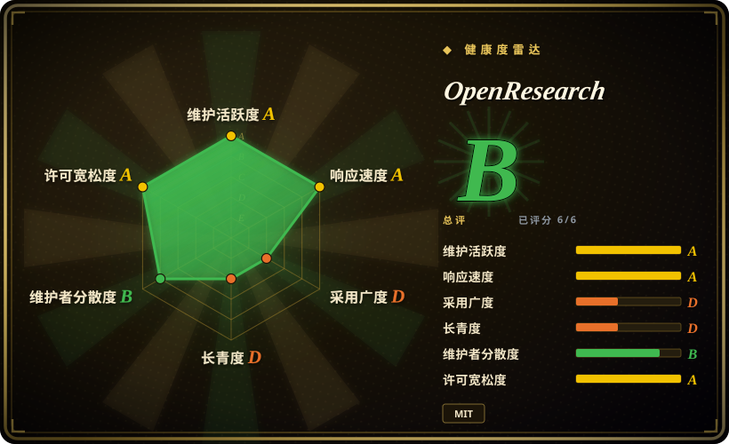
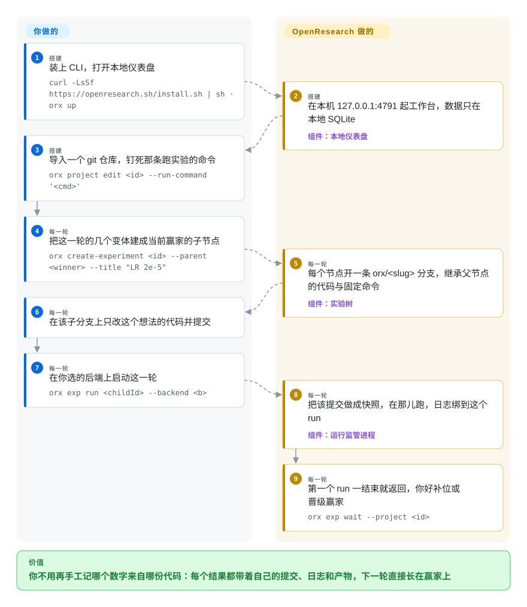

# OpenResearch

你的 coding agent 能改训练代码，但没有任何东西把「这个数字」和「产出它的那份代码」连起来：几个方向并行会互相覆盖文件，一周后复现不了那个好结果，换到 GPU 机器就离开了原来的循环。OpenResearch 把你已有的 agent（Claude Code、Codex、OpenCode、Cursor、Google Antigravity）变成研究 agent：每个方向有自己的 git worktree，项目长成一棵实验树，每个 run 都钉在一次不可变的提交上，跑在你指定的算力上。

## 何时使用

你手上有一个仓库，里面是训练或评测脚本，还有一个值得试的想法——换个学习率、把 MLP 加宽、换一套调度——以及一个能替你改代码的 coding agent。缺的是让这些尝试保持可比的那层东西：变体 A 在笔记本上跑着，变体 B 还躺在某条分支里，笔记里的数字已经对不上任何一次提交，等一台更大的 GPU 到位，你又得手工重建启动方式、再把日志拷回来。你也不想要一个替你决定研究方向的流水线。

OpenResearch 适合「agent 和算力都已经定了，缺的是两者之间的记账」这种局面。它把仓库导进本地，把项目建成一棵实验节点树——每个节点是一条 git 分支加一条固定不变的运行命令，于是要比较的两次 run 之间，只有提交过的代码不同——再由命令行工具 `orx` 把某个节点的提交做成快照，送到你指定的后端上跑（本机、SSH、Slurm、Kubernetes、Ray、Hugging Face Jobs、Modal、Tinker，或 alphaXiv 的托管算力），并把输出留作这个 run 的日志。相比自己拼 `git worktree` 加 `tmux` 加一张表格，它值得选的理由是「快照、启动、盯住」这段最容易烂掉的部分由它承担；相比 AI-Scientist 这类固定的自动科研流水线，它值得选的理由是研究问题仍然由你提，agent 只当工人。

## 怎么用起来

OpenResearch 是你那个 coding agent 外面的工作台，不是又一个 agent。它把项目保存成一个普通 git 仓库加一棵实验节点树：根节点是你的基线代码和唯一一条固定运行命令，每个子节点是一条 git 分支，继承父节点的代码和那条命令——两次 run 之所以可比，就是因为允许不同的只有提交过的代码。你启动一个节点时，`orx` 把该提交做成不可变快照，在你选定的机器上（本机、SSH 主机、Slurm／Kubernetes／Ray 集群、Hugging Face Jobs、Modal，或 alphaXiv 的托管算力）解到一个隔离的运行目录里，跑同一条命令，并把输出留作这个 run 的日志。每个对话各自是一个 worktree，每个会话还会通过它那个 harness 的原生通道收到一份 playbook——Claude Code 走 `--append-system-prompt-file`，Codex 走 `developerInstructions`，OpenCode 走配置里的 `instructions`——于是 agent 知道这棵树的规矩：一个节点一旦被某次 run 回答过就不能再改，要换想法就开子节点；可以变的是代码，不是命令。留给你的部分：选哪个项目、定那条运行命令、每一轮试什么、以及从哪个赢家继续往下长。它接过去的部分：按节点开分支的记账、提交快照、跨后端的启动与监管，以及把数字和它背后的代码、日志绑在一起的那份存档。

<!-- flow-steps:begin (generated from flows/openresearch.json by tools/flow_card.py — do not edit) -->

流程文字版

1. **你**（搭建）：装上 CLI，打开本地仪表盘 — `curl -LsSf https://openresearch.sh/install.sh | sh · orx up`
2. **OpenResearch**（搭建）：在本机 127.0.0.1:4791 起工作台，数据只在本地 SQLite — 组件：`本地仪表盘`
3. **你**（搭建）：导入一个 git 仓库，钉死那条跑实验的命令 — `orx project edit <id> --run-command '<cmd>'`
4. **你**（每一轮）：把这一轮的几个变体建成当前赢家的子节点 — `orx create-experiment <id> --parent <winner> --title "LR 2e-5"`
5. **OpenResearch**（每一轮）：每个节点开一条 orx/<slug> 分支，继承父节点的代码与固定命令 — 组件：`实验树`
6. **你**（每一轮）：在该子分支上只改这个想法的代码并提交
7. **你**（每一轮）：在你选的后端上启动这一轮 — `orx exp run <childId> --backend <b>`
8. **OpenResearch**（每一轮）：把该提交做成快照，在那儿跑，日志绑到这个 run — 组件：`运行监管进程`
9. **OpenResearch**（每一轮）：第一个 run 一结束就返回，你好补位或晋级赢家 — `orx exp wait --project <id>`

**价值**：你不用再手工记哪个数字来自哪份代码：每个结果都带着自己的提交、日志和产物，下一轮直接长在赢家上

<!-- flow-steps:end -->

## 何时不用

- **你的实验没法写成「一条命令、把结果打印出来」。** 可比性建立在每个节点固定一条运行命令之上，所以交互式 notebook、需要手工准备数据的多段流程、靠人手一步步推的活儿都会跟它打架——一次「什么也没回答」的 run 是要同节点修好重跑的，不是拿去比较的。这类情况用实验记录工具（例如 MLflow，未收录）配你自己的脚本，因为它允许任意代码、不要求命令契约。
- **任务其实是文献或网页调研，不是做实验。** `orx discover` / `orx paper` 只是 agent 可以调用的检索原语（打的是 alphaXiv、OpenAlex、bioRxiv）；这里没有任何东西会去搜网、综合成报告、附上引用。要自托管的带引用报告，用 [Local Deep Research](../../../deep-research/local-deep-research.zh.md) 或 [GPT Researcher](../../../deep-research/gpt-researcher.zh.md)，因为搜索到综合这一整圈是它们自己的职责。
- **你想让流水线替你决定研究议程。** 这棵树由你来长：agent 提出一轮假设，但运行命令、每一轮的方向、以及修几次就停下都是你定的。如果需求是「给个题目、还我一篇论文」，那就选 [The AI Scientist](../../../ml-research/ai-scientist.zh.md) 或 [Agent Laboratory](../../../ml-research/agent-laboratory.zh.md)，因为你真正要的是带自己模板的实验室自动化流水线。
- **你需要一个版本稳定、或者以 Windows 为主的平台。** Windows 支持是 beta：命令行要装 Git for Windows 才有 `bash` 和 coreutils，而且会拒绝 `System32` 里那个 WSL 启动器；发布节奏是一到两天一个版本，没有写明 LTS 或回补策略。需要冻结契约的话，直接用 agent 自己的 CLI（[Codex](../terminal-agents/codex.zh.md)、[OpenCode](../terminal-agents/opencode.zh.md)）并保留自己的脚本，因为 agent 才是那个不依赖这层也能用的部分。
- **你没法在一台多人共用的机器上跑一个只听本机的 HTTP 服务。** `orx up --remote user@host` 是把工作台搬到远程 GPU 旁边，而 README 自己写明：远程服务只绑 loopback、没有应用层认证，所以那台机器上的其他用户能访问到它。留在单人机器上，或者用 SSH 隧道；如果多个人要在同一个部署上分工并接受治理，用为此而生的平台，比如 [OpenHands](openhands.zh.md)。
- **你不接受依赖一个闭源配套服务。** 账号、组织和托管算力都在 openresearch.sh，不在这个仓库里；本地这一半不需要账号就能用，但开源的是本地这一半，其余部分自托管不了。如果一切都必须自托管，就直接透过 Slurm／Kubernetes 后端驱动你自己的集群，或者用 [SwarmForge](swarm-forge.zh.md)。
- **你不愿意把浏览器 cookie 交给这个应用。** Overleaf 集成会从本地浏览器存储里读取你的 Overleaf 编辑器会话 cookie（用 Keychain 里的密钥解 Chromium 的加密存储），这样实时同步论文不用你手工粘贴。如果这条边界不可接受，就把论文这条路径留在本地：`orx paper` 会生成并编译 LaTeX，你自己上传即可。

## 横向对比

| 替代品 | 是否收录 | 我们的评价 | 取舍 |
|---|---|---|---|
| [OpenHands](openhands.zh.md) | ✅ | 如果 harness 和算力都已经是你自己的、只缺实验记账，选本页项目；如果你想要一个连 agent 和沙箱都一起自带的平台，选 OpenHands。 | OpenHands 是完整的自托管 agent 平台，自带运行时和沙箱——更重，但没剩下什么要你自己接；本页项目只拥有「你自己的 agent 之上」这一层，更轻，代价是依赖那个 harness 继续被支持。 |
| [SwarmForge](swarm-forge.zh.md) | ✅ | 如果交付物是要上线的软件、你想要 spec→code→clean→architect→harden→QA 这种按角色交接（每个角色一个 worktree），选 SwarmForge；如果交付物是一棵由你往下走的打分实验树，选本页项目。 | 两边的直觉相同（一个 agent 一个 worktree），目标相反：SwarmForge 把软件研发角色串成流水线，但没有许可证也没有发布版本；本页项目是 MIT、每天有发布，却没有评审／QA 流水线，而且要你自己写出那条运行命令。 |
| [autoresearch](../../../ml-research/autoresearch.zh.md) | ✅ | 如果你要的是一块 GPU、一个指标、一个可编辑的 `train.py`，让 agent 在固定时限下通宵迭代，选 autoresearch；如果你要的是任意仓库、多个后端、以及一棵长期存在的实验树，选本页项目。 | autoresearch 是一份可以 fork 的小参考脚手架，你把它交给 agent；本页项目是一个装好的应用，带存储、仪表盘、技能和算力路由——机器多得多，是要维护的项目，不是读一遍的文件。 |
| [The AI Scientist](../../../ml-research/ai-scientist.zh.md) | ✅ | 如果你要流水线自己提想法、自己跑、再自己写论文，选 AI-Scientist；如果问题得由你提、agent 只当工人，选本页项目。 | 流水线拥有议程和成稿，自带模板和选题约束；本页项目完全不提供议程，研究品味留在你手上，这既是它的价值也是它的成本。仓库状态查于 2026-09-22：约 14.6k star，最近一次推送 2025-12。 |
| [Agent Laboratory](../../../ml-research/agent-laboratory.zh.md) | ✅ | 如果你想要开箱即用的多角色研究助手（文献回顾→实验→报告），选 Agent Laboratory；如果你想保留自己的 harness 并把真正的 GPU 任务派出去，选本页项目。 | 同样是 LLM 角色流水线而不是工作台：没有 git 原生的实验血统、没有按 run 的提交快照、也没有跨后端的算力路由。仓库状态查于 2026-09-22：约 5.9k star，最近一次推送 2025-08。 |

## 技术栈

- **Rust 命令行加本地仪表盘服务：** `orx` 是一个 Rust 二进制（edition 2021，用到 `tokio`、`clap`、走 rustls 的 `reqwest`、内置的 `rusqlite`、给仪表盘用的 `axum`／`hyper`，以及把前端烘进二进制的 `rust-embed`）。发布走 cargo-dist：静态 musl Linux、macOS（arm64／x64）、Windows x86_64（beta），提供 shell 与 PowerShell 安装脚本。
- **前端：** TypeScript 加 React 19（Vite、TanStack Router／Query、Tailwind 4、xterm.js 终端、`react-diff-view`、KaTeX 与 remark 处理 markdown 和公式）；构建产物提交在 `ui/dist`，发布时嵌进二进制。
- **对选型最要紧的部分**在 `src/local/`：`harness/`（claude、codex、opencode／opencode_v2、cursor、antigravity）、算力后端（`slurm`、`k8s`、`ray`、`hf`、`modal`、`ssh`、`tinker`、`localrun`）、管 worktree 与实验树的 `git.rs`、产出论文产物的 `latex`／`overleaf`、以及负责 Overleaf 会话导入的 `browser_cookies.rs`。
- **agent 接入：** 内置的 `agent-skills/orx-*` 模块（`SKILL.md`）会被装进会话 worktree（`orx install-skills`），`SYSTEM_PROMPT.md` 则是每个会话的 playbook，通过各 harness 的原生通道注入。
- **状态：** `orx` 数据目录下的本地 SQLite、作为实验血统的 git、以及以文件形式保存的 run 日志与产物。没有服务端数据库，也没有队列服务。

## 依赖

- **一个受支持的 coding agent，装好并已登录：** Claude Code（默认）、Codex、OpenCode、Cursor 或 Google Antigravity。OpenResearch 只是驱动它，本身不含模型。
- **`git` 和一个仓库**：项目就是一个仓库，每个节点是一条分支。Windows 上必须有 Git for Windows 提供 `bash`／coreutils，`System32` 下那个（WSL 启动器）会被拒绝。
- **实验本身需要的东西：** Python／`uv`、CUDA、数据集、模型权重。
- **算力：** 要么本机，要么你选的后端（SSH 主机、Slurm、Kubernetes、Ray、Hugging Face Jobs、Modal、Tinker）的可凭据配置。托管的 OpenResearch 算力、组织和账号设置需要 openresearch.sh 账号并登录。
- **可选：** 实时同步论文需要 Overleaf 账号；取论文（alphaXiv／OpenAlex／bioRxiv）和 `orx` 自身都需要网络（官方构建还会发送可关闭的使用统计）。
- **仅构建时需要：** 编译二进制要 Rust 工具链，重建前端要 Node 22 加 pnpm。

## 运维难度

**上手低，长期持有中等。** 开始只是装一条命令加一次 `orx up`；没有要运维的服务、没有外部数据库，状态就在本地数据目录里，备份或删掉都很直接。真正的负担是：在每台要用的机器上让五选一的 harness 保持登录与更新；一到两天一个版本的发布节奏又没有写明 LTS，于是「升级」从例行公事变成一个决定；本机 run 会和别的工作抢同一份 CPU、内存和 GPU；日志与产物按节点不断累积；以及远程模式——远程服务没有应用层认证，这让暴露与否成为一个真的要拍板的决定。官方构建默认开启统计，`orx telemetry off` 可关。

## 健康度与可持续性

- **维护：非常活跃（截至 2026-09-22）。** 当天还有推送；最近 30 天至少 100 次提交（这是 API 单页上限，不是总数）；发布在六天内从 v0.2.3 走到 v0.2.8。CI 在 PR 和 `main` 上跑 `fmt, clippy, test`，发布还要过 `ci`、构建渠道校验和遥测契约三个门——对一个这么年轻的应用来说，发布纪律比平均水平强。
- **响应速度：雷达给 A。** 评分窗口内 15 个合格 issue／PR 的首次响应中位数是 12.8 小时，issue 也真的会被关掉：2026-09-18／19 开的三个 issue 分别在 09-20、09-21、09-22 关闭。对一个这么年轻的仓库来说，这是真的在 triage，不是空仓库。
- **治理与 bus factor：组织所有，但贡献集中。** 仓库属于 [alphaXiv](https://github.com/alphaXiv) 组织（是组织账号，不是个人账号，约 119 个公开仓库），背后有实体。但贡献明显头重：雷达 12 个月窗口里 top-1 占 0.595、top-3 占 0.952（17 位活跃贡献者，评级 B），首位贡献者约 217 次提交，第二、三位分别约 69 和 65。仓库里没有 `CONTRIBUTING.md`、`SECURITY.md`、`GOVERNANCE.md`，也没有 `CHANGELOG.md`，因此没有写明的漏洞上报或贡献路径。[推断]
- **背书与寿命：厂商背书，按边界做开源内核。** 路线图由 alphaXiv（做 arXiv 论文讨论平台的那家）掌握；开源仓库是本地 CLI／仪表盘这一半，账号、组织和托管算力在配套服务里，其源码未公开。这是一次有意的 open core 切分：本地优先那一半是 MIT 且独立，服务那一半不是。[推断]
- **年龄与 Lindy：年轻且 star 很多，先验对它不利。** 创建于 2026-06-07（约 3.5 个月），约 5.5k star、339 fork，还拿过 GitHub Trending 日榜第一。按本索引的 Lindy 先验，这个组合是注意力信号兼风险标记，不是耐久性证据——同样的数字放在一个五年的项目上，含义完全不同。[推断]
- **采用：看得见，但还无法验证生产使用。** star、fork 和这个话题当下的热度都看得见；但没有任何包管理器足迹可量，也没有公开的用户名单，所以在看到别的证据之前，把它当成以尝鲜为主。[未验证]
- **风险标记：节奏、遥测和闭源的那一半。** 一到两天一个版本且不回补，意味着版本固定是你自己的事；官方构建发送可关闭的粗粒度使用事件；Overleaf 集成会读取浏览器会话 cookie；而且有几个巨大的单文件模块（`src/commands/up.rs` 约 340 KB，`src/local/store.rs` 约 197 KB，`src/local/harness/codex.rs` 约 252 KB），评审或改动这些路径的成本偏高。许可证是干净的 MIT，未发现改授权的历史。[推断]

## 存疑（未验证）

- [未验证] star／fork 数（约 5.5k star、339 fork）、版本号，以及对比表里两个未收录替代品的数字（AI-Scientist 约 14.6k star、最近推送 2025-12；Agent Laboratory 约 5.9k star、最近推送 2025-08）都取自 2026-09-22 的 GitHub API，对时间敏感；star 本身也不能当作可靠性证据。
- [未验证] 「最近 30 天至少 100 次提交」来自一次上限为 100 条的分页 API 调用，真实数字可能更高，也未去重或审计。
- [未验证] 遥测描述（可关闭的粗粒度使用事件、绑定随机安装 ID、不含代码／提示词／文件内容与路径）是 README 的自述；我看到 CI 里有一个 `telemetry-contract` 任务，但没有读它、也没有跑它。
- [未验证] 发布产物（dmg／zip）是否做了代码签名与公证没有核实；文档只写了平台最低版本要求。
- [推断] 「open core」的判断——本地一半 MIT，账号／组织／托管算力在闭源配套服务——是从 `AGENTS.md` 把 openresearch.sh 称为配套服务、且该源码不在本仓库和组织里推断出来的；没有读过任何条款页。
- [未验证] `orx discover` / `orx paper` 背后的 alphaXiv 检索端点是否免费、有无速率限制或账号要求；内置 skill 说这些命令不需要登录，我没有实际跑过。
- [推断] 「Windows 是 beta」取自 `docs/windows.md` 自己列出的缺口清单；Windows 上的实际失效方式没有复现。
- [未验证] harness 与后端的覆盖面（五个 harness、九个后端）来自源码文件名和内置模块清单，不是逐条跑通的。
- [推断] 会话的 worktree 隔离与远程算力在共用机器上是否安全，我没有审计；README 自己就警告过远程服务没有应用层认证。
- [未验证] Overleaf 读取 cookie 的机制来自 `Cargo.toml` 里的依赖注释与 `src/local/browser_cookies.rs`；我没有读它的错误处理与隐私处理。
