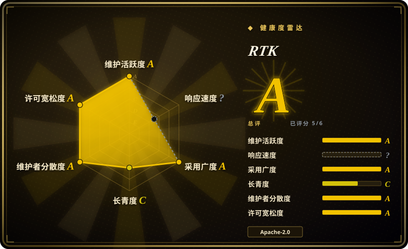
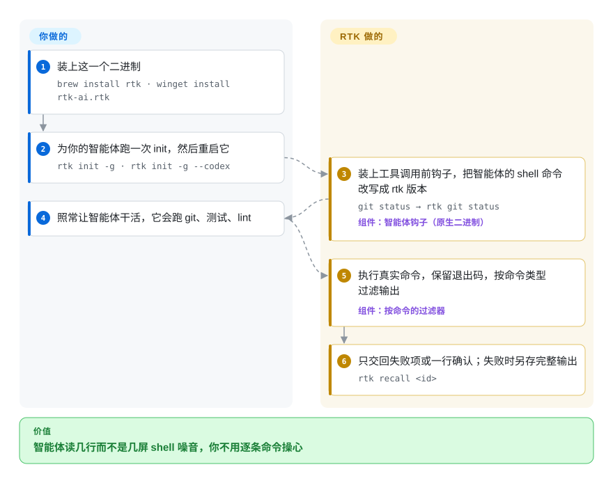

# RTK

编码智能体跑一次 `cargo test`，两百行“测试通过”全塞进上下文；跑一次 `git push`，又读进十几行进度计数——每一行都计费，还把它该看的代码挤出窗口。RTK 挡在这些 shell 命令前面，只把精简版交给智能体：只留失败项、一行 `ok main`、带文件数的目录树。

## 何时使用

你每天用 Claude Code、Codex、Cursor 或 Gemini CLI 干好几个小时，回翻一次会话就会发现，智能体读进去的大半是 shell 噪音：`ls -la` 每行都带权限和时间戳，`cargo test` 两百行里一百九十八行是 `... ok`，`docker ps` 列出全部字段，`git log` 带着完整的提交正文。长会话很早就触发压缩，账单跟着噪音涨，而不是跟着干的活涨。当这些噪音来自 **shell 命令**、而你又不想改变自己和智能体的工作方式时，就该想到 RTK：跑一次 `rtk init -g`，重启智能体，此后 `git status` 在执行前会被悄悄改写成 `rtk git status`。

你选它而不是手写 `| tail -20` 管道加 AGENTS.md 约定，是因为它为 100 多种命令各写了过滤器（测试只留失败并把通过项折成一个数，lint 按规则和文件分组，`git add/commit/push` 缩成一行），并且保留退出码，智能体的成败判断照常生效。你选它而不是 [Token Optimizer](../../../agent-tooling/work-state/token-optimizer.zh.md) 或 [caveman](../../../agent-skills/engineering/caveman.zh.md)，是因为你要宽松许可（Apache-2.0）和一个只干一件事的 Rust 二进制——压缩 shell 输出——而不是一个还要改写文件读取、给压缩打检查点或改变智能体说话方式的插件。

## 怎么用起来

RTK 是一层代理：智能体不再直接调 `git status`，而是调 `rtk git status`；RTK 执行真实的 `git status`，保留它的退出码，再用专为这个工具写的过滤器把输出削短——去掉噪音、把同类行合并（错误按文件、文件按目录）、截断长段、把重复日志折成计数。`rtk` 前缀不用你自己敲：`rtk init` 会装一个钩子（智能体每次调用工具前先跑的一段小程序），在命令执行前把它改写掉，智能体根本察觉不到 RTK 的存在。你要做的只是装二进制、给每个智能体跑一次 `rtk init`、重启智能体；逐条命令的过滤归 RTK 管。可以把它想成一个秘书：每份打印件读一遍，只递上要紧的三行，但一旦出错就把整份原件收进抽屉，智能体用 `rtk recall <id>` 就能取回，不必重跑命令。边界有两条：钩子只看得到 **Bash** 工具调用（Claude Code 自带的 `Read`、`Grep`、`Glob` 会绕过它）；对没有钩子的智能体（Windsurf、Cline、Kilo Code、Kimi），RTK 只能写一份规则文件，请模型自己加 `rtk` 前缀。

<!-- flow-steps:begin (generated from flows/rtk.json by tools/flow_card.py — do not edit) -->

流程文字版

1. **你**：装上这一个二进制 — `brew install rtk · winget install rtk-ai.rtk`
2. **你**：为你的智能体跑一次 init，然后重启它 — `rtk init -g · rtk init -g --codex`
3. **RTK**：装上工具调用前钩子，把智能体的 shell 命令改写成 rtk 版本 — `git status → rtk git status` — 组件：`智能体钩子（原生二进制）`
4. **你**：照常让智能体干活，它会跑 git、测试、lint
5. **RTK**：执行真实命令，保留退出码，按命令类型过滤输出 — 组件：`按命令的过滤器`
6. **RTK**：只交回失败项或一行确认；失败时另存完整输出 — `rtk recall <id>`

**价值**：智能体读几行而不是几屏 shell 噪音，你不用逐条命令操心

<!-- flow-steps:end -->

## 何时不用

- **如果上下文主要被读文件吃掉，而不是 shell 输出**——请用 [Token Optimizer](../../../agent-tooling/work-state/token-optimizer.zh.md) 或 [caveman](../../../agent-skills/engineering/caveman.zh.md) 的 wrap 而不是 RTK，因为 RTK 的钩子只拦 Bash 调用；Claude Code 的 `Read`/`Grep`/`Glob` 会直接穿过，除非你要求智能体显式改用 `rtk read` / `rtk grep`。
- **如果浪费来自压缩丢失、对话历史或智能体自己的啰嗦**——请用 Token Optimizer（在压缩前后打检查点）或 caveman（让回复变短），因为 RTK 只削减一种输入来源。它自己的 README 也写明，“最多 90%”指的是 bash 输出的削减，算上提示词、历史和输出 token 后，落到总账单上会小得多。
- **如果智能体事后必须能检索完整原始输出**（长日志、取证用的 diff、精确字节数）——请用 [Context Mode](../../../agent-tooling/work-state/context-mode.zh.md)，它把原始输出存进本地数据库并建索引；或者用 `exclude_commands` 把这些命令排除掉，因为 RTK 的过滤器按设计就会丢行，只在命令失败或被截断时才保留完整输出。
- **如果你的智能体只能通过规则文件接入**（Windsurf、Cline/Roo Code、Kilo Code、Kimi）——请换有工具调用前钩子的智能体（Claude Code、Codex、Cursor、Gemini CLI、OpenCode），或接受只省一部分，因为没有钩子时改写靠模型自己记得加 `rtk`，它不会每次都记得。
- **如果安全评审不允许第三方二进制改写智能体的每条 shell 命令，或你需要冻结的工具链**——请只用智能体自带的压缩，再在 AGENTS.md 里约定几处显式 `| tail`，因为 RTK 仍是 v0.x，每一两周发一个小版本（2026-08-26 到 2026-09-24 从 v0.46 到 v0.50），挡在智能体执行的每条命令路径上，而且它的遥测文档前后矛盾（见健康度）。

## 横向对比

| 替代品 | 是否收录 | 我们的评价 | 取舍 |
| --- | --- | --- | --- |
| [Token Optimizer](../../../agent-tooling/work-state/token-optimizer.zh.md) | 已收录 | 如果压缩后能否续上、读文件的增量和按美元记账跟 shell 噪音一样重要，选 Token Optimizer；如果浪费主要是命令输出且许可必须宽松，选 RTK。 | Token Optimizer 覆盖更多浪费来源（Read、压缩、臃肿的 CLAUDE.md），但许可是 PolyForm Noncommercial；RTK 只管 Bash 输出，Apache-2.0，采用面大得多。 |
| [Context Mode](../../../agent-tooling/work-state/context-mode.zh.md) | 已收录 | 如果原始输出需要保留且可检索，选 Context Mode 的沙箱加索引；如果只想让智能体已经在跑的命令输出变短，选 RTK。 | Context Mode 把完整数据挡在上下文外，但要让智能体改走 MCP 工具和脚本；RTK 不改变智能体行为，代价是过滤器削掉的内容就没了。 |
| [caveman](../../../agent-skills/engineering/caveman.zh.md) | 已收录 | 如果成本来自智能体自己的长篇回复和非 shell 的载荷，选 caveman；如果要确定性的、只针对 shell 的压缩和宽松许可，选 RTK。 | caveman 压缩智能体写出的内容，包一层后还能覆盖更多载荷类型并保留原件，但引擎是 BSL-1.1、CLI 遥测默认开启需手动关闭；RTK 范围更窄，Apache-2.0。 |
| Claude Code 自带压缩（`/compact`） | 非仓库 | 会话很少撞上下文上限时，单靠它就够；如果命令输出塞满窗口导致压缩早早触发，再加 RTK。 | 自带压缩零安装，但闭源，而且是事后总结、会丢细节；RTK 从源头不让噪音进来。 |
| 手写 `head` / `tail` / `grep` 管道 | 非仓库 | 单个项目里只有一两条吵闹命令时用它们；想在所有工具、所有智能体上统一精简时，选 RTK。 | 管道透明、零依赖，但要逐条命令写，而且末尾的 `tail` 会吞掉命令的退出码（除非开了 `pipefail`）；RTK 替你维护 100 多个过滤器，代价是命令路径上多一个二进制。 |

## 技术栈

- **Rust**（edition 2024，rust ≥ 1.91）——单个二进制；CLI 用 `clap`，过滤靠 `regex` 和 `src/` 下按命令划分的模块，结构化输出（JSON 测试报告、`go test` 的 NDJSON）用 `quick-xml`/`serde_json` 解析。
- **SQLite**（`rusqlite`，内置编译）——本地存储，记录省下的 token（`rtk gain`），并保存失败命令的完整输出供取回。
- **钩子适配**——`rtk hook claude` 原生二进制钩子（v0.37.2 起，不再需要 bash/jq），OpenCode / OpenClaw / Pi 用 TypeScript 插件，Hermes 用 Python 插件，没有钩子的智能体用规则文件。
- **自定义过滤器**——为项目专属命令写的 TOML 过滤 DSL；可选的每日遥测上报用 `ureq`。

## 依赖

- 运行时除二进制外没有别的（预编译覆盖 macOS x86_64/arm64、Linux x86_64 musl/arm64、Windows x86_64；其他平台用 `cargo install --git`——**不要**用 `cargo install rtk`，那会装上一个同名的无关 crate）。
- 被它包装的工具本身（git、cargo、pytest、docker……），以及 PATH 上的 **ripgrep**（`rg`）——部分过滤器会调用它。
- 一个 RTK 会挂钩的 AI 编码智能体；官方列了 18 个，主流 CLI 智能体都是钩子方式接入。

## 运维难度

**单机低，按智能体反复。**安装是一条包管理器命令，再给每个智能体跑一次 `rtk init` 并重启；没有守护进程或服务端。持续成本在升级：每周都有发布，钩子格式也改过（旧的 `rtk-rewrite.sh` shell 钩子要重跑 `rtk init -g` 才能迁到原生二进制钩子）。配置在 `~/.config/rtk/config.toml`（macOS 为 `~/Library/Application Support/rtk/`）；`rtk init -g --uninstall` 可移除钩子。团队使用时，每台开发机都要各自安装和升级。

## 健康度与可持续性

- **维护（2026-09-29）：非常活跃。**稳定版从 v0.46.0（2026-08-26）到 v0.50.0（2026-09-24），另有几乎每天的 `dev-0.51.0-rc` 构建；默认分支 2026-09-28 仍有推送。没有弃坑迹象。
- **响应：机器评分拿不到（`?`），人工抽样好坏参半。**每个 issue 几分钟内都会收到 `rtk-wshm-sync-bot` 的自动回执，但在 2026-09-11 至 15 日外部用户提交的 16 个 issue 里，两周后仍有 9 个开着且没有任何人工回复；2026-09-29 时共有 1,532 个未关闭 issue。提 bug 要做好排队久的准备。
- **治理与背书：**归 `rtk-ai` 组织所有（即遥测文档里署名的数据收集方 RTK AI Labs）；原作者是 Patrick Szymkowiak，但如今提交最多的是 aeppling 和 KuSh，过去 12 个月约 96 人贡献过代码——巴士因子不是单个人。路线图和资金模式握在一家公司手里。
- **年龄 / Lindy：**2026-01-22 创建，约 8 个月——太年轻，Lindy 先验说明不了什么；看活跃度，不看资历。
- **采用：**约 8.19 万 star、5.2 千 fork，并有难以低成本伪造的使用信号佐证——90 天内约 4.45 万次 Homebrew 安装、约 110 万次 release 资产下载——star 数反映的是真实使用而非刷量。crates.io 不是它的实际分发渠道（唯一匹配的 crate `brokk-rtk` 每月约 1,350 次下载）。
- **风险信号：**Apache-2.0，无改许可历史。遥测文档自相矛盾：`DISCLAIMER.md` 说默认收集使用指标，而 `docs/TELEMETRY.md` 和 `src/core/telemetry.rs` 要求在 `rtk init` / `rtk telemetry enable` 时明确同意。crates.io 上有同名项目（`rtk` = Rust Type Kit），顺手敲 `cargo install rtk` 会装错程序。

## 存疑（未验证）

- [未验证] “最多削减 90% 的 bash 输出”及各命令的百分比都是 RTK 自己测的；token 数按字节数除以 4 估算，并未真正分词，对总账单的影响更小且因工作负载而异。
- [未验证] 本页没有逐一测试 100 多个命令过滤器；过滤质量因工具而异，可能丢掉智能体需要的行。
- [未验证] 标题里的 `<10ms` 开销与 ARCHITECTURE.md 写的“约 5–15ms 代理开销”不一致——本页未做基准测试。
- [未验证] 遥测：同意门控是读 `src/core/telemetry.rs` 看到的，没有在运行时观察；`DISCLAIMER.md` 仍写“默认收集”，哪份文档是现行口径未向维护者确认。
- [推断] 规则文件方式接入的智能体（Windsurf、Cline/Roo Code、Kilo Code、Kimi）要靠模型自己选择加 `rtk` 前缀；那里的节省是推断为部分生效，并未实测。
- [推断] issue 响应的判断基于一周内 16 个 issue 的人工抽样；机器评分给出 `?`（`no_window_signal`），因为这个仓库太热闹，最新 60 个 issue 全落在采样偏移窗口之内。
- [未验证] RTK AI Labs 的商业模式和长期资金来源，仓库里没有说明。
- [未验证] README 说 RTK 不会破坏提示词缓存，本页未测试。
