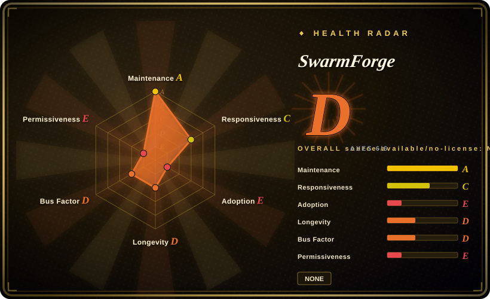

# SwarmForge

A self-hosted orchestrator that runs a pipeline of coding-agent CLIs (Codex, Claude, Grok, Copilot) in isolated git worktrees and tmux sessions, passing **committed** work between roles through a durable file-based handoff protocol, with a local dashboard for approvals and clarifications.

## When to use

You're doing multi-step work on an existing codebase and you've already learned that one long coding-agent session degrades: context rots, the agent edits files it shouldn't, and you can't tell which change caused a regression. You want the work split into *roles* — specifier, coder, cleaner, architect, hardener, QA — each running in its own git worktree so two agents never touch the same checkout, each handing the next a **commit** instead of a wall of chat text, and you want one dashboard where you approve the spec, answer a blocked agent's question, and watch the board move. SwarmForge is built for that loop: `get-swarm-forge six-pack` composes a runtime into your repo, `./swarm` creates the worktrees and tmux sessions, and a Babashka daemon (`handoffd`) copies validated handoff files into each role's inbox and sends a generic tmux wake-up. The pipeline shape is data, not code — a `swarmforge.conf` line per role (`window[-invisible] <role> <backend> <worktree> [task|batch] [forward-only|back-one|back-all]`), with six-pack, four-pack, and two-pack variants published on separate branches.

The deciding difference against its closest substitutes is **commit-as-handoff inside a configurable role pipeline, with a mix of agent backends**: [oh-my-claudecode](oh-my-claudecode.md) also runs tmux-parallel staged agents but is a Claude Code plugin, so it is Claude-bound; [Symphony](../../agent-runtimes/agent-services/symphony.md) also isolates a workspace per run but is tracker-driven and Codex-bound. Reach for SwarmForge when you want a *team-of-roles* pipeline over *your existing repo* and you want different backends per role (the shipped six-pack uses Codex for specification and mutation hardening, Grok for implementation, cleanup, architecture, and QA).

## When NOT to use

- **You need a real open-source license.** There is **no LICENSE file** in the repo — not on `main`, not on any product branch (two-pack/four-pack/six-pack/project-manager/lieutenant/squad all return 404); GitHub's license API reports `null`. Default copyright means all rights reserved. Two open issues ask for one (#64 "License", #70 "Request: Add an open-source license") and are unanswered as of 2026-09. If you must vendor, fork, or redistribute, pick an explicitly licensed orchestrator instead — [Symphony](../../agent-runtimes/agent-services/symphony.md) (Apache-2.0) or [oh-my-claudecode](oh-my-claudecode.md) (MIT). [推断]
- **Your project isn't Go, Clojure/Babashka, or Java.** The shared `engineering.prompt` constitution hard-mandates a per-language verification toolchain (`mutate4go`/`crap4go`/`dry4go`, `crap4clj`/`dry4clj`/`clj-mutate`, `mutate4java`/`crap4java`/`dry4java`) and tells agents to fetch and build it from the author's GitHub repos at startup. Only those three languages have a tool table, and an open issue requests Python support. For a Python/TS/Rust repo you would be fighting the constitution on every handoff — use a methodology harness that doesn't mandate that toolchain, e.g. [Superpowers](../../../agent-dev-methodology/coding-agent-harnesses/superpowers.md).
- **You need sandbox or container isolation for untrusted work.** Isolation here is git worktrees plus tmux, and the shipped six-pack config passes `--yolo` to the Codex roles and `--permission-mode bypassPermissions` to Grok ("Grok yolo is `--permission-mode bypassPermissions`, added by the launcher"). That is a deliberate trust-your-repo choice, not a security boundary. For untrusted or multi-tenant runs use container-sandboxed systems instead — [Background Agents (Open-Inspect)](background-agents.md) or [OpenHands](openhands.md). [推断]
- **You need to pin a version.** There are **no tagged releases** — only two informal tags (`simple-windows`, `first-working-multi-project-swarm`) and no `CHANGELOG`. `get-swarm-forge` downloads branch tarballs at HEAD (`archive/refs/heads/<ref>.tar.gz`), so installing today and installing next month gives different runtimes. If reproducible installs matter, choose a released alternative.
- **Your work queue lives in an issue tracker.** SwarmForge's queue is its own dashboard board plus per-role file inboxes; it does not poll Linear, Jira, or GitHub Issues. If you want "an issue moves to Ready and an agent picks it up", choose [Symphony](../../agent-runtimes/agent-services/symphony.md).
- **You want a skill pack inside the agent you already use, not a runtime.** SwarmForge starts its own tmux sessions and hosts its own board/dashboard; it is not a `/plugin install` for Claude Code and it does not run inside your existing chat. If that's the shape you want, see [Superpowers](../../../agent-dev-methodology/coding-agent-harnesses/superpowers.md) or [Compound Engineering](../../../agent-dev-methodology/coding-agent-harnesses/compound-engineering.md).
- **You're on Windows or a locked-down shell.** Terminal adapters exist (ghostty, iTerm2, Terminal.app, Windows Terminal, `none`), but the launcher is a zsh script and the model assumes tmux + git worktrees on a Unix-like host. [未验证]

## Comparison

| Alternative | In index | Our verdict | Tradeoff |
|---|---|---|---|
| [oh-my-claudecode](oh-my-claudecode.md) | ✅ | Closest sibling: choose oh-my-claudecode when your team already lives in Claude Code and you want staged agents plus model routing without standing up a new runtime; choose SwarmForge when you need a backend per role (Codex + Grok + …) and commit-level handoffs across git worktrees. | Both run tmux-parallel staged agents and both are single-author projects; oh-my-claudecode is cheaper to adopt (plugin, MIT, tagged releases) but Claude-bound, while SwarmForge is backend-flexible but installs an invasive runtime plus a bespoke toolchain and grants no license. |
| [Symphony](../../agent-runtimes/agent-services/symphony.md) | ✅ | Choose Symphony when the work source is a tracker and you want one agent per issue; choose SwarmForge when the work source is your own dashboard and you want several roles iterating on one task. | Symphony is Apache-2.0 with a strong vendor behind it and isolates a workspace per issue, but it is Codex+Linear hard-coupled; SwarmForge is backend-flexible and role-pipelined but unlicensed, single-maintainer, and equally preview-stage. |
| [claude-octopus](claude-octopus.md) | ✅ | Choose claude-octopus when the value you want is cross-model *adversarial review* of one task; choose SwarmForge when you want a sequential role pipeline with durable handoffs and an operator board. | Octopus fans one task out to many models and harvests disagreement; SwarmForge sequences roles and moves committed code down the line. Different coordination topologies — pick by whether your bottleneck is blindspots or process depth. |
| [Background Agents (Open-Inspect)](background-agents.md) | ✅ | Choose Background Agents when the requirement is self-hosted, sandboxed background runs for one trusted organization; choose SwarmForge when the requirement is interactive, operator-gated role handoffs on a repo you own. | Background Agents is MIT-licensed and sandbox-oriented (a stronger containment story); SwarmForge's containment is worktrees plus bypassed agent permissions, trading safety for a tighter local operator loop. |
| tmux + git worktree + coding-agent CLI (DIY) | 未收录 | Choose DIY when you want the same pattern with no unlicensed dependency and no mandated test toolchain — a few shell scripts get you worktree-per-role and a handoff file. | SwarmForge gives you a board, a validated handoff protocol, batch receive modes, and a dashboard out of the box; DIY costs you building all of that, but removes the license, Babashka, and constitution lock-ins. |

## Tech stack

- **Runtime language:** Babashka (Clojure-flavored, no JVM) — GitHub reports the repo as Clojure. The launcher and installer are zsh; the orchestrator, handoff daemon, board, and dashboard backend are `.bb` scripts (`swarmforge.bb` ~47 KB, `pack_web.bb` ~75 KB).
- **Dashboard:** a local HTTP server bound to `127.0.0.1` (port argument, default `0` = ephemeral) serving a static `pack/dashboard.html` (~60 KB) plus board/approval/clarification endpoints.
- **Transport:** the filesystem — `.swarmforge/handoffs/{outbox,sent,failed,inbox/{new,in_process,completed}}` per worktree; tmux is used only for wake-up notifications.
- **Isolation:** one git worktree per role under `.worktrees/<role>`, plus a `master` sentinel meaning the project's own checkout on its current branch.
- **Terminal adapters:** ghostty, iTerm2, Terminal.app, Windows Terminal, and `none` (headless).
- **Tests:** `bb test` runs `clojure.test` namespaces (`handoff_test.clj` ~91 KB, `pack_ui_test.clj` ~120 KB, `script_test.clj` ~54 KB) plus a Playwright suite for the dashboard (`test/dashboard`). Coverage uses Cloverage and CRAP analysis uses the author's `crap4clj`, pinned by git SHA in `bb.edn`.

## Dependencies

- **Host:** `zsh`, `git`, `tmux`, and Babashka (`bb`). Node.js + Playwright + Chromium only if you want to run the dashboard tests.
- **Agent backends:** at least one of `codex`, `claude`, `grok`, `copilot` — each with its own credentials and billing. Extra tokens on a `swarmforge.conf` line are forwarded to that backend.
- **Constitution toolchain (per language):** for Go the author's `mutate4go`/`crap4go`/`dry4go`; for Clojure/Babashka `crap4clj`/`dry4clj`/`clj-mutate` plus Speclj; for Java `mutate4java`/`crap4java`/`dry4java`; plus the `Acceptance-Pipeline-Specification` tools (`gherkin-parser`, `ir-dry-checker`, `gherkin-mutator`). The constitution instructs agents to resolve each from `github.com/unclebob/...` at its latest upstream version and build it at startup.
- **No database or external service:** all state is files under `.swarmforge/` plus the git worktrees under `.worktrees/`.

## Ops difficulty

**Medium-high, and invasive by design.** Installation copies a runtime into an existing repo (`get-swarm-forge six-pack` replaces `swarmforge/scripts`, writes `swarm`, `swarmforge.conf`, the constitution, and role prompts into the project) and running it creates `.worktrees/` and `.swarmforge/` state directories — so the swarm lives inside your checkout and you must keep both out of version control and out of your agents' edit surface. The happy path is genuinely short (`get-swarm-forge … && ./swarm`), the dashboard is localhost-only, and there is no database to operate; the cost is elsewhere: you supply and pay for several agent backends, the constitution makes agents build a bespoke CRAP/DRY/mutation toolchain before doing work, and because installs track branch HEAD with no releases or changelog you own the upgrade risk. Expect to read the shell/Babashka source when something goes wrong — there is no governance doc, no SECURITY.md, and 22 open issues / 16 open PRs at verification.

## Health & viability

- **Responsiveness**: Grade C — median first-response 229.1 hours across 4 qualifying issues (author-driven, not a support desk); 22 open issues / 16 open PRs at verification.
- **Maintenance — active but release-less (as of 2026-09-19).** 331 commits, last push 2026-09-07 (~12 days before verification), not archived. But there are **no tagged releases** (two informal tags only) and no changelog, so "upgrade" means re-pulling branches; no semver discipline exists to rely on.
- **Governance & bus factor — single author, high-profile.** The repo is `User`-owned by Robert C. Martin (`unclebob`, cleancoder.com) and ~324 of 331 commits are his; the contributors API lists 3 people total. A famous name buys attention, not continuity: bus factor is effectively 1. [推断]
- **Backing & longevity — no org, no foundation.** Unlike [Symphony](../../agent-runtimes/agent-services/symphony.md) (OpenAI-owned), there is no vendor or foundation behind the roadmap. The constitution also hard-codes the author's own tool repositories as required dependencies, so the project and its toolchain share one maintainer.
- **Age & Lindy — young and hyped; the prior does not apply.** Created 2026-04-17, ~5 months old at verification, yet ~3.9k stars and 385 forks. High stars on a young repo is a risk flag, not proof; many forks are plausibly fork-of-interest rather than production adoption. [未验证]
- **Risk flags — license is the blocker.** No LICENSE file anywhere (all rights reserved), with two unanswered issues requesting one. Secondary flags: branch-HEAD distribution with no version to pin; `--yolo` / `bypassPermissions` in the default pipeline config; a self-referential mandated toolchain; rapid, breaking surface change across nine parallel branches.

## Caveats (unverified)

- [未验证] ~3,902 stars, 385 forks, 62 watchers, 22 open issues, 16 open PRs as of 2026-09-19 — GitHub counts are date-sensitive and inflated by the project's visibility.
- [未验证] No LICENSE file exists on `main` or on the two-pack/four-pack/six-pack/project-manager/lieutenant/squad branches; GitHub's license API returns `null`. Recorded as "NONE — all rights reserved". Absent an explicit grant you have no permission to use, modify, or redistribute it.
- [未验证] Contributor split (~324 of 331 commits by `unclebob`) comes from the cached contributors API; treat as indicative.
- [未验证] The handoff protocol is documented in `swarmforge/handoff-protocol.md`, a document that mixes "*Proposed*" phrasing with a final "Implemented Helpers" section — the behavior described there (audit gate, atomic delivery, queue helpers) is the design of record, not independently exercised here.
- [未验证] The claim that agents run without approval prompts rests on the six-pack `swarmforge.conf` (`--yolo` for Codex, and the comment that Grok gets `--permission-mode bypassPermissions`); actual behavior depends on the backend CLI version and any wrapper.
- [推断] Isolation is worktree + tmux only, not container/VM-per-run — inferred from the runtime description and file layout; verify the threat boundary before running untrusted tasks.
- [推断] The dashboard appears to have no authentication, relying on binding to `127.0.0.1` — inferred from `serve!` in `pack_web.bb`; not confirmed as an explicit design decision.
- [未验证] Windows Terminal support and zsh/tmux portability beyond macOS/Linux were not exercised; only the adapter's presence was confirmed.
- [推断] High star count on a ~5-month-old repo indicates visibility rather than production adoption; no dependent-repo evidence was gathered.
