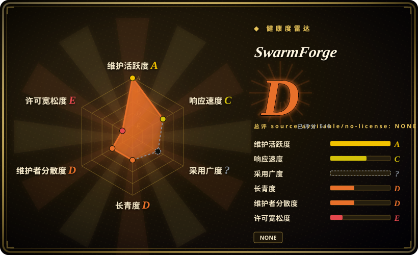

# SwarmForge

一个自托管编排器：把一组 coding-agent CLI（Codex、Claude、Grok、Copilot）放进互相隔离的 git worktree 与 tmux session 里按角色流水线跑，角色之间以**已提交的 commit** 经持久化文件 handoff 协议交接，操作员用一个本地 dashboard 审批与答疑。

## 何时使用

你在一个已有代码库上做多步骤的活，并且已经吃过教训：单个 coding-agent 长会话会退化——上下文烂掉、agent 改了不该改的文件、出了问题也说不清是哪一步引入的。你希望把活拆成*角色*——specifier、coder、cleaner、architect、hardener、QA——每个角色跑在自己的 git worktree 里，两个 agent 永不碰同一个 checkout；每个角色交给下一个的是**一个 commit**，而不是一大段聊天文本；你还想在一个 dashboard 上审批 spec、回答被卡住的 agent 的提问、看着看板往前走。SwarmForge 就是为这个循环造的：`get-swarm-forge six-pack` 把运行时组装进你的仓库，`./swarm` 创建 worktree 与 tmux session，Babashka 写的守护进程（`handoffd`）把校验过的 handoff 文件投递进各角色的 inbox，并推一条通用的 tmux 唤醒消息。流水线形状是数据而不是代码——每个角色一行 `swarmforge.conf`（`window[-invisible] <role> <backend> <worktree> [task|batch] [forward-only|back-one|back-all]`），six-pack / four-pack / two-pack 三种形状分别发布在不同分支上。

相对最接近的替代品，它的决定性差异是**「以 commit 为交接物的可配置角色流水线，且每个角色可换后端」**：[oh-my-claudecode](oh-my-claudecode.zh.md) 同样在 tmux 里跑分阶段并行 agent，但它是 Claude Code 插件，被锁死在 Claude 上；[Symphony](../../agent-runtimes/agent-services/symphony.zh.md) 同样为每次运行隔离工作区，但由跟踪器驱动且绑死 Codex。当你要在*自己的仓库*上跑一支*角色团队*、并想给不同角色分配不同后端时（官方 six-pack 用 Codex 做规格与变异加固，用 Grok 做实现、清理、架构与 QA），就选 SwarmForge。

## 何时不用

- **你需要一份真正的开源许可。** 仓库里**没有 LICENSE 文件**——`main` 没有，任何产品分支也没有（two-pack/four-pack/six-pack/project-manager/lieutenant/squad 全部 404）；GitHub 的 license API 返回 `null`。默认版权即保留所有权利。两个 issue 在请求补许可（#64 “License”、#70 “Request: Add an open-source license”），截至 2026-09 无人回应。如果你要 vendor、fork 或再分发，请改选有明确许可的编排器——[Symphony](../../agent-runtimes/agent-services/symphony.zh.md)（Apache-2.0）或 [oh-my-claudecode](oh-my-claudecode.zh.md)（MIT）。[推断]
- **你的项目不是 Go、Clojure/Babashka 或 Java。** 共享的 `engineering.prompt` 宪法强制要求一套按语言分的验证工具链（`mutate4go`/`crap4go`/`dry4go`、`crap4clj`/`dry4clj`/`clj-mutate`、`mutate4java`/`crap4java`/`dry4java`），并要求 agent 启动时从作者自己的 GitHub 仓库拉取并构建。只有这三种语言有工具表，且有一个 open issue 在请求 Python 支持。对 Python/TS/Rust 仓库，你会在每次 handoff 上跟宪法对着干——改用不强推这套工具链的方法论 harness，例如 [Superpowers](../../../agent-dev-methodology/coding-agent-harnesses/superpowers.zh.md)。
- **你需要沙箱或容器级隔离来跑不受信的任务。** 这里的隔离只有 git worktree 加 tmux，而官方 six-pack 配置给 Codex 角色传 `--yolo`、给 Grok 传 `--permission-mode bypassPermissions`（配置注释原话：“Grok yolo is `--permission-mode bypassPermissions`, added by the launcher”）。这是刻意的「信任自己的仓库」取向，不是安全边界。要跑不受信或多租户任务，请改用容器沙箱方案——[Background Agents（Open-Inspect）](background-agents.zh.md) 或 [OpenHands](openhands.zh.md)。[推断]
- **你需要钉住版本。** 它**没有任何 tagged release**——只有两个非正式 tag（`simple-windows`、`first-working-multi-project-swarm`），也没有 `CHANGELOG`。`get-swarm-forge` 直接下载分支 HEAD 的 tarball（`archive/refs/heads/<ref>.tar.gz`），所以今天装和一个月后装拿到的是不同运行时。可复现安装对你是硬要求时，请选有发版的替代品。
- **你的工作队列在 issue 跟踪器里。** SwarmForge 的队列是自己的 dashboard 看板加各角色的文件 inbox；它不会去轮询 Linear、Jira 或 GitHub Issues。想要「issue 移到 Ready 就有 agent 接走」的形态，请选 [Symphony](../../agent-runtimes/agent-services/symphony.zh.md)。
- **你要的是装进现有 agent 的技能包，而不是一个运行时。** SwarmForge 会自己拉起 tmux session、自己托管看板与 dashboard；它不是 Claude Code 的 `/plugin install`，也不跑在你现有的对话里。要那种形态请看 [Superpowers](../../../agent-dev-methodology/coding-agent-harnesses/superpowers.zh.md) 或 [Compound Engineering](../../../agent-dev-methodology/coding-agent-harnesses/compound-engineering.zh.md)。
- **你在 Windows 或被锁死的 shell 里。** 终端适配器是有的（ghostty、iTerm2、Terminal.app、Windows Terminal、`none`），但启动器是 zsh 脚本，整套模型假定 Unix-like 主机上的 tmux 加 git worktree。[未验证]

## 横向对比

| 替代品 | 是否收录 | 我们的评价 | 取舍 |
|---|---|---|---|
| [oh-my-claudecode](oh-my-claudecode.zh.md) | ✅ | 最接近的同类：团队已经在 Claude Code 里、只想加一层分阶段 agent 与模型路由而不想另起运行时，选 oh-my-claudecode；需要每个角色可配后端（Codex + Grok + …）并跨 git worktree 做 commit 级交接，选 SwarmForge。 | 两者都在 tmux 里跑分阶段并行 agent，且都是单人项目；oh-my-claudecode 上手更便宜（插件、MIT、有版本发布）但被 Claude 绑定，SwarmForge 后端更灵活，代价是侵入式安装一套运行时加自研工具链，且不授予任何许可。 |
| [Symphony](../../agent-runtimes/agent-services/symphony.zh.md) | ✅ | 工作来源是跟踪器、想一个 issue 一个 agent 时，选 Symphony；工作来源是自己的 dashboard、想让多个角色反复迭代同一个任务时，选 SwarmForge。 | Symphony 是 Apache-2.0、背后有强厂商、按 issue 隔离工作区，但硬绑 Codex + Linear；SwarmForge 后端灵活、角色流水线更细，但无许可、单人维护，同样处于 preview 阶段。 |
| [claude-octopus](claude-octopus.zh.md) | ✅ | 你要的价值是让多个模型对同一个任务做*对抗式评审*时，选 claude-octopus；你要的是带回执文件的顺序角色流水线加操作员看板时，选 SwarmForge。 | Octopus 把一个任务扇出给多个模型、收获分歧；SwarmForge 让角色串行推进、把已提交的代码沿流水线传递。这是两种不同的协调拓扑——按你的瓶颈是盲点还是流程深度来选。 |
| [Background Agents（Open-Inspect）](background-agents.zh.md) | ✅ | 需求是给一个可信组织做自托管、沙箱化的后台运行，选 Background Agents；需求是在自己的仓库上做交互式、由操作员把关的角色交接，选 SwarmForge。 | Background Agents 是 MIT 且面向沙箱（隔离叙事更强）；SwarmForge 的隔离只是 worktree 加被绕过的 agent 权限，用安全性换来更紧凑的本地操作循环。 |
| tmux + git worktree + coding-agent CLI（自搭） | 未收录 | 想用同一套模式、但不要无许可依赖、不要被强推测试工具链时，选自搭——几个 shell 脚本就能做到「一个角色一个 worktree」加一个 handoff 文件。 | SwarmForge 开箱就给你看板、校验过的 handoff 协议、batch 接收模式和 dashboard；自搭这些你都得自己写，但换来的是甩掉许可证、Babashka 和宪法三处锁定。 |

## 技术栈

- **运行时语言：** Babashka（Clojure 风味、无 JVM）——GitHub 把仓库标为 Clojure。启动器与安装器是 zsh；编排器、handoff 守护进程、看板、dashboard 后端都是 `.bb` 脚本（`swarmforge.bb` 约 47 KB，`pack_web.bb` 约 75 KB）。
- **Dashboard：** 绑定 `127.0.0.1` 的本地 HTTP 服务（端口作为参数，默认 `0` 即临时端口），对外提供静态 `pack/dashboard.html`（约 60 KB）以及看板、审批、澄清等接口。
- **传输通道：** 文件系统——每个 worktree 下的 `.swarmforge/handoffs/{outbox,sent,failed,inbox/{new,in_process,completed}}`；tmux 只用于发唤醒提示。
- **隔离方式：** 每个角色一个 git worktree，位于 `.worktrees/<role>`；另有 `master` 哨兵值，表示项目自身在當前分支上的主 checkout。
- **终端适配器：** ghostty、iTerm2、Terminal.app、Windows Terminal 与 `none`（无终端界面）。
- **测试：** `bb test` 跑 `clojure.test` 命名空间（`handoff_test.clj` 约 91 KB、`pack_ui_test.clj` 约 120 KB、`script_test.clj` 约 54 KB），外加 dashboard 的 Playwright 套件（`test/dashboard`）。覆盖率用 Cloverage，CRAP 分析用作者自研的 `crap4clj`，在 `bb.edn` 里以 git SHA 钉住。

## 依赖

- **主机：** `zsh`、`git`、`tmux`、Babashka（`bb`）。只有要跑 dashboard 测试时才需要 Node.js + Playwright + Chromium。
- **Agent 后端：** 至少一个 `codex`、`claude`、`grok`、`copilot`——各自带凭据与计费。`swarmforge.conf` 行上多出来的 token 会原样转发给该后端。
- **宪法工具链（按语言）：** Go 用作者的 `mutate4go`/`crap4go`/`dry4go`；Clojure/Babashka 用 `crap4clj`/`dry4clj`/`clj-mutate` 加 Speclj；Java 用 `mutate4java`/`crap4java`/`dry4java`；再加 `Acceptance-Pipeline-Specification` 的三个工具（`gherkin-parser`、`ir-dry-checker`、`gherkin-mutator`）。宪法要求 agent 从 `github.com/unclebob/...` 解析各自的最新上游版本并在启动时构建。
- **不需要数据库或外部服务：** 全部状态就是 `.swarmforge/` 下的文件，加上 `.worktrees/` 下的 git worktree。

## 运维难度

**中偏高，而且是刻意侵入式的。** 安装会把一整套运行时拷进你的仓库（`get-swarm-forge six-pack` 会替换 `swarmforge/scripts`，把 `swarm`、`swarmforge.conf`、宪法和角色提示词写进项目），运行又会生成 `.worktrees/` 与 `.swarmforge/` 状态目录——也就是说蜂群住在你的 checkout 里，你必须把这两个目录同时挡在版本控制和 agent 的编辑面之外。顺路径确实很短（`get-swarm-forge … && ./swarm`），dashboard 只绑本机，也没有数据库要运维；代价在别处：你得自备并为多个 agent 后端付费，宪法要求 agent 在干活前先构建一套自研的 CRAP/DRY/变异工具链，而且由于安装跟的是分支 HEAD、既无 release 也无 changelog，升级风险由你承担。出了问题时，你得去读 shell 和 Babashka 源码——没有治理文档，没有 SECURITY.md，验证时挂着 22 个 open issue 与 16 个 open PR。

## 健康度与可持续性

- **响应速度**：Grade C——4 个 qualifying issues 的中位首次响应时间 229.1 小时（这是作者驱动的项目，不是客服）；验证时挂着 22 个 open issue 与 16 个 open PR。
- **维护——活跃但没有版本发布（截至 2026-09-19）。** 331 次提交，最后推送 2026-09-07（距验证约 12 天），未归档。但**没有任何 tagged release**（只有两个非正式 tag），也没有 changelog，所以「升级」就等于重新拉分支；不存在可供依赖的 semver 纪律。
- **治理与 bus factor——单人作者、名气大。** 仓库是 `User` 持有的 Robert C. Martin（`unclebob`，cleancoder.com），331 次提交中约 324 次出自他；contributors API 一共只列出 3 个人。名气带来关注度，但不带来延续性：bus factor 实际为 1。[推断]
- **背书与寿命——没有组织、没有基金会。** 与 [Symphony](../../agent-runtimes/agent-services/symphony.zh.md)（OpenAI 所有）不同，它的路线图背后没有厂商或基金会。宪法还把作者自己的工具仓库硬编码为必需依赖，于是项目与它的工具链共用同一个维护者。
- **年龄与 Lindy——年轻且被炒作；Lindy 先验不适用。** 2026-04-17 创建，验证时约 5 个月大，却已有约 3.9k star 与 385 fork。年轻仓库上的高 star 是风险信号而非证明；其中不少 fork 更像是「表示兴趣的 fork」而非生产采用。[未验证]
- **风险信号——许可是阻断项。** 全仓没有任何 LICENSE 文件（保留所有权利），两个请求补许可的 issue 无回应。次要信号：按分支 HEAD 分发、没有可钉住的版本；默认流水线配置里的 `--yolo` / `bypassPermissions`；自我引用的强制工具链；九个并行分支上快速且破坏性的表面变动。

## 存疑（未验证）

- [未验证] 截至 2026-09-19 约 3,902 star、385 fork、62 watcher、22 个 open issue、16 个 open PR——GitHub 计数对时间敏感，且会被项目可见度放大。
- [未验证] `main` 与 two-pack/four-pack/six-pack/project-manager/lieutenant/squad 分支上都不存在 LICENSE 文件；GitHub license API 返回 `null`。记为 “NONE — all rights reserved”。在没有显式授权的情况下，你无权使用、修改或再分发它。
- [未验证] 贡献者分布（`unclebob` 约 324/331 次提交）来自有缓存的 contributors API，仅供参考。
- [未验证] handoff 协议记录在 `swarmforge/handoff-protocol.md`，该文档混用了 “*Proposed*” 措辞与末尾的 “Implemented Helpers” 小节——其中描述的行为（audit gate、原子投递、队列 helper）是设计口径，本次未独立运行验证。
- [未验证] 「agent 在无审批提示下运行」的说法依据是 six-pack 的 `swarmforge.conf`（Codex 用 `--yolo`，以及注释里 Grok 用 `--permission-mode bypassPermissions`）；实际行为取决于后端 CLI 版本与任何包装层。
- [推断] 隔离只有 worktree 加 tmux，不是每次运行一个容器/VM——由运行时描述与文件布局推断；跑不受信任务前请先确认威胁边界。
- [推断] dashboard 看来没有鉴权，仅靠绑定 `127.0.0.1`——由 `pack_web.bb` 中的 `serve!` 推断，未经确认这是明确的设计决定。
- [未验证] Windows Terminal 支持以及 macOS/Linux 之外的 zsh/tmux 可移植性未实际验证；只确认了适配器文件存在。
- [推断] 5 个月大的仓库有高 star，说明的是可见度而非生产采用；未收集依赖方证据。
