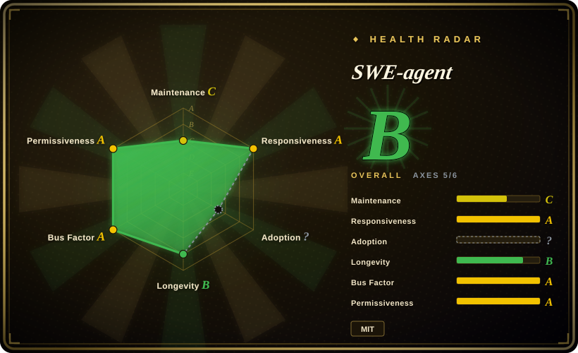
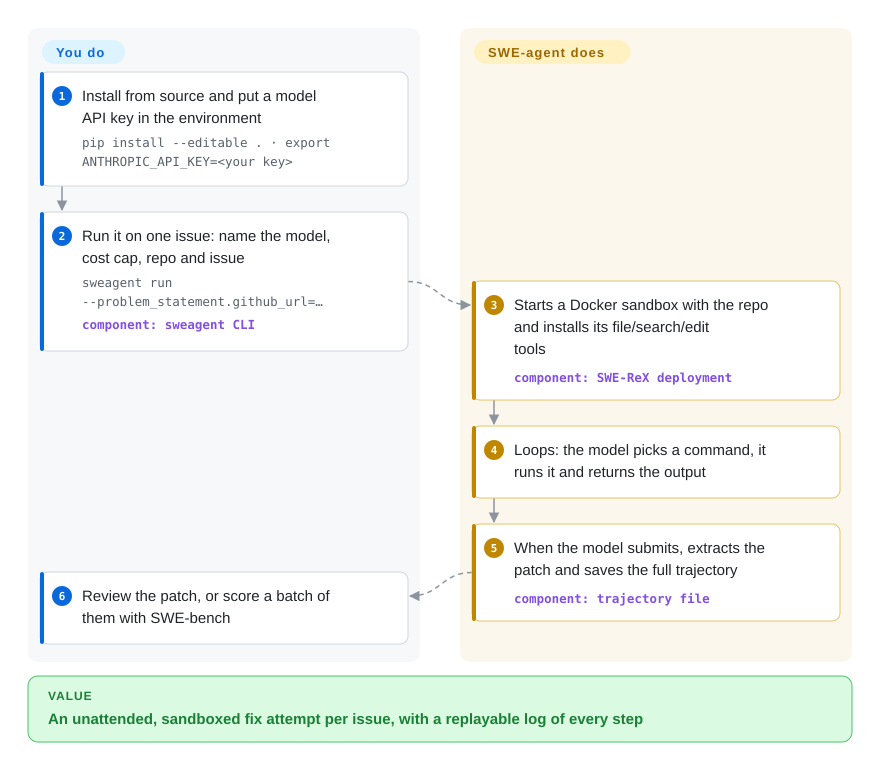

# SWE-agent

You have a GitHub issue — or two thousand of them from SWE-bench — and you want a language model to attempt each one unattended in a throwaway container, leaving you a patch and a full step-by-step log of what it tried. SWE-agent is the Princeton/Stanford research harness that does exactly that from one `sweagent run` command, but its own maintainers now recommend the much smaller mini-swe-agent for new work.

## When to use

You're an ML or agent researcher, or a team reproducing a paper, and you need to run a model against real repository issues in batch: point it at an issue URL, let it work inside a Docker sandbox, and collect a `.patch` plus a *trajectory* (the saved transcript of every command the model ran and every observation it got back) for scoring and analysis. You need the run to be governed by one YAML config — tools, prompts, model, cost limit — so a colleague can rerun it exactly. You reach for SWE-agent when you are reproducing or extending the published SWE-agent / SWE-agent 1.0 results, when you need its configurable tool bundles and demonstrations, or when you need the EnIGMA capture-the-flag mode (which still requires the 0.7 branch).

Pick it over [aider](../terminal-agents/aider.md) or [Codex](../terminal-agents/codex.md) because those are interactive pair-programmers on *your* checkout, while SWE-agent is built for unattended, sandboxed, batch runs that produce comparable artefacts. Pick it over mini-swe-agent (not indexed) only when you specifically need SWE-agent's richer tool interface or must match its published configs — for anything new, the maintainers' own README says mini-swe-agent matches its performance in far less code.

## How it works

SWE-agent wraps a language model in an *agent-computer interface*: a small set of shell tools (open a file at a line, search, edit a range, run commands) that it installs into a sandboxed environment, plus a system prompt telling the model how to use them. You give it three things on the command line — a `problem_statement` (an issue URL or text), an `agent` (which model, which cost cap) and an `env` (which repository, which Docker image). It then starts the sandbox through its companion package SWE-ReX (Docker by default; Modal or AWS Fargate are options), copies the tools in, and loops: the model proposes a command, SWE-agent runs it and feeds back the output, until the model calls `submit` and SWE-agent extracts the diff. Think of it as handing a contractor a locked workshop with a fixed toolbox and a notebook — you get back the repaired part and the notebook, but you still decide whether to install the part. You do the judging: it does not open pull requests on its own in the default flow, and for benchmarks you pass the patches to [SWE-bench](../../../llm-eval/swe-bench.md) for scoring.

<!-- flow-steps:begin (generated from flows/swe-agent.json by tools/flow_card.py — do not edit) -->

Text version of the flow

1. **You**: Install from source and put a model API key in the environment — `pip install --editable . · export ANTHROPIC_API_KEY=<your key>`
2. **You**: Run it on one issue: name the model, cost cap, repo and issue — `sweagent run --problem_statement.github_url=…` — component: `sweagent CLI`
3. **SWE-agent**: Starts a Docker sandbox with the repo and installs its file/search/edit tools — component: `SWE-ReX deployment`
4. **SWE-agent**: Loops: the model picks a command, it runs it and returns the output
5. **SWE-agent**: When the model submits, extracts the patch and saves the full trajectory — component: `trajectory file`
6. **You**: Review the patch, or score a batch of them with SWE-bench

**Value**: An unattended, sandboxed fix attempt per issue, with a replayable log of every step

<!-- flow-steps:end -->

## When NOT to use

- **Abandonment signal — you are starting a new project on it.** The README now says most development has moved to mini-swe-agent, which "has superseded SWE-agent", and recommends it going forward. The last release is v1.1.0 (2025-05-22), and `main` saw only small fixes, last on 2026-07-16. Use mini-swe-agent (not indexed) for new research harnesses unless you must match SWE-agent's published configurations.
- **You want an assistant on your own working copy.** SWE-agent is a batch harness, not a day-to-day coding tool; use [Codex](../terminal-agents/codex.md), [aider](../terminal-agents/aider.md) or [OpenCode](../terminal-agents/opencode.md) instead, because they edit your checkout interactively with approvals.
- **You want agents to run unattended against your team's repos and file PRs.** SWE-agent stops at a patch file; use [gh-aw](gh-aw.md) or [Background Agents (Open-Inspect)](background-agents.md), which handle triggers, permissions and PR creation.
- **You can't run Docker (or pay for Modal/Fargate).** The default sandbox is a local Docker container; running directly on your machine is possible but discouraged by the docs. Without a container runtime, use a hosted evaluation service or a CLI agent with its own OS sandbox such as [Codex](../terminal-agents/codex.md).
- **You only need to score existing patches.** That is [SWE-bench](../../../llm-eval/swe-bench.md)'s job; SWE-agent generates the patches.

## Comparison

| Alternative | In index | Our verdict | Tradeoff |
|---|---|---|---|
| mini-swe-agent | not indexed | For any new benchmark or research harness, pick mini-swe-agent; keep SWE-agent only to reproduce or extend its own published runs. | mini-swe-agent is the maintainers' recommended successor (bash-only, far less code, actively released); SWE-agent keeps the richer tool interface and EnIGMA lineage but is in maintenance mode. |
| [SWE-bench](../../../llm-eval/swe-bench.md) | ✅ | Use SWE-bench to score patches and SWE-agent (or mini-swe-agent) to produce them; they are complementary, not alternatives. | SWE-bench is the evaluation harness and dataset; it needs some agent to generate predictions first. |
| [aider](../terminal-agents/aider.md) | ✅ | If a human is in the loop on a local checkout, pick aider; if runs must be unattended, sandboxed and logged as trajectories, pick SWE-agent. | aider optimises for an interactive edit loop with git commits; SWE-agent optimises for reproducible batch runs at the cost of interactive comfort. |
| [Codex](../terminal-agents/codex.md) | ✅ | For daily coding with an OS-level sandbox and approvals, pick Codex; for research runs whose agent interface and prompts you must control and publish, pick SWE-agent. | Codex is a polished, fast-moving product tied to the OpenAI Responses API; SWE-agent is fully configurable via YAML with any LiteLLM model but is no longer actively developed. |
| [OpenHands](openhands.md) | ✅ | If you want a UI to dispatch agents and automations across machines, pick OpenHands; if you want a minimal, scriptable research harness, pick SWE-agent (or its successor). | OpenHands is now a control center with servers and a web UI; SWE-agent is a single Python CLI that writes patches and logs. |

## Tech stack

- **Language:** Python ≥ 3.11; CLI entry point `sweagent` (`sweagent run`, `sweagent run-batch`).
- **Model access:** LiteLLM, so OpenAI, Anthropic and other providers work through one model-name setting.
- **Sandbox/runtime:** SWE-ReX (`swe-rex`) to start and drive Docker, Modal or AWS Fargate environments.
- **Config:** a single YAML file (tools, templates, demonstrations, model), overridable with dotted CLI flags.
- **Other:** Textual and Flask/Socket.IO for the trajectory viewers (`sweagent inspect` / `sweagent inspector`), GitPython/ghapi for repository and issue access.

## Dependencies

- Python 3.11+ and a source install (`git clone` + `pip install --editable .`).
- Docker for the default local sandbox (or a Modal / AWS Fargate account for remote execution).
- An LLM API key in the environment or a `.env` file (e.g. `ANTHROPIC_API_KEY`, `OPENAI_API_KEY`).
- A `GITHUB_TOKEN` when the issue or repository is private (documented in the keys guide).

## Ops difficulty

**Medium.** There is no server, but each run pulls or builds a Docker image per repository and burns model tokens; batch runs over SWE-bench need disk for many images, a per-instance cost limit, and patience. Because development has moved to mini-swe-agent, expect to fix dependency drift (LiteLLM, SWE-ReX, model names in old configs) yourself if you pin today's `main`.

## Health & viability

- **Maintenance (2026-10-08):** coasting. Only one of the last 13 weeks saw commits and the last commit on `main` is from 2026-07-16; the last release is v1.1.0 from 2025-05. The radar's maintenance grade fell from B to C in this refresh, which matches the README's own notice that work has moved to mini-swe-agent.
- **Governance / bus factor:** an academic organization (Princeton/Stanford) with one dominant maintainer — Kilian Lieret has roughly ten times the commits of the next contributor. That maintainer's attention is now on the successor project.
- **Age / Lindy:** created 2024-04 and widely cited (NeurIPS 2024), but age is no help here: the Lindy prior requires *still active*, and the maintainers have declared a successor.
- **Adoption:** ~20.5k stars and a large research citation footprint; much of its practical value now flows through SWE-bench, SWE-smith and mini-swe-agent from the same group.
- **Risk flags:** MIT, no relicense. The main risk is quiet bit-rot against fast-moving model APIs, not a license change.

## Caveats (unverified)

- [未验证] Whether current `main` still runs cleanly with the latest LiteLLM and SWE-ReX releases was not tested.
- [未验证] The claim that mini-swe-agent matches SWE-agent's performance is the maintainers' own statement in the README, not independently re-measured.
- [未验证] The ~20.5k star count is from the GitHub API on 2026-10-08.
