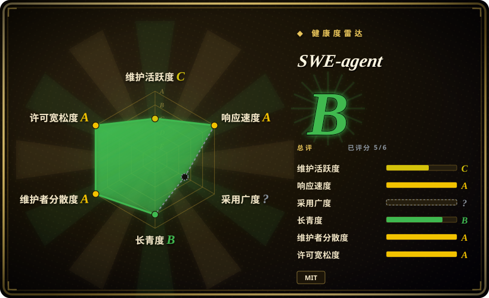
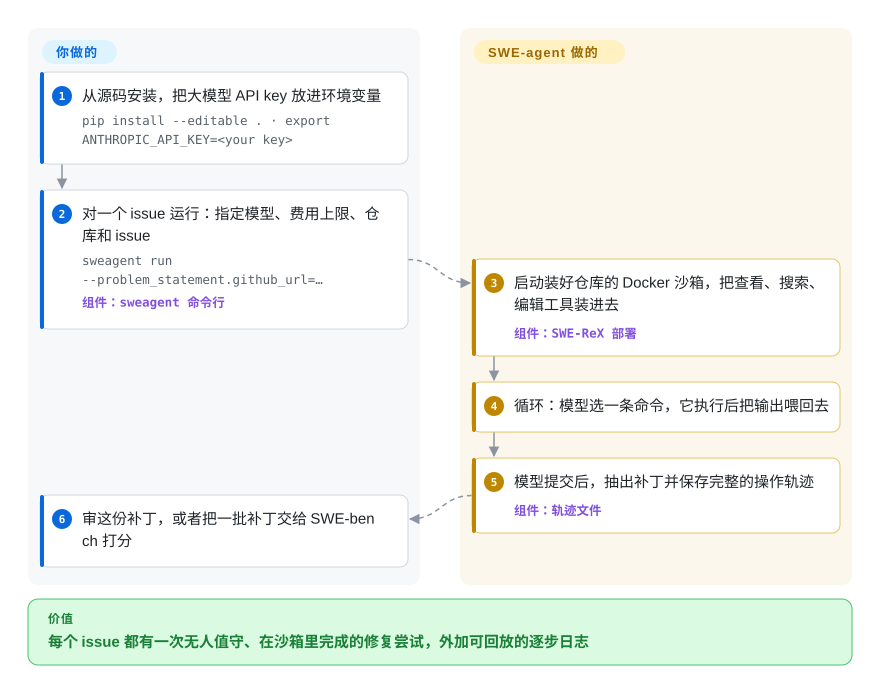

# SWE-agent

你手上有一个 GitHub issue——或者 SWE-bench 里的两千个——想让大模型在一次性的容器里无人值守地逐个去修，最后交给你一份补丁和它每一步干了什么的完整记录。SWE-agent 就是普林斯顿 / 斯坦福做的这套研究用工具，一条 `sweagent run` 命令完成上面这些；但它自己的维护者现在建议新工作改用小得多的 mini-swe-agent。

## 何时使用

你是机器学习或 agent 方向的研究者，或者在复现一篇论文的团队，需要让模型批量处理真实仓库的 issue：给它一个 issue 链接，让它在 Docker 沙箱里干活，收回一份 `.patch` 和一份*轨迹*（模型执行过的每条命令、看到的每次返回，全部存档的记录），拿去打分和分析。你需要整次运行由一个 YAML 配置决定——工具、提示词、模型、费用上限——这样同事能原样重跑。当你要复现或扩展已发表的 SWE-agent / SWE-agent 1.0 结果、需要它可配置的工具包和示范样例，或者需要 EnIGMA 夺旗赛模式（目前仍要用 0.7 分支）时，就会想到它。

和 [aider](../terminal-agents/aider.zh.md) 或 [Codex](../terminal-agents/codex.zh.md) 比，选它是因为那两个是在*你自己*的工作副本上交互结对编程，而 SWE-agent 专为无人值守、带沙箱、批量产出可比结果而设计。和 mini-swe-agent（未收录）比，只有在你明确需要 SWE-agent 更丰富的工具界面、或必须对齐它已发表的配置时才选它——做新东西的话，维护者自己的 README 就说 mini-swe-agent 性能相当、代码却少得多。

## 怎么用起来

SWE-agent 给大模型套上一层 *agent-计算机接口*：一小组 shell 工具（打开文件某一行、搜索、改一段代码、执行命令），装进沙箱环境，再配一段告诉模型怎么用这些工具的系统提示词。你在命令行上给它三样东西——`problem_statement`（issue 链接或文本）、`agent`（用哪个模型、费用上限多少）、`env`（哪个仓库、哪个 Docker 镜像）。随后它通过配套包 SWE-ReX 启动沙箱（默认 Docker，也可以用 Modal 或 AWS Fargate），把工具拷进去，然后循环：模型提出一条命令，SWE-agent 执行并把输出喂回去，直到模型调用 `submit`，SWE-agent 抽出 diff。打个比方：你把一位师傅关进一间工具固定的上锁工坊，再给他一本记录本——你拿回修好的零件和那本记录，装不装上去还是你说了算。评判归你：默认流程里它不会自己去提 PR；做基准测试时，你把补丁交给 [SWE-bench](../../../llm-eval/swe-bench.zh.md) 打分。

<!-- flow-steps:begin (generated from flows/swe-agent.json by tools/flow_card.py — do not edit) -->

流程文字版

1. **你**：从源码安装，把大模型 API key 放进环境变量 — `pip install --editable . · export ANTHROPIC_API_KEY=<your key>`
2. **你**：对一个 issue 运行：指定模型、费用上限、仓库和 issue — `sweagent run --problem_statement.github_url=…` — 组件：`sweagent 命令行`
3. **SWE-agent**：启动装好仓库的 Docker 沙箱，把查看、搜索、编辑工具装进去 — 组件：`SWE-ReX 部署`
4. **SWE-agent**：循环：模型选一条命令，它执行后把输出喂回去
5. **SWE-agent**：模型提交后，抽出补丁并保存完整的操作轨迹 — 组件：`轨迹文件`
6. **你**：审这份补丁，或者把一批补丁交给 SWE-bench 打分

**价值**：每个 issue 都有一次无人值守、在沙箱里完成的修复尝试，外加可回放的逐步日志

<!-- flow-steps:end -->

## 何时不用

- **废弃信号——你要在它上面开新项目。** README 现在写明大部分开发已转到 mini-swe-agent，后者“已经取代了 SWE-agent”，并建议以后都用它。最新发布是 v1.1.0（2025-05-22），`main` 只剩零星小修，最近一次在 2026-07-16。新的研究工具链用 mini-swe-agent（未收录），除非你必须对齐 SWE-agent 已发表的配置。
- **你想要一个在自己工作副本上干活的助手。** SWE-agent 是批处理工具，不是日常编码工具；改用 [Codex](../terminal-agents/codex.zh.md)、[aider](../terminal-agents/aider.zh.md) 或 [OpenCode](../terminal-agents/opencode.zh.md)，它们在你的工作副本上交互式修改并逐步请你批准。
- **你想让 agent 无人值守地处理团队仓库并自动提 PR。** SWE-agent 止步于一个补丁文件；改用 [gh-aw](gh-aw.zh.md) 或 [Background Agents（Open-Inspect）](background-agents.zh.md)，它们负责触发、权限和创建 PR。
- **你跑不了 Docker（也不想为 Modal/Fargate 付费）。** 默认沙箱是本地 Docker 容器；直接在本机跑虽然可以，但文档不推荐。没有容器运行时，就用托管的评测服务，或者用自带操作系统级沙箱的命令行 agent，比如 [Codex](../terminal-agents/codex.zh.md)。
- **你只需要给现成的补丁打分。** 那是 [SWE-bench](../../../llm-eval/swe-bench.zh.md) 的活；SWE-agent 负责生成补丁。

## 横向对比

| 替代品 | 是否收录 | 我们的评价 | 取舍 |
|---|---|---|---|
| mini-swe-agent | 未收录 | 任何新的基准测试或研究工具链都选 mini-swe-agent；只有复现或扩展 SWE-agent 自己已发表的运行时才留着 SWE-agent。 | mini-swe-agent 是维护者推荐的继任者（只用 bash、代码少得多、持续发版）；SWE-agent 保留更丰富的工具界面和 EnIGMA 血统，但已处于维护模式。 |
| [SWE-bench](../../../llm-eval/swe-bench.zh.md) | ✅ | 用 SWE-bench 给补丁打分，用 SWE-agent（或 mini-swe-agent）生成补丁；两者互补，不是二选一。 | SWE-bench 是评测框架和数据集，得先有某个 agent 生成预测结果。 |
| [aider](../terminal-agents/aider.zh.md) | ✅ | 有人在本地工作副本上盯着改，选 aider；运行必须无人值守、带沙箱、留下轨迹日志，选 SWE-agent。 | aider 优化的是带 git 提交的交互式改码循环；SWE-agent 优化的是可复现的批量运行，牺牲了交互上的顺手。 |
| [Codex](../terminal-agents/codex.zh.md) | ✅ | 日常编码、要操作系统级沙箱和逐步批准，选 Codex；研究里必须自己控制并公开 agent 接口和提示词，选 SWE-agent。 | Codex 是打磨好、迭代快的产品，绑定 OpenAI Responses API；SWE-agent 能用 YAML 完全配置、经 LiteLLM 接任意模型，但已不再积极开发。 |
| [OpenHands](openhands.zh.md) | ✅ | 想要一个跨机器派发 agent 和自动化任务的界面，选 OpenHands；想要一个精简、可脚本化的研究工具，选 SWE-agent（或它的继任者）。 | OpenHands 现在是带服务端和网页界面的控制台；SWE-agent 是一个只写补丁和日志的 Python 命令行。 |

## 技术栈

- **语言：**Python ≥ 3.11；命令行入口 `sweagent`（`sweagent run`、`sweagent run-batch`）。
- **模型接入：**LiteLLM，OpenAI、Anthropic 等提供方都通过同一个模型名设置接入。
- **沙箱 / 运行时：**SWE-ReX（`swe-rex`），负责启动并驱动 Docker、Modal 或 AWS Fargate 环境。
- **配置：**单个 YAML 文件（工具、模板、示范样例、模型），可用点号形式的命令行参数覆盖。
- **其他：**Textual 和 Flask/Socket.IO 用于轨迹查看器（`sweagent inspect` / `sweagent inspector`），GitPython/ghapi 用于访问仓库和 issue。

## 依赖

- Python 3.11+，从源码安装（`git clone` + `pip install --editable .`）。
- 默认本地沙箱需要 Docker（或者用 Modal / AWS Fargate 账号做远程执行）。
- 环境变量或 `.env` 文件里的大模型 API key（如 `ANTHROPIC_API_KEY`、`OPENAI_API_KEY`）。
- issue 或仓库是私有的时候，需要 `GITHUB_TOKEN`（密钥文档里有写）。

## 运维难度

**中等。**没有服务端，但每次运行都要为每个仓库拉取或构建一个 Docker 镜像，还要烧模型 token；在 SWE-bench 上批量跑，需要放得下大量镜像的磁盘、每个实例的费用上限，以及耐心。由于开发已转到 mini-swe-agent，如果你今天锁定 `main`，依赖漂移（LiteLLM、SWE-ReX、旧配置里的模型名）多半要自己修。

## 健康度与可持续性

- **维护（2026-10-08）：**在滑行。最近 13 周里只有 1 周有提交，`main` 上最后一次提交是 2026-07-16；最新发布是 2025-05 的 v1.1.0。本次刷新里雷达图的维护分从 B 掉到 C，和 README 自己说“工作已转到 mini-swe-agent”一致。
- **治理与 bus factor：**学术组织（普林斯顿 / 斯坦福），一位维护者占绝对主导——Kilian Lieret 的提交数大约是第二名的十倍，而他的精力现在放在继任项目上。
- **年龄与 Lindy：**创建于 2024-04，被广泛引用（NeurIPS 2024），但年龄在这里帮不上忙：Lindy 先验要求*仍然活跃*，而维护者已经宣布了继任者。
- **采用度：**约 2.05 万 star，研究引用量大；它的实际价值如今更多通过同一团队的 SWE-bench、SWE-smith 和 mini-swe-agent 延续。
- **风险信号：**MIT 许可，没有改过许可。主要风险是面对快速变化的模型 API 慢慢失修，而不是许可变更。

## 存疑（未验证）

- [未验证] 没有测试当前 `main` 能否和最新的 LiteLLM、SWE-ReX 版本顺利跑通。
- [未验证] “mini-swe-agent 性能与 SWE-agent 相当”是维护者在 README 里的自述，没有独立复测。
- [未验证] 约 2.05 万 star 取自 2026-10-08 的 GitHub API。
