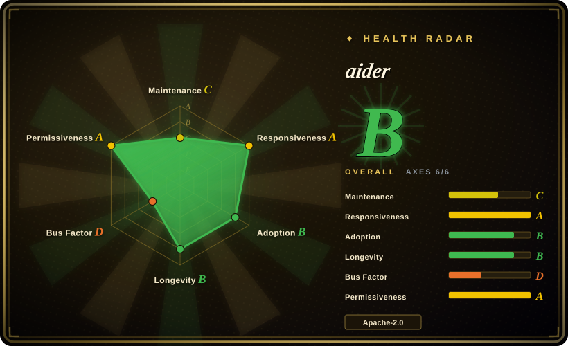
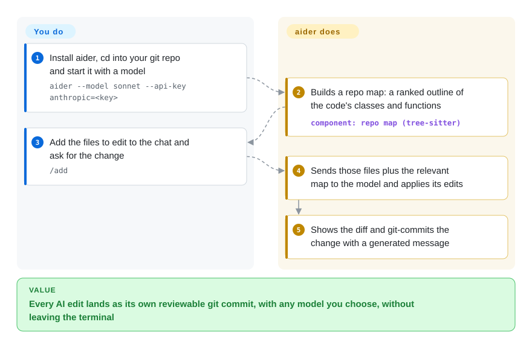

# aider

You paste a function into a chat window, paste the answer back, and an hour later cannot tell which of the six edits broke the build. aider does the editing inside your git repo from the terminal instead: you name the files, any model you choose writes the change, and each change lands as its own git commit you can diff or `/undo`.

## When to use

You are a developer working in an existing repository — a Django app, a Rust CLI — and you want an AI to make focused changes while you stay in charge of which files it touches. You have tried the web-chat loop (copy the file, copy the reply, hand-merge, lose track) and you have tried agents that rewrite ten files across the repo and leave one giant uncommitted diff. You want something in between: you say `aider app/models.py app/views.py`, type "add a soft-delete flag to Order and hide deleted orders in the list view", and get back a diff that is already committed as `feat: Add soft-delete flag to Order model`, which you keep or roll back with `/undo`.

Reach for aider when model choice and git hygiene matter more than autonomy. It talks to almost any provider (Anthropic, OpenAI, DeepSeek, local models) where [Codex](codex.md) and [Gemini CLI](gemini-cli.md) lean toward their vendor's models, and its pair-programming loop — you pick the files, it edits and commits — keeps changes small and reviewable, where Codex and [OpenCode](opencode.md) run longer autonomous loops that read, execute and iterate on their own. It is also the oldest of these terminal tools (since 2023-05), with a large body of user experience behind its edit formats and repo map.

## How it works

aider is a Python program you run in a terminal at the root of a git repo; it calls a model through LiteLLM (a library that speaks the APIs of 100+ model providers) using your own API key. **You** decide which files are "in the chat" — their full text is sent to the model — and you describe the change. **aider** adds a repo map: an outline of the most important classes and functions across the whole repo, extracted with tree-sitter (a parser that reads code structure) and ranked by how related they are to your files, so the model knows what exists without receiving every file. It asks the model to reply in an edit format (for example, search-and-replace blocks), applies those edits to disk, shows you the diff, and commits it with a generated message; it can also run your linter and tests after each change and feed failures back. Think of it as a pair programmer at your keyboard: you navigate, it types, and git keeps the record. A second way in is watch mode (`--watch-files`): leave a comment ending in `AI!` in your editor and aider picks it up.

<!-- flow-steps:begin (generated from flows/aider.json by tools/flow_card.py — do not edit) -->

Text version of the flow

1. **You**: Install aider, cd into your git repo and start it with a model — `aider --model sonnet --api-key anthropic=<key>`
2. **aider**: Builds a repo map: a ranked outline of the code's classes and functions — component: `repo map (tree-sitter)`
3. **You**: Add the files to edit to the chat and ask for the change — `/add`
4. **aider**: Sends those files plus the relevant map to the model and applies its edits
5. **aider**: Shows the diff and git-commits the change with a generated message

**Value**: Every AI edit lands as its own reviewable git commit, with any model you choose, without leaving the terminal

<!-- flow-steps:end -->

## When NOT to use

- **You want the agent to work through a task on its own — run commands, read the output, try again.** aider's core loop is request → edit → commit, with you choosing the files. Use [Codex](codex.md) (sandboxed command execution) or [OpenCode](opencode.md) (many providers, autonomous loop) instead, because they plan and verify across many steps without you feeding each turn.
- **You want the agent inside your IDE, with per-step approval and checkpoints.** aider's IDE story is comment-driven watch mode. Use [Cline](../ide-agents/cline.md) instead when approving each action in the editor UI is the point.
- **You need a tool that keeps pace with new models and features.** The last release is v0.86.0 (2025-08-09), commits stopped at 2026-05-22, and the scorer saw no active weeks in the last quarter. If release cadence matters more than maturity, prefer [OpenCode](opencode.md), which still ships frequently.
- **You cannot depend on one person.** About 82% of the 12-month commits come from the creator (Paul Gauthier). For a team-wide standard with stronger governance, pick a vendor- or community-backed agent such as [Codex](codex.md) or [OpenCode](opencode.md).
- **You want to run agents for a whole team from one place, on servers.** aider is a single-user terminal tool. Use [OpenHands](../orchestration-and-review/openhands.md) for a self-hosted control center that dispatches agents.

## Comparison

| Alternative | In index | Our verdict | Tradeoff |
|---|---|---|---|
| [Codex](codex.md) | ✅ | If you want an agent that runs and verifies commands itself in an OS sandbox, pick Codex; if you want a commit-per-change pair programmer with any provider, pick aider. | Codex is autonomous and vendor-maintained but OpenAI-centric; aider keeps you choosing files and makes every edit a git commit. |
| [OpenCode](opencode.md) | ✅ | For a provider-agnostic agent that is still releasing frequently, pick OpenCode; pick aider for tighter, file-scoped edits with automatic commits. | OpenCode runs a longer autonomous loop and is actively developed; aider's loop is smaller and its maintenance has slowed. |
| [Gemini CLI](gemini-cli.md) | ✅ | If cost is the constraint and a Google account's free quota covers you, pick Gemini CLI; pick aider when you want to choose the model and keep git-native commits. | Gemini CLI is free within quota and has a huge context window but is Gemini-first; aider is model-agnostic and pay-per-use. |
| [Cline](../ide-agents/cline.md) | ✅ | If you live in VS Code and want to approve each step with checkpoints, pick Cline; pick aider for terminal-first work. | Cline's editor UI and per-action approval vs aider's terminal chat and git commits as the undo mechanism. |
| [Freebuff](freebuff.md) | ✅ | For agentic coding with no API bill, accepting ads and a rotating hosted model catalog, pick Freebuff; pick aider when you control the model and the data path. | Freebuff is free but its operator sees your prompts and code; aider sends them only to the provider you configure. |
| [OpenHands](../orchestration-and-review/openhands.md) | ✅ | For dispatching agents on servers from a browser control center, pick OpenHands; aider is a local single-user tool. | OpenHands adds hosting and orchestration overhead; aider is one pip install. |

## Tech stack

- **Language:** Python (requires 3.10 – 3.14), distributed on PyPI as `aider-chat`, with the `aider-install` bootstrapper.
- **Model access:** LiteLLM, so any provider it supports, including local OpenAI-compatible servers.
- **Code understanding:** tree-sitter through `grep_ast` plus `networkx` graph ranking for the repo map; 100+ languages per the README.
- **Git:** GitPython for auto-commits, `/undo` and `/commit`.
- **Terminal UI:** prompt_toolkit and rich; optional voice input (sounddevice/soundfile), web page scraping (beautifulsoup4, pypandoc), file watching (watchfiles).
- **Analytics:** posthog/mixpanel clients for opt-in anonymous analytics (`aider --analytics-disable` turns them off for good).

## Dependencies

- **A model and its key** — a hosted API key (`--api-key anthropic=<key>`) or a local model server. Model cost is yours; aider adds none.
- **git** — aider works on a git repo and commits there; `--no-auto-commits` stops the commits.
- **Python 3.10+** on the machine (`aider-install` sets up an isolated environment).
- Optional: your linter and test commands, if you want the lint/test fix loop.

## Ops difficulty

**Low.** It is a local CLI: install, set a key, run. Nothing to host. The ongoing cost is managing model keys and spend, and pinning a version for a team — with releases stalled since 2025-08, newer model names may need `--model` with a LiteLLM identifier or a settings file instead of a built-in alias.

## Health & viability

- **Maintenance (2026-10):** coasting. Latest release v0.86.0 on 2025-08-09; the last commit, 2026-05-22, merged a community PR adding recent Claude model names. The scorer found no active weeks in the last 13 (maintenance C).
- **Governance / bus factor:** effectively one maintainer — the creator holds ~82% of 12-month commits (top1_share 0.824) among 10 active contributors (governance D). PRs still get fast first responses (responsiveness A), but the roadmap is one person's.
- **Backing & Lindy:** created 2023-05 (~3.4 years), organization-owned (`Aider-AI`) with no published funding or foundation. Age earns some trust (longevity B), but the Lindy prior needs "still active", and the last quarter is quiet.
- **Adoption:** ~49k stars, 260,509 PyPI downloads last month for `aider-chat`, Homebrew installs, and a widely cited LLM code-editing leaderboard (adoption B).
- **Risk flags:** Apache-2.0 with no relicense history (risk A), but contributors sign an Individual Contributor License Agreement (CONTRIBUTING.md), which leaves the door to a future relicense open. The nearer risk is stagnation.

## Caveats (unverified)

- [推断] "Coasting" is read from release and commit dates plus the scorer's zero active weeks; no maintainer statement about the project's status was found.
- [未验证] Responsiveness A is computed from PR first responses (median 0.0 h on 15 PRs), which may reflect automation rather than human triage.
- [未验证] That newer model names need a raw LiteLLM identifier is inferred from the stalled release; current aliases were not tested.
- [未验证] The ~49k star count is as of 2026-10 and noisy.
- [推断] That the CLA keeps a future relicense possible is a general reading of CLAs; the agreement text was not reviewed.
- [推断] The comparison of autonomy levels with Codex and OpenCode relies on those pages' descriptions plus aider's usage docs, not a side-by-side test.
