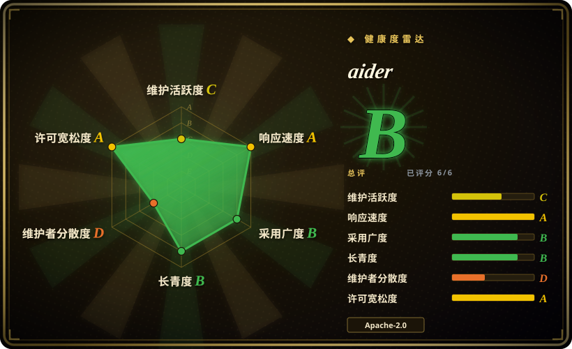
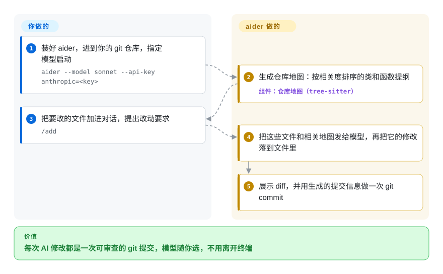

# aider

你把一个函数贴进聊天窗口，再把回答贴回来，一小时后已经分不清六次修改里是哪一次把构建弄坏了。aider 改成在终端里、直接在你的 git 仓库里动手：文件由你点名，模型随你选，它写出的每一处改动都单独成为一次 git 提交，可以 diff，也可以 `/undo`。

## 何时使用

你是一名开发者，手上是一个已有的仓库——一个 Django 应用、一个 Rust 命令行工具——你想让 AI 做一些聚焦的修改，同时由你来决定它能碰哪些文件。网页聊天那一套你试过（复制文件、复制回答、手工合并、改着改着就乱了），一口气改遍仓库十个文件、最后留下一大坨未提交 diff 的 agent 你也试过。你要的是折中：敲 `aider app/models.py app/views.py`，输入“给 Order 加一个软删除标记，列表页隐藏已删除的订单”，拿回来的 diff 已经提交成 `feat: Add soft-delete flag to Order model`，留着还是 `/undo` 回滚由你定。

当模型选择和 git 整洁比自主性更重要时，就用 aider。它几乎能对接任何厂商（Anthropic、OpenAI、DeepSeek、本地模型），而 [Codex](codex.zh.md) 和 [Gemini CLI](gemini-cli.zh.md) 更偏向自家模型；它的结对编程循环——你挑文件，它改完就提交——让每次改动都小而可审，而 Codex 和 [OpenCode](opencode.zh.md) 跑的是更长的自主循环，自己读代码、执行、再迭代。它也是这几款终端工具里资格最老的（2023-05 起），编辑格式和仓库地图背后有大量用户经验。

## 怎么用起来

aider 是一个 Python 程序，在 git 仓库根目录的终端里运行；它通过 LiteLLM（一个能对接 100 多家模型厂商 API 的库）用你自己的 API key 调模型。**你**决定哪些文件“在对话里”——这些文件的全文会发给模型——并描述要改什么。**aider** 再附上一份仓库地图：整个仓库里最重要的类和函数的提纲，用 tree-sitter（一种能读懂代码结构的解析器）抽出来，并按和你所选文件的相关度排序，这样模型知道仓库里有什么，又不必收到每个文件。它要求模型按某种编辑格式回复（比如“查找—替换”块），把这些修改写回磁盘，给你看 diff，再配上生成的提交信息做一次提交；它还可以在每次改动后跑你的 lint 和测试，把失败结果喂回去。可以把它想成坐在你键盘前的结对伙伴：你指路，它打字，git 负责记账。另一条入口是监视模式（`--watch-files`）：在编辑器里留一行以 `AI!` 结尾的注释，aider 就会接手。

<!-- flow-steps:begin (generated from flows/aider.json by tools/flow_card.py — do not edit) -->

流程文字版

1. **你**：装好 aider，进到你的 git 仓库，指定模型启动 — `aider --model sonnet --api-key anthropic=<key>`
2. **aider**：生成仓库地图：按相关度排序的类和函数提纲 — 组件：`仓库地图（tree-sitter）`
3. **你**：把要改的文件加进对话，提出改动要求 — `/add`
4. **aider**：把这些文件和相关地图发给模型，再把它的修改落到文件里
5. **aider**：展示 diff，并用生成的提交信息做一次 git commit

**价值**：每次 AI 修改都是一次可审查的 git 提交，模型随你选，不用离开终端

<!-- flow-steps:end -->

## 何时不用

- **你想让 agent 自己把任务做完——跑命令、看输出、再试。** aider 的核心循环是“提要求 → 改代码 → 提交”，文件由你挑。改用 [Codex](codex.zh.md)（在沙箱里执行命令）或 [OpenCode](opencode.zh.md)（多厂商、自主循环），它们会自己跨多步规划和验证，不用你一轮轮喂。
- **你想让 agent 待在 IDE 里，每一步都审批、都有检查点。** aider 的 IDE 方案是靠注释驱动的监视模式。如果在编辑器界面里逐个批准动作才是重点，改用 [Cline](../ide-agents/cline.zh.md)。
- **你需要一个紧跟新模型、新功能的工具。** 最新版本是 v0.86.0（2025-08-09），提交停在 2026-05-22，评分器在最近一个季度里没看到活跃周。如果发版节奏比成熟度更要紧，选仍在频繁发版的 [OpenCode](opencode.zh.md)。
- **你不能把赌注押在一个人身上。** 12 个月内约 82% 的提交来自作者本人（Paul Gauthier）。要做全团队标准、需要更强治理时，选有厂商或社区撑腰的 agent，比如 [Codex](codex.zh.md) 或 [OpenCode](opencode.zh.md)。
- **你要在服务器上、从一个地方给整个团队跑 agent。** aider 是单用户终端工具。改用 [OpenHands](../orchestration-and-review/openhands.zh.md)，一个能派发 agent 的自托管控制台。

## 横向对比

| 替代品 | 是否收录 | 我们的评价 | 取舍 |
|---|---|---|---|
| [Codex](codex.zh.md) | ✅ | 想要一个在操作系统沙箱里自己跑命令、自己验证的 agent，选 Codex；想要任意厂商、每次改动一次提交的结对程序员，选 aider。 | Codex 自主、由厂商维护，但以 OpenAI 为中心；aider 让你自己挑文件，把每次编辑都变成一次 git 提交。 |
| [OpenCode](opencode.zh.md) | ✅ | 要一个不绑厂商、仍在频繁发版的 agent，选 OpenCode；要更紧凑、按文件限定范围并自动提交的编辑，选 aider。 | OpenCode 跑更长的自主循环且在活跃开发；aider 的循环更小，维护已经放缓。 |
| [Gemini CLI](gemini-cli.zh.md) | ✅ | 预算是硬约束、谷歌账号的免费额度够用，选 Gemini CLI；想自己挑模型、保留 git 原生提交，选 aider。 | Gemini CLI 在额度内免费、上下文窗口很大，但以 Gemini 为先；aider 不绑模型，按用量付费。 |
| [Cline](../ide-agents/cline.zh.md) | ✅ | 你常驻 VS Code、想每一步审批并带检查点，选 Cline；以终端为主的工作选 aider。 | Cline 是编辑器界面加逐动作审批；aider 是终端对话，以 git 提交作为撤销手段。 |
| [Freebuff](freebuff.zh.md) | ✅ | 想不付 API 费用做 agent 式编码、能接受广告和轮换的托管模型目录，选 Freebuff；想自己掌控模型和数据去向，选 aider。 | Freebuff 免费，但运营方能看到你的 prompt 和代码；aider 只把它们发给你配置的厂商。 |
| [OpenHands](../orchestration-and-review/openhands.zh.md) | ✅ | 要从浏览器控制台把 agent 派到服务器上跑，选 OpenHands；aider 是本地单用户工具。 | OpenHands 多了托管和编排的开销；aider 一条 pip install 就完事。 |

## 技术栈

- **语言：** Python（要求 3.10 – 3.14），在 PyPI 上以 `aider-chat` 发布，另有 `aider-install` 引导安装器。
- **模型接入：** LiteLLM，所以它支持的厂商都能用，包括本地 OpenAI 兼容服务。
- **代码理解：** 通过 `grep_ast` 用 tree-sitter，加上 `networkx` 图排序生成仓库地图；README 称支持 100 多种语言。
- **Git：** 用 GitPython 实现自动提交、`/undo` 和 `/commit`。
- **终端界面：** prompt_toolkit 和 rich；可选语音输入（sounddevice/soundfile）、网页抓取（beautifulsoup4、pypandoc）、文件监视（watchfiles）。
- **统计：** 内置 posthog/mixpanel 客户端，用于需主动同意的匿名统计（`aider --analytics-disable` 可永久关闭）。

## 依赖

- **一个模型和它的 key**——托管 API key（`--api-key anthropic=<key>`）或本地模型服务。模型费用由你承担，aider 本身不收费。
- **git**——aider 在 git 仓库上工作并在其中提交；`--no-auto-commits` 可以关掉自动提交。
- **Python 3.10+**（`aider-install` 会建一个隔离环境）。
- 可选：你的 lint 和测试命令，用于“改完就检查、失败再修”的循环。

## 运维难度

**低。** 它是本地命令行工具：安装、配 key、运行，没有要托管的东西。持续的成本在于管理模型 key 和花费，以及团队内统一钉版本——发版自 2025-08 起停滞，较新的模型名可能得用 LiteLLM 原始标识配合 `--model` 或配置文件，而不是内置别名。

## 健康度与可持续性

- **维护（2026-10）：** 在滑行。最新版本是 2025-08-09 的 v0.86.0；最后一次提交在 2026-05-22，合入的是社区补充新 Claude 模型名的 PR。评分器在最近 13 周里没找到活跃周（维护 C）。
- **治理与 bus factor：** 实质上是一人维护——作者占 12 个月内约 82% 的提交（top1_share 0.824），活跃贡献者共 10 人（治理 D）。PR 仍能很快得到首次回复（响应速度 A），但路线图是一个人的。
- **背书与 Lindy：** 创建于 2023-05（约 3.4 年），由组织账号（`Aider-AI`）持有，没有公开的资金来源或基金会。年龄带来一定信任（寿命 B），但 Lindy 先验要求“仍在活跃”，而最近一个季度很安静。
- **采用度：** 约 49k star，`aider-chat` 上月 PyPI 下载 260,509 次，有 Homebrew 安装量，还有一个被广泛引用的大模型改代码排行榜（采用度 B）。
- **风险标记：** Apache-2.0，没有改许可证的历史（风险 A），但贡献者要签个人贡献者许可协议（CONTRIBUTING.md），给将来改许可证留了口子。更近的风险是停滞。

## 存疑（未验证）

- [推断] “在滑行”是根据发版和提交日期以及评分器的零活跃周得出的；没有找到维护者对项目状态的说明。
- [未验证] 响应速度 A 是按 PR 首次回复算的（15 个 PR，中位数 0.0 小时），可能反映的是自动化而不是人工分诊。
- [未验证] 较新的模型名需要用 LiteLLM 原始标识，这一点是从发版停滞推出来的；没有实测当前别名。
- [未验证] 约 49k star 截至 2026-10，噪声很大。
- [推断] CLA 给将来改许可证留了口子，是对 CLA 的一般性解读；没有审阅协议原文。
- [推断] 与 Codex、OpenCode 自主程度的对比，依据的是那些页面的描述和 aider 的使用文档，不是并排实测。
