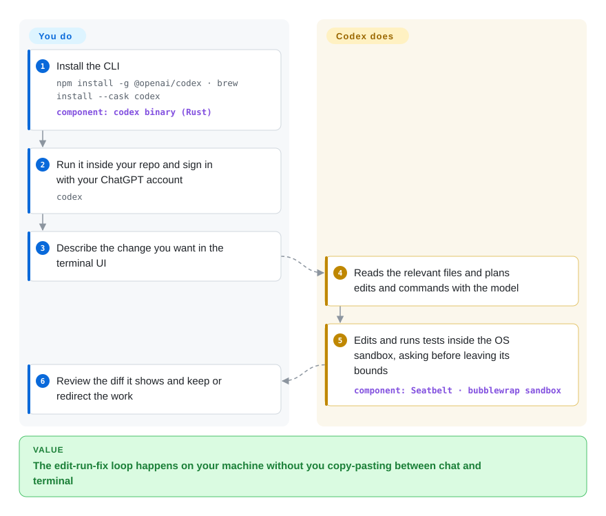

# Codex

Pasting code into a chat window and copying the answer back means you are the one who runs the tests, notices the import it forgot, and pastes again. Codex CLI is OpenAI's open-source agent that does that loop itself in your terminal — it reads the repo, edits files and runs commands inside an operating-system sandbox, asking before it steps outside the project folder.

## When to use

You're a developer who already pays for ChatGPT (Plus, Pro, Business, Edu or Enterprise) and wants that plan to do real work on your machine, not just answer questions. You `cd` into a repo, run `codex`, and type "the date parser fails on `2026-02-30`, add a test and fix it" — Codex finds the file, writes the test, runs `pytest`, sees `FAILED test_dates.py::test_invalid_day`, fixes the code, reruns, and shows you the diff. You want this to be safe by default, so commands run inside the OS sandbox (Seatbelt on macOS, bubblewrap on Linux, a native sandbox on Windows) and anything outside the workspace or the default sandbox rules stops for approval. The same tool runs headless in CI via `codex exec`, and reads your repo's `AGENTS.md` for project rules.

Pick it over [OpenCode](opencode.md) or [Open Interpreter](open-interpreter.md) when your models come from OpenAI and you want the first-party harness the model was tuned against, billed to the ChatGPT plan you already have; pick it over Claude Code (not indexed) when you want the agent's source under Apache-2.0 rather than a closed binary; pick it over [Gemini CLI](gemini-cli.md) when you want sandboxing on by default rather than opt-in. The deciding tradeoff: the most polished OpenAI-native terminal agent with a real OS sandbox, in exchange for living on OpenAI's roadmap — external pull requests are not accepted, and other providers must speak the OpenAI Responses API.

## How it works

Codex is a single Rust binary with a full-screen terminal UI (a TUI). When you give it a task it sends your request plus the relevant context to the model, and the model answers with actions — read this file, apply this patch, run this command. Codex executes each action inside a sandbox: the operating system itself (not a container) limits which files the command can write and whether it can reach the network, and a *policy* decides what runs automatically and what waits for your yes. Think of a contractor working in your kitchen who may move anything inside the kitchen freely but has to knock before opening any other door. Codex does the loop, the sandboxing, the diffs, sessions you can resume (`codex resume`), and the plumbing for MCP servers (the Model Context Protocol, a plug format for external tools), skills and hooks; you choose the sign-in (ChatGPT account or API key), the sandbox level, and you review the result. Local models are possible through `--oss` with Ollama or LM Studio, and any provider that exposes the OpenAI Responses API can be configured; the older Chat Completions wire format has been removed.

<!-- flow-steps:begin (generated from flows/codex.json by tools/flow_card.py — do not edit) -->

Text version of the flow

1. **You**: Install the CLI — `npm install -g @openai/codex · brew install --cask codex` — component: `codex binary (Rust)`
2. **You**: Run it inside your repo and sign in with your ChatGPT account — `codex`
3. **You**: Describe the change you want in the terminal UI
4. **Codex**: Reads the relevant files and plans edits and commands with the model
5. **Codex**: Edits and runs tests inside the OS sandbox, asking before leaving its bounds — component: `Seatbelt · bubblewrap sandbox`
6. **You**: Review the diff it shows and keep or redirect the work

**Value**: The edit-run-fix loop happens on your machine without you copy-pasting between chat and terminal

<!-- flow-steps:end -->

## When NOT to use

- **Your models come from a provider that only speaks Chat Completions or its own API.** Codex removed `wire_api = "chat"`; custom providers must implement the Responses API. Use [OpenCode](opencode.md) for broad multi-provider support, or [Open Interpreter](open-interpreter.md) (a Codex fork with harnesses tuned for cheaper/open models).
- **You want to contribute code or steer the roadmap.** `docs/contributing.md` states that OpenAI does **not** accept external pull requests — only issues and analysis. If community governance matters, pick [OpenCode](opencode.md) or [aider](aider.md).
- **You need a stable interface to build on.** It is still 0.x with a stable release almost daily (v0.161.0 on 2026-10-07) and alpha builds several times a day; flags and config keys change (for example the Chat wire API and the `ollama-chat` provider were removed). Pin a version in CI, or drive it through a protocol layer such as ACP from [OpenHands](../orchestration-and-review/openhands.md).
- **You want to run it without any sandbox on a machine with secrets.** The sandbox only helps if you leave it on; `--dangerously-bypass-approvals-and-sandbox` (alias `--yolo`) turns everything off and is meant for externally sandboxed environments. If you can't guarantee that, run it inside a devcontainer or prefer CI-hosted agents like [gh-aw](../orchestration-and-review/gh-aw.md).
- **You want unattended batch fixes of many issues for research.** Codex is built around one interactive session (or one `codex exec` job); for benchmark-style batch runs with saved trajectories, use [SWE-agent](../orchestration-and-review/swe-agent.md)'s successor mini-swe-agent (not indexed).

## Comparison

| Alternative | In index | Our verdict | Tradeoff |
| --- | --- | --- | --- |
| [OpenCode](opencode.md) | ✅ | If you switch between Anthropic, OpenAI, Google and local models, pick OpenCode; if you are on OpenAI models and a ChatGPT plan, pick Codex for the first-party harness and OS sandbox. | OpenCode gives provider freedom and accepts community PRs; Codex gives tighter OpenAI integration and default sandboxing but only Responses-API providers. |
| [Open Interpreter](open-interpreter.md) | ✅ | If you want Codex's shape but cheaper or open-weight models (DeepSeek, Kimi, Qwen) to behave well, pick Open Interpreter; for OpenAI models, stay on upstream Codex. | Open Interpreter is a fork that adds swappable harnesses; it trails upstream Codex features and depends on a smaller team. |
| [Gemini CLI](gemini-cli.md) | ✅ | If you want a free tier on a personal Google account and a 1M-token context, pick Gemini CLI; if you want sandboxing on by default and a ChatGPT-plan login, pick Codex. | Gemini CLI's sandbox is opt-in (`-s`) and it is Gemini-only; Codex sandboxes by default but is tied to OpenAI's API shape. |
| [aider](aider.md) | ✅ | If you want a git-commit-per-change pair programmer that works with many providers, pick aider; if you want an agent that runs and verifies commands itself in a sandbox, pick Codex. | aider keeps every edit as a commit and is provider-agnostic; Codex is more autonomous and does more per turn, with OS-level sandboxing. |
| Claude Code | 未收录 | If your team standardises on Anthropic models and accepts a closed-source binary, pick Claude Code; if you need to read and audit the agent's source, pick Codex. | Claude Code is closed-source and Anthropic-only; Codex is Apache-2.0 but OpenAI-centric. |

## Tech stack

- **Rust** — the `codex-rs` workspace (TUI, core agent loop, `exec`, app server, MCP client, sandbox helpers); a small Node wrapper ships the npm package.
- **OpenAI Responses API** — the only supported wire protocol; ChatGPT-account login or API key.
- **OS sandboxing** — macOS Seatbelt (`sandbox-exec`), Linux bubblewrap (system `bwrap` or a bundled copy), a native Windows sandbox; WSL1 unsupported.
- **Extensibility** — MCP servers, `AGENTS.md`, skills, lifecycle hooks, profiles in `config.toml`; a TypeScript SDK in `sdk/`.
- **Local models** — `--oss` with Ollama or LM Studio providers.

## Dependencies

- A ChatGPT plan login or an OpenAI API key (or a Responses-API-compatible provider / local Ollama or LM Studio).
- macOS, Linux (install `bubblewrap`; Codex falls back to a bundled copy) or Windows (PowerShell or WSL2).
- Network access to OpenAI unless you run local models; the standalone installer downloads from `releases.openai.com` with GitHub Releases as fallback.
- Git is strongly recommended so you can review and roll back its edits.

## Ops difficulty

**Low** for an individual: one installer or `npm install -g @openai/codex`, then `codex`. The work is choosing sandbox and approval settings and reviewing diffs. **Medium** for an organisation: you need to pin versions against a near-daily release train, decide on ChatGPT-workspace vs API-key billing, and enforce settings centrally via the admin `requirements.toml` (e.g. managed hooks only).

## Health & viability

- **Maintenance (2026-10-08):** extremely active — commits every week of the last quarter, stable v0.161.0 on 2026-10-07 and multiple alpha builds per day. The pace is a stability cost for anyone scripting against it.
- **Governance / bus factor:** a single vendor. The contributor list is almost entirely OpenAI staff (369 active contributors in the past year, top three about 31% of commits), and outside code is not accepted, so the community's lever is issues only — and there are over 21,000 open ones.
- **Backing & longevity:** strategically important to OpenAI and tied to paid ChatGPT plans, which argues for continued investment; but the repo is only about 18 months old (created 2025-04), so the Lindy prior is weak, and its direction follows OpenAI's product needs.
- **Adoption:** among the most-installed coding agents — 91,144,251 npm downloads last month and ~128k stars (2026-10).
- **Risk flags:** Apache-2.0 with a CLA document and no relicense history; the main risk is roadmap lock-in to OpenAI's API shape, as the Chat Completions removal showed.

## Caveats (unverified)

- [未验证] Exact usage limits per ChatGPT plan and API pricing were not checked; they live on OpenAI help pages, not in the repo.
- [未验证] The sandbox's resistance to a determined prompt-injection attack has not been independently audited; the docs themselves say devcontainers "do not prevent every attack".
- [推断] Most of the 21,000+ open issues are likely duplicates or feature requests; the number reflects user scale as much as unresolved bugs.
- [推断] The npm download figure is inflated by CI installs and the npm package being a thin wrapper that fetches native binaries.
- [未验证] Whether the default sandbox mode blocks command network access on every platform was not tested; it is configurable per profile.
