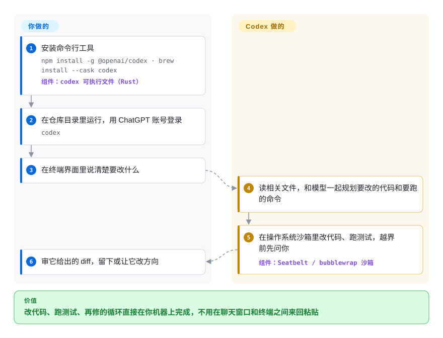

# Codex

把代码贴进聊天窗口、再把回答抄回编辑器，意味着跑测试、发现它漏了一个 import、再贴一遍的人都是你。Codex CLI 是 OpenAI 开源的 agent，在你的终端里自己跑完这个循环——读仓库、改文件、在操作系统沙箱里执行命令，要走出项目目录之前先问你。

## 何时使用

你是一名已经在付 ChatGPT（Plus、Pro、Business、Edu 或 Enterprise）的开发者，希望这份订阅在你的机器上真正干活，而不只是回答问题。你 `cd` 进一个仓库，运行 `codex`，输入“日期解析器遇到 `2026-02-30` 会出错，加个测试并修掉”——Codex 找到文件、写好测试、跑 `pytest`，看到 `FAILED test_dates.py::test_invalid_day`，修好代码、重跑，再把 diff 给你看。你希望这件事默认就是安全的：命令在操作系统沙箱里执行（macOS 用 Seatbelt，Linux 用 bubblewrap，Windows 用原生沙箱），凡是越出工作区或默认沙箱规则的操作都停下来等你批准。同一个工具还能通过 `codex exec` 在 CI 里无界面运行，并读取仓库里的 `AGENTS.md` 作为项目规则。

如果你的模型来自 OpenAI，想用模型本身针对调过的官方外壳、并直接记在已有的 ChatGPT 订阅上，选它而不是 [OpenCode](opencode.zh.md) 或 [Open Interpreter](open-interpreter.zh.md)；如果你希望 agent 的源码以 Apache-2.0 公开、而不是一个闭源二进制，选它而不是 Claude Code（未收录）；如果你希望沙箱默认开启而不是需要手动打开，选它而不是 [Gemini CLI](gemini-cli.zh.md)。决定性的取舍：最成熟的 OpenAI 原生终端 agent，带真正的操作系统级沙箱，代价是跟着 OpenAI 的路线走——不接受外部 PR，其他模型提供方也必须兼容 OpenAI Responses API。

## 怎么用起来

Codex 是一个 Rust 写的单一可执行文件，带全屏终端界面（TUI）。你交给它一个任务，它把请求和相关上下文发给模型，模型以动作作答——读这个文件、打这个补丁、跑这条命令。Codex 在沙箱里执行每个动作：由操作系统本身（不是容器）限制这条命令能写哪些文件、能不能联网，再由一套*策略*决定哪些自动执行、哪些等你点头。打个比方：一位在你厨房干活的师傅，厨房里的东西随便挪，但开任何别的门之前都得先敲门。循环、沙箱、diff 展示、可恢复的会话（`codex resume`），以及接入 MCP 服务器（Model Context Protocol，一种给 agent 接外部工具的插头格式）、技能和 hook 的管道，都由 Codex 负责；登录方式（ChatGPT 账号或 API key）、沙箱级别由你选，结果也由你审。本地模型可以通过 `--oss` 接 Ollama 或 LM Studio，任何提供 OpenAI Responses API 的服务也能配置进来；老的 Chat Completions 协议已经被移除。

<!-- flow-steps:begin (generated from flows/codex.json by tools/flow_card.py — do not edit) -->

流程文字版

1. **你**：安装命令行工具 — `npm install -g @openai/codex · brew install --cask codex` — 组件：`codex 可执行文件（Rust）`
2. **你**：在仓库目录里运行，用 ChatGPT 账号登录 — `codex`
3. **你**：在终端界面里说清楚要改什么
4. **Codex**：读相关文件，和模型一起规划要改的代码和要跑的命令
5. **Codex**：在操作系统沙箱里改代码、跑测试，越界前先问你 — 组件：`Seatbelt / bubblewrap 沙箱`
6. **你**：审它给出的 diff，留下或让它改方向

**价值**：改代码、跑测试、再修的循环直接在你机器上完成，不用在聊天窗口和终端之间来回粘贴

<!-- flow-steps:end -->

## 何时不用

- **你的模型提供方只支持 Chat Completions 或它自己的 API。** Codex 已移除 `wire_api = "chat"`，自定义提供方必须实现 Responses API。要广泛的多提供方支持，用 [OpenCode](opencode.zh.md)；或者用 [Open Interpreter](open-interpreter.zh.md)（Codex 的一个分支，为更便宜的开源模型调过外壳）。
- **你想贡献代码或影响路线图。** `docs/contributing.md` 写明 OpenAI **不接受**外部 pull request，只接受 issue 和分析。如果社区治理对你重要，选 [OpenCode](opencode.zh.md) 或 [aider](aider.zh.md)。
- **你需要一个稳定的接口在上面做二次开发。** 它仍是 0.x，几乎每天一个稳定版（2026-10-07 发布 v0.161.0），alpha 版一天好几个；参数和配置项会变（比如 Chat 协议和 `ollama-chat` 提供方都被移除过）。在 CI 里锁定版本，或者通过 ACP 这类协议层来驱动它，比如 [OpenHands](../orchestration-and-review/openhands.zh.md)。
- **你想在一台放着密钥的机器上关掉沙箱跑。** 沙箱只有开着才有用；`--dangerously-bypass-approvals-and-sandbox`（别名 `--yolo`）会把一切都关掉，本意是给外部已经隔离好的环境用。保证不了这一点，就在 devcontainer 里跑，或者优先用 [gh-aw](../orchestration-and-review/gh-aw.zh.md) 这类在 CI 里托管的 agent。
- **你要做研究用的批量无人值守修复。** Codex 围绕单个交互会话（或单个 `codex exec` 任务）设计；要做基准测试式、保存轨迹的批量运行，用 [SWE-agent](../orchestration-and-review/swe-agent.zh.md) 的继任者 mini-swe-agent（未收录）。

## 横向对比

| 替代品 | 是否收录 | 我们的评价 | 取舍 |
| --- | --- | --- | --- |
| [OpenCode](opencode.zh.md) | ✅ | 如果你在 Anthropic、OpenAI、Google 和本地模型之间切换，选 OpenCode；如果你用 OpenAI 模型和 ChatGPT 订阅，选 Codex，图的是官方外壳和操作系统沙箱。 | OpenCode 换来提供方自由并接受社区 PR；Codex 换来更紧的 OpenAI 集成和默认沙箱，但只支持 Responses API 提供方。 |
| [Open Interpreter](open-interpreter.zh.md) | ✅ | 如果你想要 Codex 的形态、又想让更便宜的开源权重模型（DeepSeek、Kimi、Qwen）表现得好，选 Open Interpreter；用 OpenAI 模型就留在上游 Codex。 | Open Interpreter 是加了可切换外壳的分支，功能落后于上游 Codex，背后的团队也更小。 |
| [Gemini CLI](gemini-cli.zh.md) | ✅ | 想用个人 Google 账号的免费额度和百万 token 上下文，选 Gemini CLI；想要默认开启的沙箱和 ChatGPT 订阅登录，选 Codex。 | Gemini CLI 的沙箱要手动开（`-s`），而且只支持 Gemini；Codex 默认沙箱，但绑定 OpenAI 的 API 形态。 |
| [aider](aider.zh.md) | ✅ | 想要每次改动一个 git 提交、能接多种提供方的结对编程工具，选 aider；想要 agent 自己在沙箱里跑命令验证，选 Codex。 | aider 把每次编辑都留成提交，且不绑定提供方；Codex 更自主、每轮做得更多，并有操作系统级沙箱。 |
| Claude Code | 未收录 | 如果团队统一用 Anthropic 模型、能接受闭源二进制，选 Claude Code；如果你需要阅读和审计 agent 源码，选 Codex。 | Claude Code 闭源且只支持 Anthropic；Codex 是 Apache-2.0，但以 OpenAI 为中心。 |

## 技术栈

- **Rust**——`codex-rs` 工作区（TUI、核心 agent 循环、`exec`、app server、MCP 客户端、沙箱辅助程序）；npm 包只是一层很薄的 Node 外壳。
- **OpenAI Responses API**——唯一支持的线协议；用 ChatGPT 账号登录或 API key。
- **操作系统沙箱**——macOS Seatbelt（`sandbox-exec`）、Linux bubblewrap（系统里的 `bwrap` 或自带的一份）、Windows 原生沙箱；不支持 WSL1。
- **扩展**——MCP 服务器、`AGENTS.md`、技能、生命周期 hook、`config.toml` 里的 profile；`sdk/` 下有 TypeScript SDK。
- **本地模型**——`--oss` 搭配 Ollama 或 LM Studio。

## 依赖

- ChatGPT 订阅登录或 OpenAI API key（或兼容 Responses API 的提供方 / 本地 Ollama、LM Studio）。
- macOS、Linux（装好 `bubblewrap`；没有的话 Codex 退回自带的一份）或 Windows（PowerShell 或 WSL2）。
- 除非用本地模型，否则要能访问 OpenAI；独立安装脚本从 `releases.openai.com` 下载，失败时退回 GitHub Releases。
- 强烈建议有 Git，方便审查和回滚它的修改。

## 运维难度

个人用是**低**：一个安装脚本或 `npm install -g @openai/codex`，然后 `codex`。要做的是选沙箱和批准设置、审 diff。组织里用是**中等**：面对几乎每天一次的发版要锁定版本，要在 ChatGPT 工作区计费和 API key 计费之间做选择，还要通过管理员的 `requirements.toml` 集中下发设置（比如只允许托管的 hook）。

## 健康度与可持续性

- **维护（2026-10-08）：**极其活跃——上个季度每周都有提交，2026-10-07 发布稳定版 v0.161.0，每天有多个 alpha 构建。对拿它写脚本的人来说，这个节奏是稳定性成本。
- **治理与 bus factor：**单一厂商。贡献者几乎全是 OpenAI 员工（过去一年 369 位活跃贡献者，前三名约占 31% 的提交），而且不接受外部代码，社区能用的杠杆只有 issue——目前未关闭的超过 2.1 万个。
- **背书与长期性：**它对 OpenAI 有战略意义、又和付费 ChatGPT 订阅绑定，说明会持续投入；但仓库只有约 18 个月（创建于 2025-04），Lindy 先验很弱，方向跟着 OpenAI 的产品需要走。
- **采用度：**最常被安装的编码 agent 之一——上月 npm 下载 91,144,251 次，约 12.8 万 star（2026-10）。
- **风险信号：**Apache-2.0，附带 CLA 文档，没有改过许可；主要风险是路线图把你锁在 OpenAI 的 API 形态上，移除 Chat Completions 就是一例。

## 存疑（未验证）

- [未验证] 各档 ChatGPT 订阅的具体用量上限和 API 价格没有核实；这些写在 OpenAI 帮助页面，不在仓库里。
- [未验证] 沙箱能否抵御有预谋的提示词注入攻击，没有独立审计；文档自己也说 devcontainer“并不能阻止所有攻击”。
- [推断] 2.1 万多个未关闭 issue 里大概率有大量重复和功能请求；这个数字既反映用户规模，也反映未解决的 bug。
- [推断] npm 下载量被 CI 安装放大，而且 npm 包只是一层下载原生二进制的外壳。
- [未验证] 默认沙箱模式是否在所有平台上都禁止命令联网，没有实测；这一点可以按 profile 配置。
