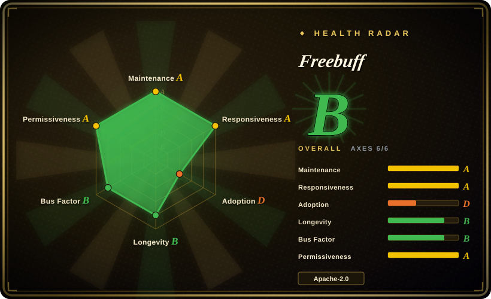
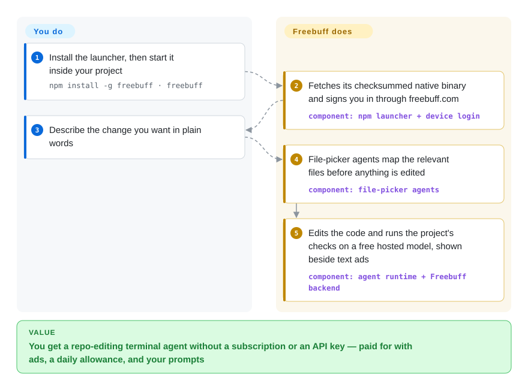

# Freebuff

You want a coding agent in your terminal, but every serious one asks for a $20/month subscription or an API key that bills per token. Freebuff gives you one for nothing: its company pays for the models and shows you text ads, with a daily allowance and region limits as the catch.

## When to use

You are a student, a hobbyist, or a developer in a team that will not expense another AI subscription, and you want to try agentic coding on a real repo tonight. The usual answers stall at the first screen: Codex wants an OpenAI subscription or API key, OpenCode and aider want you to paste a provider key and then watch a token meter, and Gemini CLI only gives you Google's models. You do not want to configure anything; you want `npm install -g freebuff`, `freebuff`, and a prompt like "add pagination to the orders API and fix the tests".

Reach for Freebuff in that situation. It is the open client half of Codebuff's multi-agent harness (file-picker agents, editor, reviewer, browser and research agents) wired to a hosted model catalog that its operator pays for with ads and paid upsells. Pick it over [Gemini CLI](gemini-cli.md) when you want several model families on a free plan instead of one vendor's; pick it over [OpenCode](opencode.md) or [aider](aider.md) when not managing a key or a bill matters more than controlling exactly where your code goes. The same CLI also has a `/byok` mode that sends requests straight to OpenRouter or any OpenAI-compatible endpoint with ads off — useful once you outgrow the free tier, but then you are choosing it on harness quality alone.

## How it works

The repository is a public mirror of a private source tree: the terminal client (an OpenTUI + React TUI), the `@codebuff/sdk` package, the agent runtime, and the agent definitions are here, while the backend, billing, web app and Desktop app are not. `npm install -g freebuff` installs a small launcher that downloads a platform binary and checks its SHA-256 (a fingerprint of the file) before running it. On first launch you sign in through freebuff.com in the browser. When you type a request, the root agent does not answer alone: it spawns helper agents — file pickers that map the relevant files, an editor, a reviewer — the way a site foreman sends people to measure before anyone cuts wood. Every model call goes through the Freebuff backend, which routes it to the model you picked, counts your daily "Freebucks" allowance, and serves text ads. What stays yours: the repository, the prompt, and the judgement about which commands are safe — the agent runs shell commands itself, and the only brake is an instruction in its prompt, not a permission prompt. In `/byok` mode the SDK skips the backend completely: no account, no analytics events, no ads, and no hosted web-research tools.

<!-- flow-steps:begin (generated from flows/freebuff.json by tools/flow_card.py — do not edit) -->

Text version of the flow

1. **You**: Install the launcher, then start it inside your project — `npm install -g freebuff · freebuff`
2. **Freebuff**: Fetches its checksummed native binary and signs you in through freebuff.com — component: `npm launcher + device login`
3. **You**: Describe the change you want in plain words
4. **Freebuff**: File-picker agents map the relevant files before anything is edited — component: `file-picker agents`
5. **Freebuff**: Edits the code and runs the project's checks on a free hosted model, shown beside text ads — component: `agent runtime + Freebuff backend`

**Value**: You get a repo-editing terminal agent without a subscription or an API key — paid for with ads, a daily allowance, and your prompts

<!-- flow-steps:end -->

## When NOT to use

- **Your code or prompts must not leave a controlled boundary.** The README's data-use notice says Freebuff uses prompts, code, files and agent traces to provide the service, may analyze prompts to personalize ads, and that some models (the "Space Bunny Alpha" stealth model is named) retain prompts or allow training. Use [aider](aider.md) or [OpenCode](opencode.md) with a provider you already have a data agreement with, or [Codex](codex.md) under an OpenAI business plan, instead of the free Freebuff tier, because their data path is the one your company signed.
- **You need enforced guardrails on shell commands.** There is no approval gate, read-only mode or project-directory jail: the `run_terminal_command` tool only tells the model to ask before risky commands, and issue #1450 (2026-09-29) reports the agent deleting most of a repository without asking. Use [Codex](codex.md) or [Open Interpreter](open-interpreter.md) instead of Freebuff, because they run commands inside an OS sandbox that the model cannot talk its way out of.
- **You are outside the "full access" regions, or behind a VPN or corporate proxy.** Those users get "limited" mode: a handful of cheaper models and 25 Freebucks a day (20 on a VPN), per the README. Use [Gemini CLI](gemini-cli.md) with a personal Google account, or [OpenCode](opencode.md) with your own key, instead of Freebuff, because their quota does not depend on the country your IP resolves to.
- **You need a stable model contract for repeatable work.** The catalog rotates (the README notes DeepSeek V4 Pro was retired and replaced), models may be served quantized (Q8_0), and "free" models are priced in an internal currency that the operator can reprice. Use [aider](aider.md) or [OpenCode](opencode.md) pinned to a specific provider model instead of Freebuff, because the model then changes only when you change it.
- **You want to self-host the whole stack or fork the product.** Only the client, SDK, runtime and agents are public; CONTRIBUTING says the private repo is the source of truth, PRs are hand-ported rather than merged, and backend/billing code is refused. Issue #1441 reports an account suspended after running a community-patched build against the free service. Use [OpenCode](opencode.md) or [Kilo Code](../ide-agents/kilocode.md) instead of Freebuff, because their open code is the whole product and you can run your fork without asking anyone.
- **You want the agent inside your editor.** This page is the terminal client; the Desktop/Web/Cloud products are closed. Use [Kilo Code](../ide-agents/kilocode.md) or [Cline](../ide-agents/cline.md) instead of Freebuff, because they live in VS Code with diffs you approve inline.

## Comparison

| Alternative | In index | Our verdict | Tradeoff |
|---|---|---|---|
| [Gemini CLI](gemini-cli.md) | ✅ | For a free terminal agent where Google's models are acceptable, pick Gemini CLI; pick Freebuff when you want several model families and a multi-agent harness on the free plan. | Gemini CLI's free tier is tied to a personal Google account but carries no ads; Freebuff spreads you across many vendors' models and pays for it with ads, region tiers and prompt analysis. |
| [OpenCode](opencode.md) | ✅ | When you will bring your own provider key and want the client to be the whole open product, pick OpenCode; pick Freebuff when the point is not paying or configuring a key at all. | OpenCode means a token bill but a data path you choose; Freebuff is zero-setup and zero-cost, but the backend that routes your prompts is closed. |
| [aider](aider.md) | ✅ | For git-native pair programming with any model you choose, pick aider; pick Freebuff when you want an agent that plans and spawns helpers rather than a commit-per-change pair programmer. | aider auto-commits every change so undo is a git command, and dates from 2023, though its last push was 2026-05-22; Freebuff does more on its own per prompt but gives you no command approval gate. |
| [Codex](codex.md) | ✅ | If you already pay OpenAI or need an OS sandbox around shell commands, pick Codex; pick Freebuff when no subscription is the hard constraint. | Codex enforces its sandbox in the OS; Freebuff's safety is a line in the prompt, and its free models come from a shifting catalog. |
| [Kilo Code](../ide-agents/kilocode.md) | ✅ | When you want a BYOK agent inside VS Code with an open code base you can fork, pick Kilo Code; pick Freebuff when you live in the terminal and want hosted models without a key. | Kilo Code costs you a provider bill and an IDE; Freebuff costs you ads and a closed backend. |

## Tech stack

- **TypeScript monorepo on Bun** (`packageManager: bun@1.3.14`): workspaces `cli/`, `sdk/`, `common/`, `agents/`, `packages/agent-runtime`, `packages/code-map`, `packages/llm-providers`, `freebuff/`, `evals/`.
- **TUI:** OpenTUI + React 19 (`cli/`), shipped as a compiled native binary per platform (darwin/linux/win32, x64/arm64, plus a no-AVX2 `darwin-x64-baseline` build).
- **SDK:** `@codebuff/sdk` 0.10.x (`CodebuffClient.run`, custom agents via `AgentDefinition`, custom tools with Zod schemas, `loadLocalAgents` from `.agents/`).
- **Agents:** TypeScript agent definitions (`base2`/`base3` roots, file-picker, code-reviewer, browser-use, researcher, thinker); programmatic agents use `handleSteps` generators that the runtime evals in-process.
- **Code map:** tree-sitter (`packages/code-map`, a `tree-sitter.wasm` ships next to the binary).

## Dependencies

- **Node.js ≥ 16** for the npm launcher; it downloads the native binary from the Codebuff release endpoint.
- **A Freebuff account** (browser device-code login at freebuff.com) and network access to the hosted backend for normal use — the models, the allowance accounting and the ads all live there.
- **For `/byok`:** an OpenRouter key or any OpenAI-compatible endpoint (including a local server); then no Freebuff account is needed, but hosted tools such as web research are disabled.
- **To build from source:** Bun 1.3.14; running the full dev stack (`bun up`) needs Docker and a configured `.env.local`.

## Ops difficulty

**Low** for the user: one npm install, one browser login, and the launcher updates itself. There is no server to run. The hidden operational cost is that you depend on someone else's capacity and policy: outages and daily-limit problems are explicitly "operational" and routed to Discord rather than tracked as issues, and model availability, regions and prices change without a release on your side. Building from source is **medium** (Bun, Docker for the dev services), and a self-built client is not guaranteed to be accepted by the free service.

## Health & viability

- **Maintenance:** Grade A — very active as of 2026-10-01: last push the same day, the `freebuff` npm package at 0.2.11 after ~195 versions since 2026-03-09, and the `codebuff` CLI at 1.0.688 (2026-09-08). GitHub Releases are stale (last a 2025-10 staging build); npm is the real release channel.
- **Governance / bus factor:** Grade B (top-3 share 97%) — a single vendor, CodebuffAI. The public repo is an export of a private one (top committer is `github-actions[bot]`); among humans, three engineers (`jahooma`, `charleslien`, `brandonkachen`) account for almost all commits. Roadmap and backend are private.
- **Longevity:** Grade B — the repo dates from 2024-07-09 as Codebuff and was renamed to Freebuff, so the codebase is ~2.2 years old and still active — a modest Lindy prior. The free product depends on an ad-plus-upsell business model that is itself only months old; the open client survives a shutdown, the free models do not.
- **Responsiveness:** Grade A — median first response 8.5 h over 39 qualifying issues; in three sampled threads (#1443, #1463, #1468) the first replies came from other users, not maintainers.
- **Adoption:** Grade D on the scorer, which only saw GitHub release-asset downloads; the real channel is npm: ~13.1k stars and ~1.4k forks; the `freebuff` npm package had ~99k downloads in the month to 2026-09-29, versus ~6k for `codebuff` and ~2k for `@codebuff/sdk` — people use the free CLI, few build on the SDK.
- **Risk / License:** Grade A for the root Apache-2.0, but license metadata disagrees (root `LICENSE` and the SDK `package.json` say Apache-2.0; the `freebuff`/`codebuff` npm packages and the sub-READMEs say MIT); npm publishes with `provenance: false`; sponsored "agentic offers" can run an advertiser's procedure in your working copy after consent; issues untouched for 28 days are auto-closed by a bot.

## Caveats (unverified)

- [推断] The repo was renamed from `CodebuffAI/codebuff` to `CodebuffAI/freebuff` around March 2026; only the redirect (`gh api repos/CodebuffAI/codebuff` returns `freebuff`) and the `freebuff` npm package's first publish (2026-03-09) were checked, not the rename date itself.
- [未验证] Whether the free tier's model list, Freebucks prices and regional split still match the README on the day you read this; they are operator policy, not code, and change without a tagged release.
- [未验证] The npm package README's "5–10× speed up" and "3–5× tokens per second compared to Claude" claims; no benchmark was found in the repo to check them.
- [未验证] Why the account in issue #1441 was suspended; the reporter attributes it to running a community-fixed `-dev` build, and no maintainer answer was posted as of 2026-10-01.
- [推断] That `/byok` mode sends nothing to Freebuff servers beyond the model provider: the SDK runtime stubs analytics, the agent registry and hosted fetches when BYOK is set, but the CLI's own update check and ad modules were not traced end to end.
- [未验证] How the private backend chooses and routes models (including quantization) for a given request; that code is not in the public repo.
- [未验证] Which license actually governs the published npm binaries given the Apache-2.0 vs MIT mismatch; read the license shipped inside the package you install.
