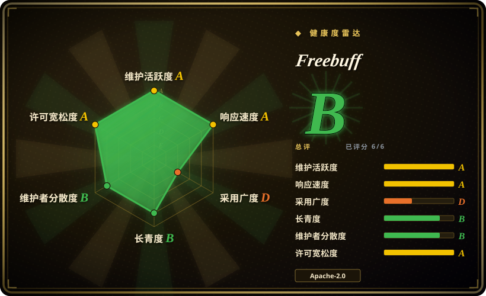
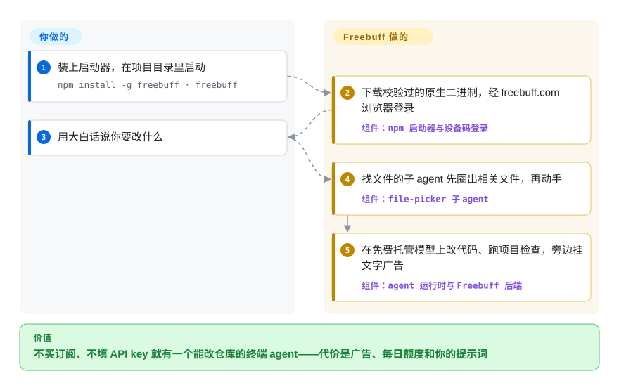

# Freebuff

想在终端里用上编码 agent，正经的几家不是要每月 20 美元订阅，就是要一把按 token 计费的 API key。Freebuff 让你白用：模型钱由它家公司出，换你看文字广告，代价是每日额度和按地区分档。

## 何时使用

你是学生、业余开发者，或者所在团队不肯再报销一份 AI 订阅，你今晚就想在真实仓库上试试 agent 写代码。常见选项第一步就卡住：Codex 要 OpenAI 订阅或 API key，OpenCode 和 aider 要你先贴一把供应商 key、再盯着 token 计费，Gemini CLI 只给你 Google 一家的模型。你什么都不想配，只想 `npm install -g freebuff`、`freebuff`，然后说一句“给订单接口加分页，顺便把测试修好”。

这种时候想到 Freebuff。它是 Codebuff 多 agent 框架的开源客户端那一半（找文件的子 agent、改代码的、审代码的、浏览器和调研 agent），接到一个由运营方用广告和付费升级来买单的托管模型目录上。想在免费档里用到好几家的模型、而不是一家厂商的，选它而不是 [Gemini CLI](gemini-cli.zh.md)；不想管 key、不想管账单这件事，比精确控制代码流向更重要时，选它而不是 [OpenCode](opencode.zh.md) 或 [aider](aider.zh.md)。同一个 CLI 还带 `/byok` 模式，请求直接发到 OpenRouter 或任何 OpenAI 兼容端点、广告关闭——免费档不够用时有用，但那时你选它就只是看框架本身好不好了。

## 怎么用起来

这个仓库是一份私有源码树的公开镜像：终端客户端（OpenTUI + React 写的 TUI）、`@codebuff/sdk`、agent 运行时和 agent 定义在这里，后端、计费、网页版和桌面版不在。`npm install -g freebuff` 装的是一个小启动器，它下载对应平台的二进制，先核对 SHA-256（文件的指纹）再运行。第一次启动会让你在浏览器里经 freebuff.com 登录。你提一个需求，根 agent 不是自己埋头答：它派出帮手——先圈出相关文件的 file-picker、改代码的、审代码的——就像工头先派人去量尺寸，再让人下锯。每一次模型调用都经过 Freebuff 后端，由它转给你选的模型、扣你当天的“Freebucks”额度、投放文字广告。留给你的是：仓库、提示词，以及判断哪些命令安全——agent 自己会跑 shell 命令，唯一的刹车是写在它提示词里的一句话，不是一个确认弹窗。在 `/byok` 模式下 SDK 完全绕开后端：不要账号、不发分析事件、没有广告，托管的网页调研工具也一并不可用。

<!-- flow-steps:begin (generated from flows/freebuff.json by tools/flow_card.py — do not edit) -->

流程文字版

1. **你**：装上启动器，在项目目录里启动 — `npm install -g freebuff · freebuff`
2. **Freebuff**：下载校验过的原生二进制，经 freebuff.com 浏览器登录 — 组件：`npm 启动器与设备码登录`
3. **你**：用大白话说你要改什么
4. **Freebuff**：找文件的子 agent 先圈出相关文件，再动手 — 组件：`file-picker 子 agent`
5. **Freebuff**：在免费托管模型上改代码、跑项目检查，旁边挂文字广告 — 组件：`agent 运行时与 Freebuff 后端`

**价值**：不买订阅、不填 API key 就有一个能改仓库的终端 agent——代价是广告、每日额度和你的提示词

<!-- flow-steps:end -->

## 何时不用

- **代码或提示词不能离开受控边界。** README 的数据使用说明写明：Freebuff 会用提示词、代码、文件和 agent 轨迹来提供服务，可能分析提示词来做个性化广告；部分模型（点名了隐身模型“Space Bunny Alpha”）会保留提示词或允许用于训练。改用 [aider](aider.zh.md) 或 [OpenCode](opencode.zh.md) 接你已签数据协议的供应商，或在 OpenAI 企业方案下用 [Codex](codex.zh.md)，而不是 Freebuff 免费档，因为它们的数据路径就是你公司签过字的那条。
- **你需要对 shell 命令有强制护栏。** 它没有确认关卡、没有只读模式、也不把 agent 关在项目目录里：`run_terminal_command` 工具只是叮嘱模型高风险命令先问，issue #1450（2026-09-29）报告 agent 没问一声就删掉了仓库大半代码。改用 [Codex](codex.zh.md) 或 [Open Interpreter](open-interpreter.zh.md)，因为它们在操作系统沙箱里跑命令，模型说什么也出不去。
- **你不在“完整访问”地区，或者挂着 VPN、公司代理。** 按 README，这些用户只拿到“受限”模式：几个便宜模型，每天 25 Freebucks（VPN 下 20）。改用个人 Google 账号的 [Gemini CLI](gemini-cli.zh.md)，或自带 key 的 [OpenCode](opencode.zh.md)，因为它们的额度不看你的 IP 落在哪个国家。
- **你需要稳定的模型契约来做可复现的工作。** 模型目录会轮换（README 写了 DeepSeek V4 Pro 已下架、被替换），模型可能以量化版（Q8_0）提供，“免费”模型用一种内部货币计价，运营方随时可以改价。改用钉死某个供应商模型的 [aider](aider.zh.md) 或 [OpenCode](opencode.zh.md)，因为那样模型只在你自己改的时候才变。
- **你想自托管整套，或者 fork 这个产品。** 公开的只有客户端、SDK、运行时和 agent；CONTRIBUTING 写明私有仓库才是事实源，PR 是手工移植而不是合并，后端和计费代码一律不收。issue #1441 报告有人用社区修补版客户端连免费服务后账号被封。改用 [OpenCode](opencode.zh.md) 或 [Kilo Code](../ide-agents/kilocode.zh.md)，因为它们公开的代码就是完整产品，你 fork 了就能自己跑，不用请示谁。
- **你要的是编辑器里的 agent。** 本页是终端客户端；桌面版、网页版、Cloud 都是闭源的。改用 [Kilo Code](../ide-agents/kilocode.zh.md) 或 [Cline](../ide-agents/cline.zh.md)，因为它们住在 VS Code 里，改动以 diff 形式逐条由你批准。

## 横向对比

| 替代品 | 是否收录 | 我们的评价 | 取舍 |
|---|---|---|---|
| [Gemini CLI](gemini-cli.zh.md) | 已收录 | 要免费的终端 agent、且只用 Google 模型也能接受时，选 Gemini CLI；想在免费档里用到好几家模型和一套多 agent 框架时，选 Freebuff。 | Gemini CLI 的免费档绑个人 Google 账号，但没有广告；Freebuff 让你横跨多家厂商的模型，代价是广告、地区分档和提示词分析。 |
| [OpenCode](opencode.zh.md) | 已收录 | 你愿意自带供应商 key、并希望客户端本身就是完整开源产品时，选 OpenCode；重点就是不花钱、不配 key 时，选 Freebuff。 | OpenCode 要付 token 账单，但数据走哪条路由你定；Freebuff 零配置零成本，但转发你提示词的后端是闭源的。 |
| [aider](aider.zh.md) | 已收录 | 要 git 原生、随你挑模型的结对编程，选 aider；想要一个会自己规划、派帮手的 agent，而不是每改一处提交一次的结对工具，选 Freebuff。 | aider 每次改动都自动提交，撤销就是一条 git 命令，项目始于 2023 年，但最后一次推送是 2026-05-22；Freebuff 每个提示自己做得更多，却没有命令确认关卡。 |
| [Codex](codex.zh.md) | 已收录 | 你已经在给 OpenAI 付钱，或者需要给 shell 命令套操作系统沙箱时，选 Codex；“不订阅”是硬约束时，选 Freebuff。 | Codex 的沙箱由操作系统强制；Freebuff 的安全只是提示词里的一句话，免费模型还来自一个不断变动的目录。 |
| [Kilo Code](../ide-agents/kilocode.zh.md) | 已收录 | 想在 VS Code 里用自带 key 的 agent、并且代码能整套 fork，选 Kilo Code；常驻终端、想不带 key 用托管模型，选 Freebuff。 | Kilo Code 的代价是供应商账单和一个 IDE；Freebuff 的代价是广告和闭源后端。 |

## 技术栈

- **基于 Bun 的 TypeScript monorepo**（`packageManager: bun@1.3.14`）：工作区有 `cli/`、`sdk/`、`common/`、`agents/`、`packages/agent-runtime`、`packages/code-map`、`packages/llm-providers`、`freebuff/`、`evals/`。
- **TUI：** OpenTUI + React 19（`cli/`），按平台编译成原生二进制发布（darwin/linux/win32，x64/arm64，另有给不支持 AVX2 的老 Intel Mac 用的 `darwin-x64-baseline`）。
- **SDK：** `@codebuff/sdk` 0.10.x（`CodebuffClient.run`，用 `AgentDefinition` 自定义 agent，用 Zod schema 自定义工具，`loadLocalAgents` 从 `.agents/` 加载）。
- **Agent：** TypeScript 写的 agent 定义（`base2`／`base3` 根 agent、file-picker、code-reviewer、browser-use、researcher、thinker）；程序化 agent 用 `handleSteps` 生成器，运行时在本进程里直接 eval。
- **代码地图：** tree-sitter（`packages/code-map`，二进制旁边附带 `tree-sitter.wasm`）。

## 依赖

- **Node.js ≥ 16**，给 npm 启动器用；它从 Codebuff 的发布端点下载原生二进制。
- **一个 Freebuff 账号**（在 freebuff.com 做浏览器设备码登录），日常使用还要能连上托管后端——模型、额度记账和广告都在那里。
- **用 `/byok` 时：** 一把 OpenRouter key，或任何 OpenAI 兼容端点（本地服务也行）；这时不需要 Freebuff 账号，但网页调研这类托管工具会被禁用。
- **从源码构建：** Bun 1.3.14；跑完整开发栈（`bun up`）还要 Docker 和配置好的 `.env.local`。

## 运维难度

对使用者是**低**：一次 npm 安装、一次浏览器登录，启动器自己更新，没有要跑的服务。隐藏的运维成本是你依赖别人的容量和政策：宕机和每日额度问题被明确归为“运营问题”，引导去 Discord 而不在 issue 里跟踪；模型可用性、地区和价格的变化不需要你这边发版。从源码构建是**中**（Bun、开发服务要 Docker），而且自己编译的客户端不保证被免费服务接受。

## 健康度与可持续性

- **维护：** A 档——截至 2026-10-01 非常活跃：当天还有推送；`freebuff` npm 包自 2026-03-09 起发了约 195 个版本，到 0.2.11；`codebuff` CLI 在 1.0.688（2026-09-08）。GitHub Releases 早已停更（最后一个是 2025-10 的 staging 构建），npm 才是真实发布渠道。
- **治理／bus factor：** B 档（前三人占 97%）——单一厂商 CodebuffAI。公开仓库是私有仓库的导出（提交数第一的是 `github-actions[bot]`）；人类提交几乎全来自三位工程师（`jahooma`、`charleslien`、`brandonkachen`）。路线图和后端都不公开。
- **长期性：** B 档——仓库创建于 2024-07-09，原名 Codebuff，后改名 Freebuff，代码库约 2.2 年且仍活跃——Lindy 先验中等。免费产品靠“广告 + 付费升级”的商业模式，这个模式本身才几个月；公司关停时开源客户端还在，免费模型不在。
- **响应：** A 档——39 个合格 issue 的首次响应中位数 8.5 小时；抽看的三个帖子（#1443、#1463、#1468）里，最先回复的是其他用户而不是维护者。
- **采用度：** 评分器给 D 档，它只看到了 GitHub release 附件下载量；真实渠道是 npm：约 13.1k star、1.4k fork；截至 2026-09-29 的一个月里 `freebuff` npm 包下载约 9.9 万次，`codebuff` 约 6 千，`@codebuff/sdk` 约 2 千——人们在用免费 CLI，基于 SDK 二次开发的很少。
- **风险／许可证：** 根目录 Apache-2.0 拿 A 档，但许可证元数据互相打架（根目录 `LICENSE` 和 SDK 的 `package.json` 是 Apache-2.0，`freebuff`／`codebuff` npm 包和子目录 README 写 MIT）；npm 发布设置 `provenance: false`；赞助的“agentic offer”在你同意后可以在你的工作副本里执行广告主的流程；28 天没动静的 issue 会被机器人自动关闭。

## 存疑（未验证）

- [推断] 仓库约在 2026 年 3 月从 `CodebuffAI/codebuff` 改名为 `CodebuffAI/freebuff`；只核对了重定向（`gh api repos/CodebuffAI/codebuff` 返回 `freebuff`）和 `freebuff` npm 包首次发布时间（2026-03-09），没查到改名的确切日期。
- [未验证] 免费档的模型列表、Freebucks 价格和地区划分在你读到时是否还和 README 一致；这些是运营方的政策而不是代码，改动不需要打 tag。
- [未验证] npm 包 README 里“提速 5–10 倍”“每秒 token 数是 Claude 的 3–5 倍”的说法；仓库里没找到能核对的基准测试。
- [未验证] issue #1441 里那个账号为什么被封；报告者归因于跑了社区修补的 `-dev` 构建，截至 2026-10-01 维护者没有回复。
- [推断] `/byok` 模式除模型供应商外不向 Freebuff 服务器发送任何东西：设置 BYOK 后 SDK 运行时会把分析、agent 注册表和托管请求换成空实现，但 CLI 自己的更新检查和广告模块没有端到端追踪。
- [未验证] 私有后端针对一次请求如何挑选和路由模型（包括是否量化）；这部分代码不在公开仓库。
- [未验证] 鉴于 Apache-2.0 和 MIT 的不一致，发布到 npm 的二进制实际受哪份许可证约束；以你所装包内附带的许可证为准。
