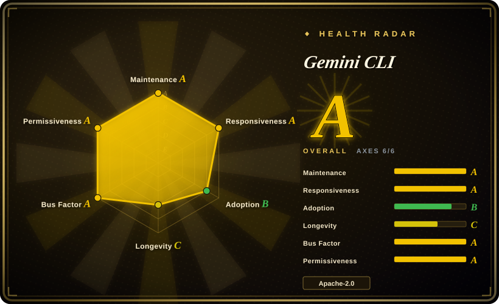
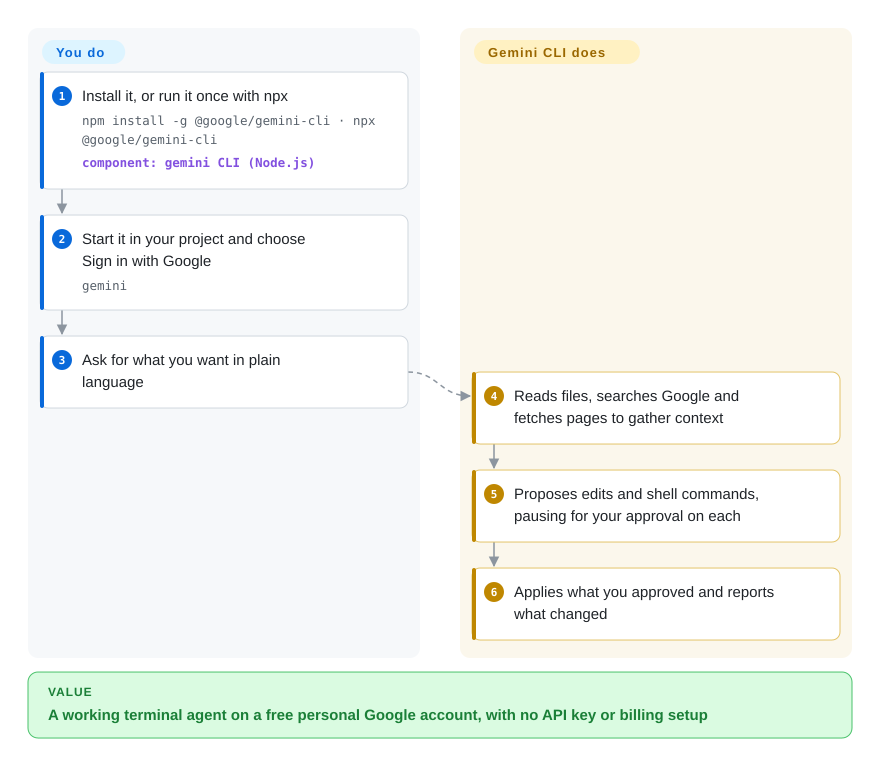

# Gemini CLI

You want an AI agent that reads your whole repo and runs commands from the terminal, but every option seems to start with "paste your API key" and a monthly bill. Gemini CLI is Google's open-source terminal agent that you sign into with an ordinary Google account and use for free within a daily quota, with Gemini's very large context window for big codebases.

## When to use

You're a developer — a student, a hobbyist, or someone whose employer hasn't bought an AI tool yet — and you want to ask "summarise every change that went into this repo yesterday" or "write a Discord bot that answers from this FAQ.md" and have the agent actually open files, search the web, and run shell commands. You don't want to manage API keys or a credit card for an experiment. You run `npx @google/gemini-cli`, choose *Sign in with Google*, and get the free tier (the README states 60 requests/minute and 1,000/day) with Gemini models and a 1M-token context, which matters when the question spans a large codebase. Later the same tool scripts into CI with `gemini -p "…" --output-format json`, plugs into GitHub through the `run-gemini-cli` Action, or is driven by other front-ends over ACP (`gemini --acp`).

Pick it over [Codex](codex.md) when you have no paid ChatGPT plan and want the no-cost path; over [OpenCode](opencode.md) when you would rather sign in once with Google than configure provider keys; over Claude Code (not indexed) when you need the agent's source under Apache-2.0. The deciding tradeoff: the cheapest way into a capable terminal agent and the biggest context window, in exchange for being Gemini-only and having its sandbox switched off by default.

## How it works

Gemini CLI is a Node.js program with an interactive terminal UI. You type a request; it sends the request, your project's `GEMINI.md` context file (persistent instructions for this repo), and the definitions of its built-in tools to a Gemini model. The model replies by calling tools — read or write a file, run a shell command, fetch a URL, or search Google ("grounding": letting the model cite fresh search results instead of guessing from memory) — and the CLI runs them and feeds the results back until the task is done. By default every tool call waits for your approval; `--approval-mode auto_edit` approves file edits only, and `--yolo` approves everything (and turns on the sandbox by default). Sandboxing — running commands inside macOS Seatbelt or a Docker/Podman container so they cannot touch the rest of your machine — is **off** unless you pass `-s` or set `GEMINI_SANDBOX`. Think of it as a capable intern who asks before every action unless you hand over the keys. It does the loop, the tools, checkpointing and MCP plumbing (MCP, the Model Context Protocol, is a plug format for adding external tools); you choose the login, write `GEMINI.md`, approve actions, and decide whether to sandbox.

<!-- flow-steps:begin (generated from flows/gemini-cli.json by tools/flow_card.py — do not edit) -->

Text version of the flow

1. **You**: Install it, or run it once with npx — `npm install -g @google/gemini-cli · npx @google/gemini-cli` — component: `gemini CLI (Node.js)`
2. **You**: Start it in your project and choose Sign in with Google — `gemini`
3. **You**: Ask for what you want in plain language
4. **Gemini CLI**: Reads files, searches Google and fetches pages to gather context
5. **Gemini CLI**: Proposes edits and shell commands, pausing for your approval on each
6. **Gemini CLI**: Applies what you approved and reports what changed

**Value**: A working terminal agent on a free personal Google account, with no API key or billing setup

<!-- flow-steps:end -->

## When NOT to use

- **You need to switch between OpenAI, Anthropic or local models.** Gemini CLI talks only to Gemini (via Google login, Gemini API key or Vertex AI). Use [OpenCode](opencode.md) for multi-provider work, or Qwen Code (not indexed) — a project that began as a Gemini CLI fork and now supports OpenAI, Anthropic, Gemini and local models.
- **You work offline or air-gapped.** There is no local-model path; every turn goes to Google's API. Use [OpenCode](opencode.md) or [Codex](codex.md) (`--oss` with Ollama / LM Studio) against a local model server instead.
- **You expect safe defaults on an unsandboxed machine.** The sandbox is opt-in; with `--yolo` or a broad `--allowed-tools`, shell commands run with your user's rights. If you can't enforce `-s` or a system settings file, prefer [Codex](codex.md), whose OS sandbox is on by default, or keep agents in CI with [gh-aw](../orchestration-and-review/gh-aw.md).
- **Your code may not leave the company under consumer terms.** The free tier rides on a personal Google account; organisations should use Vertex AI or a paid Gemini Code Assist licence and lock settings down with the system settings file (login-domain restriction, tool allowlists, enforced sandbox, OpenTelemetry export). The enterprise guide itself warns these are guardrails against accidents, not a security boundary against a determined local admin. If you need a hard server-side boundary, run agents in CI ([gh-aw](../orchestration-and-review/gh-aw.md)) rather than on laptops.
- **You need complex multi-agent orchestration.** Gemini CLI is one agent per session; for supervising several agents across machines use [OpenHands](../orchestration-and-review/openhands.md) (which can drive Gemini CLI over ACP).

## Comparison

| Alternative | In index | Our verdict | Tradeoff |
| --- | --- | --- | --- |
| [Codex](codex.md) | ✅ | If you already pay for ChatGPT and want sandboxing on by default, pick Codex; if you want a free personal-account tier and a 1M-token context, pick Gemini CLI. | Codex sandboxes every command by default but is OpenAI-centric and closed to outside PRs; Gemini CLI accepts PRs and costs nothing to start, but its sandbox is opt-in. |
| [OpenCode](opencode.md) | ✅ | If you need to swap providers or run local models, pick OpenCode; if one Google login and Gemini's context window are enough, pick Gemini CLI. | OpenCode is provider-agnostic but you bring and pay for keys; Gemini CLI is single-vendor but free to try. |
| [Open Interpreter](open-interpreter.md) | ✅ | If your budget is cheap or open-weight models and you need a harness tuned for them, pick Open Interpreter; for Gemini models, pick Gemini CLI. | Open Interpreter (a Codex fork) works across providers with OS sandboxing; Gemini CLI has first-party Gemini tooling such as Search grounding. |
| Qwen Code | 未收录 | If you like Gemini CLI's workflow but need OpenAI, Anthropic, Qwen or local models, pick Qwen Code; stay on Gemini CLI for the official Google tooling and free tier. | Qwen Code forked from Gemini CLI v0.8.2 and diverged; you gain providers but lose upstream fixes and Google-specific features. |
| Claude Code | 未收录 | If your team standardises on Anthropic models and accepts a closed-source binary, pick Claude Code; if you need an open-source agent with a free tier, pick Gemini CLI. | Claude Code is closed-source and subscription-based; Gemini CLI is Apache-2.0 but Gemini-only. |

## Tech stack

- **TypeScript on Node.js ≥ 20** — monorepo (`packages/cli`, `core`, `sdk`, `a2a-server`, `vscode-ide-companion`); npm package `@google/gemini-cli`.
- **Gemini API / Vertex AI** — the only model back ends; Google OAuth, Gemini API key or Vertex credentials.
- **Built-in tools** — file system, shell, web fetch, Google Search grounding; MCP client configured in `~/.gemini/settings.json`; extensions and custom slash commands.
- **Sandboxing (opt-in)** — macOS Seatbelt (`sandbox-exec`), Docker/Podman (prebuilt `gemini-cli-sandbox` image), plus `runsc`/`lxc` options.
- **Integrations** — headless mode with JSON / stream-JSON output, ACP mode, VS Code companion, GitHub Action, OpenTelemetry telemetry.

## Dependencies

- Node.js 20+ with npm/npx (or Homebrew, MacPorts, conda-provided Node).
- A Google account for the free tier, or a Gemini API key, or a Google Cloud project with Vertex AI / a Code Assist licence.
- Internet access to Google's APIs on every turn.
- Docker or Podman only if you enable container sandboxing.

## Ops difficulty

**Low** for one developer: `npm install -g @google/gemini-cli`, run `gemini`, sign in. Expect weekly stable releases (Tuesdays, plus preview and nightly channels), so pin a version in CI. **Medium** in a company: to make it governable you deploy a system `settings.json` (and possibly a wrapper script that forces it), restrict login domains, allowlist tools and MCP servers, enforce sandboxing, and route telemetry to your collector with prompt logging off.

## Health & viability

- **Maintenance (2026-10-08):** very active — commits every week of the last quarter, nightly builds daily and a stable v0.63.0 on 2026-10-06 on a fixed weekly train.
- **Responsiveness:** now measurable and strong — the radar's responsiveness axis moved from unscored to A in this refresh, and the overall grade rose from B to A.
- **Governance / bus factor:** Google-owned roadmap, but the commit history is broad (79 active contributors in the past year; the top three hold about 20%), and the project accepts outside PRs under a public roadmap.
- **Backing & longevity:** the repo is about 18 months old (created 2025-04), so the Lindy prior is weak. Google has a record of retiring developer products, but this CLI is tied to its Gemini Code Assist offering. [推断]
- **Adoption & risk:** ~107k stars and 1,703,850 npm downloads last month (2026-10-09); Apache-2.0 with no relicense. The main risk is free-tier terms and quotas changing at Google's discretion.

## Caveats (unverified)

- [未验证] The free-tier quotas (60 requests/minute, 1,000/day) are as stated in the README on 2026-10-08; Google can change them, and they may differ by model.
- [未验证] How prompts and code sent under the free personal-account tier are used for model training was not checked; read the linked Terms & Privacy before using it on private code.
- [推断] Long-term commitment depends on Google keeping Gemini Code Assist as a product; inferred from the auth options, not from any public commitment.
- [未验证] The quality and security of third-party MCP servers and extensions were not reviewed.
