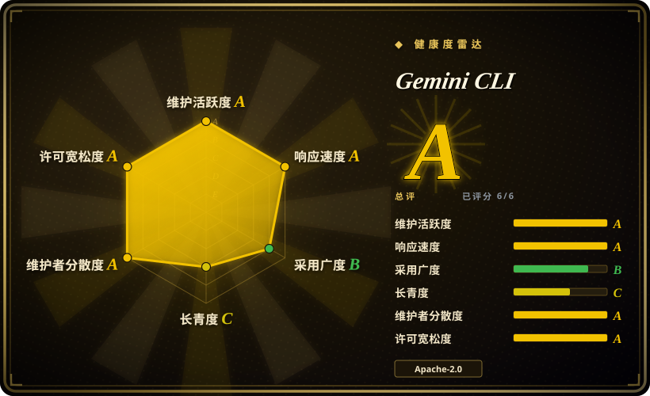
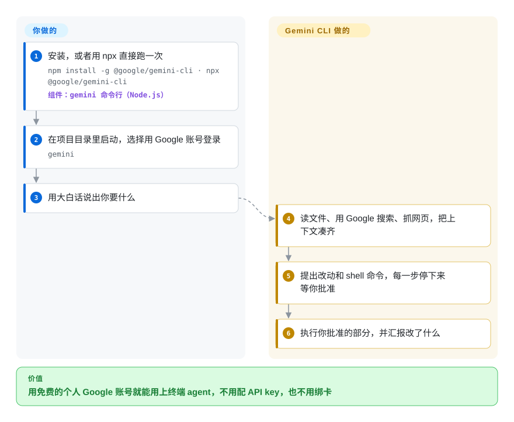

# Gemini CLI

你想要一个能读完整个仓库、在终端里跑命令的 AI agent，可每个选项的第一步似乎都是“粘贴你的 API key”，接着就是月账单。Gemini CLI 是 Google 开源的终端 agent：用普通 Google 账号登录，在每日额度内免费用，还带着 Gemini 超大的上下文窗口，适合大代码库。

## 何时使用

你是一名开发者——学生、业余爱好者，或者公司还没采购 AI 工具的上班族——想问一句“把这个仓库昨天合进来的所有改动总结一下”或者“照着这份 FAQ.md 写个 Discord 机器人”，然后让 agent 真的去打开文件、上网搜索、执行 shell 命令。你不想为一次尝试去管 API key 或绑信用卡。你运行 `npx @google/gemini-cli`，选 *Sign in with Google*，就拿到免费额度（README 写的是每分钟 60 次、每天 1000 次请求），用的是 Gemini 模型和百万 token 的上下文——问题横跨一个大代码库时这一点很要紧。之后同一个工具还能用 `gemini -p "…" --output-format json` 写进 CI 脚本，通过 `run-gemini-cli` Action 接入 GitHub，或者被其他前端通过 ACP（`gemini --acp`）驱动。

如果你没有付费的 ChatGPT 订阅、想走零成本的路，选它而不是 [Codex](codex.zh.md)；如果你宁愿用 Google 登录一次、也不想配各家提供方的 key，选它而不是 [OpenCode](opencode.zh.md)；如果你需要 agent 源码以 Apache-2.0 公开，选它而不是 Claude Code（未收录）。决定性的取舍：上手一个能干活的终端 agent 最便宜的方式、外加最大的上下文窗口，代价是只能用 Gemini，而且沙箱默认是关的。

## 怎么用起来

Gemini CLI 是一个带交互式终端界面的 Node.js 程序。你输入请求，它把请求、项目里的 `GEMINI.md` 上下文文件（给这个仓库的长期指令）和内置工具的说明一起发给 Gemini 模型。模型以调用工具作答——读写文件、执行 shell 命令、抓取网址，或者用 Google 搜索（“grounding”：让模型引用最新的搜索结果，而不是凭记忆猜）——命令行执行这些工具并把结果喂回去，直到任务完成。默认每一次工具调用都要等你批准；`--approval-mode auto_edit` 只自动批准改文件，`--yolo` 全部自动批准（同时默认打开沙箱）。沙箱——把命令关在 macOS Seatbelt 或 Docker/Podman 容器里跑，碰不到机器的其他部分——除非你加 `-s` 或设置 `GEMINI_SANDBOX`，否则是**关着的**。打个比方：一个能干的实习生，每做一件事都先问你，除非你把钥匙交给他。循环、工具、断点存档和 MCP 管道（MCP 即 Model Context Protocol，一种给 agent 接外部工具的插头格式）由它负责；登录方式、`GEMINI.md`、批准哪些动作、要不要开沙箱，由你决定。

<!-- flow-steps:begin (generated from flows/gemini-cli.json by tools/flow_card.py — do not edit) -->

流程文字版

1. **你**：安装，或者用 npx 直接跑一次 — `npm install -g @google/gemini-cli · npx @google/gemini-cli` — 组件：`gemini 命令行（Node.js）`
2. **你**：在项目目录里启动，选择用 Google 账号登录 — `gemini`
3. **你**：用大白话说出你要什么
4. **Gemini CLI**：读文件、用 Google 搜索、抓网页，把上下文凑齐
5. **Gemini CLI**：提出改动和 shell 命令，每一步停下来等你批准
6. **Gemini CLI**：执行你批准的部分，并汇报改了什么

**价值**：用免费的个人 Google 账号就能用上终端 agent，不用配 API key，也不用绑卡

<!-- flow-steps:end -->

## 何时不用

- **你需要在 OpenAI、Anthropic 或本地模型之间切换。** Gemini CLI 只连 Gemini（通过 Google 登录、Gemini API key 或 Vertex AI）。多提供方的活用 [OpenCode](opencode.zh.md)，或者用 Qwen Code（未收录）——它最初是 Gemini CLI 的分支，现在支持 OpenAI、Anthropic、Gemini 和本地模型。
- **你在离线或物理隔离的环境里工作。** 它没有本地模型这条路，每一轮都要请求 Google 的 API。改用 [OpenCode](opencode.zh.md) 或 [Codex](codex.zh.md)（`--oss` 搭配 Ollama / LM Studio）接本地模型服务。
- **你指望在没有沙箱的机器上默认就安全。** 沙箱要手动开；用了 `--yolo` 或范围很宽的 `--allowed-tools`，shell 命令就以你的用户权限运行。如果你没法强制 `-s` 或系统级设置文件，优先选默认开启操作系统沙箱的 [Codex](codex.zh.md)，或者把 agent 放在 CI 里用 [gh-aw](../orchestration-and-review/gh-aw.zh.md)。
- **按消费者条款，你的代码不能离开公司。** 免费额度挂在个人 Google 账号上；组织应该用 Vertex AI 或付费的 Gemini Code Assist 许可，并用系统设置文件把配置锁死（限制登录域名、工具白名单、强制沙箱、OpenTelemetry 导出）。企业指南自己也提醒：这些是防误操作的护栏，挡不住一个有本机管理员权限、存心绕过的人。需要服务端硬边界，就把 agent 放在 CI 里跑（[gh-aw](../orchestration-and-review/gh-aw.zh.md)），而不是放在笔记本上。
- **你需要复杂的多 agent 编排。** Gemini CLI 一个会话就是一个 agent；要跨机器监管多个 agent，用 [OpenHands](../orchestration-and-review/openhands.zh.md)（它能通过 ACP 驱动 Gemini CLI）。

## 横向对比

| 替代品 | 是否收录 | 我们的评价 | 取舍 |
| --- | --- | --- | --- |
| [Codex](codex.zh.md) | ✅ | 如果你已经在付 ChatGPT、想要默认开启的沙箱，选 Codex；如果你想要个人账号的免费额度和百万 token 上下文，选 Gemini CLI。 | Codex 默认给每条命令上沙箱，但以 OpenAI 为中心、也不接受外部 PR；Gemini CLI 接受 PR、零成本起步，但沙箱要手动开。 |
| [OpenCode](opencode.zh.md) | ✅ | 需要换提供方或跑本地模型，选 OpenCode；一个 Google 登录加 Gemini 的上下文窗口就够用，选 Gemini CLI。 | OpenCode 不绑定提供方，但 key 要自己带、钱要自己付；Gemini CLI 只认一家，但免费就能试。 |
| [Open Interpreter](open-interpreter.zh.md) | ✅ | 预算在便宜或开源权重模型上、需要专门为它们调过的外壳，选 Open Interpreter；用 Gemini 模型就选 Gemini CLI。 | Open Interpreter（Codex 的分支）跨提供方并带操作系统沙箱；Gemini CLI 有 Search grounding 这类 Gemini 官方工具。 |
| Qwen Code | 未收录 | 喜欢 Gemini CLI 的用法、但需要 OpenAI、Anthropic、Qwen 或本地模型，选 Qwen Code；想要 Google 官方工具和免费额度，留在 Gemini CLI。 | Qwen Code 从 Gemini CLI v0.8.2 分出来后独立发展；你多了提供方，但失去上游修复和 Google 专属功能。 |
| Claude Code | 未收录 | 如果团队统一用 Anthropic 模型、能接受闭源二进制，选 Claude Code；如果你需要带免费额度的开源 agent，选 Gemini CLI。 | Claude Code 闭源、按订阅收费；Gemini CLI 是 Apache-2.0，但只支持 Gemini。 |

## 技术栈

- **TypeScript，运行在 Node.js ≥ 20 上**——monorepo（`packages/cli`、`core`、`sdk`、`a2a-server`、`vscode-ide-companion`）；npm 包名 `@google/gemini-cli`。
- **Gemini API / Vertex AI**——唯一的模型后端；Google OAuth、Gemini API key 或 Vertex 凭据。
- **内置工具**——文件系统、shell、网页抓取、Google 搜索 grounding；MCP 客户端在 `~/.gemini/settings.json` 里配置；扩展和自定义斜杠命令。
- **沙箱（需手动开启）**——macOS Seatbelt（`sandbox-exec`）、Docker/Podman（预构建的 `gemini-cli-sandbox` 镜像），以及 `runsc`/`lxc` 选项。
- **集成**——带 JSON / stream-JSON 输出的无界面模式、ACP 模式、VS Code 配套插件、GitHub Action、OpenTelemetry 遥测。

## 依赖

- Node.js 20+ 及 npm/npx（或者 Homebrew、MacPorts、conda 提供的 Node）。
- 免费额度需要一个 Google 账号；或者 Gemini API key；或者开通了 Vertex AI / Code Assist 许可的 Google Cloud 项目。
- 每一轮都要能访问 Google 的 API。
- 只有开启容器沙箱时才需要 Docker 或 Podman。

## 运维难度

一个人用是**低**：`npm install -g @google/gemini-cli`，运行 `gemini`，登录即可。稳定版每周发一次（周二，另有 preview 和 nightly 通道），所以 CI 里要锁版本。公司里用是**中等**：要让它可管，你得下发一份系统级 `settings.json`（可能还要一个强制使用它的包装脚本）、限制登录域名、给工具和 MCP 服务器设白名单、强制沙箱，并把遥测发到自己的收集端、同时关掉提示词记录。

## 健康度与可持续性

- **维护（2026-10-08）：**非常活跃——上个季度每周都有提交，nightly 每天构建，稳定版 v0.63.0 于 2026-10-06 按固定的每周节奏发布。
- **响应度：**现在可以测量了，而且表现很好——本次刷新里雷达图的响应度一轴从“无法评分”变成 A，总评也从 B 升到 A。
- **治理与 bus factor：**路线图归 Google，但提交历史分布很广（过去一年 79 位活跃贡献者，前三名约占 20%），并在公开路线图下接受外部 PR。
- **背书与长期性：**仓库约 18 个月（创建于 2025-04），Lindy 先验很弱。Google 有下线开发者产品的前科，但这个命令行和它的 Gemini Code Assist 产品绑在一起。[推断]
- **采用度与风险：**约 10.7 万 star，上月 npm 下载 1,630,541 次；Apache-2.0，没有改过许可。主要风险是免费额度的条款和配额由 Google 说了算，随时可能变。

## 存疑（未验证）

- [未验证] 免费额度（每分钟 60 次、每天 1000 次）以 2026-10-08 的 README 为准；Google 可以调整，不同模型可能也不一样。
- [未验证] 在免费个人账号下发送的提示词和代码会不会被用于训练模型，没有核实；在私有代码上用之前，先读链接里的服务条款与隐私说明。
- [推断] 长期投入取决于 Google 是否保留 Gemini Code Assist 这个产品；这是从认证选项推断的，并非来自任何公开承诺。
- [未验证] 第三方 MCP 服务器和扩展的质量与安全性没有审查。
