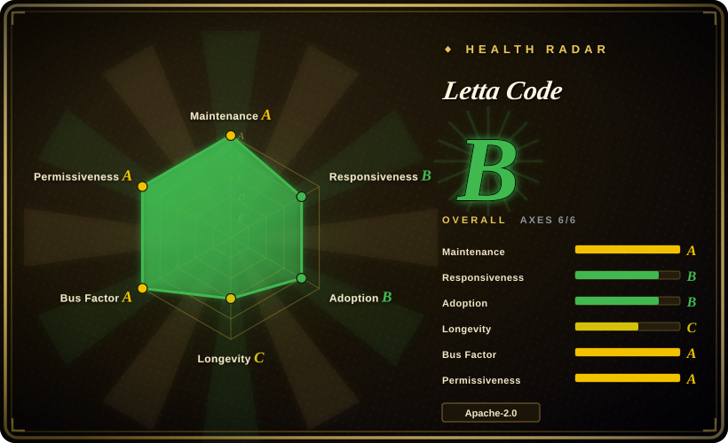
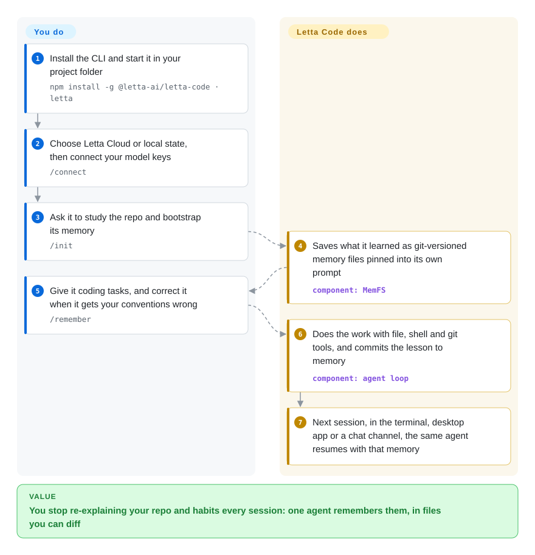

# Letta Code

Every new session with a coding agent starts from zero: you explain again that this repo uses pnpm, that the tests need a seeded database, that you want small diffs. Letta Code keeps one agent alive across sessions instead — it writes what it learns into git-versioned memory files and loads them back into its own prompt next time.

## When to use

You use a terminal coding agent every day, and it keeps making the same mistake: it runs `npm install` in a pnpm workspace, you correct it, and the next morning's session does it again because the correction lived only in yesterday's chat. A rules file such as `AGENTS.md` helps, but you are the one who has to notice the lesson and write it down.

Reach for Letta Code when you want the agent itself to own that loop. It is the maintained product from the MemGPT team (the retired [Letta V1 server](../../../agent-memory/app-memory/letta.md) pointed here): you talk to one long-lived agent, it rewrites its own "memory blocks" — sections of text pinned into its system prompt — when it learns something durable, and every change is a git commit you can read. Pick it over [OpenCode](opencode.md) or [Pi](pi.md) when cross-session learning is the deciding feature rather than provider breadth or a minimal core; pick it over adding [claude-mem](../../../agent-memory/coding-agent-memory/claude-mem.md) to Claude Code when you are willing to change agents to get memory that the agent edits itself rather than a log that is replayed to it.

## How it works

Letta Code is a TypeScript CLI (`letta`) that runs the agent loop on your machine with the usual coding tools — read, edit, patch, grep, shell, git worktrees. What makes it different is where the agent's state lives. Each agent has a memory folder called MemFS ("memory file system": plain files under git version control); part of it is compiled into the system prompt at the start of every turn, so the agent sees its own notes without having to search for them. **What Letta Code does for you:** it stores and versions that memory, lets the agent rewrite it when it learns something (or when you say `/remember …`), runs background "dreaming" passes — sub-agents that reread recent conversations and consolidate lessons — and keeps the same agent reachable from the terminal, the desktop app, a browser, or Slack/Telegram/Discord. **What you do:** install the CLI, decide where state is kept (Letta Cloud, the default, or local on your machine), connect your own model keys or a coding plan, and keep working with the agent instead of starting new ones. Think of it as a colleague who keeps a notebook in a git repo, not a tool you reconfigure every morning.

<!-- flow-steps:begin (generated from flows/letta-code.json by tools/flow_card.py — do not edit) -->

Text version of the flow

1. **You**: Install the CLI and start it in your project folder — `npm install -g @letta-ai/letta-code · letta`
2. **You**: Choose Letta Cloud or local state, then connect your model keys — `/connect`
3. **You**: Ask it to study the repo and bootstrap its memory — `/init`
4. **Letta Code**: Saves what it learned as git-versioned memory files pinned into its own prompt — component: `MemFS`
5. **You**: Give it coding tasks, and correct it when it gets your conventions wrong — `/remember`
6. **Letta Code**: Does the work with file, shell and git tools, and commits the lesson to memory — component: `agent loop`
7. **Letta Code**: Next session, in the terminal, desktop app or a chat channel, the same agent resumes with that memory

**Value**: You stop re-explaining your repo and habits every session: one agent remembers them, in files you can diff

<!-- flow-steps:end -->

## When NOT to use

- **You want the agent to behave the same way every day.** A Letta agent changes its own prompt, memory and skills as it works, so yesterday's behaviour is not a fixed baseline. Use [OpenCode](opencode.md) or [Codex](codex.md) instead, because their behaviour comes from configuration you edit, not from what the agent decided to remember.
- **Agent state must stay off vendor infrastructure without extra work.** Letta Cloud is the default unless you choose local on first launch, the source treats the local backend as the fallback mode, and self-hosted agents lose chat.letta.com access, remote computers, cross-machine secrets and automatic backups. Use [Hermes Agent](../../agent-runtimes/personal-assistants/hermes-agent.md) instead when self-hosting is the default, or [OpenCode](opencode.md) with a local model when you do not need persistent memory at all.
- **You want memory for the coding agent you already use.** Letta Code replaces your agent rather than adding to it. Use [claude-mem](../../../agent-memory/coding-agent-memory/claude-mem.md) for Claude Code instead, because it captures and replays sessions without changing the tool you work in.
- **You are building memory into your own application's agent loop.** Letta Code wants to be the runtime. Use [Mem0](../../../agent-memory/app-memory/mem0.md) or [LangMem](../../../agent-memory/app-memory/langmem.md) instead, because they add memory to a loop you keep control of.
- **You need a stable interface to script against.** It is 0.x and shipped 100 releases between 2026-07-23 and 2026-10-09, and features disappear as well as appear: AgentFile (`.af`) import/export was removed outright. Use [aider](aider.md) instead when a slower-moving, long-lived tool matters more than memory.
- **You need memory shared across several agents.** Memory belongs to one agent; open issue #2666 (2026-06) reports that a new agent starts from a blank slate whatever the other agents know. Use [Mem0](../../../agent-memory/app-memory/mem0.md) instead when several agents or tools must read one memory store.

## Comparison

| Alternative | In index | Our verdict | Tradeoff |
|---|---|---|---|
| [Hermes Agent](../../agent-runtimes/personal-assistants/hermes-agent.md) | ✅ | Choose Hermes when you want a self-hosted, always-on assistant on a VPS that also learns skills and memory; choose Letta Code when the agent mainly works in your repos and you want its memory versioned in git. | Hermes keeps two small capped memory files and defaults to your own host; Letta Code keeps a larger git-tracked memory tree and defaults to Letta Cloud. |
| [OpenCode](opencode.md) | ✅ | Choose OpenCode when you want a terminal agent you configure once and swap providers under freely; choose Letta Code when you want the agent to accumulate project knowledge by itself. | OpenCode is MIT, runs as a local process with no account required, and learns nothing across sessions unless you write it into rules files; Letta Code buys self-maintained memory at the price of a vendor account in the default path. |
| [Pi](pi.md) | ✅ | Choose Pi when you want a minimal agent whose behaviour comes from files you author; choose Letta Code when you want the agent to author and maintain those files itself. | Letta Code uses Pi's provider library (`@earendil-works/pi-ai`) for its local backend; Pi stays small and leaves memory to you, Letta Code adds memory, channels and a cloud service. |
| [claude-mem](../../../agent-memory/coding-agent-memory/claude-mem.md) | ✅ | Choose claude-mem when you are staying on Claude Code and want past sessions remembered; choose Letta Code when you will switch agents to get memory the agent rewrites itself. | claude-mem hooks your existing agent, compresses session activity into observations in a local store and injects them back; Letta Code is a whole agent runtime with self-edited memory blocks and dreaming. |
| [Letta (MemGPT)](../../../agent-memory/app-memory/letta.md) | ✅ | Do not adopt the retired Letta V1 server; choose Letta Code for anything new, and use the Letta page only to plan a migration. | The V1 Python server was archived in August 2026 with no security fixes; Letta Code is where the same team now ships. |

## Tech stack

- **TypeScript** CLI built and tested with **Bun** (`bun.lock`, `build.js`), published to npm as `@letta-ai/letta-code` with a bundled `npm-shrinkwrap.json`; a Nix flake is provided.
- **Terminal UI:** Ink (React for terminals) on React 18, `node-pty` for shell sessions, Shiki for code highlighting.
- **Agent plumbing:** `@letta-ai/letta-client` and `@letta-ai/letta-agent-sdk` for the Letta Cloud / App Server API; `@earendil-works/pi-ai` for model providers in the local backend; `@modelcontextprotocol/sdk` for MCP tools; `cron-parser` for schedules.
- **Memory:** MemFS, a git repository per agent; can be synced to your own GitHub remote with `/memory-repository set`.

## Dependencies

- **Node.js 22.19+** for the npm install (Bun 1.2.20+ only if you build from source).
- **A model:** your own API keys (Anthropic, OpenAI, Gemini, Bedrock and others), a coding plan you already pay for (ChatGPT/Codex, GitHub Copilot, Kimi, Z.ai and others), or a local endpoint (Ollama, LM Studio, llama.cpp) — all connected with `/connect`.
- **git** for MemFS.
- **Optional, Letta Cloud account:** free plan limited to 3 stateful agents; Pro ($20/month) for up to 20 agents, remote sandboxes and usage quota. Remote computers and secrets require signing in.
- **Optional:** bot tokens for Slack/Telegram/Discord channels; an always-on host if you self-host the App Server (`letta server --backend local`).

## Ops difficulty

**Low for one developer, medium once you self-host.** On a laptop it is one npm install, `/connect`, and a choice of backend; there is no database to run. Two settings deserve attention on day one: telemetry is on by default (set `LETTA_CODE_TELEM=0` or `DO_NOT_TRACK=1` to turn it off), and the backend choice decides whether your agent's memory and conversations sit in Letta Cloud. Self-hosting the App Server for always-on agents and chat channels means running and securing that process yourself, and backing up agent state by hand, because self-hosted agents are not backed up automatically. Expect frequent updates: releases land more than once a day.

## Health & viability

- **Maintenance A, and fast.** The default branch was pushed the day it was scored (2026-10-09), with commits in all of the last 13 weeks and 100 releases between 2026-07-23 and 2026-10-09 — more than one a day. That is momentum, and also churn you have to absorb.
- **Governance A — a funded vendor team, not a foundation.** 58 active contributors in 12 months, top-1 share 39% and top-3 73%; the top committer, `cpacker`, holds about 1,275 commits. The roadmap belongs to Letta, Inc., whose business is Letta Cloud, so expect the cloud path to stay the default.
- **Longevity C — young, but with a long-lived lineage.** The repository is 349 days old (created 2025-10-25). The team has shipped MemGPT/Letta since 2023, but it also retired its previous product (the V1 server) within months of launching this one; the Lindy prior here rests on the team, not on this codebase.
- **Responsiveness B on thin evidence.** The scorer found only 3 qualifying issues (median first response 232.4 hours, relaxed band). Issues and pull requests that do not follow the AI-usage disclosure policy are closed automatically, which keeps noise down but also filters out quick reports.
- **Adoption B.** 541,255 npm downloads in the scorer's last-month window, ~3.6k stars and 430 forks (2026-10-09); no dependent repositories, as expected for an end-user CLI.
- **Risk flags:** Apache-2.0 with no relicense, but the LICENSE excludes the Letta name, logo and ASCII art from the grant, so forks must rebrand; telemetry is on by default; free cloud accounts are capped at 3 agents.

## Caveats (unverified)

- [推断] The source (`src/backend/backend-mode.ts`, 2026-10-09) resolves to the cloud API unless local mode is configured and comments the local switch as an experimental env flag; the README presents local as a first-launch choice. How complete local mode is compared with the cloud was not tested.
- [未验证] Whether ordinary telemetry events are sent when you run in local mode; the code reviewed only gates error reports (with a debug-log tail) on cloud users.
- [未验证] How well self-edited memory holds up over months — drift, contradictions, prompt bloat. A `/doctor` command exists to audit memory placement and token usage, but no long-horizon measurement was found.
- [推断] Background dreaming appears to run automatically on macOS and Linux, inferred from the README note that it is disabled by default only on native Windows.
- [未验证] Whether agents and memories from a retired Letta V1 server can be migrated into Letta Code without loss.
- [推断] The docs now call the product "the Letta Harness (formerly Letta Code)"; the repository and npm package still use the Letta Code name as of 2026-10-09, so a rename may follow.
- [未验证] How much of the roughly 0.5–0.6M monthly npm downloads (541,255 in the scorer's window; 615,272 for 2026-09-08 to 2026-10-07 from the npm API) is auto-update or CI traffic rather than distinct users.
