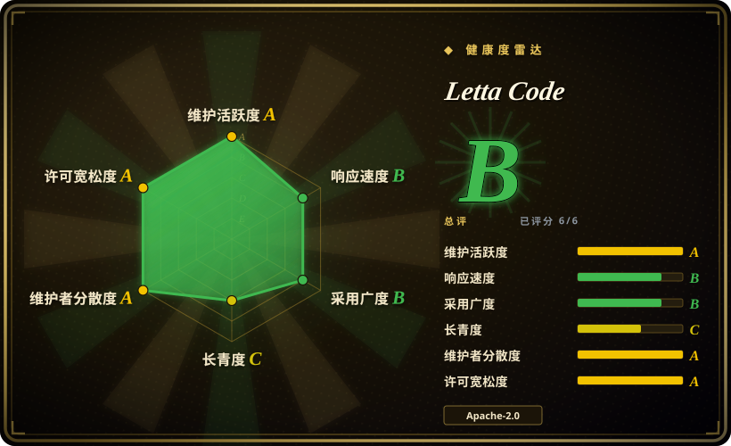
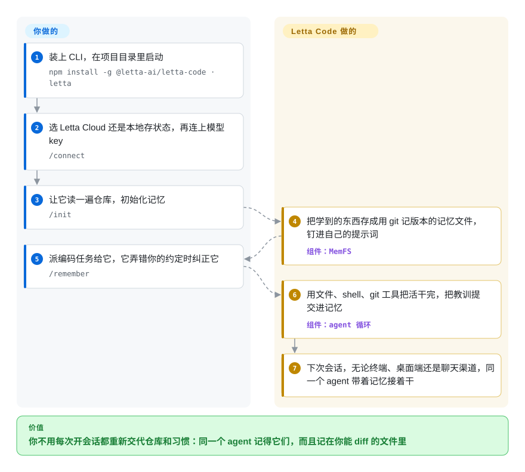

# Letta Code

每次新开编码 agent 的会话，它都不认识你：这个仓库用 pnpm、跑测试前要先灌好数据库、你只要小改动，又得从头讲一遍。Letta Code 让同一个 agent 跨会话一直活着——它把学到的东西写进用 git 记版本的记忆文件，下次启动时再放回自己的提示词里。

## 何时使用

你每天都在终端里用编码 agent，它老犯同一个错：在 pnpm 工作区里跑 `npm install`，你纠正了，第二天早上新开的会话照犯不误，因为那句纠正只活在昨天的聊天记录里。`AGENTS.md` 这类规则文件能缓解，但发现教训、动手写下来的那个人还是你。

想让 agent 自己接过这件事时，就想到 Letta Code。它是 MemGPT 团队还在维护的产品（已退役的 [Letta V1 服务器](../../../agent-memory/app-memory/letta.zh.md) 就指向这里）：你一直跟同一个长期存在的 agent 对话，它学到持久的东西时会改写自己的“记忆块”——钉在系统提示词里的几段文字——每次改动都是一个你能看的 git 提交。如果决定性的需求是跨会话学习，而不是 provider 覆盖面或极简内核，选它而不选 [OpenCode](opencode.zh.md) 或 [Pi](pi.zh.md)；如果你愿意为了“agent 自己改写的记忆”换掉手上的 agent，而不是只要一份回放给它的日志，选它而不是给 Claude Code 装 [claude-mem](../../../agent-memory/coding-agent-memory/claude-mem.zh.md)。

## 怎么用起来

Letta Code 是一个 TypeScript 写的命令行工具（`letta`），在你的机器上跑 agent 循环，带着常见的编码工具——读文件、改文件、打补丁、grep、shell、git worktree。它的不同之处在于 agent 的状态放在哪。每个 agent 有一个叫 MemFS 的记忆目录（“记忆文件系统”：一堆受 git 版本管理的普通文件），其中一部分在每一轮开始时被编进系统提示词，所以 agent 不用搜索就能看到自己的笔记。**Letta Code 替你做的：**存储记忆并记版本；agent 学到东西时（或你说 `/remember …` 时）让它自己改写记忆；在后台跑“做梦”——子 agent 回看最近的对话、把教训归并整理；并让同一个 agent 在终端、桌面端、浏览器、Slack/Telegram/Discord 里都能找到。**你要做的：**装好 CLI，决定状态存在哪（默认是 Letta Cloud，也可以选存在本机），接上自己的模型 key 或编码订阅，然后一直和这个 agent 干活，而不是每次新建一个。可以把它想成一个把笔记本放在 git 仓库里的同事，而不是一件你每天早上都要重新配置的工具。

<!-- flow-steps:begin (generated from flows/letta-code.json by tools/flow_card.py — do not edit) -->

流程文字版

1. **你**：装上 CLI，在项目目录里启动 — `npm install -g @letta-ai/letta-code · letta`
2. **你**：选 Letta Cloud 还是本地存状态，再连上模型 key — `/connect`
3. **你**：让它读一遍仓库，初始化记忆 — `/init`
4. **Letta Code**：把学到的东西存成用 git 记版本的记忆文件，钉进自己的提示词 — 组件：`MemFS`
5. **你**：派编码任务给它，它弄错你的约定时纠正它 — `/remember`
6. **Letta Code**：用文件、shell、git 工具把活干完，把教训提交进记忆 — 组件：`agent 循环`
7. **Letta Code**：下次会话，无论终端、桌面端还是聊天渠道，同一个 agent 带着记忆接着干

**价值**：你不用每次开会话都重新交代仓库和习惯：同一个 agent 记得它们，而且记在你能 diff 的文件里

<!-- flow-steps:end -->

## 何时不用

- **你要 agent 每天的行为都一样。** Letta agent 干活时会改自己的提示词、记忆和技能，昨天的行为不是固定基线。改用 [OpenCode](opencode.zh.md) 或 [Codex](codex.zh.md)，因为它们的行为来自你编辑的配置，而不是 agent 自己决定记住什么。
- **agent 状态必须不经额外操作就不进厂商基础设施。** 除非首次启动时选了本地，否则默认用 Letta Cloud；源码把本地后端当作备用模式；自托管的 agent 用不了 chat.letta.com、远程电脑、跨机器 secrets，也没有自动备份。默认就自托管的场景改用 [Hermes Agent](../../agent-runtimes/personal-assistants/hermes-agent.zh.md)；根本不需要持久记忆时，改用 [OpenCode](opencode.zh.md) 接本地模型。
- **你想给手上正在用的编码 agent 加记忆。** Letta Code 是替换你的 agent，不是给它加东西。Claude Code 用户改用 [claude-mem](../../../agent-memory/coding-agent-memory/claude-mem.zh.md)，因为它记录并回放会话，不用换工具。
- **你在自己应用的 agent 循环里做记忆。** Letta Code 要当运行时。改用 [Mem0](../../../agent-memory/app-memory/mem0.zh.md) 或 [LangMem](../../../agent-memory/app-memory/langmem.zh.md)，因为它们把记忆加进一个仍由你掌控的循环。
- **你需要一个能稳定写脚本调用的接口。** 它还是 0.x，2026-07-23 到 2026-10-09 之间发了 100 个版本，功能有增也有删：AgentFile（`.af`）导入导出被直接移除了。比起记忆更看重慢节奏、活得久的工具时，改用 [aider](aider.zh.md)。
- **你需要多个 agent 共用一份记忆。** 记忆属于单个 agent；2026-06 提的未关闭 issue #2666 报告说，不管别的 agent 知道什么，新 agent 都从一张白纸开始。多个 agent 或工具必须读同一个记忆库时，改用 [Mem0](../../../agent-memory/app-memory/mem0.zh.md)。

## 横向对比

| 替代品 | 是否收录 | 我们的评价 | 取舍 |
|---|---|---|---|
| [Hermes Agent](../../agent-runtimes/personal-assistants/hermes-agent.zh.md) | ✅ | 想在 VPS 上自托管一个常驻助手、它也会自己学技能和记忆时，选 Hermes；agent 主要在你的仓库里干活、你要它的记忆用 git 记版本时，选 Letta Code。 | Hermes 只留两个有上限的小记忆文件，默认跑在你自己的机器上；Letta Code 维护一棵更大的 git 记忆树，默认连 Letta Cloud。 |
| [OpenCode](opencode.zh.md) | ✅ | 想要一个配一次就好、底下 provider 随便换的终端 agent，选 OpenCode；想让 agent 自己积累项目知识，选 Letta Code。 | OpenCode 是 MIT，作为本地进程运行、不需要账号，除非你写进规则文件，否则它不会跨会话学到任何东西；Letta Code 用默认路径里的厂商账号，换来自己维护的记忆。 |
| [Pi](pi.zh.md) | ✅ | 想要一个极简 agent、行为由你写的文件决定，选 Pi；想让 agent 自己写、自己维护那些文件，选 Letta Code。 | Letta Code 的本地后端就用了 Pi 的 provider 库（`@earendil-works/pi-ai`）；Pi 保持小巧、记忆留给你，Letta Code 加上了记忆、聊天渠道和一个云服务。 |
| [claude-mem](../../../agent-memory/coding-agent-memory/claude-mem.zh.md) | ✅ | 继续用 Claude Code、只想让它记住过去的会话，选 claude-mem；为了拿到 agent 自己改写的记忆而愿意换 agent，选 Letta Code。 | claude-mem 挂在你现有的 agent 上，把会话活动压缩成观察记录存到本地再注入回去；Letta Code 是一整套 agent 运行时，带自改写的记忆块和做梦。 |
| [Letta (MemGPT)](../../../agent-memory/app-memory/letta.zh.md) | ✅ | 不要采用已退役的 Letta V1 服务器；新项目一律选 Letta Code，Letta 页面只用来规划迁移。 | V1 Python 服务器 2026 年 8 月归档，不再有安全修复；同一个团队现在在 Letta Code 里发版。 |

## 技术栈

- **TypeScript** 写的 CLI，用 **Bun** 构建和测试（`bun.lock`、`build.js`），以 `@letta-ai/letta-code` 发布到 npm，附带 `npm-shrinkwrap.json`；提供 Nix flake。
- **终端界面：**Ink（终端里的 React），跑在 React 18 上；`node-pty` 负责 shell 会话；Shiki 做代码高亮。
- **agent 管线：**`@letta-ai/letta-client` 与 `@letta-ai/letta-agent-sdk` 对接 Letta Cloud / App Server API；本地后端的模型 provider 用 `@earendil-works/pi-ai`；MCP 工具用 `@modelcontextprotocol/sdk`；定时任务用 `cron-parser`。
- **记忆：**MemFS，每个 agent 一个 git 仓库；可用 `/memory-repository set` 同步到你自己的 GitHub 远端。

## 依赖

- **Node.js 22.19+**，用于 npm 安装（只有从源码构建才需要 Bun 1.2.20+）。
- **一个模型：**自己的 API key（Anthropic、OpenAI、Gemini、Bedrock 等）、已在付费的编码订阅（ChatGPT/Codex、GitHub Copilot、Kimi、Z.ai 等），或本地端点（Ollama、LM Studio、llama.cpp）——都用 `/connect` 接入。
- **git**，MemFS 要用。
- **可选，Letta Cloud 账号：**免费版限 3 个有状态 agent；Pro（每月 20 美元）最多 20 个 agent，带远程沙箱和用量额度。远程电脑和 secrets 需要登录。
- **可选：**Slack/Telegram/Discord 渠道的 bot token；自托管 App Server（`letta server --backend local`）时要一台常开的机器。

## 运维难度

**单个开发者用很低，自托管后中等。** 在笔记本上就是一次 npm 安装、`/connect`、选一个后端，不用跑数据库。第一天有两个设置值得留意：遥测默认开启（设 `LETTA_CODE_TELEM=0` 或 `DO_NOT_TRACK=1` 关掉）；后端选择决定 agent 的记忆和对话是否存进 Letta Cloud。为常驻 agent 和聊天渠道自托管 App Server，意味着你要自己运行、加固这个进程，并手动备份 agent 状态，因为自托管的 agent 不会自动备份。更新会很频繁：一天不止发一个版本。

## 健康度与可持续性

- **维护 A，而且很快。** 评分当天（2026-10-09）默认分支仍有推送，最近 13 周每周都有提交，2026-07-23 到 2026-10-09 之间发了 100 个版本——一天不止一个。这是势头，也是你要消化的变动量。
- **治理 A——有资金的厂商团队，不是基金会。** 12 个月内 58 位活跃贡献者，第一名占 39%，前三名占 73%；提交最多的 `cpacker` 约有 1,275 次提交。路线图归 Letta, Inc. 所有，它的生意是 Letta Cloud，所以云端路径大概率会一直是默认。
- **长寿 C——仓库年轻，但血统久。** 仓库 349 天（2025-10-25 创建）。团队从 2023 年起一直在做 MemGPT/Letta，但推出这个产品后没几个月就把上一代产品（V1 服务器）退役了；这里的 Lindy 先验押的是团队，不是这份代码。
- **响应 B，证据很薄。** 评分器只找到 3 个合格 issue（首次回应中位数 232.4 小时，宽松档）。不按 AI 使用披露政策填写的 issue 和 PR 会被自动关闭，噪音少了，顺手提的报告也被挡掉一部分。
- **采用 B。** 评分器统计窗口内 npm 月下载 541,255 次，约 3.6k star、430 fork（2026-10-09）；没有依赖它的仓库，终端用户 CLI 本该如此。
- **风险信号：**Apache-2.0，没有改过许可证；但 LICENSE 把 Letta 名称、logo 和 ASCII 图排除在授权之外，fork 必须换品牌；遥测默认开启；免费云账号最多 3 个 agent。

## 存疑（未验证）

- [推断] 源码（`src/backend/backend-mode.ts`，2026-10-09）在没配置本地模式时解析到云端 API，并把本地开关注释为实验性的环境变量开关；README 则把本地写成首次启动时的一个选项。本地模式和云端相比完整到什么程度，没有实测。
- [未验证] 本地模式下普通遥测事件是否仍会发出；看过的代码只把错误报告（带调试日志尾部）限定在云端用户。
- [未验证] 自改写的记忆跑几个月后效果如何——漂移、自相矛盾、提示词膨胀。有个 `/doctor` 命令用来审查记忆的位置和 token 占用，但没找到长期的实测。
- [推断] 后台做梦在 macOS 和 Linux 上似乎会自动运行，这是从 README“只在原生 Windows 上默认关闭”的说明推出来的。
- [未验证] 已退役的 Letta V1 服务器上的 agent 和记忆能否无损迁进 Letta Code。
- [推断] 文档现在把产品叫作“the Letta Harness（formerly Letta Code）”；截至 2026-10-09 仓库和 npm 包仍叫 Letta Code，之后可能改名。
- [未验证] 每月约 50 万到 60 万次 npm 下载（评分器窗口 541,255 次；npm API 给出 2026-09-08 到 2026-10-07 为 615,272 次）里，有多少是自动更新或 CI 流量，而不是独立用户。
