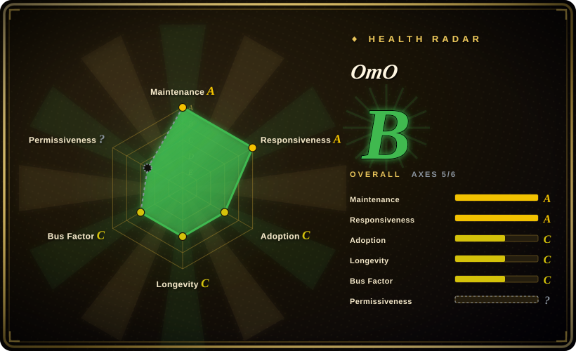
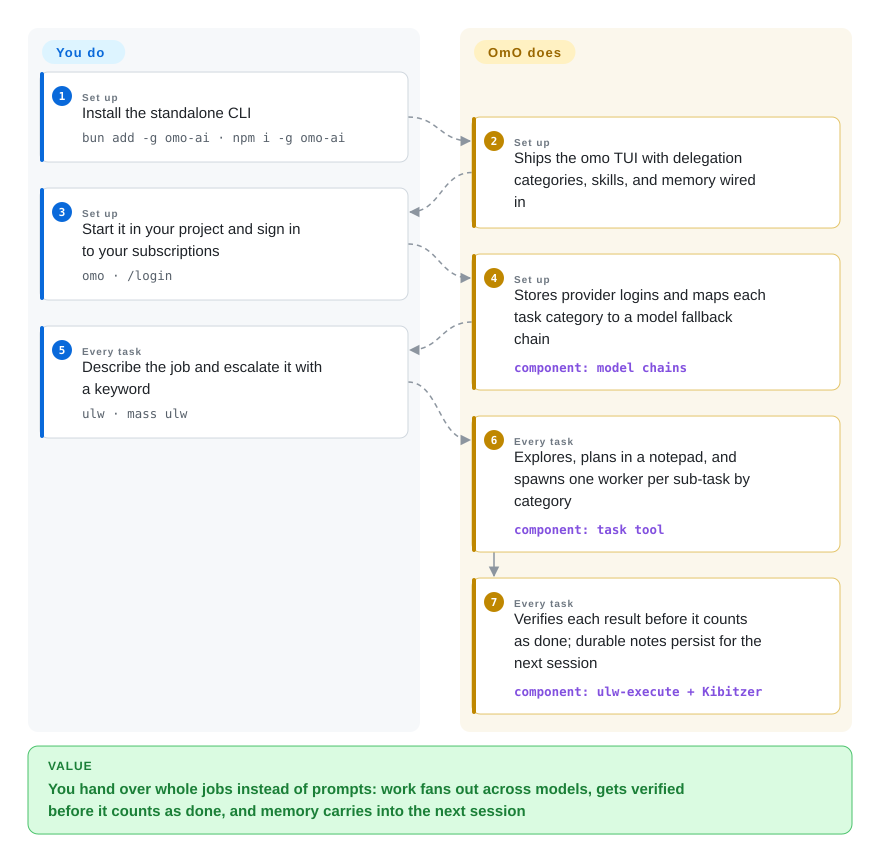

# OmO

You hand a coding agent a big job and spend the evening steering it back on course — then re-explain the same project decisions to it next week. OmO is a terminal agent that takes the steering over: type `mass ulw` and the job becomes a graph of parallel workers, each run on the model that fits it and checked before anything is called done, with what it learns kept in a git repo of notes.

## When to use

You are a developer who already pays for model subscriptions — Claude, ChatGPT, Kimi, GLM — and your backlog is whole jobs, not quick edits: a migration nobody wants, a research sweep across thousands of sources, a backend with tests. The plain terminal agent burns your frontier-model quota on typo fixes, forgets every decision the moment the session ends, and stops at the first ambiguity for you to resolve. The chat fills with file dumps while step 3 of 40 never gets verified.

Reach for OmO when you want to delegate the entire job. One `omo` command, `/login` once, then describe the work — add `ulw` (ultrawork) for one deep verified lane, `mass ulw` when the tasks have real ordering and should fan out as a dependency graph. Sub-tasks route by category: cheap fast models get boilerplate, frontier models get design decisions, and an independent reviewer verifies a worker's "done" claim before the checkbox flips. Choose OmO over [OpenCode](opencode.md) when you want orchestration, memory, and model-mixing pre-wired instead of assembled from plugins — and you can live with its source-available license. Choose it over [Pi](pi.md) when you want the batteries included rather than a minimal harness you extend yourself; OmO's engine is itself a fork of Pi.

## How it works

OmO is one TypeScript TUI built on senpi, a fork of [Pi](pi.md); everything else is layers the harness adds around the session. Escalation is by keyword: a bare prompt is answered directly by your session model, while the `ulw` keyword switches the main agent into a mode that explores the codebase first, plans in a notepad, delegates every implementation unit through the `task` tool, and verifies results with evidence before calling them done. With `mass ulw` the main agent instead defines a dependency graph of nodes and drives it phase by phase through the `workflow` tool; `/ulw-plan` plus `/ulw-execute` gives you a written, independently reviewed plan first (a plan consultant hunts gaps, a reviewer rejects verified blockers, capped at five rounds), with per-wave task-owned worktrees, a five-gate verification per checklist item, and boulder state that resumes the work in a later session. Delegation routes by category, not model name — `quick`, `deep-low`, `ultrabrain`, `visual-engineering`, `writing` — and each category maps to a fallback chain that prefers subscription lanes over per-token billing. Memory ships on by default as a git repository of markdown: a reflection pass writes durable notes every ~25 steps, and Kibitzer — a cheap resident sidecar model fed redacted session events — nudges the main agent only when a stored memory would change the next step, in a hint capped at 200 characters. What stays yours: the repo, the provider logins, and the budget. What it takes over: planning artifacts under `.omo/`, worker dispatch, verification gates, and the memory repo.

<!-- flow-steps:begin (generated from flows/oh-my-openagent.json by tools/flow_card.py — do not edit) -->

Text version of the flow

1. **You** (Set up): Install the standalone CLI — `bun add -g omo-ai · npm i -g omo-ai`
2. **OmO** (Set up): Ships the omo TUI with delegation categories, skills, and memory wired in
3. **You** (Set up): Start it in your project and sign in to your subscriptions — `omo · /login`
4. **OmO** (Set up): Stores provider logins and maps each task category to a model fallback chain — component: `model chains`
5. **You** (Every task): Describe the job and escalate it with a keyword — `ulw · mass ulw`
6. **OmO** (Every task): Explores, plans in a notepad, and spawns one worker per sub-task by category — component: `task tool`
7. **OmO** (Every task): Verifies each result before it counts as done; durable notes persist for the next session — component: `ulw-execute + Kibitzer`

**Value**: You hand over whole jobs instead of prompts: work fans out across models, gets verified before it counts as done, and memory carries into the next session

<!-- flow-steps:end -->

## When NOT to use

- **Your use is not internal, personal, or non-commercial.** The license (Sustainable Use License 1.0) grants use only "for your own internal business purposes or for non-commercial or personal use", and distribution only free of charge for non-commercial purposes. Embedding OmO in something you sell is outside it [推断 — reading of the license text; not legal advice]. If you need a permissively licensed agent you can ship inside a commercial offering, use [OpenCode](opencode.md) (MIT) or [Pi](pi.md) (MIT) instead.
- **You meter every token.** The project's own manifesto accepts higher token usage in exchange for autonomy — parallel worker swarms, independent verification reviewers, memory reflection every ~25 steps. On a tight API-key budget, use [aider](aider.md) or [Codex](codex.md) instead of OmO, because a single-model loop spends one model's worth of tokens per step, not a fleet's.
- **You want a minimal harness you can audit line by line.** OmO is ~30 workspace packages plus Rust desktop components, with keyword-triggered behavior changes and opinionated defaults deep in `~/.omo/omo.jsonc`. Use [Pi](pi.md) instead of OmO, because Pi is the small auditable core OmO itself forked from.
- **You need a security sandbox around spawned workers.** Filesystem isolation exists for parallel worktrees (clone + merge-back), but no OS-level sandbox is documented; workers' shell commands run with your user permissions [推断]. Use [Open Interpreter](open-interpreter.md) or [Codex](codex.md) instead of OmO, because those document sandboxed execution as part of the product.
- **Anonymous telemetry on by default is a compliance problem.** PostHog-backed telemetry is enabled when omitted; opt-out exists (`telemetry: false`, `OMO_DISABLE_POSTHOG=1`). If default-on analytics fail your policy before you can turn them off, use [OpenCode](opencode.md) or [Codex](codex.md) instead.
- **You need a Lindy-backed, low-churn tool.** The repo was created 2025-12-03, reached ~69.6k stars in ten months, shipped v5.0.0 after 90 betas, renamed itself (oh-my-opencode → oh-my-openagent, two npm packages still publishing in tandem), and routes through one human maintainer plus his AI assistant. Use [aider](aider.md) instead of OmO when age × still-active is the prior that decides, because ten hot months is a risk flag here, not proof.

## Comparison

| Alternative | In index | Our verdict | Tradeoff |
|---|---|---|---|
| [OpenCode](opencode.md) | ✅ | Choose OpenCode for a lean MIT terminal agent whose orchestration you assemble yourself; choose OmO when you want delegation categories, memory, and model mixing to arrive pre-wired — and SUL terms are acceptable. | OpenCode is the permissive, minimalist daily driver; OmO is the batteries-included descendant (formerly its plugin) that spends more tokens and restricts commercial redistribution. |
| [Pi](pi.md) | ✅ | Choose Pi when you want a minimal agent whose behavior lives in files you can read in an afternoon; choose OmO when inheriting a decided orchestration stack beats building one. | OmO's engine (senpi) is a fork of Pi; Pi stays small and MIT, OmO trades size and license for built-in categories, verification gates, and memory. |
| [Codex](codex.md) | ✅ | Choose Codex when you want a vendor-backed terminal agent with documented sandboxing and one throat to choke; choose OmO when mixing subscriptions across providers and autonomous verification matter more. | Codex is OpenAI-shaped and simpler to trust at the OS boundary; OmO is provider-agnostic and orchestration-rich, but unsandboxed and license-restricted. |
| Claude Code | 未收录 | Choose Claude Code when you accept a proprietary Anthropic-bound terminal agent for its polished managed experience; choose OmO when multi-provider mixing with source access is the requirement. | Claude Code is closed and subscription-bound; OmO is source-available across providers but gated by SUL-1.0. Real product, not a repo this index can page — not added in this tab-intake batch. |
| [oh-my-codex](https://github.com/Yeachan-Heo/oh-my-codex) | 未收录 | Choose oh-my-codex when you live inside Codex and want its Ultragoal/UltraQA-style autonomy loop there; choose OmO when you want that autonomy standalone across providers. | OmO credits oh-my-codex as the concept source and reimplements the ideas; it is a real repo left 未收录 (not added in this tab-intake batch), so judge it from its own tree. |

## Tech stack

- **TypeScript monorepo** — ~30 workspace packages (`model-core`, `memory-core`, `delegate-core`, `rules-engine`, `tmux-core`, `omo-senpi`, `omo-opencode`, `omo-codex`, …) with Bun as the build/test runtime.
- **Engine: senpi** — a fork of `badlogic/pi-mono` (Pi); the OpenCode-edition integration rides on `@opencode-ai/plugin`/`sdk` pinned at 1.18.31.
- **TUI** — OpenTUI (`@opentui/core`, `@opentui/solid`) plus xterm for the web terminal; Commander CLI.
- **MCP** — `@modelcontextprotocol/sdk`; built-in remote MCPs (websearch, context7, grep_app) plus a local stdio LSP server.
- **Rust crates** — `crates/` with `rust-toolchain.toml` feeding the `senpi-desktop-*` packages; platform binaries ship via npm `optionalDependencies`.
- **Telemetry** — `posthog-node` (anonymous daily-active, on by default, opt-out via config or `OMO_DISABLE_POSTHOG=1`).

## Dependencies

- **Node.js or Bun** — `bun add -g omo-ai` (or `npm i -g omo-ai`); the package warns that the unrelated `omo` npm package is someone else's.
- **At least one model source** — subscription `/login` (Claude, ChatGPT, Kimi, GLM) or API keys / OpenAI-compatible proxies (e.g. `OPENGATEWAY_API_KEY`).
- **Git** — memory is stored as a git repository of markdown; plan waves run in task-owned worktrees and merge back.
- **Optional: tmux or cmux** — pane-per-agent visualization when `tmux.enabled` is on.

## Ops difficulty

**Low to medium.** Install is one global package; `omo setup` migrates an OpenCode-edition install (provider keys, MCP servers, skills), `omo doctor` diagnoses what providers can run, `omo update` updates in place; config cascades from `~/.omo/omo.jsonc` to a project `.omo/omo.jsonc`. The real burden is usage, not deployment: token spend across a fleet of models, noticing telemetry is on by default, memory-repo hygiene, and keeping configuration current through a near-daily release cadence (v5.0.1 on 2026-09-27, one day after v5.0.0, on the heels of 90 betas).

## Health & viability

- **Maintenance:** very active — v5.0.1 released 2026-09-27, v5.0.0 on 2026-09-26, beta.88–90 within 2026-09-23..24; default branch pushed the day of verification.
- **Governance / bus factor:** one human maintainer (YeonGyu Kim / `code-yeongyu`) holds the dominant commit share (14,410 of the top-10 window's ~17k); the project states it is "maintained by Jobdori", an AI assistant running on a customized OpenClaw fork, with Sisyphus Labs as the commercial arm (waitlist-stage as of 2026-09). A CLA grants the owner relicensing rights, including proprietary.
- **Backing & age:** a personal side project (sponsor: OpenGateway) — created 2025-12-03, so no Lindy record; ~69.6k stars in ten months is a hype flag on this index's prior, not adoption proof.
- **Adoption:** the health scorer measures 104,759 npm downloads/month for the canonical package `oh-my-openagent` (2026-09-28); alongside it the native CLI `omo-ai` pulls 21.8k/month (created 2026-08-03) and the legacy `oh-my-opencode` plugin 79.6k/month; 5.7k forks; an active Discord; 1,083 open issues against a solo triage.
- **Risk flags:** SUL-1.0 is not OSI open source (commercial distribution restricted); CLA with unlimited relicensing; default-on PostHog telemetry; identity churn (rename, tandem packages, several domains 301-ing to omo.dev, all named in `docs/manifesto.md`); v5.0.0 shipped the new standalone OmO Native engine two days after beta.90.

## Caveats (unverified)

- [推断] No OS-level security sandbox is documented; `isolation-core`'s own contract describes filesystem isolation with patch/branch merge-back, not a security boundary — inferred from its AGENTS.md, not from an attack test.
- [推断] SUL-1.0's "internal business purposes" reading (internal development OK, embedding in a sold product not OK) is this page's interpretation of the license text, not legal advice.
- [未验证] README's "Loved by professionals at Google, Microsoft, Vercel, Deepgram…" — company name-drops with no named users; the quoted speed gains ("in 1 hour what Claude Code does in 7 days") are testimonials, not benchmarks.
- [推断] ~69.6k stars in ~10 months alongside ~5.7k forks likely measures attention (X/Discord virality) more than production adoption.
- [未验证] Whether the `omo-ai` and `oh-my-opencode` npm packages keep publishing in tandem or the OpenCode plugin edition is eventually sunset — the manifesto says "during the transition" without an end date.
- [未验证] What the Rust `senpi-desktop-*` packages gate (desktop app, native tooling) — their presence is verified from `Cargo.toml` and the workspace list; their function was not read.
