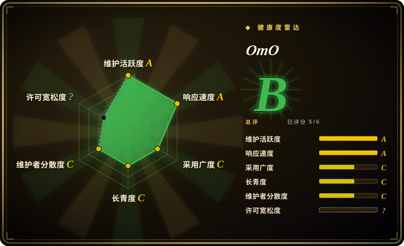
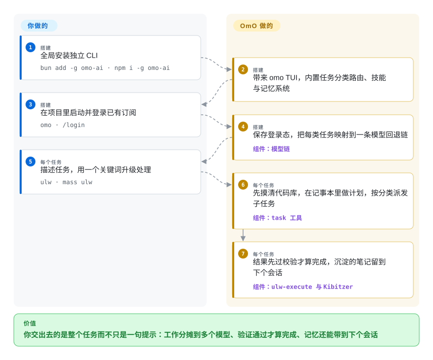

# OmO

你把一个大任务交给终端 agent，结果一晚上都在把它拽回正轨，下周还得把同样的项目决策重新交代一遍。OmO 把这些拖拽的活接了过去：一句 `mass ulw`，任务就变成一张并行 worker 的依赖图，每一块跑在合适的模型上、验证通过才算完成，学到的东西沉淀成一个 git 笔记仓库。

## 何时使用

你已经付着好几家的模型订阅——Claude、ChatGPT、Kimi、GLM——而你的待办清单里是整件整件的活，不是小修小补：没人想碰的迁移、横跨数千来源的调研、一个带测试的后端。普通终端 agent 把前沿模型的额度烧在改错别字上，会话一结束就忘掉所有决策，遇到第一处含糊就停下来等你裁决；对话窗口塞满文件转储，而 40 步里的第 3 步从头到尾没人验证过。

想整件交出去时用 OmO。一条 `omo` 命令、一次 `/login`，然后描述任务——加 `ulw`（ultrawork）走一条深度验证通道，任务之间有先后依赖就打 `mass ulw`，让它们摊成一张依赖图并行跑。子任务按类别路由：便宜快的模型干体力活，前沿模型做设计决策，而且「完成」要过独立评审才算数。比起 [OpenCode](opencode.zh.md)，选 OmO 的理由是你想让编排、记忆和模型混用开箱即得，而不是自己拿插件拼一套，并且能接受它的 source-available 许可；比起 [Pi](pi.zh.md)，选它的理由是你要的是全家桶而不是自己扩展的极简内核——OmO 的引擎本就是 Pi 的一个 fork。

## 怎么用起来

OmO 是一个 TypeScript TUI，跑在 senpi（[Pi](pi.zh.md) 的 fork）上，其余全是 harness 在会话外叠加的层。升级靠关键词：裸提示词由会话模型直接回答；打出 `ulw` 关键词后，主 agent 先摸代码库、在记事本里做计划、把每个实现单元经 `task` 工具派出去，结果带着证据验证完才算数。打 `mass ulw` 时，主 agent 改为定义一张带依赖的节点图，经 `workflow` 工具逐阶段推进；`/ulw-plan` 加 `/ulw-execute` 则先给你一份写成文档、独立评审过的计划（plan consultant 找漏洞，plan reviewer 只对查实的 blocker 说不行，最多五轮），每波跑在任务专属的 worktree 里，每个清单项过五道验证门，boulder 状态文件让之后的会话能接着干。派发按类别而非模型名路由——`quick`、`deep-low`、`ultrabrain`、`visual-engineering`、`writing`——每个类别映射到一条回退链，订阅通道排在按 token 计费的 API 通道前面。记忆默认开启，存成一个 git 管的 markdown 仓库：每约 25 步跑一次反思、写下耐久笔记；Kibitzer——一个吃脱敏会话事件的常驻廉价小模型——只在已存记忆会改变下一步时提醒主 agent，提示词上限 200 字符。属于你的：仓库、provider 登录和预算。它接管的：`.omo/` 下的计划产物、worker 派发、验证门和记忆仓库。

<!-- flow-steps:begin (generated from flows/oh-my-openagent.json by tools/flow_card.py — do not edit) -->

流程文字版

1. **你**（搭建）：全局安装独立 CLI — `bun add -g omo-ai · npm i -g omo-ai`
2. **OmO**（搭建）：带来 omo TUI，内置任务分类路由、技能与记忆系统
3. **你**（搭建）：在项目里启动并登录已有订阅 — `omo · /login`
4. **OmO**（搭建）：保存登录态，把每类任务映射到一条模型回退链 — 组件：`模型链`
5. **你**（每个任务）：描述任务，用一个关键词升级处理 — `ulw · mass ulw`
6. **OmO**（每个任务）：先摸清代码库，在记事本里做计划，按分类派发子任务 — 组件：`task 工具`
7. **OmO**（每个任务）：结果先过校验才算完成，沉淀的笔记留到下个会话 — 组件：`ulw-execute 与 Kibitzer`

**价值**：你交出去的是整个任务而不只是一句提示：工作分摊到多个模型、验证通过才算完成、记忆还能带到下个会话

<!-- flow-steps:end -->

## 何时不用

- **你的用途不是内部、个人或非商业。** 它的许可（Sustainable Use License 1.0）只授权「为自己的内部业务目的、非商业或个人用途」使用，分发也只能是非商业且免费。把 OmO 嵌进你卖的产品超出了授权范围 [推断——对许可文本的解读，不构成法律意见]。需要一个可以随商业产品分发的宽松许可 agent 时，改用 [OpenCode](opencode.zh.md)（MIT）或 [Pi](pi.zh.md)（MIT）。
- **你在逐 token 精打细算。** 项目自己的宣言就是用更高 token 消耗换自主性——并行 worker 蜂群、独立验证评审、每约 25 步一次记忆反思。API 预算紧张时改用 [aider](aider.zh.md) 或 [Codex](codex.zh.md)，因为单模型循环每步只花一个模型的钱，不是一个机队的钱。
- **你想要一个能逐行审计的极简 harness。** OmO 是约 30 个 workspace 包加 Rust 桌面组件，关键词触发行为切换，深度默认值埋在 `~/.omo/omo.jsonc` 里。改用 [Pi](pi.zh.md)——OmO 自己就是从它 fork 出来的那个小而可审计的内核。
- **你需要罩住 worker 的安全沙箱。** 并行 worktree 有文件系统隔离（克隆加合并回去），但没有文档化的 OS 级沙箱；worker 的 shell 命令以你的用户权限执行 [推断]。改用 [Open Interpreter](open-interpreter.zh.md) 或 [Codex](codex.zh.md)，它们把沙箱执行写进了产品文档。
- **默认开启的匿名遥测过不了合规。** PostHog 遥测缺省即启用，可以关（`telemetry: false`、`OMO_DISABLE_POSTHOG=1`）。如果「先开再关」本身就违反你的政策，改用 [OpenCode](opencode.zh.md) 或 [Codex](codex.zh.md)。
- **你要一个 Lindy 背书、低变动的工具。** 仓库 2025-12-03 才创建，十个月冲到约 69.6k stars，90 个 beta 之后发 v5.0.0，还改过名（oh-my-opencode → oh-my-openagent，两个 npm 包仍在并行发布），路线图握在一个人类维护者加他的 AI 助手手里。当「年龄 × 仍在活跃」是决定性先验时，改用 [aider](aider.zh.md)——十个月的火热在这个索引里是风险信号，不是证明。

## 横向对比

| 替代品 | 是否收录 | 我们的评价 | 取舍 |
|---|---|---|---|
| [OpenCode](opencode.zh.md) | ✅ | 要一个宽松许可、编排自己拼装的精简终端 agent，选 OpenCode；要派发类别、记忆和模型混用出厂即配好，选 OmO——前提是接受 SUL 条款。 | OpenCode 是宽松、极简的日常主力；OmO 是电池全含的后继者（曾是它的插件），代价是更高 token 消耗和商业再分发受限。 |
| [Pi](pi.zh.md) | ✅ | 想要一个行为由仓库文件决定、一下午能读完的极简 agent，选 Pi；想直接继承一套已定型的编排栈，选 OmO。 | OmO 的引擎（senpi）是 Pi 的 fork；Pi 保持小而 MIT，OmO 用体积和许可换内建类别、验证门和记忆。 |
| [Codex](codex.zh.md) | ✅ | 要厂商背书、有文档化沙箱、出事有一个问责主体的终端 agent，选 Codex；要跨 provider 混用订阅加自主验证，选 OmO。 | Codex 是 OpenAI 形状、OS 边界更易信任；OmO 跨 provider、编排更丰富，但无沙箱且许可受限。 |
| Claude Code | 未收录 | 接受专有、绑定 Anthropic 的终端 agent 换取打磨过的托管体验，选 Claude Code；要跨 provider 混用且能看源码，选 OmO。 | Claude Code 闭源、绑定订阅；OmO 跨 provider 且源码可见，但受 SUL-1.0 约束。它是真实产品而非本索引可收录的仓库——本 tab-intake 批次未添加。 |
| [oh-my-codex](https://github.com/Yeachan-Heo/oh-my-codex) | 未收录 | 生活在 Codex 里、想要 Ultragoal／UltraQA 式自主循环跑在 Codex 内部，选 oh-my-codex；要这套自主性独立成体、跨 provider，选 OmO。 | OmO 自认 oh-my-codex 是概念来源并重新实现；它是真实仓库但本批未收录（tab-intake 批次未添加），请自行到它的仓库判断。 |

## 技术栈

- **TypeScript monorepo**——约 30 个 workspace 包（`model-core`、`memory-core`、`delegate-core`、`rules-engine`、`tmux-core`、`omo-senpi`、`omo-opencode`、`omo-codex` 等），Bun 做构建与测试运行时。
- **引擎：senpi**——`badlogic/pi-mono`（Pi）的 fork；OpenCode 版集成依赖固定在 1.18.31 的 `@opencode-ai/plugin`／`sdk`。
- **TUI**——OpenTUI（`@opentui/core`、`@opentui/solid`）加 xterm 网页终端；Commander CLI。
- **MCP**——`@modelcontextprotocol/sdk`；内建远程 MCP（websearch、context7、grep_app）加本地 stdio LSP 服务。
- **Rust crates**——`crates/` 与 `rust-toolchain.toml` 支撑 `senpi-desktop-*` 包；平台二进制经 npm `optionalDependencies` 分发。
- **遥测**——`posthog-node`（匿名日活，默认开启，可用配置或 `OMO_DISABLE_POSTHOG=1` 关闭）。

## 依赖

- **Node.js 或 Bun**——`bun add -g omo-ai`（或 `npm i -g omo-ai`）；README 特别提醒 npm 上无关的 `omo` 包是别人的。
- **至少一个模型来源**——订阅 `/login`（Claude、ChatGPT、Kimi、GLM）或 API key／OpenAI 兼容代理（如 `OPENGATEWAY_API_KEY`）。
- **Git**——记忆存成 git 管的 markdown 仓库；计划波次跑在任务专属 worktree 里再合并回来。
- **可选：tmux 或 cmux**——开 `tmux.enabled` 后一个 agent 一个窗格可视化。

## 运维难度

**低到中。** 安装就是一个全局包；`omo setup` 迁移 OpenCode 版安装（provider key、MCP 服务、技能），`omo doctor` 诊断各家 provider 能跑哪些任务类别，`omo update` 原地升级；配置从 `~/.omo/omo.jsonc` 级联到项目 `.omo/omo.jsonc`。真正的负担在使用而非部署：一个机队模型的 token 开销、注意到遥测默认开启、记忆仓库的卫生，以及跟上近乎每日的发版节奏（v5.0.1 发于 2026-09-27，距 v5.0.0 仅一天，此前是 90 个 beta）。

## 健康度与可持续性

- **维护**：非常活跃——v5.0.1 发布于 2026-09-27，v5.0.0 于 2026-09-26，beta.88–90 集中在 2026-09-23 至 24；核实当天默认分支仍有推送。
- **治理／bus factor**：单一人类维护者（YeonGyu Kim／`code-yeongyu`）占压倒性提交份额（top-10 窗口约 1.7 万次提交中占 14,410 次）；项目自述由 Jobdori 维护——一个跑在定制 OpenClaw fork 上的 AI 助手，商业主体 Sisyphus Labs 截至 2026-09 还在候补名单阶段。CLA 授予所有者包括专有许可在内的再许可权。
- **背书与年龄**：个人副业（赞助方：OpenGateway）——2025-12-03 创建，没有 Lindy 记录；十个月约 69.6k stars 在本索引的先验下是热度信号，不是采用证明。
- **采用**：健康度评分器测得规范包 `oh-my-openagent` 月下载 104,759（2026-09-28）；新原生 CLI `omo-ai` 月下载 2.18 万（创建于 2026-08-03），旧 `oh-my-opencode` 插件版另有 7.96 万；5.7k forks；活跃 Discord；1,083 个 open issue 对一个人的分诊。
- **风险标记**：SUL-1.0 不是 OSI 开源（商业分发受限）；CLA 含无限再许可；PostHog 遥测默认开启；身份变动（改名、双包并行、多个域名 301 到 omo.dev，域名清单见 `docs/manifesto.md`）；v5.0.0 在 beta.90 两天后就发布了全新独立引擎 OmO Native。

## 存疑（未验证）

- [推断] 未文档化 OS 级安全沙箱；`isolation-core` 自己的契约写的是带补丁／分支合并的文件系统隔离，不是安全边界——依据其 AGENTS.md 推断，未做攻击测试。
- [推断] SUL-1.0「内部业务目的」的读法（公司内部开发可以、嵌入售卖产品不行）是本页对许可文本的解读，不构成法律意见。
- [未验证] README 的「受 Google、Microsoft、Vercel、Deepgram 等公司专业人士喜爱」——只挂了公司名没有具体用户；引述的速度对比（「Claude Code 要 7 天的活它 1 小时」）是证言不是基准测试。
- [推断] 十个月约 69.6k stars、约 5.7k forks，衡量的更可能是关注度（X／Discord 传播）而非生产采用。
- [未验证] `omo-ai` 与 `oh-my-opencode` 两个 npm 包是否长期并行发布、OpenCode 插件版会不会停更——宣言只说「过渡期间」并行，没给终止日期。
- [未验证] Rust `senpi-desktop-*` 包管什么（桌面应用、原生工具）——存在性由 `Cargo.toml` 和 workspace 清单核实，功能未读。
