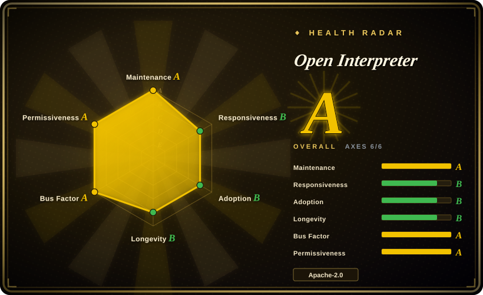
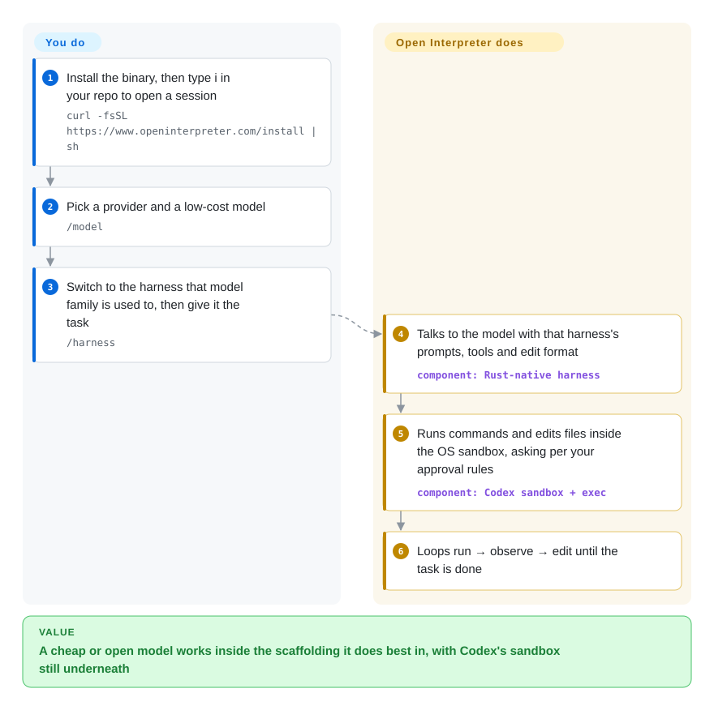

# Open Interpreter

You point a Codex-style terminal agent at a cheap model like Kimi or GLM and it fumbles edits and tool calls it handles noticeably better inside its own vendor's CLI — the scaffolding around it was tuned for someone else's model. Open Interpreter is a fork of OpenAI's Codex that lets you swap in the prompt-and-tool scaffolding (the "harness") each model family is used to, from one terminal app.

> **Identity change — read this first.** The project you may remember — the Python "natural-language interface for your computer" REPL that wrote and executed code locally — is *not* what this repo ships today. That Python codebase last shipped `v0.4.2` (2024-10) and now lives on as a community fork at [`endolith/open-interpreter`](https://github.com/endolith/open-interpreter). The repo (now `openinterpreter/openinterpreter`; the old `open-interpreter` URL redirects) was rewritten in **Rust as a Codex fork** and relaunched in 2026. Everything below describes the *current* Rust project. If you want the old Python tool, use the community fork, not this page.

## When to use

You're a developer who likes the Codex / Claude Code terminal-agent workflow but doesn't want to pay frontier-model prices for every loop. You've got access to cheaper or open-weight models — Kimi, GLM, DeepSeek, Qwen, or any OpenAI-compatible endpoint — and you've noticed they behave worse in a generic agent than in their vendor's own CLI: the edit format, tool framing and system prompt were tuned for a different model. You install Open Interpreter, type `i`, pick a model with `/model`, then switch the **harness** with `/harness` — `native`, `claude-code`, `zcode`, `kimi-code`, `kimi-cli`, `qwen-code`, `deepseek-tui`, `swe-agent`, `minimal` and more — to run that model inside the scaffolding it does best in. The agent runs shell commands and edits files inside OS-native sandboxing, and because it inherits Codex's machinery you also get `exec`, MCP, skills, hooks, permissions, `AGENTS.md`, an Agent Client Protocol (ACP) mode for editors, and a drop-in binary for apps already built on the Codex SDK.

Pick it over plain Codex when the model you want to run is *not* an OpenAI model and the per-model scaffolding is the whole point; pick it over aider or OpenCode when you specifically want Codex's sandbox + exec protocol underneath rather than a different agent loop.

## How it works

Open Interpreter is Codex underneath — the same Rust agent loop, sandbox and exec protocol — with one extra layer: a set of re-implemented **harnesses**, each a copy of the prompt, tool definitions and edit format that a specific vendor's coding CLI uses (Kimi Code, ZCode, Qwen Code, Claude Code and so on). You do three things: install the binary, choose a provider/model, and choose which harness to wrap it in; Open Interpreter then talks to the model the way that model's own vendor tool would, while still running every command through Codex's OS sandbox and approval rules. Think of it as one car body that accepts a different steering setup per driver. Because it speaks the Codex exec protocol and ACP, an editor or an app built on the Codex SDK can drive it instead of `codex` with a one-line binary override.

<!-- flow-steps:begin (generated from flows/open-interpreter.json by tools/flow_card.py — do not edit) -->

Text version of the flow

1. **You**: Install the binary, then type i in your repo to open a session — `curl -fsSL https://www.openinterpreter.com/install | sh`
2. **You**: Pick a provider and a low-cost model — `/model`
3. **You**: Switch to the harness that model family is used to, then give it the task — `/harness`
4. **Open Interpreter**: Talks to the model with that harness's prompts, tools and edit format — component: `Rust-native harness`
5. **Open Interpreter**: Runs commands and edits files inside the OS sandbox, asking per your approval rules — component: `Codex sandbox + exec`
6. **Open Interpreter**: Loops run → observe → edit until the task is done

**Value**: A cheap or open model works inside the scaffolding it does best in, with Codex's sandbox still underneath

<!-- flow-steps:end -->

## When NOT to use

- **You are about to run an LLM coding agent on a machine that matters — understand the execution risk first.** This agent runs shell commands and edits files based on model output. "Native sandboxing" plus approvals is mitigation, not immunity: prompt-injected or simply wrong output can still delete files, leak secrets or run destructive commands within whatever scope you approve. Review what it does, scope its access, keep production credentials out of reach, and read the [sandbox & approvals docs](https://www.openinterpreter.com/docs/terminal/sandbox) first; if you need a hard boundary, run it inside a disposable container or VM instead of on your workstation. [推断]
- **You wanted the old Python "talk to your computer" REPL.** It's gone from this repo. Code that imports the Python `interpreter` package / API belongs to the community fork [`endolith/open-interpreter`](https://github.com/endolith/open-interpreter) — use that instead of this repo.
- **You need a stable API or production track record for *this* codebase.** The Rust line is at `rust-v0.0.56` (2026-10-07) after roughly 40 `0.0.x` releases in under four months — fast, unfrozen, and young. If you need a settled release line, use [aider](aider.md) (multi-year, model-agnostic) instead, because its CLI and edit format have stayed stable across many releases.
- **You only use OpenAI models.** The value here is the per-model harness for *other* vendors' models. For GPT models, use [Codex](codex.md) directly instead of Open Interpreter, because the upstream has the larger team and gets features first — Open Interpreter merges them later.
- **You want a library to *build* multi-agent systems.** This is an end-user coding agent (plus ACP / Codex-SDK surfaces), not an orchestration framework. Use [AgentScope](../../agent-runtimes/agent-sdks/agentscope.md) or [smolagents](../../agent-runtimes/agent-sdks/smolagents.md) instead of Open Interpreter when you need to compose agents in your own code.
- **You need the browser / native-app QA mode to be reliable.** Driving apps through external tools (agent-browser, trycua) is fragile across OS versions, app updates and screen states. For a critical browser-testing workflow, use a scripted test framework like Playwright instead of an LLM-driven QA skill, because it is deterministic and reviewable. [未验证]

## Comparison

| Alternative | In index | Our verdict | Tradeoff |
|---|---|---|---|
| [Codex](codex.md) | ✅ | When your models are OpenAI's, pick Codex; pick Open Interpreter when you want the same Codex runtime driving Kimi, GLM, DeepSeek or Qwen through their own vendor-style harness. | Codex is the upstream: larger team, features land there first. Open Interpreter adds the swappable harness layer and an open-model provider catalog, at the cost of trailing upstream by a merge. |
| Claude Code | 未收录 | If you are happy paying for Claude and want the most polished vendor experience, pick Claude Code; pick Open Interpreter when you want to emulate a Claude-Code-style harness around a cheaper model. | Claude Code is closed-source and Anthropic-only; Open Interpreter is Apache-2.0 and model-agnostic but its `claude-code` harness is an emulation, not the real product. |
| [OpenCode](opencode.md) | ✅ | For a model-agnostic agent with a desktop app, IDE extension and client/server API, pick OpenCode; pick Open Interpreter when you want Codex's OS sandbox and per-model harness emulation. | OpenCode runs one agent loop over 75+ providers with permissive default permissions; Open Interpreter keeps Codex's sandbox and changes the scaffolding per model family. |
| [aider](aider.md) | ✅ | For long-lived, git-commit-per-change pair programming across many providers, pick aider; pick Open Interpreter when you want an autonomous Codex-style agent with sandboxed shell execution. | aider is mature and stable but is not a sandboxed autonomous runner; Open Interpreter is newer and churns faster. |
| endolith/open-interpreter (the old Python OI) | 未收录 | If you actually wanted the original Python "natural-language computer" REPL and its `interpreter` API, pick this community fork instead of the current repo. | Keeps the legacy Python API alive; community-pace maintenance and no tie to the Rust rewrite. |

## Tech stack

- **Core:** Rust — the `codex-rs` workspace inherited from OpenAI Codex (CLI, exec, MCP, sandbox, ACP server, app-server), regularly merged from upstream Codex releases.
- **Harness layer:** Open Interpreter's addition — Rust-native harnesses (`native`, `claude-code`, `claude-code-bare`, `zcode`, `kimi-code`, `kimi-cli`, `qwen-code`, `deepseek-tui`, `swe-agent`, `minimal`) switchable at runtime with `/harness`.
- **Providers:** a generated provider/model catalog (`scripts/write_provider_catalog.py`), plus a generic OpenAI-compatible path via `--chat-completions`.
- **Interfaces:** terminal TUI (`i` / `interpreter`); `interpreter exec`; ACP agent (`interpreter acp`); Codex exec-protocol compatibility for the Codex SDK; a built-in QA skill driving browsers (agent-browser) and native apps (trycua).
- **Packaging:** Bazel (`MODULE.bazel`) over Cargo, with `pnpm` for the npm/JS side and a Mintlify-style docs site in-repo.

## Dependencies

- **Install:** `curl -fsSL https://www.openinterpreter.com/install | sh` (macOS/Linux) or `irm https://www.openinterpreter.com/install.ps1 | iex` (Windows) — a remote script piped to a shell; review it if that matters to you.
- **Runtime:** at least one model backend — a hosted provider API key or a local/OpenAI-compatible server. No bundled model.
- **Build from source:** Rust toolchain + Bazel + `pnpm` — a polyglot build you only need for development.
- **Optional:** MCP servers; `agent-browser` / `trycua` for the QA skill; [Interpreter Workstation](https://github.com/openinterpreter/interpreter-workstation) if you want a desktop/browser front-end.
- **State:** product-only config and session state under `~/.openinterpreter`; skills and instructions in shared `AGENTS.md` / `.agents/skills`.

## Ops difficulty

**Low to run, medium to run *safely*, high to build from source.** Using it is a one-line install and `i` — no server, no datastore. The real work is the same as for any code-executing agent: deciding what it may touch (sandbox scope, approvals, which credentials are visible), watching token spend across iterative loops, and accepting non-deterministic results. Upgrades are frequent (often several per week) because it tracks both upstream Codex and fast-moving provider catalogs, so pin a version if you script around it.

## Health & viability

- **Responsiveness**: Grade B — median first-response time 70.6 hours across 27 qualifying issues/PRs.
- **Maintenance — very active, but on a young line (as of 2026-10-08).** Last push 2026-10-07; releases moved from `rust-v0.0.17` (2026-06-20) to `rust-v0.0.56` (2026-10-07), with periodic "merge upstream Codex" syncs. Before the Rust relaunch the Python line stopped at `v0.4.2` (2024-10-24) — a ~20-month gap, so "active" describes the new codebase only.
- **Governance & bus factor — inherited breadth, thin own core.** The contributor count (and the A governance grade) is dominated by OpenAI Codex engineers whose history came with the fork; recent Open-Interpreter-specific commits come mostly from one `interpreterwork` account and its automation bot plus a few outside contributors. The roadmap of the layer you are choosing it for rests on a very small team, and its base is a fork it does not control. [推断]
- **Age & Lindy — old repo, young product.** The repo dates to 2023-07, but what it ships today is months old; an old repo that replaced its codebase and identity is closer to a young project. The ~68k stars were mostly earned by the discontinued Python tool.
- **Risk flags — fork dependency and code execution, not licensing.** Apache-2.0, no relicense history. The durable risks are dependence on tracking upstream Codex, and the inherent attack surface of an agent that executes model-generated commands.

## Caveats (unverified)

- [未验证] Repo facts as of 2026-10-08 via GitHub API: created 2023-07-14, last push 2026-10-07, not archived, ~68.5k stars, ~5.9k forks, Apache-2.0, language Rust, owner type Organization; full name is now `openinterpreter/openinterpreter` (the `open-interpreter` URL redirects). The star count predates the rewrite.
- [未验证] Release facts: `rust-v0.0.56` on 2026-10-07; `rust-v0.0.17` on 2026-06-20; last Python-era release `v0.4.2` on 2024-10-24 (prerelease). The ~20-month gap is read from the releases list, not a maintainer statement.
- [推断] "Very small own core" is inferred from the last ~40 commits on `main` (mostly `interpreterwork` and `interpreterwork-automation[bot]`) and the top-10 contributors list being OpenAI Codex staff; no governance document was found that states who maintains the harness layer.
- [未验证] The harness list, `--chat-completions`, the Codex SDK `codexPathOverride` compatibility, ACP mode, the QA skill drivers and `.agents/skills` portability are from the current README; their exact behaviour and per-OS stability were not tested here.
- [未验证] "Native sandboxing on macOS, Linux, and Windows" and the approvals model are README claims inherited from Codex; their isolation guarantees were not audited — do not treat the sandbox as a hard security boundary.
- [推断] The claim that a cheap model does noticeably better inside its vendor-style harness is the project's premise (README: "emulating the agent harness that gets the best performance out of low-cost models"); no independent benchmark was checked.
- [未验证] The community fork `endolith/open-interpreter` was pushed on 2026-10-07 (~33 stars); its depth of maintenance was not evaluated.
