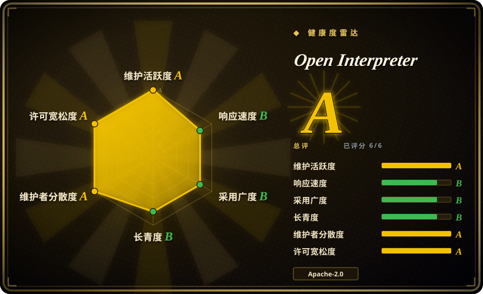
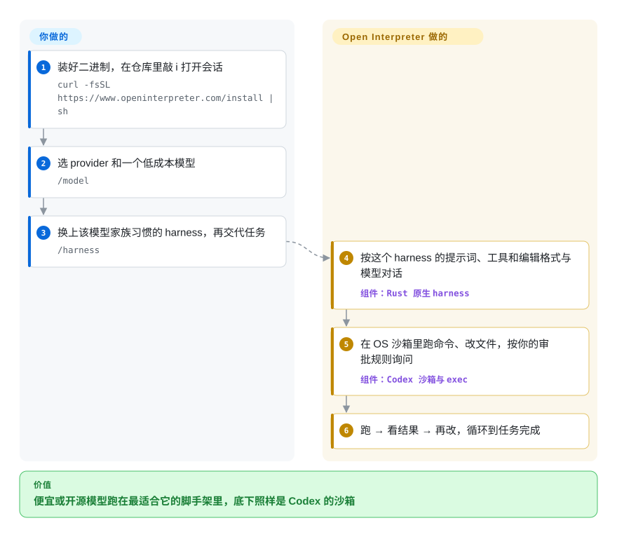

# Open Interpreter

你把 Kimi、GLM 这类便宜模型接进一个 Codex 式终端 agent，结果它改文件、调工具频频出错，而同一个模型在它自家厂商的 CLI 里明显顺手得多——外面那层脚手架是照别家模型调的。Open Interpreter 是 OpenAI Codex 的一个 fork，让你在同一个终端程序里，按模型家族换上它习惯的那套提示词和工具脚手架（也就是“harness”）。

> **身份已变——请先读这段。** 你也许记得的那个项目——用 Python 写的“自然语言操作你的电脑”REPL，在本地生成并执行代码——*不是*这个仓库今天交付的东西。那套 Python 代码最后一次发版是 `v0.4.2`（2024-10），如今作为社区 fork 存活在 [`endolith/open-interpreter`](https://github.com/endolith/open-interpreter)。这个仓库（现名 `openinterpreter/openinterpreter`，旧的 `open-interpreter` 地址会自动跳转）已用 **Rust 重写成 Codex 的 fork**，于 2026 年重新发布。下文描述的全部是*当前*这个 Rust 项目。想要老的 Python 工具，请用社区 fork，而不是看这一页。

## 何时使用

你是一名开发者，喜欢 Codex / Claude Code 那种终端 agent 工作流，但不想每一轮循环都按前沿模型的价格付费。你手上有更便宜或开源权重的模型——Kimi、GLM、DeepSeek、Qwen，或任何 OpenAI 兼容端点——也发现它们放进通用 agent 里，表现不如在自家厂商 CLI 里：编辑格式、工具定义、系统提示都是为别的模型调的。你装上 Open Interpreter，敲 `i`，用 `/model` 选模型，再用 `/harness` 切换 **harness**——`native`、`claude-code`、`zcode`、`kimi-code`、`kimi-cli`、`qwen-code`、`deepseek-tui`、`swe-agent`、`minimal` 等——让这个模型跑在它最擅长的那套脚手架里。agent 在 OS 原生沙箱里执行 shell 命令、改文件；又因为继承了 Codex 的整套机制，你还直接得到 `exec`、MCP、skills、hooks、权限、`AGENTS.md`、给编辑器用的 Agent Client Protocol（ACP）模式，以及一个能顶替 Codex SDK 里 `codex` 的二进制。

当你要跑的*不是* OpenAI 模型、而按模型定制的脚手架正是重点时，选它而不是原版 Codex；当你明确想要底下是 Codex 的沙箱和 exec 协议、而不是另一套 agent 循环时，选它而不是 aider 或 OpenCode。

## 怎么用起来

Open Interpreter 的底子就是 Codex——同一套 Rust agent 循环、沙箱和 exec 协议——只多了一层：一组重新实现的 **harness**，每个都是某家厂商编码 CLI（Kimi Code、ZCode、Qwen Code、Claude Code 等）所用提示词、工具定义和编辑格式的复刻。你只做三件事：装好二进制、选 provider 和模型、选用哪个 harness 包住它；之后 Open Interpreter 就按那家厂商自己工具的方式和模型对话，同时每条命令照样过 Codex 的 OS 沙箱和审批规则。可以把它想成同一副车身，按司机换不同的方向盘和踏板布局。因为它讲 Codex exec 协议和 ACP，编辑器、或基于 Codex SDK 写的应用，只要改一行二进制路径就能改由它来驱动。

<!-- flow-steps:begin (generated from flows/open-interpreter.json by tools/flow_card.py — do not edit) -->

流程文字版

1. **你**：装好二进制，在仓库里敲 i 打开会话 — `curl -fsSL https://www.openinterpreter.com/install | sh`
2. **你**：选 provider 和一个低成本模型 — `/model`
3. **你**：换上该模型家族习惯的 harness，再交代任务 — `/harness`
4. **Open Interpreter**：按这个 harness 的提示词、工具和编辑格式与模型对话 — 组件：`Rust 原生 harness`
5. **Open Interpreter**：在 OS 沙箱里跑命令、改文件，按你的审批规则询问 — 组件：`Codex 沙箱与 exec`
6. **Open Interpreter**：跑 → 看结果 → 再改，循环到任务完成

**价值**：便宜或开源模型跑在最适合它的脚手架里，底下照样是 Codex 的沙箱

<!-- flow-steps:end -->

## 何时不用

- **你打算在一台要紧的机器上跑 LLM 编码 agent——先搞清楚执行风险。** 这个 agent 会按模型输出执行 shell 命令、改文件。“原生沙箱”加审批是缓解，不是豁免：被提示注入或单纯出错的输出，仍可能在你批准的范围内删文件、泄露密钥、跑破坏性命令。审它做了什么、限制访问范围、别让它碰到生产凭据，先读[沙箱与审批文档](https://www.openinterpreter.com/docs/terminal/sandbox)；需要硬边界时，把它放进一次性容器或虚拟机里跑，而不是直接在工作机上跑。[推断]
- **你想要的是老的 Python“对电脑说话”REPL。** 它已经不在这个仓库里了。依赖 Python `interpreter` 包 / API 的代码属于社区 fork [`endolith/open-interpreter`](https://github.com/endolith/open-interpreter)——改用它，而不是这个仓库。
- **你需要*这套代码*有稳定 API 或生产业绩。** Rust 线在不到四个月里发了约 40 个 `0.0.x` 版本，现在是 `rust-v0.0.56`（2026-10-07）——快、未冻结、很年轻。需要稳定发版线，就选 [aider](aider.zh.md)（多年、模型无关），因为它的 CLI 和编辑格式跨很多版本都保持稳定。
- **你只用 OpenAI 模型。** 这里的价值在于给*其他*厂商模型的定制 harness。用 GPT 模型就直接用 [Codex](codex.zh.md)，而不是 Open Interpreter，因为上游团队更大、功能先到——Open Interpreter 要晚一步合并。
- **你想要一个用来*构建*多 agent 系统的库。** 这是面向终端用户的编码 agent（外加 ACP / Codex SDK 接口），不是编排框架。需要在自己代码里组合 agent，就用 [AgentScope](../../agent-runtimes/agent-sdks/agentscope.zh.md) 或 [smolagents](../../agent-runtimes/agent-sdks/smolagents.zh.md)，而不是 Open Interpreter。
- **你需要浏览器 / 原生应用 QA 模式可靠。** 借外部工具（agent-browser、trycua）驱动应用，跨 OS 版本、应用更新和屏幕状态都很脆弱。关键的浏览器测试流程请用 Playwright 这类脚本化测试框架，而不是 LLM 驱动的 QA skill，因为前者确定、可审查。[未验证]

## 横向对比

| 替代品 | 是否收录 | 我们的评价 | 取舍 |
|---|---|---|---|
| [Codex](codex.zh.md) | ✅ | 用的是 OpenAI 模型就选 Codex；想用同一套 Codex 运行时，按各家风格的 harness 驱动 Kimi、GLM、DeepSeek 或 Qwen 时选 Open Interpreter。 | Codex 是上游：团队更大、功能先到。Open Interpreter 加了可切换的 harness 层和开源模型 provider 目录，代价是比上游慢一次合并。 |
| Claude Code | 未收录 | 愿意为 Claude 付费、要最打磨的厂商体验，选 Claude Code；想在更便宜的模型外面套一层 Claude Code 风格的 harness，选 Open Interpreter。 | Claude Code 闭源且只用 Anthropic 模型；Open Interpreter 是 Apache-2.0、模型无关，但它的 `claude-code` harness 只是模拟，不是正品。 |
| [OpenCode](opencode.zh.md) | ✅ | 要模型无关、带桌面应用、IDE 扩展和客户端/服务端 API 的 agent，选 OpenCode；要 Codex 的 OS 沙箱加按模型模拟 harness，选 Open Interpreter。 | OpenCode 用同一套 agent 循环接 75+ provider，默认权限偏宽松；Open Interpreter 保留 Codex 沙箱，按模型家族换脚手架。 |
| [aider](aider.zh.md) | ✅ | 要长期稳定、每次改动一个 git 提交、跨多家 provider 的结对编程，选 aider；要带沙箱 shell 执行的自主 Codex 式 agent，选 Open Interpreter。 | aider 成熟稳定，但不是沙箱化的自主执行器；Open Interpreter 更新、变动也更快。 |
| endolith/open-interpreter（老的 Python OI） | 未收录 | 如果你真正想要的是原版 Python“自然语言操作电脑”REPL 和它的 `interpreter` API，选这个社区 fork，而不是现在的仓库。 | 让旧 Python API 活下去；社区节奏维护，与 Rust 重写无关。 |

## 技术栈

- **内核：** Rust——继承自 OpenAI Codex 的 `codex-rs` 工作区（CLI、exec、MCP、沙箱、ACP server、app-server），定期从上游 Codex 发布合并。
- **harness 层：** Open Interpreter 的新增——Rust 原生 harness（`native`、`claude-code`、`claude-code-bare`、`zcode`、`kimi-code`、`kimi-cli`、`qwen-code`、`deepseek-tui`、`swe-agent`、`minimal`），运行时用 `/harness` 切换。
- **provider：** 由脚本生成的 provider / 模型目录（`scripts/write_provider_catalog.py`），外加通过 `--chat-completions` 走的通用 OpenAI 兼容路径。
- **接口：** 终端 TUI（`i` / `interpreter`）；`interpreter exec`；ACP agent（`interpreter acp`）；对 Codex SDK 兼容的 Codex exec 协议；内置 QA skill，可驱动浏览器（agent-browser）和原生应用（trycua）。
- **打包：** Cargo 之上用 Bazel（`MODULE.bazel`），JS / npm 一侧用 `pnpm`，仓库内带文档站。

## 依赖

- **安装：** macOS/Linux 用 `curl -fsSL https://www.openinterpreter.com/install | sh`，Windows 用 `irm https://www.openinterpreter.com/install.ps1 | iex`——都是把远程脚本直接交给 shell 执行，介意的话先审一遍。
- **运行时：** 至少一个模型后端——托管 provider 的 API key，或本地 / OpenAI 兼容服务。不内置模型。
- **从源码构建：** Rust 工具链 + Bazel + `pnpm`——只有做开发才需要的多语言构建。
- **可选：** MCP 服务；QA skill 用的 `agent-browser` / `trycua`；想要桌面或浏览器前端时用 [Interpreter Workstation](https://github.com/openinterpreter/interpreter-workstation)。
- **状态：** 产品专属的配置和会话状态在 `~/.openinterpreter`；skills 和指令放在共享的 `AGENTS.md` / `.agents/skills`。

## 运维难度

**跑起来低，跑得*安全*中等，从源码构建高。** 用它就是一行安装加 `i`——没有服务、没有数据库。真正的功夫和任何会执行代码的 agent 一样：决定它能碰什么（沙箱范围、审批、能看到哪些凭据）、盯住迭代循环里的 token 花费、接受结果不确定。升级很频繁（常常一周好几次），因为它既要跟上游 Codex，又要跟快速变化的 provider 目录；要是写脚本围着它转，记得锁定版本。

## 健康度与可持续性

- **响应速度**：Grade B——中位首次响应时间 70.6 小时，基于 27 个 qualifying issues/PRs。
- **维护——非常活跃，但是条年轻的线（截至 2026-10-08）。** 最后推送 2026-10-07；版本从 `rust-v0.0.17`（2026-06-20）走到 `rust-v0.0.56`（2026-10-07），期间定期“合并上游 Codex”。Rust 重启前，Python 线停在 `v0.4.2`（2024-10-24）——约 20 个月的断档，所以“活跃”只描述新代码库。
- **治理与 bus factor——继承来的广度，自己的核心很薄。** 贡献者人数（以及 A 级治理分）主要来自随 fork 带进来的 OpenAI Codex 工程师提交历史；最近 Open Interpreter 自有的提交大多出自一个 `interpreterwork` 账号及其自动化 bot，外加少数外部贡献者。你选它的那一层，路线图压在一个很小的团队上，底座还是一个它不掌控的 fork。[推断]
- **年龄与 Lindy——仓库老，产品年轻。** 仓库始于 2023-07，但今天交付的东西只有几个月；一个换掉了代码库和身份的老仓库，更接近年轻项目。约 68k star 大多是已停更的 Python 工具挣来的。
- **风险信号——fork 依赖和代码执行，而不是许可。** Apache-2.0，无改许可历史。持久的风险在于必须持续跟上游 Codex，以及一个执行模型生成命令的 agent 天然带来的攻击面。

## 存疑（未验证）

- [未验证] 截至 2026-10-08 的 GitHub API 仓库事实：2023-07-14 创建，最后推送 2026-10-07，未归档，约 68.5k star、约 5.9k fork，Apache-2.0，语言 Rust，owner 类型 Organization；全名现为 `openinterpreter/openinterpreter`（`open-interpreter` 地址会跳转）。star 数早于这次重写。
- [未验证] 发版事实：`rust-v0.0.56` 于 2026-10-07；`rust-v0.0.17` 于 2026-06-20；Python 时代最后一版 `v0.4.2` 于 2024-10-24（预发布）。约 20 个月的断档是从发布列表读出的，不是维护者声明。
- [推断] “自有核心很薄”是根据 `main` 上最近约 40 个提交（大多来自 `interpreterwork` 和 `interpreterwork-automation[bot]`）以及前 10 名贡献者均为 OpenAI Codex 员工推断的；没有找到说明谁维护 harness 层的治理文档。
- [未验证] harness 列表、`--chat-completions`、Codex SDK 的 `codexPathOverride` 兼容、ACP 模式、QA skill 的驱动和 `.agents/skills` 可移植性都出自当前 README；具体行为和各 OS 下的稳定性未在此实测。
- [未验证] “macOS、Linux、Windows 上的原生沙箱”和审批模型是继承自 Codex 的 README 声明；隔离保证未经审计——别把这个沙箱当硬安全边界。
- [推断] “便宜模型在厂商风格的 harness 里明显更好”是项目的前提（README：“emulating the agent harness that gets the best performance out of low-cost models”）；没有核对独立基准。
- [未验证] 社区 fork `endolith/open-interpreter` 于 2026-10-07 有推送（约 33 star）；其维护深度未评估。
