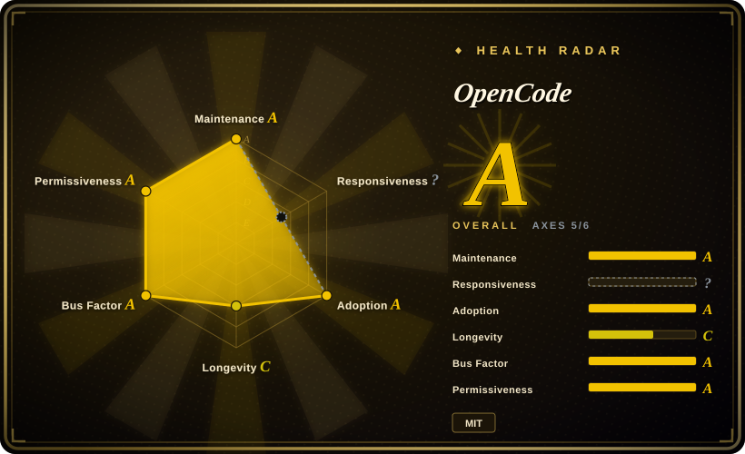
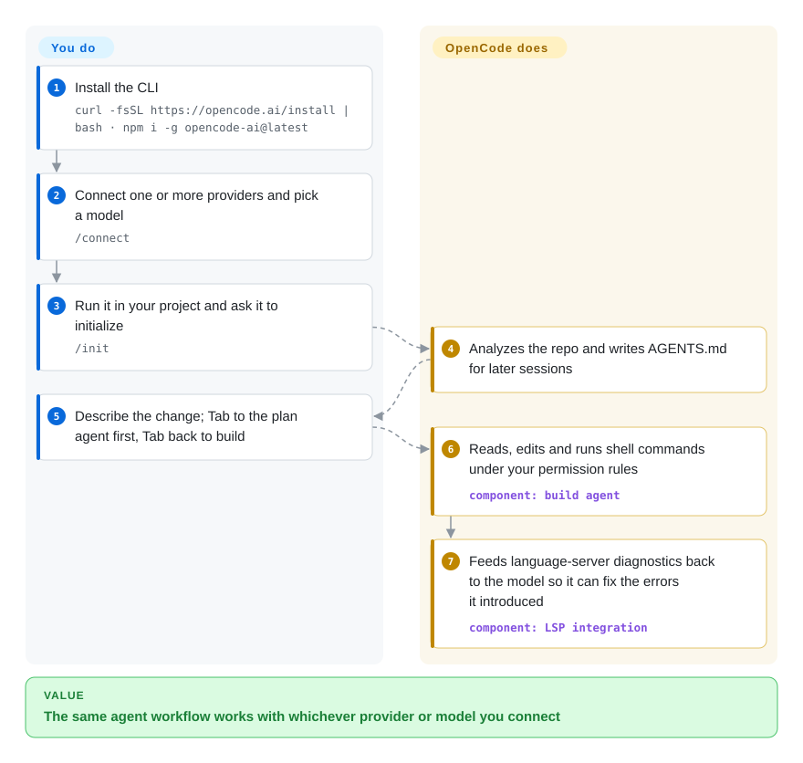

# OpenCode

Your coding-agent habits — the commands, the `AGENTS.md`, the muscle memory — are tied to one vendor's CLI, so when a better or cheaper model ships elsewhere you either switch tools or stay put. OpenCode is an MIT-licensed coding agent that keeps the same terminal workflow and swaps the model underneath: 75+ providers, local models, or a ChatGPT / Copilot subscription you already pay for.

## When to use

You're a developer who uses a coding agent every day and has been burned by lock-in: Claude Code only talks to Anthropic, Codex is tuned for OpenAI, and each time a new model tops the leaderboard you'd have to relearn a tool to try it. You install OpenCode, run `/connect` once per provider (Anthropic API, OpenAI, a ChatGPT Plus or GitHub Copilot login, OpenRouter, a local Ollama/LM Studio server…), and from then on trying a model is `/models` → pick → keep working in the same session, with the same `AGENTS.md`, slash commands and keybindings. A `plan` agent you reach with Tab reads the code and proposes a change without editing anything; Tab again and the `build` agent carries it out, using your project's language servers to see its own compile errors as it goes.

Pick OpenCode over Claude Code or Codex when *model freedom* is the requirement, and over aider when you want an autonomous agent with plan/build modes, subagents, a desktop app and a client/server API rather than a git-commit-per-edit pair programmer.

## How it works

Running `opencode` starts two things: a local HTTP server that owns the sessions, tools and model calls, and a terminal UI that is just one client of it. The same server is what the desktop app, the VS Code/Cursor extension, `opencode run` (non-interactive) and the JS SDK talk to, which is why one agent shows up in so many places. Model access goes through the Vercel AI SDK plus the Models.dev catalogue — the list of providers and models — so a new provider is a config entry, not a new tool. What OpenCode does for you: the agent loop (read files, edit, run shell commands), language-server diagnostics fed back to the model, `/undo` / `/redo` of its edits, and per-tool permission rules (`allow` / `ask` / `deny`). What you do: connect providers, write `AGENTS.md` (or let `/init` draft it), set permission rules if the permissive defaults are too loose for you, and review what it changed.

<!-- flow-steps:begin (generated from flows/opencode.json by tools/flow_card.py — do not edit) -->

Text version of the flow

1. **You**: Install the CLI — `curl -fsSL https://opencode.ai/install | bash · npm i -g opencode-ai@latest`
2. **You**: Connect one or more providers and pick a model — `/connect`
3. **You**: Run it in your project and ask it to initialize — `/init`
4. **OpenCode**: Analyzes the repo and writes AGENTS.md for later sessions
5. **You**: Describe the change; Tab to the plan agent first, Tab back to build
6. **OpenCode**: Reads, edits and runs shell commands under your permission rules — component: `build agent`
7. **OpenCode**: Feeds language-server diagnostics back to the model so it can fix the errors it introduced — component: `LSP integration`

**Value**: The same agent workflow works with whichever provider or model you connect

<!-- flow-steps:end -->

## When NOT to use

- **You want the agent fenced in by default.** OpenCode's documented defaults are permissive — most permissions are `allow`, so edits and shell commands run without asking unless you write `permission` rules — and it has no built-in OS sandbox. If you want a sandbox and approvals out of the box, use [Codex](codex.md) or [Open Interpreter](open-interpreter.md) instead of OpenCode, because they run commands inside an OS-level sandbox before you've configured anything. [推断]
- **You want to use your Claude Pro/Max subscription.** OpenCode's docs say Anthropic prohibits using Pro/Max plans through third-party tools and that OpenCode stopped bundling the plugins that did it as of v1.3.0. If the subscription is your Claude budget, use Claude Code instead of OpenCode, because only the vendor tool is allowed to spend it; OpenCode needs an Anthropic API key (pay per token) or another provider.
- **You want an editor-native agent with in-editor diff approval.** The OpenCode IDE extension mostly opens the terminal UI in a split pane and passes your selection to it. If you want approve/reject buttons and inline diffs inside VS Code, use [Cline](../ide-agents/cline.md) or [Kilo Code](../ide-agents/kilocode.md) instead, because their whole UX lives in the editor.
- **You found an "OpenCode" written in Go.** That is `opencode-ai/opencode`, a different, now-archived project whose author continued it as Charm's Crush (未收录). If you want that Go terminal agent, follow Crush instead of this repo — configs and docs are not interchangeable.
- **You need a slow-moving, stable tool.** OpenCode ships several releases a week (v1.18.x as of 2026-10) and has reshaped config before (the `tools` booleans were folded into `permission` in v1.1.1). If you script around it in CI, pin a version; if you need a tool whose CLI barely changes, use [aider](aider.md) instead, because its interface has been stable for years.
- **Sharing sessions would leak code.** `/share` uploads the conversation to opencode.ai's servers and serves it from a public link (manual by default, `auto` if configured). In a regulated codebase set `"share": "disabled"` in `opencode.json` — or pick a tool without a hosted share feature — before anyone types `/share`.

## Comparison

| Alternative | In index | Our verdict | Tradeoff |
| --- | --- | --- | --- |
| Claude Code | 未收录 | If you are all-in on Claude and want to spend a Pro/Max subscription, pick Claude Code; pick OpenCode when you want the same terminal workflow across many vendors. | Claude Code is closed-source and Anthropic-only but can use the subscription; OpenCode is MIT and multi-provider but must use API keys for Anthropic models. |
| [Codex](codex.md) | ✅ | When you mostly use OpenAI models and want an OS sandbox by default, pick Codex; pick OpenCode when switching providers per task matters more than default isolation. | Codex is Apache-2.0 and sandboxed but tuned for OpenAI; OpenCode reaches 75+ providers but starts from permissive permissions. |
| [Open Interpreter](open-interpreter.md) | ✅ | To run cheap open models through the vendor-style harness they were tuned for, pick Open Interpreter; pick OpenCode for one consistent agent with desktop, IDE and server surfaces. | Open Interpreter changes the scaffolding per model on a young Codex fork; OpenCode keeps one loop and a broader client ecosystem. |
| [Kilo Code](../ide-agents/kilocode.md) | ✅ | If your team lives in VS Code or JetBrains and wants an in-editor agent with a model gateway, pick Kilo Code; pick OpenCode when the terminal is home. | Kilo's CLI is itself a fork of OpenCode; Kilo adds editor UI and a hosted gateway, OpenCode stays the upstream terminal-first core. |
| [aider](aider.md) | ✅ | For careful pair programming where every edit becomes a git commit, pick aider; pick OpenCode for autonomous plan/build agents and subagents. | aider is older and steadier with less autonomy; OpenCode does more per prompt and changes faster. |

## Tech stack

- **TypeScript on Bun** — monorepo (`packages/opencode` core, `tui`, `desktop`, `app`, `sdk`, `server`, `console`, `web`), built with Turborepo; Effect for the service layer.
- **Client/server split** — `opencode serve` exposes an OpenAPI 3.1 HTTP API (default `127.0.0.1:4096`); the TUI, desktop app, IDE extension and SDK are clients.
- **Model layer** — Vercel AI SDK + Models.dev provider catalogue; local models via OpenAI-compatible servers.
- **Code intelligence** — built-in and auto-installed LSP servers whose diagnostics are fed back to the agent; MCP servers, custom tools, plugins, skills and custom agents.
- **Distribution** — install script, npm (`opencode-ai`), Homebrew tap, Scoop/Chocolatey, AUR, Nix, a Docker image, and desktop installers.

## Dependencies

- **Runtime:** a single binary from the install script or a package manager; Node.js/Bun only if you install via npm/bun. A modern terminal emulator is recommended (WezTerm, Alacritty, Ghostty, Kitty); on Windows, WSL is the recommended path.
- **Model access:** at least one provider credential — API key, ChatGPT Plus / GitHub Copilot / GitLab Duo login, OpenCode Zen/Go (the team's paid model gateway, optional), or a local model server. Keys are stored in `~/.local/share/opencode/auth.json`.
- **Optional:** language servers for your stack (many auto-install), MCP servers, and network access to opencode.ai only if you use `/share` or Zen.

## Ops difficulty

**Low.** It is a local process: install, `/connect`, run. The work is policy, not infrastructure — writing `permission` rules if you don't want shell commands to auto-run, disabling `/share` where code is sensitive, guarding the `auth.json` credential file, and pinning a version for scripted use because releases land several times a week. Running `opencode serve` for remote clients adds one more thing to secure (set `OPENCODE_SERVER_PASSWORD`).

## Health & viability
- **Maintenance**: Grade A — 13/13 active weeks in trailing 13; last commit 0 days ago.
- **Responsiveness**: Cannot be scored — no_traffic.
- **Adoption**: Grade A — 91,946,158 release-asset downloads and 88,990 Homebrew installs in 90 days (scorer, 2026-10-09). The npm CLI package `opencode-ai` is not linked to this repo in the registry index, so it is not counted.
- **Longevity**: Grade C — 526 days old.
- **Governance**: Grade A — top-3 contributor share 41.3% (429 active maintainers in the trailing 12 months).
- **Risk / License**: Grade A — MIT license.
- **Verdict (2026-10-08): strong momentum, young, company-steered.** Owned by Anomaly (the team formerly behind SST — `sst/opencode` now redirects here), with the two founders still the top committers and a monetization path in OpenCode Zen/Go and an Enterprise offer. At ~17 months old the Lindy prior is weak, but the release cadence (100 releases between 2026-04-27 and 2026-10-06) and the number of downstream forks such as Kilo's CLI suggest it would outlive any single maintainer. [推断] The main risk flags are churn, not licensing: MIT with no relicense history.

## Caveats (unverified)

- [未验证] Repo facts as of 2026-10-08 via GitHub API: created 2025-04-30, default branch `dev`, last push 2026-10-08, not archived, ~212k stars, ~28.3k forks, MIT, TypeScript, owner `anomalyco` (Organization); latest release v1.18.35 on 2026-10-06. Star growth this fast on a 17-month-old repo is a hype signal as much as an adoption one.
- [推断] "Formerly SST" rests on `sst/opencode` redirecting to `anomalyco/opencode` and the repo still carrying `sst.config.ts`; no announcement was read.
- [推断] "No built-in OS sandbox" is inferred from the permissions docs (allow/ask/deny rules only) and the docs mentioning sandboxing only for third-party ecosystem plugins; not confirmed against source.
- [未验证] The responsiveness axis could not be scored (`no_window_signal`) despite thousands of open issues, which looks like a scorer artifact; adoption leaves out npm installs of `opencode-ai`, so if anything it understates use.
- [未验证] The Anthropic Pro/Max restriction and the v1.3.0 plugin removal are as stated in OpenCode's provider docs; Anthropic's own terms were not read here.
- [未验证] The Go `opencode-ai/opencode` → Charm Crush lineage is from that archived repo's README.
