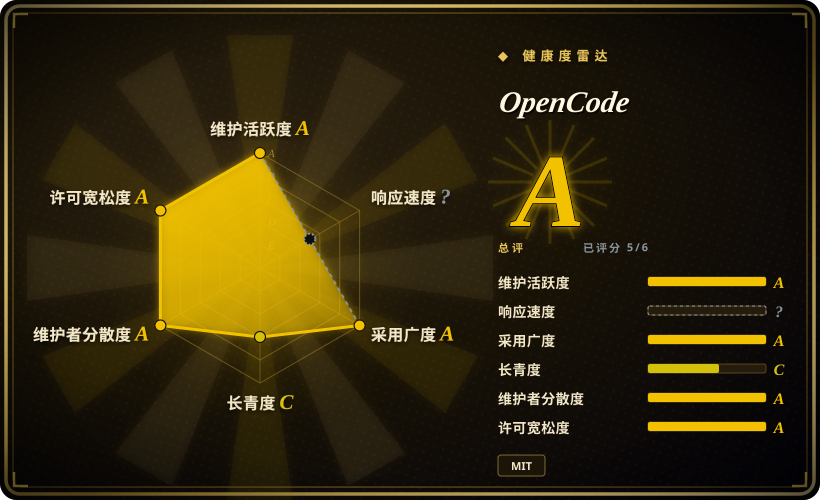
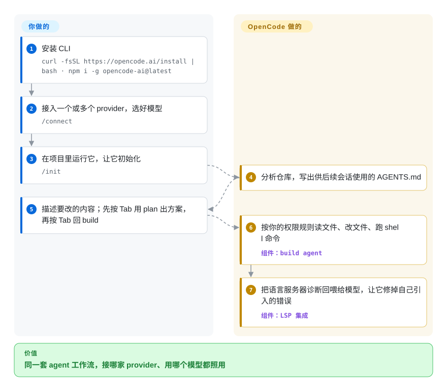

# OpenCode

你用编码 agent 的那套习惯——命令、`AGENTS.md`、手感——全绑在某一家厂商的 CLI 上，别家出了更强或更便宜的模型，你要么换工具重学，要么干看着。OpenCode 是一个 MIT 许可的编码 agent，终端里的工作方式不变，底下的模型随便换：75+ 家 provider、本地模型，或者你已经在付费的 ChatGPT / Copilot 订阅。

## 何时使用

你是每天都在用编码 agent 的开发者，被锁定坑过：Claude Code 只认 Anthropic，Codex 为 OpenAI 调优，每次新模型登上榜首，想试一下就得重学一个工具。你装上 OpenCode，每个 provider 跑一次 `/connect`（Anthropic API、OpenAI、ChatGPT Plus 或 GitHub Copilot 登录、OpenRouter、本地 Ollama / LM Studio……），此后试新模型就是 `/models` → 选中 → 在同一个会话里接着干，`AGENTS.md`、斜杠命令和快捷键都不变。按 Tab 切到 `plan` agent，它只读代码、给方案，不动任何文件；再按 Tab 回到 `build` agent 去落实，过程中它借你项目的语言服务器看到自己引入的编译错误。

当“模型自由”是硬要求时，选 OpenCode 而不是 Claude Code 或 Codex；当你要的是带 plan / build 模式、子 agent、桌面应用和客户端/服务端 API 的自主 agent，而不是每次编辑一个 git 提交的结对编程工具时，选它而不是 aider。

## 怎么用起来

运行 `opencode` 会同时启动两样东西：一个本地 HTTP 服务，管会话、工具和模型调用；一个终端界面，它只是这个服务的一个客户端。桌面应用、VS Code / Cursor 扩展、非交互的 `opencode run` 和 JS SDK 连的都是同一个服务，所以同一个 agent 能出现在这么多地方。模型接入走 Vercel AI SDK 加 Models.dev 目录（一份 provider 和模型清单），所以多接一家 provider 只是多一条配置，而不是换一个工具。OpenCode 替你做的：agent 循环（读文件、改文件、跑 shell 命令）、把语言服务器的诊断信息回喂给模型、`/undo` / `/redo` 撤销重做它的改动、按工具执行权限规则（`allow` / `ask` / `deny`）。你要做的：接好 provider，写 `AGENTS.md`（或让 `/init` 起个草稿），默认权限太宽就自己写规则，最后审它改了什么。

<!-- flow-steps:begin (generated from flows/opencode.json by tools/flow_card.py — do not edit) -->

流程文字版

1. **你**：安装 CLI — `curl -fsSL https://opencode.ai/install | bash · npm i -g opencode-ai@latest`
2. **你**：接入一个或多个 provider，选好模型 — `/connect`
3. **你**：在项目里运行它，让它初始化 — `/init`
4. **OpenCode**：分析仓库，写出供后续会话使用的 AGENTS.md
5. **你**：描述要改的内容；先按 Tab 用 plan 出方案，再按 Tab 回 build
6. **OpenCode**：按你的权限规则读文件、改文件、跑 shell 命令 — 组件：`build agent`
7. **OpenCode**：把语言服务器诊断回喂给模型，让它修掉自己引入的错误 — 组件：`LSP 集成`

**价值**：同一套 agent 工作流，接哪家 provider、用哪个模型都照用

<!-- flow-steps:end -->

## 何时不用

- **你希望 agent 默认就被关在笼子里。** OpenCode 文档写明默认权限偏宽松——大多数权限是 `allow`，不写 `permission` 规则的话，改文件和 shell 命令都不会先问你——而且没有内置 OS 沙箱。想要开箱即用的沙箱和审批，用 [Codex](codex.zh.md) 或 [Open Interpreter](open-interpreter.zh.md)，而不是 OpenCode，因为它们在你什么都没配之前就把命令放进 OS 级沙箱里跑。[推断]
- **你想用自己的 Claude Pro/Max 订阅。** OpenCode 文档说 Anthropic 明确禁止通过第三方工具使用 Pro/Max 套餐，OpenCode 从 v1.3.0 起也不再捆绑实现这件事的插件。如果订阅就是你的 Claude 预算，用 Claude Code 而不是 OpenCode，因为只有厂商自家工具被允许用它；OpenCode 用 Anthropic 模型得走 API key（按 token 计费）或换别的 provider。
- **你要的是编辑器原生、在编辑器里逐块批准 diff 的 agent。** OpenCode 的 IDE 扩展主要是在分屏终端里打开它的终端界面，并把你选中的内容传过去。想在 VS Code 里有“接受 / 拒绝”按钮和行内 diff，用 [Cline](../ide-agents/cline.zh.md) 或 [Kilo Code](../ide-agents/kilocode.zh.md)，因为它们整个交互都长在编辑器里。
- **你找到的“OpenCode”是 Go 写的。** 那是 `opencode-ai/opencode`，另一个项目，已归档，作者把它延续成了 Charm 的 Crush（未收录）。要那个 Go 终端 agent，就跟 Crush 走，别用这个仓库——两边的配置和文档不通用。
- **你需要一个变化慢、稳定的工具。** OpenCode 一周发好几个版本（截至 2026-10 为 v1.18.x），也改过配置结构（v1.1.1 把 `tools` 布尔开关并进了 `permission`）。在 CI 里写脚本调用它就锁定版本；需要 CLI 几乎不变的工具，就用 [aider](aider.zh.md)，因为它的界面多年来一直很稳。
- **分享会话会泄露代码。** `/share` 会把对话上传到 opencode.ai 的服务器，生成公开链接（默认手动，配置成 `auto` 则自动）。在受监管的代码库里，先在 `opencode.json` 里设 `"share": "disabled"`——或者换一个没有托管分享功能的工具——别等有人敲了 `/share` 再说。

## 横向对比

| 替代品 | 是否收录 | 我们的评价 | 取舍 |
| --- | --- | --- | --- |
| Claude Code | 未收录 | 全押 Claude、想花掉 Pro/Max 订阅，选 Claude Code；想在多家厂商之间保持同一套终端工作流，选 OpenCode。 | Claude Code 闭源、只用 Anthropic，但能用订阅；OpenCode 是 MIT、多 provider，但用 Anthropic 模型必须走 API key。 |
| [Codex](codex.zh.md) | ✅ | 主要用 OpenAI 模型、想默认有 OS 沙箱，选 Codex；按任务切换 provider 比默认隔离更重要时，选 OpenCode。 | Codex 是 Apache-2.0、带沙箱，但为 OpenAI 调优；OpenCode 能接 75+ provider，但默认权限宽松。 |
| [Open Interpreter](open-interpreter.zh.md) | ✅ | 想让便宜的开源模型跑在它们习惯的厂商风格 harness 里，选 Open Interpreter；想要一个统一的 agent，外加桌面、IDE 和服务端入口，选 OpenCode。 | Open Interpreter 在一个年轻的 Codex fork 上按模型换脚手架；OpenCode 保持同一个循环，客户端生态更广。 |
| [Kilo Code](../ide-agents/kilocode.zh.md) | ✅ | 团队常驻 VS Code 或 JetBrains、想要编辑器内 agent 加模型网关，选 Kilo Code；主场在终端，选 OpenCode。 | Kilo 的 CLI 本身就是 OpenCode 的 fork；Kilo 多了编辑器界面和托管网关，OpenCode 是终端优先的上游核心。 |
| [aider](aider.zh.md) | ✅ | 想谨慎结对、每次编辑都成一个 git 提交，选 aider；想要自主的 plan / build agent 和子 agent，选 OpenCode。 | aider 更老更稳、自主性低；OpenCode 每个提示能做更多，变化也更快。 |

## 技术栈

- **Bun 上的 TypeScript**——monorepo（`packages/opencode` 核心、`tui`、`desktop`、`app`、`sdk`、`server`、`console`、`web`），用 Turborepo 构建；服务层用 Effect。
- **客户端 / 服务端分离**——`opencode serve` 暴露 OpenAPI 3.1 HTTP API（默认 `127.0.0.1:4096`）；终端界面、桌面应用、IDE 扩展和 SDK 都是客户端。
- **模型层**——Vercel AI SDK + Models.dev provider 目录；本地模型走 OpenAI 兼容服务。
- **代码智能**——内置并可自动安装的 LSP 服务，诊断信息回喂给 agent；支持 MCP 服务、自定义工具、插件、skills 和自定义 agent。
- **分发**——安装脚本、npm（`opencode-ai`）、Homebrew tap、Scoop / Chocolatey、AUR、Nix、Docker 镜像和桌面安装包。

## 依赖

- **运行时：** 安装脚本或包管理器给你一个独立二进制；只有经 npm / bun 安装时才需要 Node.js / Bun。建议用现代终端（WezTerm、Alacritty、Ghostty、Kitty）；Windows 上推荐走 WSL。
- **模型接入：** 至少一个 provider 凭据——API key、ChatGPT Plus / GitHub Copilot / GitLab Duo 登录、OpenCode Zen / Go（团队自营的付费模型网关，可选），或本地模型服务。凭据存放在 `~/.local/share/opencode/auth.json`。
- **可选：** 你技术栈的语言服务器（很多会自动安装）、MCP 服务；只有用 `/share` 或 Zen 时才需要访问 opencode.ai。

## 运维难度

**低。** 它就是个本地进程：安装、`/connect`、运行。要花功夫的是策略而不是基础设施——不想让 shell 命令自动执行就写 `permission` 规则，代码敏感的地方关掉 `/share`，保护好 `auth.json` 凭据文件，脚本化使用时锁定版本（一周会发好几个版本）。如果为远程客户端跑 `opencode serve`，还要多守一个入口（设置 `OPENCODE_SERVER_PASSWORD`）。

## 健康度与可持续性
- **维护活跃度**：Grade A——最近 13 周中 13 周有提交；最后提交距今 0 天。
- **响应速度**：无法计算——no_traffic。
- **采用广度**：Grade A——release 资产下载 91,946,158 次，Homebrew 90 天安装 88,990 次（评分器，2026-10-09）。npm 上的 CLI 包 `opencode-ai` 在注册表索引里没有链接到本仓库，所以没有计入。
- **长青度**：Grade C——仓库已创建 526 天。
- **治理集中度**：Grade A——前三贡献者占比 41.3%（过去 12 个月内 429 位活跃维护者）。
- **许可风险**：Grade A——MIT 许可证。
- **结论（2026-10-08）：势头强、年轻、由公司主导。** 归属 Anomaly（原 SST 团队——`sst/opencode` 现在会跳转到这里），两位创始人仍是提交最多的人，变现路径是 OpenCode Zen / Go 和企业版。仓库约 17 个月，Lindy 先验很弱；但发版节奏（2026-04-27 到 2026-10-06 共 100 个版本）以及 Kilo CLI 这样的下游 fork 说明，它不太会因为某一个维护者离开而停摆。[推断] 主要风险是变化太快，而不是许可：MIT，无改许可历史。

## 存疑（未验证）

- [未验证] 截至 2026-10-08 的 GitHub API 仓库事实：2025-04-30 创建，默认分支 `dev`，最后推送 2026-10-08，未归档，约 212k star、约 28.3k fork，MIT，TypeScript，owner 为 `anomalyco`（Organization）；最新版本 v1.18.35，发布于 2026-10-06。一个 17 个月大的仓库 star 涨这么快，既是采用信号，也是炒作信号。
- [推断] “原 SST 团队”的依据是 `sst/opencode` 跳转到 `anomalyco/opencode`，且仓库仍带 `sst.config.ts`；没有读到正式公告。
- [推断] “没有内置 OS 沙箱”是根据权限文档（只有 allow / ask / deny 规则）以及文档只在第三方生态插件里提到沙箱推断的；未对照源码确认。
- [未验证] 响应速度一轴没能打分（`no_window_signal`），可仓库有几千个未关闭 issue，看起来是打分器的偏差；采用度没有计入 `opencode-ai` 的 npm 安装量，要说偏差也只会是低估。
- [未验证] Anthropic 禁止第三方使用 Pro/Max 以及 v1.3.0 移除插件，出自 OpenCode 的 provider 文档；未阅读 Anthropic 自己的条款。
- [未验证] Go 版 `opencode-ai/opencode` → Charm Crush 的传承关系出自那个已归档仓库的 README。
