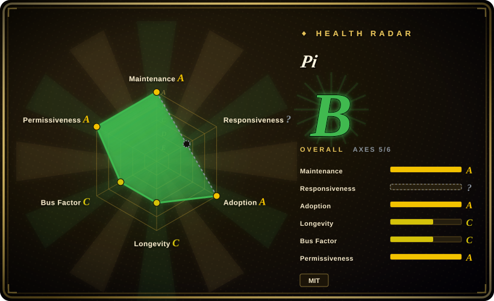
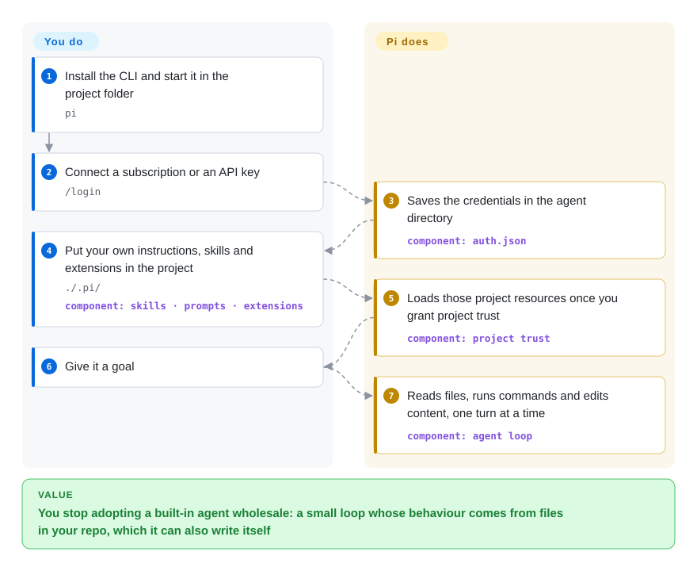

# Pi

The terminal agent that is pleasant out of the box is the one you cannot change: its system prompt is compiled in, compaction is a black box, and the one behaviour you want different is a roadmap item. Pi keeps the loop deliberately small and hands you the levers as files in your own repository — prompt templates, skills, and TypeScript extensions it can also write for itself.

## When to use

You live in a terminal and you have opinions about how an agent should behave in yours: which files carry instructions, what it may run without asking, how much of the session it remembers. Most agents that feel good on the first run are closed at exactly the layer you care about — you configure them, you do not modify them, and a project-specific quirk turns into a feature request.

Reach for Pi when you would rather build that behaviour out of files you own. Under the terminal UI sits a small agent core, and nearly everything above the core is a resource: `.pi/skills/` for on-demand instructions, `.pi/prompts/` for snippets exposed as slash commands, `.pi/extensions/` for TypeScript modules loaded into the process, plus `SYSTEM.md` / `APPEND_SYSTEM.md` to override or extend the prompt — at user level (`~/.pi/agent/`) or per project once you grant project trust. Choose it over [OpenCode](opencode.md) when the extension point you want is a TypeScript module rather than a settings surface, and over [Codex](codex.md) when you would rather own the isolation story yourself than inherit a vendor's sandboxing. Two more things separate it from a plain CLI: the same core runs as print, JSON-event and RPC modes and as a TypeScript SDK, and `/login` can attach a subscription instead of an API key.

## Q&A

**Is Pi the same kind of thing as an agent SDK like Strands Agents?**
Not at the same layer. Pi's product is the terminal agent; what shares a cell with an agent SDK is its library layer — `@earendil-works/pi-ai` for the provider abstraction and `@earendil-works/pi-agent-core` for the loop — which is published separately and usable on its own. If you are embedding an agent in your own service, judge it by those packages, not by the CLI.

**What does "extensible, it can adapt itself" actually mean in practice?**
It means the resources above are plain files, and Pi is allowed to write them: ask for a prompt template, a skill, or an extension and the next turn loads it. It is a real mechanism, not a marketing line — and it is also why the trust decision matters, since an extension is TypeScript running inside the Pi process.

**There is no permission system — what actually bounds it?**
Project trust decides which project resources Pi loads; it does not decide what the tools may touch. Enabled tools run with the permissions of the Pi process, so the boundary is the one you put around that process (the docs offer a micro-VM, plain Docker, or a policy-controlled sandbox). If you need the product itself to be the boundary, this is the wrong tool.

## How it works

Pi is a TypeScript program that owns one agent loop and exposes it through several interfaces. A message is appended to the active branch of a session tree, and Pi builds a model request from the system prompt, that branch, the tool definitions and the skill descriptions; the provider streams back text and tool calls, Pi executes them and records the results, and the turn ends — another turn starts only if there is more work. Sessions are JSONL files where each entry points at its parent, which makes "resume" and "branch" the same operation: you pick a different parent, and compaction simply inserts a summary entry while the originals stay on disk. What it takes over: context assembly, compaction, tool dispatch, session storage and the terminal rendering. What stays yours: the model account, the working folder, and the decision about how much isolation to put around the process — because there is no built-in permission layer, only project trust for resource loading. An analogy that stays true: it is less an application you configure and more a small runtime with a reference client, which is why the same code appears as a TUI, a scriptable command, and an SDK.

<!-- flow-steps:begin (generated from flows/pi.json by tools/flow_card.py — do not edit) -->

Text version of the flow

1. **You**: Install the CLI and start it in the project folder — `pi`
2. **You**: Connect a subscription or an API key — `/login`
3. **Pi**: Saves the credentials in the agent directory — component: `auth.json`
4. **You**: Put your own instructions, skills and extensions in the project — `./.pi/` — component: `skills · prompts · extensions`
5. **Pi**: Loads those project resources once you grant project trust — component: `project trust`
6. **You**: Give it a goal
7. **Pi**: Reads files, runs commands and edits content, one turn at a time — component: `agent loop`

**Value**: You stop adopting a built-in agent wholesale: a small loop whose behaviour comes from files in your repo, which it can also write itself

<!-- flow-steps:end -->

## When NOT to use

- **You need the tool itself to be a security boundary.** The README is explicit that Pi has no built-in permission system for filesystem, process, network or credential access, and that project trust gates resource loading rather than tool execution. Use [Open Interpreter](open-interpreter.md) or [Codex](codex.md) instead, because native or OS-level sandbox execution is part of those products rather than an extension you add.
- **You want an editor-integrated agent.** Pi is a CLI and TUI. Use [Cline](../ide-agents/cline.md) or [Kilo Code](../ide-agents/kilocode.md) instead, because the diff-and-review loop lives in the editor there.
- **You want a Lindy-backed, low-risk dependency.** The repository was created 2025-08-09 and reached ~108.8k stars in about thirteen months, with one author (`badlogic` / Mario Zechner) holding most of the commit history. Use [aider](aider.md) or [OpenCode](opencode.md) instead of Pi, because age × still-active is the prior this index uses and a young, hyped repository is a risk flag rather than proof.
- **You plan to send patches upstream or lean on community response times.** New issues and pull requests from new contributors are closed automatically and reviewed in daily batches. Use [OpenCode](opencode.md) or [aider](aider.md) instead, because their contribution path is the ordinary one if upstream participation is part of your plan.
- **You want a vendor with an enterprise story behind the tool.** Pi is an independent project with a small org behind it. Use [Codex](codex.md) or [Gemini CLI](gemini-cli.md) instead when procurement wants a named vendor, a support contract, and an account team.
- **You need detachable long runs whose context is programmatic rather than conversational.** Pi's loop lives and dies with the process it started in. Use [Prime Agent](prime-agent.md) instead, because that fork adds a daemon, a persistent Python kernel and `rlm.spawn(...)` for jobs that must survive a closed terminal.

## Comparison

| Alternative | In index | Our verdict | Tradeoff |
|---|---|---|---|
| [OpenCode](opencode.md) | ✅ | Choose OpenCode when you want a model-flexible terminal agent steered by config and plugins; choose Pi when the thing you want to rewrite is the agent loop itself and TypeScript is an acceptable price. | Both are npm-installed MIT terminal agents; OpenCode optimises for configuration breadth, Pi for a small core you extend in code. |
| [Codex](codex.md) | ✅ | Choose Codex when documented sandboxing and a vendor-backed product are the deciding factors; choose Pi when you want the sandbox to be your container decision rather than the tool's opinion. | Codex hands you safety defaults and ties you to OpenAI's stack; Pi stays provider-flexible and leaves isolation to you. |
| [aider](aider.md) | ✅ | Choose aider for git-native pair-programming with years of still-active history; choose Pi when self-modifying resources and multi-interface embedding matter more than longevity. | aider is the Lindy-safe choice with a narrower surface; Pi is the younger, wider, riskier one. |
| [Prime Agent](prime-agent.md) | ✅ | Choose Prime Agent when a long run must outlive the terminal and the model should program over context; choose Pi when you want the upstream minimal agent without a daemon and a Python kernel. | Prime Agent is a hard fork that adds a multi-process runtime and an RLM loop; Pi is the smaller base it forked from. |
| [Open Interpreter](open-interpreter.md) | ✅ | Choose Open Interpreter when you want a native OS sandbox and a harness tuned for cheaper models; choose Pi when upstream minimality and the TypeScript extension model are the point. | Open Interpreter buys safety and model economy with a heavier fork lineage; Pi buys a small core and asks you to bring the boundary. |

## Tech stack

- **TypeScript npm workspaces** publishing `@earendil-works/pi-ai` (unified multi-provider LLM API), `pi-agent-core` (loop, tool execution, event stream), `pi-coding-agent` (the CLI), `pi-tui`, plus `pi-durable`, `pi-telemetry` and `chord`.
- **Biome + vitest** in-repo with husky hooks; `npm run check` covers lint, format, type checking and pinned-dependency verification.
- **Node.js 22.19 or newer** for the npm install path; standalone binaries are built from versioned source archives published with the releases.
- **Distribution is deliberately hardened:** direct external dependencies pinned to exact versions, `save-exact=true` and `min-release-age=2` in `.npmrc`, a generated `npm-shrinkwrap.json` shipped in the published CLI, and a scheduled `npm audit --omit=dev` workflow.

## Dependencies

- **Node.js 22.19+**, or a released standalone binary if you would rather not run npm.
- **A model provider.** `/login` inside Pi connects a subscription or an API key and stores credentials in `auth.json` under the agent directory (default `~/.pi/agent`); other providers and compatible endpoints are configured through `models.json`.
- **A working directory** Pi may read, write and run commands in — plus, if you need real isolation, a container or micro-VM around the whole process.
- **Optional:** MCP servers, TypeScript extensions, skills, prompt templates and themes, either user-level (`~/.pi/agent/`) or project-level (`.pi/`, loaded after project trust). `PI_CODING_AGENT_DIR` relocates the agent directory.

## Ops difficulty

**Low, with a trust decision instead of an operational one.** Setup is one npm install (or one install script) and `/login`; there is no server, no database and no daemon. Sessions are JSONL files under the agent directory, and `/sessions`-style resumption reads them back rather than replaying history. The real work is deciding the boundary: because tools and extensions execute with your user's permissions, the meaningful configuration is where you run Pi, not what you set inside it. Day-2 tasks are small — `/settings` for preferences, `/reload` after hand-editing resources, and `PI_CODING_AGENT_DIR` when you want the agent state somewhere else. The documented containerization patterns are the parts to read before pointing it at anything you would not hand a shell script.

## Health & viability

- **Maintenance:** Grade A — `v0.87.1` published 2026-09-22, six releases in the six days before this page was written, the default branch pushed the same day, and 13 of 13 active weeks.
- **Responsiveness:** Not scored (`?`, no window signal) — the index found no qualifying issue set to measure. The auto-close policy for new contributors is a plausible cause of that shape, not a measured one.
- **Adoption:** Grade A — measured on 2026-09-23, the canonical package records 16,404,021 npm downloads in the last month, with the CLI package at 9,369,096, alongside ~108.8k stars and ~13.8k forks. Very high for its age, and consistent with the CLI being driven by scripts and other tools, not only by humans.
- **Longevity:** Grade C — 410 days old (created 2025-08-09). Still-active, not long-lived.
- **Governance:** Grade C — 98 active maintainers over 12 months on paper, but top-1 share 60.0% and top-3 77.1%: commits concentrate in two well-known authors. An independent org (`earendil-works`), so there is no foundation behind the roadmap.
- **Risk / License:** Grade A — MIT, no relicense in 36 months, and supply-chain discipline (exact pins, `min-release-age=2`, a shipped shrinkwrap, a scheduled `npm audit`) that is unusually strong for the age. The deliberate risks sit elsewhere: no built-in permission system, and new-contributor issues and pull requests auto-closed.

## Caveats (unverified)

- [未验证] That nothing besides project trust gates tool execution: the "no built-in permission system" claim comes from the README and the security/containerization docs, not from reading the tool implementations.
- [未验证] What fraction of the ~9.4M monthly npm downloads for the CLI are CI, mirrors or automated installs rather than people using it interactively.
- [推断] The high fork-to-star ratio (about 13% on 2026-09-23) may include mirrors and one-off forks rather than a downstream ecosystem.
- [推断] Star count and watcher count diverge sharply (334 subscribers for ~108.8k stars), which is more consistent with attention than with a large resident user base.
- [推断] Auto-closing new-contributor submissions is likely to suppress first-time contributors; the effect on maintainer response times was not measured.
- [未验证] Whether the standalone binary and the npm install behave identically, including how each updates itself.
- [未验证] The real-world quality of extension isolation: extensions run in the Pi process by design, but no audit of the extension distribution channel was performed.
