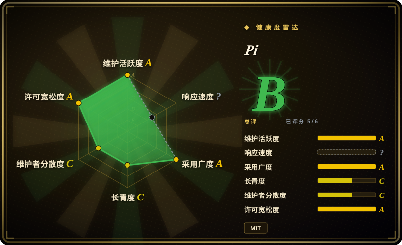
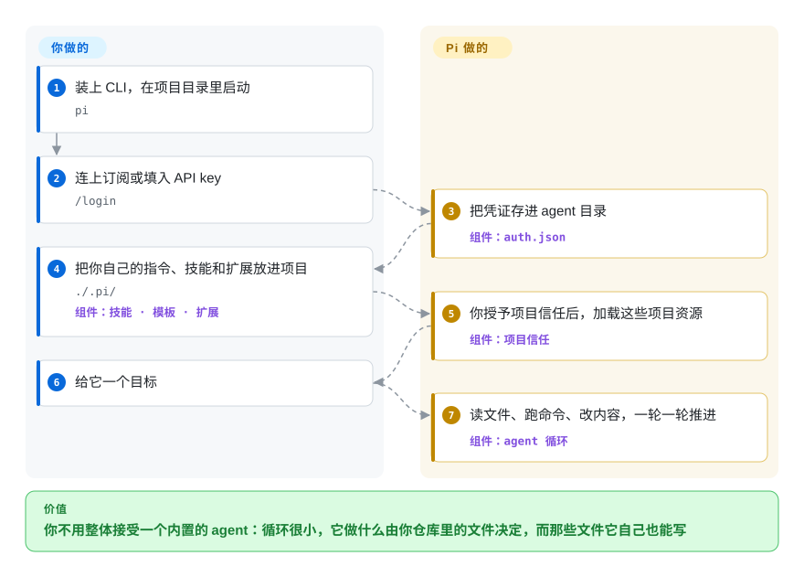

# Pi

开箱就顺手的那种终端 agent，往往正是你改不动的那种：system prompt 编在代码里、压缩逻辑是个黑箱，唯一想改的那一处行为只是路线图上的一个条目。Pi 把循环刻意做小，把旋钮交出来——就是你仓库里的文件：prompt 模板、技能、以及它自己也能写的 TypeScript 扩展。

## 何时使用

你整天泡在终端里，对 agent 在你这里该怎么表现有具体要求：哪些文件承担指令、什么操作不许它不问就做、会话里留多少东西。第一印象很好的那些 agent，恰恰在你最在意的这一层是关的——你只能配置它们，不能改它们，一个项目特有的怪癖就变成了一张 feature request。

与其这样，不如用文件把行为搭出来，那就选 Pi。终端界面之下是一个很小的 agent 内核，而内核之上的东西几乎全是资源：`.pi/skills/` 放按需加载的指令，`.pi/prompts/` 放暴露成斜杠命令的片段，`.pi/extensions/` 放会被加载进进程的 TypeScript 模块，再加 `SYSTEM.md` / `APPEND_SYSTEM.md` 覆盖或追加 prompt——可以放在用户级（`~/.pi/agent/`），也可以在你授予项目信任之后按项目放。相比 [OpenCode](opencode.zh.md)，当你想要的扩展点是一个 TypeScript 模块而不是一堆设置项时选它；相比 [Codex](codex.zh.md)，当你宁愿自己承担隔离这件事、而不想继承厂商的沙箱主张时选它。还有两点把它和普通 CLI 分开：同一个内核还能以 print、JSON 事件流、RPC 三种模式运行，并提供一个 TypeScript SDK；而 `/login` 挂的是订阅，不一定是 API key。

## 快问快答

**Pi 和 [Harness SDK](../../agent-runtimes/agent-sdks/harness-sdk.zh.md) 这类 agent SDK 是一类东西吗？**
不在同一层。Pi 的产品是那个终端 agent；真正和 agent SDK 抢同一格的是它的库层——`@earendil-works/pi-ai` 负责供应商抽象、`@earendil-works/pi-agent-core` 负责循环——这两个包是单独发布的，也能单独用。如果你要把 agent 嵌进自己的服务，该看的是这两个包，不是这个 CLI。

**“可扩展、能自己适配自己”落到实际是什么？**
就是指上面那些资源都是普通文件，而且 Pi 被允许去写它们：要一个 prompt 模板、一个技能或一个扩展，它写下来，下一轮就加载。这是真机制不是宣传话术——也正因如此，项目信任那个决定才重要，因为扩展就是跑在 Pi 进程里的 TypeScript。

**没有权限系统，那它到底被什么限制住？**
项目信任决定 Pi 加载哪些项目资源，不决定工具能碰什么。启用的工具带着 Pi 进程的权限运行，所以边界是你套在那个进程外面的东西（文档给了微虚拟机、朴素 Docker、策略沙箱三种）。如果你要的是产品本身成为边界，那这就不是对的工具。

## 怎么用起来

Pi 是一个 TypeScript 程序，拥有唯一一个 agent 循环，并用几种界面把它露出来。一条消息被追加到会话树的当前分支上，Pi 用 system prompt、这个分支、工具定义和技能描述拼出模型请求；供应商回流文本和工具调用，Pi 执行它们、记录结果，一轮结束——只有当还有活要干时才开启下一轮。会话是 JSONL 文件，每一条记录都指向自己的父节点，于是“继续”和“分支”是同一个操作：换一个父节点而已；压缩也只是插入一条摘要记录，原始记录留在盘上。它接管的是：上下文拼装、压缩、工具分发、会话存储和终端渲染。留在你手里的是：模型账号、工作目录，以及“给这个进程套多少隔离”的决定——因为它没有内置权限层，只有负责资源加载的项目信任。一个站得住脚的比喻：它不像是你配置的应用，更像一个自带参考客户端的小运行时，所以同一份代码既是 TUI，也是可脚本化的命令，还是一个 SDK。

<!-- flow-steps:begin (generated from flows/pi.json by tools/flow_card.py — do not edit) -->

流程文字版

1. **你**：装上 CLI，在项目目录里启动 — `pi`
2. **你**：连上订阅或填入 API key — `/login`
3. **Pi**：把凭证存进 agent 目录 — 组件：`auth.json`
4. **你**：把你自己的指令、技能和扩展放进项目 — `./.pi/` — 组件：`技能 · 模板 · 扩展`
5. **Pi**：你授予项目信任后，加载这些项目资源 — 组件：`项目信任`
6. **你**：给它一个目标
7. **Pi**：读文件、跑命令、改内容，一轮一轮推进 — 组件：`agent 循环`

**价值**：你不用整体接受一个内置的 agent：循环很小，它做什么由你仓库里的文件决定，而那些文件它自己也能写

<!-- flow-steps:end -->

## 何时不用

- **你要工具本身成为安全边界。** README 说得很直白：Pi 不含用于限制文件系统、进程、网络或凭证访问的权限系统，项目信任管的是资源加载、不是工具执行。这时候用 [Open Interpreter](open-interpreter.zh.md) 或 [Codex](codex.zh.md)，因为原生或操作系统级沙箱是它们产品的一部分，而不是你后加的一个扩展。
- **你要一个长在编辑器里的 agent。** Pi 是 CLI 加 TUI。这时候用 [Cline](../ide-agents/cline.zh.md) 或 [Kilo Code](../ide-agents/kilocode.zh.md)，因为“看 diff、审改动”这套循环在它们那里发生在编辑器内。
- **你要一个 Lindy 撑腰、低风险的依赖。** 仓库建于 2025-08-09，约十三个月涨到 10.88 万星，而提交历史主要压在一位作者（`badlogic` / Mario Zechner）身上。这时候用 [aider](aider.zh.md) 或 [OpenCode](opencode.zh.md)，因为本索引的先验是“年龄乘持续活跃”，年轻又高热是风险标记而不是证明。
- **你打算往上游送补丁、或指望社区响应速度。** 新贡献者的 issue 和 PR 默认被自动关闭，由维护者每天批量过一遍。这时候用 [OpenCode](opencode.zh.md) 或 [aider](aider.zh.md)，因为如果你的计划里包含参与上游，它们那条贡献路径才是平常的那条。
- **你需要工具背后有说得出口的厂商与企业采购故事。** Pi 是一个独立项目，背后是一个很小的组织。这时候用 [Codex](codex.zh.md) 或 [Gemini CLI](gemini-cli.zh.md)，当采购要的是具名厂商、支持合同和客户团队时。
- **你要的是能把上下文当程序处理、还能脱离终端活下去的长任务。** Pi 的循环和启动它的那个进程同生共死。这时候用 [Prime Agent](prime-agent.zh.md)，因为那个分叉加了 daemon、常驻 Python 内核和 `rlm.spawn(...)`，专门为关掉终端还得继续跑的活准备。

## 横向对比

| 替代品 | 是否收录 | 我们的评价 | 取舍 |
|---|---|---|---|
| [OpenCode](opencode.zh.md) | 已收录 | 要一个靠配置和插件驱动的、模型可换的终端 agent，选 OpenCode；想改的是 agent 循环本身、并且接受用 TypeScript 来改，选 Pi。 | 两者都是 npm 安装的 MIT 终端 agent；OpenCode 押配置面的宽度，Pi 押一个你能用代码扩展的小内核。 |
| [Codex](codex.zh.md) | 已收录 | 有文档化的沙箱和厂商背书的产品是决定因素时，选 Codex；想让沙箱是你自己的容器决定、而不是工具替你拿主意时，选 Pi。 | Codex 给你安全默认值，也把你系在 OpenAI 的栈上；Pi 保持供应商可换，把隔离留给你。 |
| [aider](aider.zh.md) | 已收录 | 要 git 原生、有多年持续活跃历史的结对编程，选 aider；自修改资源和多界面嵌入对你更重要，选 Pi。 | aider 是 Lindy 上更稳、面更窄的那个；Pi 更年轻、更宽、也更冒险。 |
| [Prime Agent](prime-agent.zh.md) | 已收录 | 长任务必须活得比终端久、并且要让模型对着上下文写程序，选 Prime Agent；要上游那个最小 agent、不要 daemon 和 Python 内核，选 Pi。 | Prime Agent 是硬分叉，加了一整套多进程运行时和 RLM 循环；Pi 是它分叉的那个更小的底座。 |
| [Open Interpreter](open-interpreter.zh.md) | 已收录 | 要原生操作系统沙箱、以及为便宜模型调过的 harness，选 Open Interpreter；上游的极小内核和 TypeScript 扩展模型才是重点，选 Pi。 | Open Interpreter 用更重的分叉血统换来安全与模型经济性；Pi 用一个小内核换你自带边界。 |

## 技术栈

- **TypeScript npm workspaces**，发布 `@earendil-works/pi-ai`（统一多供应商 LLM API）、`pi-agent-core`（循环、工具执行、事件流）、`pi-coding-agent`（CLI）、`pi-tui`，以及 `pi-durable`、`pi-telemetry`、`chord`。
- 仓库内用 **Biome 加 vitest**，配 husky 钩子；`npm run check` 覆盖 lint、格式化、类型检查和依赖钉版校验。
- npm 安装路径要求 **Node.js 22.19 以上**；独立二进制由随发布一起提供的版本化源码包构建。
- **发布链路刻意做了加固：** 直接外部依赖钉到精确版本，`.npmrc` 里设 `save-exact=true` 与 `min-release-age=2`，发布的 CLI 里带上生成的 `npm-shrinkwrap.json`，并有定时的 `npm audit --omit=dev` 工作流。

## 依赖

- **Node.js 22.19+**，或者不想用 npm 就用发布出来的独立二进制。
- **一个模型供应商。** 在 Pi 里跑 `/login` 连订阅或 API key，凭证存到 agent 目录下的 `auth.json`（默认 `~/.pi/agent`）；其他供应商和兼容端点通过 `models.json` 配置。
- **一个可读可写可执行命令的工作目录**——另外，如果你需要真正的隔离，就给它整个进程套一层容器或微虚拟机。
- **可选项：** MCP server、TypeScript 扩展、技能、prompt 模板与主题，放用户级（`~/.pi/agent/`）或项目级（`.pi/`，授予项目信任后加载）。`PI_CODING_AGENT_DIR` 可以挪动 agent 目录。

## 运维难度

**低，但要用一个信任决定换掉一个运维决定。** 装起来是一行 npm（或一个安装脚本）加 `/login`；没有服务、没有数据库、没有 daemon。会话是 agent 目录下的 JSONL 文件，恢复时是把它读回来，而不是重放历史。真正的活是划边界：因为工具和扩展带着你用户的权限跑，有意义的配置是“在哪儿跑 Pi”，而不是“在 Pi 里设什么”。日常维护也就几件小事——偏好用 `/settings`，手改资源之后 `/reload`，想把 agent 状态放别处用 `PI_CODING_AGENT_DIR`。文档里那几种容器化方案，是你在把它指向任何“不愿交给一段 shell 脚本”的目录之前该读的部分。

## 健康度与可持续性

- **维护：** 评级 A——`v0.87.1` 发布于 2026-09-22，2026-09-19 到 09-22 这四天里连发四个版本，默认分支当天还有推送，13 周里 13 周活跃。
- **响应：** 无法评分（`?`，无窗口信号）——索引找不到可用于测量的有效 issue 集合。新贡献者提交被自动关闭是这种形态的一个可能原因，但没有实测。
- **采用：** 评级 A——2026-09-23 实测，`@earendil-works/pi-ai` 最近一个月 npm 下载 16,404,021 次，CLI 包 9,369,096 次，另有约 10.88 万星、约 1.38 万 fork。对这个年龄来说非常高，也与“CLI 不只被人用、还被脚本和其他工具驱动”相符。
- **寿命：** 评级 C——410 天（建于 2025-08-09）。仍然活跃，但不算久经考验。
- **治理：** 评级 C——纸面上 12 个月有 98 位活跃维护者，但第一贡献者占 60.0%、前三占 77.1%：提交集中在两位知名作者身上。背后是一个独立组织（`earendil-works`），路线图后面没有基金会。
- **风险与许可：** 评级 A——MIT，36 个月内没有换许可；供应链纪律（精确钉版、`min-release-age=2`、随包发布 shrinkwrap、定时 `npm audit`）对这个年龄来说异常扎实。有意的风险在别处：没有内置权限系统，以及新贡献者的 issue 与 PR 被自动关闭。

## 存疑（未验证）

- [未验证] 除项目信任之外确实没有别的东西把住工具执行：这一说法来自 README 和安全、容器化文档，没有读工具实现来核。
- [未验证] CLI 那每月约 940 万次 npm 下载里，CI、镜像、自动化安装各占多少，有多少是真的有人在交互使用。
- [推断] 偏高的 fork 与 star 比（2026-09-23 约 13%）可能含镜像和一次性 fork，而不是下游生态。
- [推断] 星数与关注者数差距很大（约 10.88 万星对 334 个订阅者），这更像注意力而不是庞大的常住用户群。
- [推断] 自动关闭新贡献者提交很可能压低首次贡献意愿；对维护者响应时间的影响没有实测。
- [未验证] 独立二进制与 npm 安装两条路径的行为是否一致，包括各自怎么自更新。
- [未验证] 扩展隔离在真实世界里的成色：扩展按设计跑在 Pi 进程内，但对扩展的分发渠道没有做安全审计。
