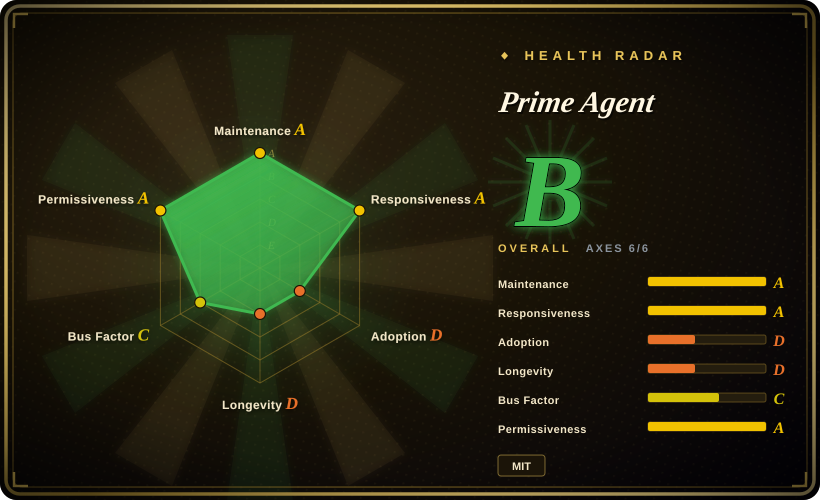
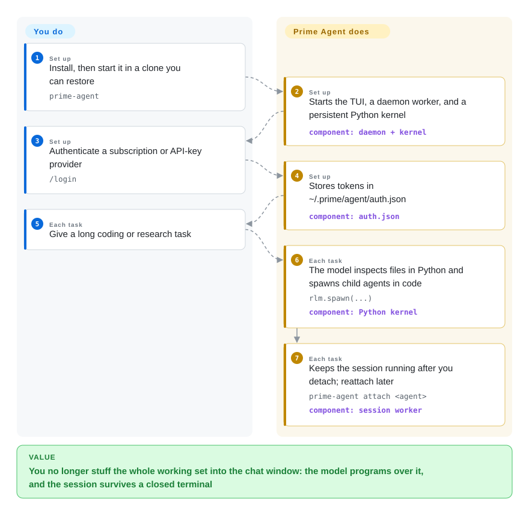

# Prime Agent

A long coding session fills the model's window with files, command dumps, and summaries until it forgets the original goal and starts guessing. Prime Agent keeps that material in a persistent Python interpreter and makes the model write code to inspect it, spawn child agents, and keep going after you close the terminal.

## When to use

You are mid a multi-hour coding or evaluation job — a repo-wide refactor, a research sweep over a large log, a SWE-style rollout that should still be running after you log out — and the usual terminal agent is already losing the plot. The chat is a stack of file dumps and compaction summaries; a bug that only makes sense when two distant files are in the same window never gets seen together. You do not want another list of tools. You want the model to treat the working set as data it can slice in code.

Reach for Prime Agent when that is the constraint. It is a hard fork of `pi` (earendil-works) now shipped by Prime Intellect: the model's one built-in tool is a persistent Python kernel, `rlm.spawn(...)` starts real child agents, and a local daemon keeps the session, kernel, and children alive after the TUI detaches. Choose it over [OpenCode](opencode.md) or [Codex](codex.md) when programmatic context folding and detachable long runs are the point, not model-agnostic pair-programming. Choose it over [OpenHands](../orchestration-and-review/openhands.md) when you want a local CLI/TUI rather than a self-hosted agent platform with its own sandbox. The cost is a multi-process runtime (daemon, worker, kernel), Node.js ≥ 22.8 and Python ≥ 3.11, an install path that is `curl | sh` from Prime's domain, and no default security sandbox.

## Callouts

Other agents dump files into the chat. This one makes the model write Python to look at them. Sounds smarter. The parent stops seeing the files and turns into a dispatcher. Cutting the work into pieces is the part that needed the whole picture — and this setup took the picture away. [推断]

They call it self-improving. `/refine` writes extra prompts. The research bet is that RL will teach the model this scaffold. Their own write-up: short math gets worse with the scaffold on. So it has not learned yet. [推断]

The sandbox warning in the README is the honest bit. RLM, Continual Harness, RSI in the commits — packaging. Install is still `curl | sh` off Prime's domain. The package inside the tree is still named `pi`.

## How it works

The TypeScript host owns providers, transcripts, child lifecycles, and scheduling. What the model sees is a persistent Python REPL: files, shell, skills, and subagents are all reached by writing code, not by a menu of separate tools. `rlm.spawn("…", name="…")` admits a child `AgentSession` with its own context; the call returns a handle immediately, and answers come back as messages or files, not as the spawn return value. Compaction summarizes old chat while kernel variables survive. A daemon worker keeps that tree running after you detach; `/refine` can write small, reviewable updates into supplemental prompts, memories, skill descriptions, or subagent specs without touching the immutable base system prompt. What stays yours: the repo, the provider login, and whether the working tree is disposable. What it takes over: the Python control loop, child admission, session JSONL, and background continuity. Analogy: other agents paste the binder into the conversation; this one hands the model a desk and a filing cabinet and asks it to write the retrieval program.

<!-- flow-steps:begin (generated from flows/prime-agent.json by tools/flow_card.py — do not edit) -->

Text version of the flow

1. **You** (Set up): Install, then start it in a clone you can restore — `prime-agent`
2. **Prime Agent** (Set up): Starts the TUI, a daemon worker, and a persistent Python kernel — component: `daemon + kernel`
3. **You** (Set up): Authenticate a subscription or API-key provider — `/login`
4. **Prime Agent** (Set up): Stores tokens in ~/.prime/agent/auth.json — component: `auth.json`
5. **You** (Each task): Give a long coding or research task
6. **Prime Agent** (Each task): The model inspects files in Python and spawns child agents in code — `rlm.spawn(...)` — component: `Python kernel`
7. **Prime Agent** (Each task): Keeps the session running after you detach; reattach later — `prime-agent attach <agent>` — component: `session worker`

**Value**: You no longer stuff the whole working set into the chat window: the model programs over it, and the session survives a closed terminal

<!-- flow-steps:end -->

## When NOT to use

- **The task is short, and the model needs the materials in the same window.** Cross-file bugs and short math-like jobs live or die on the parent actually seeing A and B together. Prime Intellect's own RLM write-up reports the scaffold hurting math-python versus a plain LLM-plus-Python-tool. Use [Codex](codex.md) or [OpenCode](opencode.md) instead of Prime Agent, because they spend the model's forward pass on the files rather than on writing a retrieval program.
- **You need a default security sandbox.** The README states workers and kernels improve lifecycle isolation, not security; they run with your user permissions. Use [Open Interpreter](open-interpreter.md) or [Codex](codex.md) instead of Prime Agent, because those document OS/native sandbox execution as part of the product, not as an optional extension.
- **You want the smallest local attack surface and no background service.** Prime Agent starts a daemon, a session worker, a Python kernel, and a catalog process, then stores auth in `~/.prime/agent/auth.json`. Use [aider](aider.md) or [OpenCode](opencode.md) instead of Prime Agent, because they stay closer to a single CLI process.
- **You want an in-editor agent.** This is a TUI/CLI. Use [Cline](../ide-agents/cline.md) or [Kilo Code](../ide-agents/kilocode.md) instead of Prime Agent, because those live in the editor.
- **You will not run `curl | sh` from app.primeintellect.ai, or you need a pinned npm/pip coordinate as the public install.** Docs say the inherited `@earendil-works/pi-coding-agent` workspace name is an implementation detail, not the install path. Use [OpenCode](opencode.md) (`npm`) or [Codex](codex.md) instead of Prime Agent, because their published packages are the thing you install.
- **You need a Lindy-backed, low-bus-factor-risk tool.** The repo was created 2026-05-08; as of 2026-09-22 it had ~21.2k stars and ~2.3k forks in about four and a half months, with one author (badlogic / Mario Zechner) at ~64% of sampled top-contributor commits. Use [Codex](codex.md) or [aider](aider.md) instead of Prime Agent, because age × still-active is the prior this index uses, and a young hyped repo is a risk flag rather than proof.

## Comparison

| Alternative | In index | Our verdict | Tradeoff |
|---|---|---|---|
| [OpenCode](opencode.md) | ✅ | Choose OpenCode when you want a model-flexible terminal pair-programmer with an npm install; choose Prime Agent when the model must program over context and keep a daemon-backed session after detach. | OpenCode is the smaller daily driver; Prime Agent adds a Python kernel, recursive children, and a multi-process runtime you then have to operate. |
| [Codex](codex.md) | ✅ | Choose Codex when you want OpenAI's terminal agent with documented sandboxing and git-native edits; choose Prime Agent when you reject stuffing the working set into the chat and want code-shaped delegation. | Codex is vendor-shaped and simpler to reason about at the OS boundary; Prime Agent is MIT and provider-flexible, but the kernel is not a sandbox. |
| [Open Interpreter](open-interpreter.md) | ✅ | Choose Open Interpreter when OS sandbox execution and a harness tuned for cheap/open models are the priority; choose Prime Agent when recursive Python-kernel agents and detachable long runs matter more than the sandbox. | Open Interpreter is a Codex-fork rewrite aimed at harness swapping inside a native sandbox; Prime Agent is an RLM/TUI stack that tells you up front it is not one. |
| [OpenHands](../orchestration-and-review/openhands.md) | ✅ | Choose OpenHands when you want a self-hosted coding-agent platform that owns the sandbox; choose Prime Agent when you want a local TUI whose model writes Python and spawns children on your machine. | OpenHands is heavier and closer to a product you deploy; Prime Agent is a workstation CLI with a research-shaped programming model and a larger default trust assumption. |
| [aider](aider.md) | ✅ | Choose aider for git-native terminal pair-programming with a long, still-active history; choose Prime Agent only if the RLM loop (kernel + `rlm.spawn` + daemon) is the feature you are buying. | aider is the Lindy-safer pair-programmer; Prime Agent is younger, hotter, and operationally heavier. |

## Tech stack

- **TypeScript npm workspaces:** `packages/{ai,agent,coding-agent,tui}`; the coding-agent package.json still publishes internally as `@earendil-works/pi-coding-agent` with `bin: pi` and `piConfig.configDir: .prime/agent`.
- **Python kernel:** `prime-agent-runtime` (`requires-python >=3.11`, runtime deps `mcp>=2,<3` and `tyro`) shipped beside the Node host.
- **Node.js ≥ 22.8.0**; Biome + vitest in-repo; husky hooks.
- **Distribution:** versioned release artifacts via `https://app.primeintellect.ai/prime-agent/install.sh`, not the npm workspace names.

## Dependencies

- **Node.js ≥ 22.8.0** and **Python ≥ 3.11** for the kernel shim.
- **A model provider:** `/login` OAuth for ChatGPT Plus/Pro (Codex), Claude Pro/Max, GitHub Copilot, or xAI Grok; or an API key such as `ANTHROPIC_API_KEY`. Prime Inference model lists refresh from a `/models` endpoint unless `PI_OFFLINE=1`.
- **A project directory** the process can read, write, and run commands in. The README tells you to use a disposable clone or worktree.
- **Local daemon/worker/kernel processes** with the same OS permissions as you. Optional: MCP servers via Python skills; TypeScript extensions.

## Ops difficulty

**Medium.** First run is one install script and `/login`, but you then own a daemon, per-session workers, a resident Python kernel, auth under `~/.prime/agent/`, and session JSONL. `prime-agent doctor`, `status`, `attach`, `shutdown`, and `update` are first-class because the background half is part of the product. There is no application-level sandbox to operate — the burden is trust, process hygiene, and not pointing it at an untrusted tree. Official updates come from Prime's install domain.

## Health & viability

- **Maintenance:** Grade A — last commit 1 day ago, 13/13 active weeks; `v0.9.5` on 2026-09-16 after `v0.9.3`/`v0.9.4` the same month. CI and binary-build workflows are present.
- **Responsiveness:** Grade A — median time-to-first-response 78.6h on 5 qualifying issues (relaxed_solo band).
- **Adoption:** Cannot be scored (`ambiguous`); public docs, JSON/RPC/ACP/SDK, and arXiv `2608.23552` exist, but registry dependents are not a clean signal for a `curl | sh` binary.
- **Longevity:** Grade D — 138 days old. Still-active, not long-lived; 21.2k stars in that window is a risk flag on this index's prior, not proof.
- **Governance:** Grade C — 96 active maintainers in 12 months, but top-1 share 64.1% / top-3 78.2% (`badlogic` / Mario Zechner). LICENSE copyright is 2025 Mario Zechner and 2026 Prime Intellect; org backing is real, commit concentration is still high.
- **Risk / License:** Grade A — MIT, no relicense in 36 months. Install/update still goes through a vendor-hosted `curl | sh`; the default runtime is not a sandbox.

## Caveats (unverified)

- [未验证] Whether `prime-agent update` works without a Prime Intellect account; only the install URL and `PI_OFFLINE=1` model-list skip were read.
- [未验证] Production adoption versus star count; 21.2k stars in ~4.5 months is an attention signal, not a user-count.
- [推断] High fork/star (~11% on 2026-09-22) may include mirrors or one-off forks rather than a downstream ecosystem.
- [推断] Putting context in variables rather than the window demotes the parent to a dispatcher; how you slice needs the global view that move just removed.
- [推断] Prime Intellect's RLM blog (math-python drop, DeepDive without tips) applies to their verifier RLM scaffold, not as a measured Prime Agent TUI benchmark.
- [推断] `/refine` plus the RL-training story is a harness that hopes the model will learn the scaffold, not evidence that it already has.
- [未验证] How far `/refine` actually improves later sessions in the wild; docs describe the mechanism, not a field study.
- [未验证] Windows/Termux support depth beyond the existence of `docs/windows.md` and `docs/termux.md`.
