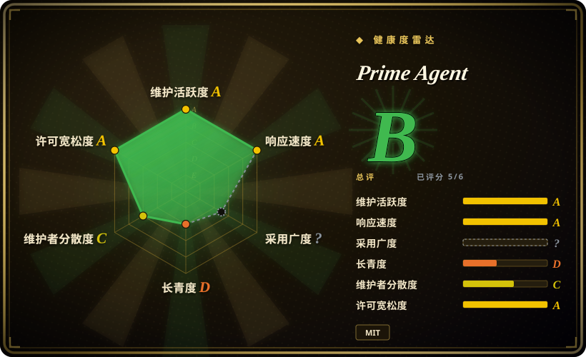
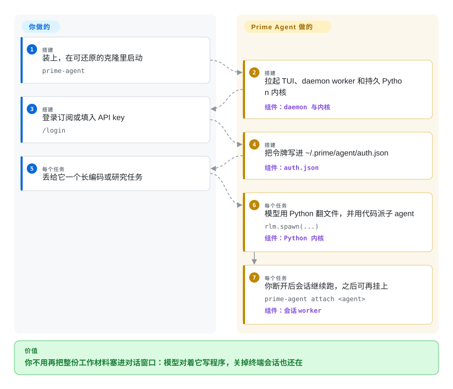

# Prime Agent

长任务把文件、命令输出和摘要一层层塞进模型窗口，它开始忘目标、开始猜。Prime Agent 把这些材料放进一个持久的 Python 解释器，让模型写代码去翻、去派子 agent，你关掉终端它也能接着跑。

## 何时使用

你正卡在一个要跑好几小时的编码或评测活里——仓库级重构、对着一份巨大日志做研究扫、登出后还得继续的 SWE 式 rollout——而手头的终端 agent 已经开始丢线。对话里堆着文件原文和压缩摘要；一个只有两份相距很远的文件同时在窗口里才看得出的 bug，永远见不到面。你要的不是又一排工具按钮，而是让模型把工作集当成能用代码切开的数据。

这才是选它的理由。它是 `pi`（earendil-works）的硬分叉，现在由 Prime Intellect 出品：模型的内置工具只有一个持久 Python 内核，`rlm.spawn(...)` 拉起真正的子 agent，本地 daemon 在 TUI 断开后仍保住会话、内核和子进程。当你要的是程序化的上下文折叠和可断开的长跑，而不是模型无关的结对编程，选它而不是 [OpenCode](opencode.zh.md) 或 [Codex](codex.zh.md)。当你要的是本机 CLI/TUI，而不是自带沙箱的自托管 agent 平台，选它而不是 [OpenHands](../orchestration-and-review/openhands.zh.md)。代价是多进程运行时（daemon、worker、kernel）、Node.js ≥ 22.8 加 Python ≥ 3.11、从 Prime 域名 `curl | sh` 安装，以及默认没有安全沙箱。

## 怎么用起来

TypeScript 宿主管供应商、会话记录、子进程生命周期和调度。模型看见的是一个持久 Python REPL：文件、shell、技能、子 agent 都靠写代码触达，不是点菜单。`rlm.spawn("…", name="…")` 准入一个自带上下文的子 `AgentSession`；调用立刻返回句柄，答案走消息或文件回来，不是 spawn 的返回值。压缩会摘要旧对话，内核变量还在。daemon worker 在你断开后继续跑这棵树；`/refine` 可以把小而可审的更新写进附加提示、记忆、技能说明或子 agent 规格，不动不可变的底层系统提示。你管的是仓库、供应商登录、工作树是否可丢。它接管的是 Python 控制循环、子进程准入、会话 JSONL，以及后台连续性。类比：别的 agent 把整本活页夹贴进对话；这个把桌子和文件柜交给模型，让它自己写检索程序。

<!-- flow-steps:begin (generated from flows/prime-agent.json by tools/flow_card.py — do not edit) -->

流程文字版

1. **你**（搭建）：装上，在可还原的克隆里启动 — `prime-agent`
2. **Prime Agent**（搭建）：拉起 TUI、daemon worker 和持久 Python 内核 — 组件：`daemon 与内核`
3. **你**（搭建）：登录订阅或填入 API key — `/login`
4. **Prime Agent**（搭建）：把令牌写进 ~/.prime/agent/auth.json — 组件：`auth.json`
5. **你**（每个任务）：丢给它一个长编码或研究任务
6. **Prime Agent**（每个任务）：模型用 Python 翻文件，并用代码派子 agent — `rlm.spawn(...)` — 组件：`Python 内核`
7. **Prime Agent**（每个任务）：你断开后会话继续跑，之后可再挂上 — `prime-agent attach <agent>` — 组件：`会话 worker`

**价值**：你不用再把整份工作材料塞进对话窗口：模型对着它写程序，关掉终端会话也还在

<!-- flow-steps:end -->

## 何时不用

- **任务很短，而且模型需要材料同窗出现。** 跨文件 bug 和短的数学类活，成败取决于父模型同时看见 A 和 B。Prime Intellect 自己的 RLM 文章写过：相对「普通 LLM 加 Python 工具」，这套脚手架在 math-python 上掉分。改用 [Codex](codex.zh.md) 或 [OpenCode](opencode.zh.md)，因为它们把模型的前向计算花在文件上，而不是花在写检索程序上。
- **你需要默认的安全沙箱。** README 写明 worker 和 kernel 改善的是生命周期隔离，不是安全；它们以你的用户权限跑。改用 [Open Interpreter](open-interpreter.zh.md) 或 [Codex](codex.zh.md)，因为它们把 OS/原生沙箱执行写成产品的一部分，而不是可选扩展。
- **你要最小的本机攻击面、不要后台服务。** Prime Agent 会拉起 daemon、会话 worker、Python 内核和 catalog 进程，认证写在 `~/.prime/agent/auth.json`。改用 [aider](aider.zh.md) 或 [OpenCode](opencode.zh.md)，因为它们更接近单个 CLI 进程。
- **你要编辑器里的 agent。** 这是 TUI/CLI。改用 [Cline](../ide-agents/cline.zh.md) 或 [Kilo Code](../ide-agents/kilocode.zh.md)，因为它们活在编辑器里。
- **你不愿对 app.primeintellect.ai 跑 `curl | sh`，或公开安装必须是钉死的 npm/pip 坐标。** 文档说继承来的 `@earendil-works/pi-coding-agent` 工作区名是实现细节，不是安装路径。改用 [OpenCode](opencode.zh.md)（`npm`）或 [Codex](codex.zh.md)，因为它们发布的包就是你装的那个东西。
- **你需要有 Lindy 背书、bus factor 风险低的工具。** 仓库创建于 2026-05-08；截至 2026-09-22 约 4.5 个月里 21.2k star、2.3k fork，抽样 top 贡献里一人（badlogic / Mario Zechner）约占 64%。改用 [Codex](codex.zh.md) 或 [aider](aider.zh.md)，因为本索引用的先验是「年龄 × 仍在活跃」，年轻爆火是风险信号而不是证明。

## 横向对比

| 替代品 | 是否收录 | 我们的评价 | 取舍 |
|---|---|---|---|
| [OpenCode](opencode.zh.md) | 已收录 | 要模型灵活的终端结对编程、并且用 npm 安装时，选 OpenCode；要模型对着上下文写程序、断开后还靠 daemon 保住会话时，选 Prime Agent。 | OpenCode 是更轻的日常驱动；Prime Agent 多了 Python 内核、递归子进程和一套你得自己运的多进程运行时。 |
| [Codex](codex.zh.md) | 已收录 | 要 OpenAI 的终端 agent、文档里写了沙箱和 git 原生改动时，选 Codex；拒绝把工作集塞进对话、要代码形态的委派时，选 Prime Agent。 | Codex 更贴供应商、OS 边界更好讲清楚；Prime Agent 是 MIT、供应商可换，但内核不是沙箱。 |
| [Open Interpreter](open-interpreter.zh.md) | 已收录 | OS 沙箱执行、以及为廉价/开源模型调过的 harness 是优先项时，选 Open Interpreter；递归 Python 内核 agent 和可断开长跑比沙箱更重要时，选 Prime Agent。 | Open Interpreter 是 Codex 分叉重写，目标是原生沙箱里换 harness；Prime Agent 是 RLM/TUI 栈，自己就写了默认不是沙箱。 |
| [OpenHands](../orchestration-and-review/openhands.zh.md) | 已收录 | 要自托管、自己管沙箱的 coding-agent 平台时，选 OpenHands；要本机 TUI、模型在你机器上写 Python 并派子进程时，选 Prime Agent。 | OpenHands 更重，更接近你去部署的产品；Prime Agent 是工作站 CLI，编程模型偏研究，默认信任假设更大。 |
| [aider](aider.zh.md) | 已收录 | 要 git 原生的终端结对编程、而且有更长仍活跃的历史时，选 aider；只有 RLM 循环（内核 + `rlm.spawn` + daemon）才是你要买的功能时，才选 Prime Agent。 | aider 在 Lindy 上更稳；Prime Agent 更年轻、更热、运维更重。 |

## 技术栈

- **TypeScript npm 工作区：** `packages/{ai,agent,coding-agent,tui}`；coding-agent 的 package.json 内部仍以 `@earendil-works/pi-coding-agent` 发布，`bin` 是 `pi`，`piConfig.configDir` 是 `.prime/agent`。
- **Python 内核：** `prime-agent-runtime`（`requires-python >=3.11`，运行时依赖 `mcp>=2,<3` 和 `tyro`），和 Node 宿主一起发。
- **Node.js ≥ 22.8.0**；仓库内 Biome + vitest；husky 钩子。
- **分发：** 通过 `https://app.primeintellect.ai/prime-agent/install.sh` 拉版本化发布产物，不是 npm 工作区名。

## 依赖

- **Node.js ≥ 22.8.0** 和 **Python ≥ 3.11**（内核垫片）。
- **模型供应商：** `/login` OAuth 支持 ChatGPT Plus/Pro（Codex）、Claude Pro/Max、GitHub Copilot、xAI Grok；或 `ANTHROPIC_API_KEY` 这类 API key。Prime Inference 的模型表会从 `/models` 刷新，除非设 `PI_OFFLINE=1`。
- **一个项目目录**，进程能在里面读、写、跑命令。README 让你用可丢的克隆或 worktree。
- **本机 daemon / worker / kernel 进程**，权限和你一样。可选：经 Python 技能接 MCP 服务器；TypeScript 扩展。

## 运维难度

**中。** 第一次跑是一条安装脚本加 `/login`，但随后你要管 daemon、每会话 worker、常驻 Python 内核、`~/.prime/agent/` 下的认证，以及会话 JSONL。`prime-agent doctor`、`status`、`attach`、`shutdown`、`update` 都是一等公民，因为后台那一半就是产品。没有应用层沙箱可运——负担是信任、进程卫生，以及别拿它去跑不信任的树。官方更新来自 Prime 的安装域名。

## 健康度与可持续性

- **维护：** A——上次提交 1 天前，13/13 活跃周；`v0.9.5` 在 2026-09-16，同月还有 `v0.9.3` / `v0.9.4`。CI 和二进制构建工作流在。
- **响应：** A——5 个合格 issue 的中位首次响应 78.6 小时（relaxed_solo 档）。
- **采用：** 评不了（`ambiguous`）；有公开文档、JSON/RPC/ACP/SDK 和 arXiv `2608.23552`，但 `curl | sh` 二进制没有干净的注册表依赖信号。
- **长寿：** D——仓库 138 天。仍活跃，并不长寿；这窗口里 21.2k star 按本索引的先验是风险信号，不是证明。
- **治理：** C——12 个月 96 个活跃维护者，但 top-1 占 64.1%、top-3 占 78.2%（`badlogic` / Mario Zechner）。LICENSE 版权是 2025 Mario Zechner 与 2026 Prime Intellect；组织背书是真的，提交集中度仍然高。
- **风险 / 许可：** A——MIT，36 个月内无改许可。安装和更新仍走供应商托管的 `curl | sh`；默认运行时不是沙箱。

## 存疑（未验证）

- [未验证] `prime-agent update` 离开 Prime Intellect 账号能不能用；只读了安装 URL 和 `PI_OFFLINE=1` 跳过模型表刷新。
- [未验证] 生产采用相对 star 数如何；4.5 个月 21.2k star 是注意力信号，不是用户数。
- [推断] 高 fork/star（2026-09-22 约 11%）可能含镜像或一次性 fork，不一定是下游生态。
- [推断] Prime Intellect 的 RLM 博文（math-python 掉分、没 tip 的 DeepDive）说的是他们 verifier 里的 RLM 脚手架，不是测过的 Prime Agent TUI 基准。
- [未验证] `/refine` 在野外对后续会话能改进多少；文档写了机制，没有田野研究。
- [未验证] Windows/Termux 支持深度，除了仓库里有 `docs/windows.md` 和 `docs/termux.md`。
