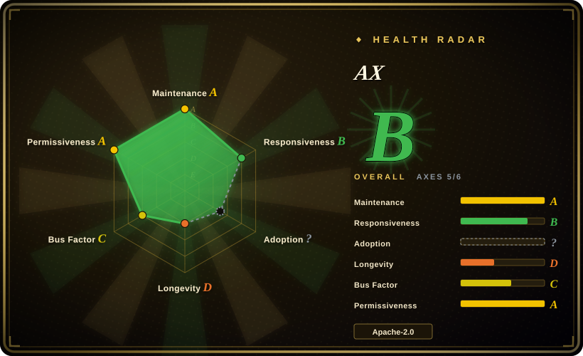
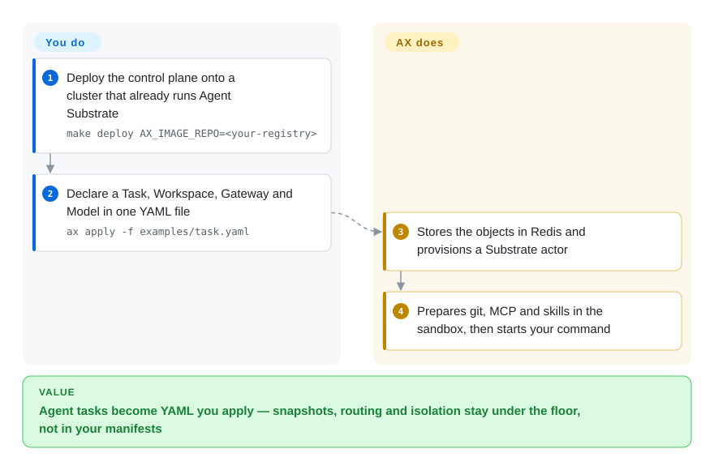

# AX

A coding agent waits on a model and a reviewer while its Pod still holds a full CPU request — multiply that by a few hundred sessions and you pay for empty sandboxes, then pay again on every cold start. AX is the YAML control plane for those sessions: you declare the task, the workspace, the network fence and the model, and a density runtime underneath freezes idle sandboxes and restores their disk.

## When to use

You already run Kubernetes, and agents are arriving as a third kind of workload — not a stateless service, not a batch Job. Each session clones a repo, talks to a model, waits on a human, then continues from the same files. The naive answer is one Pod per session; the invoice is idle sandboxes plus cold starts. You reach for AX because it is the declarative face of that problem: a `Task` (sandbox plus command), a `Workspace` (git, MCP servers, skills, an optional English `goal` that an agent finishes on first boot), a `Gateway` (which hosts the sandbox may call) and a `Model` (provider plus a Kubernetes secret). `ax apply` puts them on a control plane that stores objects in Redis — not as Kubernetes custom resources — because the designers expect millions of short-lived tasks, which would push etcd past its comfort zone. Isolation, snapshot and resume are [Agent Substrate](../../sandboxing/substrate.md) underneath; AX's increment is that you never author an Actor or a WorkerPool. Against [kagent](kagent.md) you are not declaring the agent (prompt, tools, an ADK loop) as a cluster object — you are declaring the *task* the agent runs in, and you bring your own `spec.command`. Against hosted sandbox APIs you accept operating Kubernetes plus Substrate so snapshot state stays in your cluster and the verbs stay `kubectl`-shaped (`ax get`, `ax watch`, `ax suspend`).

## How it works

AX is four small objects and a runner. You write YAML; the `ax` CLI talks gRPC to `ax-server`, which writes Redis hashes and a stream; horizontally scaled `ax-controller` workers consume that stream and ask Agent Substrate to create or resume an actor — one sandboxed session. Inside the sandbox, `ax-task-runner` is process 1: it clones git, lays down MCP config and skills, optionally hands a workspace `goal` to an Antigravity agent (needs `GEMINI_API_KEY`, ten minutes by default), then starts your command and keeps serving HTTP metadata on port 80 even after the command exits. Traffic never gets a Kubernetes Service — it goes through Substrate's atenet router with the header `ate-target-actor: <atespace>/<task>`, where an atespace is AX's namespace analog. You own the YAML and the agent binary; AX owns validation, storage, reconciliation, workspace bootstrap and the suspend/resume verbs.

<!-- flow-steps:begin (generated from flows/ax.json by tools/flow_card.py — do not edit) -->

Text version of the flow

1. **You**: Deploy the control plane onto a cluster that already runs Agent Substrate — `make deploy AX_IMAGE_REPO=<your-registry>`
2. **You**: Declare a Task, Workspace, Gateway and Model in one YAML file — `ax apply -f examples/task.yaml`
3. **AX**: Stores the objects in Redis and provisions a Substrate actor
4. **AX**: Prepares git, MCP and skills in the sandbox, then starts your command

**Value**: Agent tasks become YAML you apply — snapshots, routing and isolation stay under the floor, not in your manifests

<!-- flow-steps:end -->

## When NOT to use

- **You do not run Kubernetes, or you will not operate Agent Substrate.** AX has no standalone library path; CONTRIBUTING lists a cluster with Substrate installed as a prerequisite. For a sandbox API without that stack, use [E2B](../../sandboxing/e2b.md) or [OpenSandbox](../../sandboxing/opensandbox.md).
- **You want to write the agent's reasoning loop.** AX does not ship a planner, graph or ADK engine — `spec.command` is yours. For the loop itself, use [LangGraph](../agent-runtimes/agent-sdks/langgraph.md) or [kagent](kagent.md) (which runs agents on ADK as cluster objects).
- **You want the agent itself as a Kubernetes object.** AX's Task/Workspace/Gateway/Model live in Redis and are invisible to `kubectl get`. For CRDs, RBAC and `kubectl`-native agents, use [kagent](kagent.md).
- **You have a handful of tasks for one person.** Redis plus `ax-server` plus `ax-controller` plus Substrate is far more machinery than a sandbox SDK. Use [E2B](../../sandboxing/e2b.md) or [OpenSandbox](../../sandboxing/opensandbox.md).
- **You need a stable API this quarter.** The README warns that core concepts will take major breaking changes before a stable release; latest tag is v0.3.0 (2026-09-20). Stay on plain Pods plus a sandbox runtime, or a hosted API, until the surface settles.
- **The default path must not call Google's generative stack.** A workspace `goal` is handed to Antigravity and needs `GEMINI_API_KEY`; the default task-runner image installs that agent. You can ship your own runner binary at `/usr/local/bin/ax-task-runner`, but that is your build. If you only need "run this code now" with no bootstrap agent, use [OpenSandbox](../../sandboxing/opensandbox.md).
- **Your sessions are not idle-heavy.** The density win is reclaiming sandboxes that wait. A workload that burns CPU continuously gains nothing from suspend/resume — schedule it with [kagent](kagent.md) or a normal Deployment.
- **You need a hosted, no-ops option.** AX is software you deploy with `ko` into `ax-system`. If operating a control plane is the problem, use [E2B](../../sandboxing/e2b.md) or the [Modal client SDK](../../sandboxing/modal-client.md).

## Comparison

| Alternative | In index | Our verdict | Tradeoff |
|---|---|---|---|
| [Agent Substrate](../../sandboxing/substrate.md) | ✅ | Choose AX when you want kubectl-shaped Task/Workspace YAML and will take Substrate as a dependency; choose Substrate when you are building that control plane yourself (or already have one) and need to speak WorkerPool/Actor directly. | AX is the developer-facing orchestrator; Substrate is the density runtime. They stack — AX is not a substitute for the snapshot/resume layer. |
| [kagent](kagent.md) | ✅ | Choose kagent when the *agent* (prompt, tools, ADK engine) should be a Kubernetes CRD; choose AX when the *task* (sandbox, workspace, egress, suspend) is the object you want to declare. | kagent's lifecycle lives in etcd and comes with an engine; AX's lifecycle lives in Redis, brings no brain, and is built for many short-lived sandboxed tasks. |
| [E2B](../../sandboxing/e2b.md) | ✅ | Choose E2B when you want a sandbox SDK (hosted first, Terraform-self-host later) and the job is "run this code now"; choose AX when a fleet of idle stateful sessions must be declared as YAML on your own cluster. | E2B optimizes time-to-first-sandbox; AX optimizes declaring and suspending a fleet — at the cost of Kubernetes plus Substrate. |
| [OpenSandbox](../../sandboxing/opensandbox.md) | ✅ | Choose OpenSandbox when the requirement is a self-hosted sandbox API/SDK for untrusted code; choose AX when the requirement is a kubectl-shaped task control plane on top of a density runtime. | OpenSandbox is the sandbox you call; AX is the orchestrator that creates sandboxed tasks and pre-wires their workspace. They overlap at the word "sandbox". |
| [Modal client SDK](../../sandboxing/modal-client.md) | ✅ | Choose Modal when you want serverless containers, GPUs and sandboxes and will operate nothing; choose AX when snapshot state and the control plane must stay in your cluster. | Modal removes the ops burden; AX keeps state and policy on your side and makes you run Redis, a gRPC API and Substrate. |

## Tech stack

- **Language:** Go (`go 1.27.1` in `go.mod`). Binaries: `ax` (CLI), `ax-server` (gRPC API), `ax-controller` (reconcile workers), `ax-task-runner` (PID 1 in the task container).
- **API:** `ax.io/v1alpha1` manifests (`Task`, `Workspace`, `Gateway`, `Model`) applied over gRPC, not as Kubernetes CRDs. Health is plain HTTP `GET /healthz`.
- **Control-plane store:** Redis hashes for objects, Redis Streams as the work queue between API server and controllers, PubSub for watches (`github.com/redis/go-redis/v9`).
- **Execution:** Agent Substrate (`github.com/agent-substrate/substrate`) for actors, atespaces, worker assignment and egress filtering; `github.com/agent-substrate/env` for guest gRPC (process/filesystem) when `spec.debug` is true.
- **Images:** `ko` builds/pushes `ax-controller` and `ax-server`; the default task-runner image is Python 3.12 with git, curl, OpenSSH and Antigravity (`Dockerfile.task-runner`).
- **In-sandbox surface:** HTTP/1.1 + `h2c` on port 80 (`/healthz`, `/readyz`, `/metadata/v1alpha1/ax/task`, `/metadata/v1alpha1/ax/workspaces`); `AX_METADATA_URL` is injected into `spec.command`.

## Dependencies

- **A Kubernetes cluster you operate**, with a reachable Agent Substrate Control API (in-cluster default named in the README: `api.ate-system.svc.cluster.local:443`). This is the load-bearing dependency — AX does not sandbox by itself.
- **Redis**, deployed by `make deploy` from `deploy/redis.yaml` into the `ax-system` namespace.
- **A container registry the cluster can pull from**, plus [`ko`](https://ko.build/) to build the control-plane images (`make deploy AX_IMAGE_REPO=<your-registry>`).
- **An LLM credential as a Kubernetes secret** when you use `Model` or a workspace `goal` — the documented path stores `GEMINI_API_KEY` (Google) or `ANTHROPIC_API_KEY` (Anthropic). Goal-based bootstrap additionally needs that key inside the task container.
- **Client side:** Go 1.27+ to `go install github.com/google/ax/cmd/ax@latest`; `kubectl` (AX follows the active kube context, including `kubectx`); Docker or Podman only if you build a custom task-runner image.

## Ops difficulty

**High.** You are adding a second control plane on top of Agent Substrate: Redis, a gRPC API server, horizontally scaled controllers, a task-runner image, and Substrate's own Postgres, object storage, node DaemonSet and sandbox binaries. `make deploy` looks like one target and is not — it assumes Substrate is already healthy, a registry is reachable, and `ko` can push. Day-2 is worse than install: objects are not Kubernetes resources, so your existing CRD/RBAC/audit story does not see Tasks; you debug with `ax get` / `ax watch` / `ax ssh` (the last requires `spec.debug: true`, which opens arbitrary process execution inside the sandbox). The documented default Gateway allowlist is `host: "*"` on port 443 — tighten it before anything untrusted runs. Pre-1.0 churn means every upgrade is a compatibility event, not a patch.

## Health & viability

- **Maintenance (2026-09-22).** Active: last push 2026-09-20 (`d8ed0fe`), latest release v0.3.0 the same day; prior tags v0.2.3 (2026-08-13), v0.2.2 / v0.2.1 / v0.2.0 (2026-07), v0.1.0 (2026-05-20). Not archived. Releases have empty bodies and no attached binaries — install is `go install` / `make deploy`, not a GitHub asset.
- **Governance / bus factor (2026-09-22).** Lives under the `google` org with a Google CLA and Google's OSS community guidelines. GitHub reports `pull_request_creation_policy: collaborators_only`. Contributor counts are skewed: rakyll (JBD) 472 commits, then 56 / 45 / 30 / 13, then single digits. CONTRIBUTING still tells you to clone `git@github.com:rakyll/ax2.git` — a leftover private-fork path, not the current contribution entry.
- **Backing & Lindy (2026-09-22).** Created 2026-03-30 — about six months old — so Lindy gives it no credit. `google/ax` plus Makefile copyright "Google LLC" is a real org signal; it is not the same as a Google product SLA. Agent Substrate's README says *that* project is "not an officially supported Google product"; AX's README does not repeat the sentence. Homepage copy ties the work to Google DeepMind research — treat that as marketing until a primary source is cited.
- **Adoption & ecosystem (2026-09-22).** ~7.2k stars, 338 forks, **32** watchers — a star-to-watcher ratio that reads more like attention than production embed. Direct Go dependents are the repo itself plus Substrate libraries; no public Helm chart, no CRD install. Agent Substrate names `google/ax` as a concrete consumer; that link is now this page.
- **Risk flags (2026-09-22).** Pre-1.0 with an explicit breaking-change warning; Google CLA; collaborator-only PRs; default generative bootstrap (Antigravity + Gemini) on the documented workspace-`goal` path; default egress allowlist is wide open on 443. License is Apache-2.0 with no relicense history in the files read for this page.

## Caveats (unverified)

- [未验证] Homepage claims ("billions of tasks", "sub-second resumption") were not measured here. They sit on Agent Substrate's density story, whose own page already labels the matching numbers as targets rather than published benchmarks.
- [未验证] Homepage "Born from research… Google DeepMind" has no independent citation in the repository files read for this page.
- [未验证] AX's README does not contain Substrate's "not an officially supported Google product" disclaimer; whether AX has a Google product-support commitment was not verified beyond org + CLA + copyright.
- [未验证] Integration depth of workspace MCP/skill registries (`provider: google` queries in `examples/task.yaml`) was not exercised; the example file exists, a live registry was not called.
- [未验证] `docs/runner.md` states the control plane does not currently read the command's exit status back from the container — that is a documentation claim, not confirmed against controller code in this pass.
- [推断] The `rakyll/ax2.git` clone URL in CONTRIBUTING is leftover from a private-fork migration, not the intended contribution remote.
- [推断] Comparison rows against kagent / E2B / OpenSandbox / Modal are positioning about layer and object model, not a measured feature benchmark.
