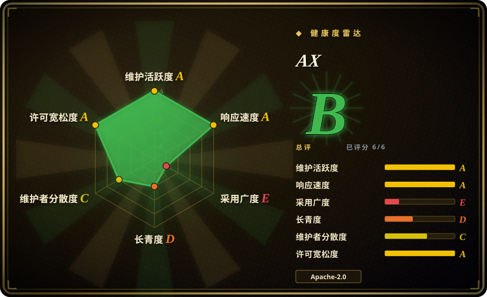
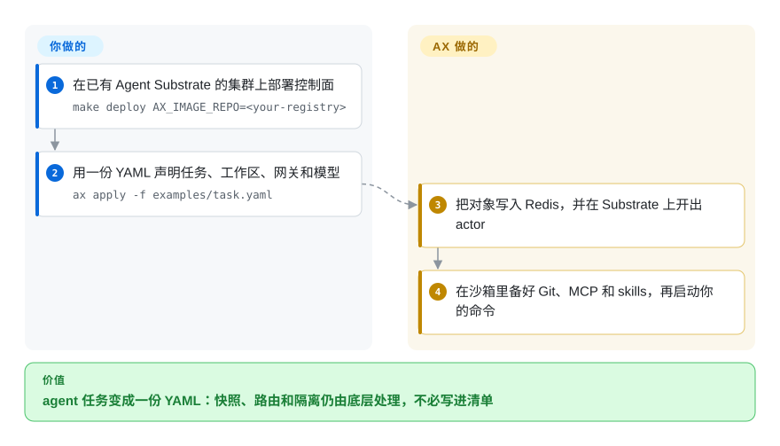

# AX

编码 agent 等模型和评审时，它的 Pod 仍占着一整份 CPU 请求——乘上几百个会话，你为空沙箱付一遍，每次冷启动再付一遍。AX 是这些会话的 YAML 控制面：你声明任务、工作区、网络围栏和模型，底下的密度运行时把发呆的沙箱冻住，磁盘原样恢复。

## 何时使用

你已经在跑 Kubernetes，而 agent 正作为第三种工作负载进来——不是无状态服务，也不是批处理 Job。每个会话克隆仓库、打模型、等人，然后从同一批文件继续。朴素做法是一个会话一个 Pod；账单是空闲沙箱加冷启动。你找 AX，是因为它是这个问题的声明式表面：`Task`（沙箱加命令）、`Workspace`（git、MCP 服务器、skills，以及可选的英文 `goal`，首次启动由 agent 收尾）、`Gateway`（沙箱允许访问的主机）和 `Model`（供应商加 Kubernetes secret）。`ax apply` 把它们送到控制面，对象存在 Redis 里——不是 Kubernetes 自定义资源——因为设计者预期有海量短命任务，那会把 etcd 推出舒适区。隔离、快照和恢复是底下的 [Agent Substrate](../../sandboxing/substrate.zh.md)；AX 多出来的那一层是：你不用自己写 Actor 或 WorkerPool。相对 [kagent](kagent.zh.md)，你声明的不是 agent 本身（提示、工具、ADK 循环）这个集群对象，而是 agent **跑在里面的那次任务**，`spec.command` 得自己带。相对托管沙箱 API，你接受自己运 Kubernetes 加 Substrate，换来快照状态留在自己集群里，动词仍然像 `kubectl`（`ax get`、`ax watch`、`ax suspend`）。

## 怎么用起来

AX 是四个小对象加一个 runner。你写 YAML；`ax` CLI 用 gRPC 跟 `ax-server` 说话，后者写入 Redis 的 hash 和 stream；横向扩展的 `ax-controller` 消费这条 stream，让 Agent Substrate 创建或恢复一个 actor——一次隔离会话。沙箱里 `ax-task-runner` 是 1 号进程：克隆 git、落下 MCP 配置和 skills，可选地把工作区 `goal` 交给 Antigravity agent（需要 `GEMINI_API_KEY`，默认十分钟），然后启动你的命令，即使命令退出了也继续在 80 端口提供 HTTP 元数据。流量不会拿到 Kubernetes Service——一律走 Substrate 的 atenet 路由器，请求头是 `ate-target-actor: <atespace>/<task>`，atespace 相当于 AX 的命名空间。你负责 YAML 和 agent 二进制；AX 负责校验、存储、reconcile、工作区预热，以及挂起／恢复这几个动词。

<!-- flow-steps:begin (generated from flows/ax.json by tools/flow_card.py — do not edit) -->

流程文字版

1. **你**：在已有 Agent Substrate 的集群上部署控制面 — `make deploy AX_IMAGE_REPO=<your-registry>`
2. **你**：用一份 YAML 声明任务、工作区、网关和模型 — `ax apply -f examples/task.yaml`
3. **AX**：把对象写入 Redis，并在 Substrate 上开出 actor
4. **AX**：在沙箱里备好 Git、MCP 和 skills，再启动你的命令

**价值**：agent 任务变成一份 YAML：快照、路由和隔离仍由底层处理，不必写进清单

<!-- flow-steps:end -->

## 何时不用

- **你不跑 Kubernetes，或不肯运 Agent Substrate。** AX 没有单独当库的路径；CONTRIBUTING 把“集群里已装 Substrate”列为前提。不想扛这套栈、只要沙箱 API，用 [E2B](../../sandboxing/e2b.zh.md) 或 [OpenSandbox](../../sandboxing/opensandbox.zh.md)。
- **你想写的是 agent 的推理循环。** AX 不带规划器、图或 ADK 引擎——`spec.command` 是你的。循环本身请用 [LangGraph](../agent-runtimes/agent-sdks/langgraph.zh.md)，或 [kagent](kagent.zh.md)（把 agent 当集群对象、用 ADK 跑）。
- **你想把 agent 本身做成 Kubernetes 对象。** AX 的 Task／Workspace／Gateway／Model 住在 Redis 里，`kubectl get` 看不见。要 CRD、RBAC 和 `kubectl` 原生的 agent，用 [kagent](kagent.zh.md)。
- **就几个人的几个任务。** Redis 加 `ax-server` 加 `ax-controller` 加 Substrate，比一个沙箱 SDK 重太多。用 [E2B](../../sandboxing/e2b.zh.md) 或 [OpenSandbox](../../sandboxing/opensandbox.zh.md)。
- **你这个季度就要稳定 API。** README 警告核心概念在稳定版之前会有大 breaking change；最新标签是 v0.3.0（2026-09-20）。在表面稳住之前，继续用普通 Pod 加沙箱运行时，或托管 API。
- **默认路径不能打到 Google 的生成式栈。** 工作区 `goal` 会交给 Antigravity，需要 `GEMINI_API_KEY`；默认 task-runner 镜像就装着这个 agent。你可以自己做 runner 二进制放到 `/usr/local/bin/ax-task-runner`，但那是你的构建。如果只要“现在跑这段代码”、不要引导 agent，用 [OpenSandbox](../../sandboxing/opensandbox.zh.md)。
- **会话并不长时间空闲。** 密度收益来自回收在等的沙箱。一直占满 CPU 的负载，挂起／恢复帮不上忙——用 [kagent](kagent.zh.md) 或普通 Deployment 调度。
- **你需要托管、免运维。** AX 是你用 `ko` 部署进 `ax-system` 的软件。如果“跑一个控制面”本身就是问题，用 [E2B](../../sandboxing/e2b.zh.md) 或 [Modal client SDK](../../sandboxing/modal-client.zh.md)。

## 横向对比

| 替代品 | 是否收录 | 我们的评价 | 取舍 |
|---|---|---|---|
| [Agent Substrate](../../sandboxing/substrate.zh.md) | ✅ | 想要像 kubectl 那样的 Task／Workspace YAML、并接受 Substrate 当依赖，选 AX；你要自己建那层控制面（或已经有一层）、需要直接说 WorkerPool／Actor，选 Substrate。 | AX 是给开发者看的编排器；Substrate 是密度运行时。两者叠加——AX 替不了快照／恢复那一层。 |
| [kagent](kagent.zh.md) | ✅ | *agent*（提示、工具、ADK 引擎）应该是 Kubernetes CRD，选 kagent；想声明的对象是 *任务*（沙箱、工作区、出站、挂起），选 AX。 | kagent 的生命周期住在 etcd，还自带引擎；AX 的生命周期住在 Redis，不带大脑，面向大量短命沙箱任务。 |
| [E2B](../../sandboxing/e2b.zh.md) | ✅ | 想要沙箱 SDK（托管优先，之后可用 Terraform 自建）、活是“现在跑这段代码”，选 E2B；一大批空闲有状态会话必须在自己集群里用 YAML 声明，选 AX。 | E2B 优化的是出第一个沙箱的时间；AX 优化的是声明并挂起一整批——代价是 Kubernetes 加 Substrate。 |
| [OpenSandbox](../../sandboxing/opensandbox.zh.md) | ✅ | 需求是自建沙箱 API／SDK 来跑不信任的代码，选 OpenSandbox；需求是叠在密度运行时上的、像 kubectl 的任务控制面，选 AX。 | OpenSandbox 是你去调用的沙箱；AX 是创建沙箱任务并预装工作区的编排器。两者只在“沙箱”这个词上重叠。 |
| [Modal client SDK](../../sandboxing/modal-client.zh.md) | ✅ | 想要 serverless 容器、GPU 和沙箱、什么都不运，选 Modal；快照状态和控制面必须留在自己集群，选 AX。 | Modal 卸掉运维负担；AX 把状态和策略留在你这边，代价是你要跑 Redis、gRPC API 和 Substrate。 |

## 技术栈

- **语言：** Go（`go.mod` 里是 `go 1.27.1`）。二进制：`ax`（CLI）、`ax-server`（gRPC API）、`ax-controller`（reconcile worker）、`ax-task-runner`（任务容器里的 1 号进程）。
- **API：** `ax.io/v1alpha1` 清单（`Task`、`Workspace`、`Gateway`、`Model`）经 gRPC 提交，不是 Kubernetes CRD。健康检查是普通 HTTP `GET /healthz`。
- **控制面存储：** Redis hash 存对象，Redis Streams 当 API 服务器与 controller 之间的工作队列，PubSub 做 watch（`github.com/redis/go-redis/v9`）。
- **执行：** Agent Substrate（`github.com/agent-substrate/substrate`）负责 actor、atespace、worker 分配和出站过滤；`spec.debug` 为 true 时用 `github.com/agent-substrate/env` 提供 guest gRPC（进程／文件系统）。
- **镜像：** `ko` 构建并推送 `ax-controller` 与 `ax-server`；默认 task-runner 镜像是带 git、curl、OpenSSH 和 Antigravity 的 Python 3.12（`Dockerfile.task-runner`）。
- **沙箱内表面：** 80 端口上的 HTTP/1.1 + `h2c`（`/healthz`、`/readyz`、`/metadata/v1alpha1/ax/task`、`/metadata/v1alpha1/ax/workspaces`）；`AX_METADATA_URL` 会注入 `spec.command`。

## 依赖

- **你自己运的 Kubernetes 集群**，以及可到达的 Agent Substrate Control API（README 写的集群内默认名：`api.ate-system.svc.cluster.local:443`）。这是承重依赖——AX 自己不做沙箱。
- **Redis**，由 `make deploy` 从 `deploy/redis.yaml` 部署进 `ax-system` 命名空间。
- **集群能拉取的容器仓库**，外加 [`ko`](https://ko.build/) 来构建控制面镜像（`make deploy AX_IMAGE_REPO=<your-registry>`）。
- **作为 Kubernetes secret 的 LLM 凭据**——用 `Model` 或工作区 `goal` 时需要。文档路径是存 `GEMINI_API_KEY`（Google）或 `ANTHROPIC_API_KEY`（Anthropic）。基于 goal 的引导还要求任务容器里也有这把钥匙。
- **客户端：** Go 1.27+ 以便 `go install github.com/google/ax/cmd/ax@latest`；`kubectl`（AX 跟随当前 kube context，包括 `kubectx`）；只有自建 task-runner 镜像时才需要 Docker 或 Podman。

## 运维难度

**高。** 你是在 Agent Substrate 之上再加一套控制面：Redis、gRPC API 服务器、横向扩展的 controller、task-runner 镜像，再加上 Substrate 自己的 Postgres、对象存储、节点 DaemonSet 和沙箱二进制。`make deploy` 看起来像一个 target，其实不是——它假定 Substrate 已经健康、仓库可达、`ko` 能推。第二天比安装更糟：对象不是 Kubernetes 资源，你现有的 CRD／RBAC／审计故事看不见 Task；排障靠 `ax get`／`ax watch`／`ax ssh`（后者要求 `spec.debug: true`，这会在沙箱里打开任意进程执行）。文档里默认的 Gateway 白名单是 443 端口上的 `host: "*"`——任何不信任的东西跑起来之前先收紧。pre-1.0 的变动意味着每次升级都是兼容性事件，不是补丁。

## 健康度与可持续性

- **维护（2026-09-22）。** 活跃：最近一次推送 2026-09-20（`d8ed0fe`），当天发 v0.3.0；更早的标签有 v0.2.3（2026-08-13）、v0.2.2／v0.2.1／v0.2.0（2026-07）、v0.1.0（2026-05-20）。未归档。Release 正文为空、没有附带二进制——安装路径是 `go install`／`make deploy`，不是 GitHub asset。
- **治理／bus factor（2026-09-22）。** 挂在 `google` 组织下，要签 Google CLA，遵守 Google OSS 社区准则。GitHub 报告 `pull_request_creation_policy: collaborators_only`。贡献计数偏斜：rakyll（JBD）472 次提交，其后 56／45／30／13，再往后是个位数。CONTRIBUTING 仍让你 clone `git@github.com:rakyll/ax2.git`——私人 fork 的残留路径，不是现在的贡献入口。
- **背书与 Lindy（2026-09-22）。** 创建于 2026-03-30——大约六个月——所以 Lindy 一分不给。`google/ax` 加上 Makefile 版权 “Google LLC” 是真实的组织信号；这不等于 Google 产品 SLA。Agent Substrate 的 README 写明**那个**项目“不是 Google 官方支持的产品”；AX 的 README 没有重复这句。首页文案把工作挂到 Google DeepMind 研究上——在出现一手来源之前，按宣传处理。
- **采用与生态（2026-09-22）。** 约 7.2k star、338 fork、**32** watcher——星多、watcher 少，更像注意力而不是生产嵌入。直接的 Go 依赖是仓库自己加上 Substrate 的库；没有公开 Helm chart，也没有 CRD 安装。Agent Substrate 把 `google/ax` 列为具体消费者；那条链接现在就是本页。
- **风险旗标（2026-09-22）。** pre-1.0，且明确警告会 breaking change；Google CLA；仅 collaborator 可开 PR；文档中的工作区 `goal` 默认走生成式引导（Antigravity + Gemini）；默认出站白名单在 443 上大开。许可证是 Apache-2.0，本页读过的文件里没有改许可证历史。

## 存疑（未验证）

- [未验证] 首页宣称（“billions of tasks”、“sub-second resumption”）此处没有测量。它们坐在 Agent Substrate 的密度叙事上，而 Substrate 自己的页面已把对应数字标成目标而非已发表基准。
- [未验证] 首页 “Born from research… Google DeepMind” 在本页读过的仓库文件里没有独立引用。
- [未验证] AX 的 README 没有 Substrate 那句“不是 Google 官方支持的产品”；AX 是否有 Google 产品支持承诺，除组织 + CLA + 版权外未再核实。
- [未验证] 工作区 MCP／skill 注册表（`examples/task.yaml` 里 `provider: google` 的查询）没有实际打过；示例文件存在，没有调用过活的注册表。
- [未验证] `docs/runner.md` 写控制面目前不会从容器回读命令退出码——这是文档主张，本轮没有对着 controller 代码确认。
- [推断] CONTRIBUTING 里的 `rakyll/ax2.git` clone 地址是私人 fork 迁移残留，不是现在该用的贡献远程。
- [推断] 相对 kagent／E2B／OpenSandbox／Modal 的对比行是关于层级和对象模型的定位，不是测过的功能基准。
