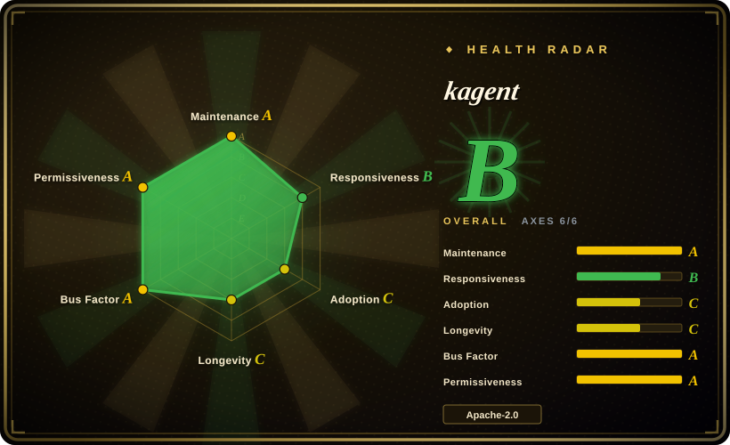
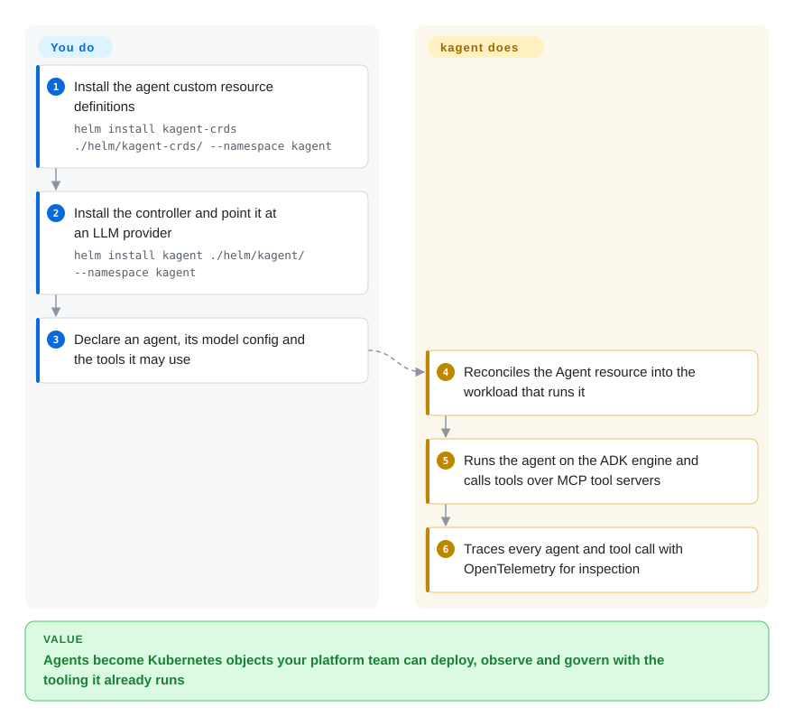

# kagent

A Kubernetes-native framework for running agents as cluster resources: agents, their tools and their model configuration become CRDs you deploy with `kubectl`, run by a controller + engine, and observe with the UI/CLI and OpenTelemetry.

## When to use

You are a platform team with Kubernetes as the system of record, and agents are arriving as another workload to operate — with the same demands as everything else: declarative config in Git, RBAC, namespaces, auditability, upgrades, and a way for the on-call engineer to see what is going on. Non-Kubernetes agent frameworks leave that to you to bolt on; kagent makes the agent itself a Kubernetes object. You install the CRDs and the controller, then declare an `Agent` (system prompt, LLM config, tools), `ModelConfig` for the provider (OpenAI, Anthropic, Vertex, Ollama, or an AI gateway) and `ToolServer`s for MCP tools — of which the project ships servers covering Kubernetes, Istio, Helm, Argo, Prometheus, Grafana and Cilium, so an agent can be wired to your own operational stack quickly. The deciding tradeoff against a general framework like [LangGraph](../agent-runtimes/agent-sdks/langgraph.md) is where the agent's lifecycle lives: with kagent it lives in your cluster's reconciliation loop, so you get `kubectl`-shaped operations, rollout semantics and the platform team's existing guardrails — but you also inherit Kubernetes' constraints, and you are not in a Python notebook any more. Against [Agent Substrate](../../sandboxing/substrate.md), kagent answers "how do I *operate* agents on Kubernetes"; Substrate answers "how do I run *many stateful* agents cheaply" — they stack.

## How it works

kagent has four components: a Kubernetes **controller** that watches its custom resources and creates what is needed to run them, an **engine** that executes agents (built on Google's ADK), a **UI** for managing agents and tools, and a **CLI**. You install it into a namespace with two Helm releases — the CRDs chart first (`helm install kagent-crds ./helm/kagent-crds/ --namespace kagent`), then the controller chart with a provider configured (`helm install kagent ./helm/kagent/ --namespace kagent`, plus provider flags such as an OpenAI API key or selecting Ollama). From then on your interface is YAML plus `kubectl`: you declare an agent and the tools it may call, and the controller turns that into running workloads, while tools are exposed to agents as MCP servers declared as `ToolServer` resources so several agents can share them. What you write is the agent's prompt, model binding, tool selection and any custom tool server; what kagent owns is the reconciliation, the runtime wiring, the model-provider plumbing, and the tracing that makes an agent's behaviour inspectable.

<!-- flow-steps:begin (generated from flows/kagent.json by tools/flow_card.py — do not edit) -->

Text version of the flow

1. **You**: Install the agent custom resource definitions — `helm install kagent-crds ./helm/kagent-crds/ --namespace kagent`
2. **You**: Install the controller and point it at an LLM provider — `helm install kagent ./helm/kagent/ --namespace kagent`
3. **You**: Declare an agent, its model config and the tools it may use
4. **kagent**: Reconciles the Agent resource into the workload that runs it
5. **kagent**: Runs the agent on the ADK engine and calls tools over MCP tool servers
6. **kagent**: Traces every agent and tool call with OpenTelemetry for inspection

**Value**: Agents become Kubernetes objects your platform team can deploy, observe and govern with the tooling it already runs

<!-- flow-steps:end -->

## When NOT to use

- **You need many stateful agents multiplexed onto few machines.** kagent schedules agents as workloads; it does not snapshot-and-resume them to reclaim idle capacity. For density with suspend/resume of in-memory state, use [Agent Substrate](../../sandboxing/substrate.md); for a YAML *task* control plane on top of that runtime, use [AX](ax.md).
- **You are not on Kubernetes, or you cannot install CRDs and an operator.** kagent's entire value is being cluster-native. Off Kubernetes, use a code-first framework such as [LangGraph](../agent-runtimes/agent-sdks/langgraph.md) or [AgentScope](../agent-runtimes/agent-sdks/agentscope.md).
- **You need a sandbox boundary for hostile agent code.** Agents configured here call tools with whatever credentials you give them; the isolation question is separate — put a sandbox runtime ([gVisor](../../sandboxing/gvisor.md), [Kata Containers](../../sandboxing/kata-containers.md)) or a sandbox platform ([OpenSandbox](../../sandboxing/opensandbox.md)) underneath rather than assuming the framework isolates anything.
- **You want a mature, churn-free API today.** The project is young (created 2025-01) and in active development with its own roadmap board; treat its CRD surface as moving. For older, broader agent framework ecosystems, use the `agent-runtimes` entries.
- **Your agents are a single script for one person.** Installing CRDs, a controller and a UI is far more machinery than a Python file; the framework pays off with multiple agents, multiple operators and governance needs.
- **You need a hosted/no-ops option.** kagent is software you run. If running a control plane is the problem, a hosted platform is the honest answer.

## Comparison

| Alternative | In index | Our verdict | Tradeoff |
|---|---|---|---|
| [Agent Substrate](../../sandboxing/substrate.md) | ✅ | Choose kagent when agents must be declared, governed and observed as Kubernetes objects; choose Substrate when the problem is compute density for many idle stateful agents. | kagent is the declarative *control* layer for agents-as-workloads; Substrate is the execution layer that multiplexes them with snapshot resume. kagent's own documentation positions Substrate-class runtimes beneath it. |
| [LangGraph](../agent-runtimes/agent-sdks/langgraph.md) | ✅ | Choose LangGraph when the agent logic is the product and you want a Python graph API with maximum control; choose kagent when the agent's *operations* (deploy, config, tools, tracing) are the problem. | LangGraph gives you programmatic control flow inside your process and no cluster opinion; kagent gives you CRDs, a controller and a UI but less control over the run loop. |
| [AgentScope](../agent-runtimes/agent-sdks/agentscope.md) | ✅ | Choose AgentScope when you want a full multi-agent framework with its own runtime and sandboxing story in code; choose kagent when the runtime should be Kubernetes itself. | AgentScope is a framework you deploy; kagent is a way of deploying agents as cluster objects and accepting Kubernetes' operational model. |
| [OpenSandbox](../../sandboxing/opensandbox.md) | ✅ | Choose OpenSandbox when the requirement is isolated execution for agent-generated code; choose kagent when the requirement is declaratively managing which agents exist and what tools they may use. | Orthogonal layers: kagent decides the agent's configuration and lifecycle, OpenSandbox decides where its code runs and what it can reach. |
| [AX](ax.md) | ✅ | Choose kagent when the *agent* (prompt, tools, ADK engine) should be a Kubernetes CRD; choose AX when the object you want to declare is the sandboxed *task* (workspace, egress, suspend) and you bring your own command. | kagent's lifecycle lives in etcd and comes with an engine; AX stores tasks in Redis, has no planner, and sits on Agent Substrate. |

## Tech stack

- **Language:** Go (controller, engine, CLI, tool servers).
- **Custom resources:** `Agent` (prompt + tools + LLM config), `ModelConfig` (provider/credentials), `ToolServer` (MCP tool providers, including servers for Kubernetes, Istio, Helm, Argo, Prometheus, Grafana and Cilium).
- **Agent engine:** Google's Agent Development Kit (ADK).
- **Interfaces:** a web UI, a CLI, and normal `kubectl` workflows against the CRDs.
- **Observability:** OpenTelemetry tracing for agents and tool calls; the project carries an OpenSSF Best Practices badge.

## Dependencies

- **A Kubernetes cluster you operate**, with permission to install CRDs and run a controller/engine.
- **The Helm charts from this repository** (`helm/kagent-crds` and `helm/kagent`) — the documented install is `helm install kagent-crds ./helm/kagent-crds/ --namespace kagent` followed by `helm install kagent ./helm/kagent/ --namespace kagent` with provider settings.
- **An LLM provider and its credentials** — OpenAI, Azure OpenAI, Anthropic, Google Vertex AI, Ollama, or any provider reachable through an AI gateway (configured via `ModelConfig`).
- **Tool infrastructure you want agents to reach** (Kubernetes API, Prometheus, Grafana, …) — the shipped tool servers need access and credentials for those systems.
- **Optional but recommended:** an observability backend for the OTel traces.

## Ops difficulty

**Medium to high.** You are adding a CRD-based control plane plus an agent runtime and its UI to a cluster you already operate: install and upgrade two Helm charts, manage LLM credentials as cluster secrets, grant the tool servers real access to production systems (this is the part to think hardest about — an agent with Prometheus and Kubernetes tools is an agent with a lot of reach), and run whatever tracing backend makes the agents debuggable. The Kubernetes-native approach is what makes it operable at all: rollouts, RBAC and audit land in tooling your platform team already has. But agent behavior remains non-deterministic, so the operational question is less "will the pod restart" and more "how do I bound what this thing can do" — which is a policy design task, not a packaging one.

## Health & viability

- **Maintenance (2026-09-20).** Active: last push 2026-09-18, ~3.8k stars, releases and CI badge in the README, Discord and community meetings. Not archived.
- **Governance / bus factor (2026-09-20).** A **CNCF project** (the README carries the CNCF logo and states it), with a code of conduct, a roadmap Kanban board, and an OpenSSF Best Practices entry. Originated from Solo.io (the same company as several maintainers of other cloud-native projects); CNCF hosting is a genuine multi-vendor signal. [推断] The CNCF maturity level is not stated in the README and was not checked.
- **Backing & Lindy (2026-09-20).** Created 2025-01 — about 20 months old. Lindy gives it little credit, and the agent-runtime space it occupies is moving fast; what mitigates this is the CNCF affiliation plus active vendor contributions rather than a single hobbyist. [推断]
- **Adoption & ecosystem (2026-09-20).** Ecosystem work is a highlight: first-party MCP tool servers for Kubernetes, Istio, Helm, Argo, Prometheus, Grafana and Cilium mean it plugs into existing cloud-native stacks rather than inventing a tool format, and other projects (including Agent Substrate's ecosystem) describe running sandboxed agent workloads on it. Adoption breadth at this age is not independently measured here. [未验证]
- **Risk flags (2026-09-20).** Youth and API churn are the main ones; security design is the other — an agent that holds cluster credentials is a new class of privileged principal, so review the tool-granting model against your threat model before pointing it at production. [推断]

## Caveats (unverified)

- [未验证] The CNCF maturity level (Sandbox/Incubating/Graduated) was not verified; the README only identifies the project as CNCF-affiliated.
- [未验证] The Helm chart paths and flags quoted here come from the repository's `helm/README.md`; the project's own docs site may recommend a different (e.g. OCI registry) install path.
- [推断] "Solo.io origin" is inferred from maintainer affiliations and project history references, not from a governance document read for this page.
- [未验证] Production adoption claims and the claim that other platforms run sandboxed agent workloads on kagent were not verified against third-party sources.
- [未验证] The completeness and maturity of each shipped tool server (Kubernetes, Istio, Helm, Argo, Prometheus, Grafana, Cilium) was not evaluated.
- [推断] The Comparison rows against LangGraph/AgentScope and general operator frameworks are positioning judgments about where the agent's lifecycle lives, not measured comparisons.

