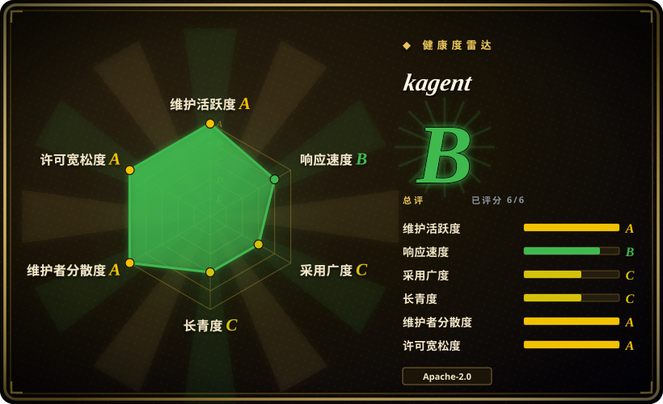
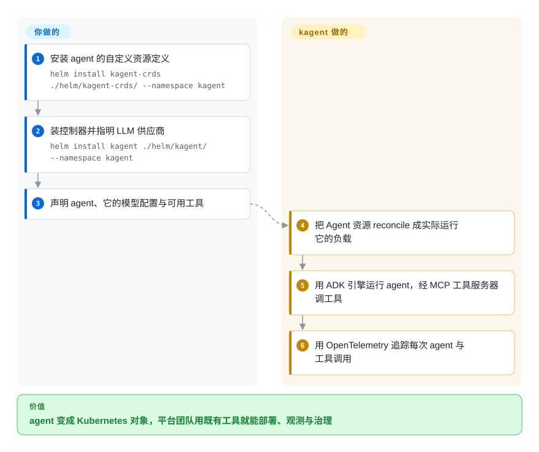

# kagent

Kubernetes 原生的 agent 框架：把 agent、它可用的工具、以及模型配置都变成 CRD，用 `kubectl` 部署，由控制器加引擎运行，用 UI／CLI 与 OpenTelemetry 观测。

## 何时使用

你是平台团队，Kubernetes 是系统的唯一事实源，而 agent 正作为又一种工作负载进来——要求和其他负载一样：配置声明式进 Git、RBAC、命名空间、可审计、可升级，以及值班工程师有办法看清它在干什么。Kubernetes 之外的 agent 框架把这些留给你自己接；kagent 把 agent 本身变成 Kubernetes 对象。你装上 CRD 与控制器，然后声明 `Agent`（系统提示、LLM 配置、工具）、`ModelConfig`（供应商：OpenAI、Anthropic、Vertex、Ollama 或经 AI 网关接入）以及 `ToolServer`（MCP 工具）——项目自带的工具服务器覆盖 Kubernetes、Istio、Helm、Argo、Prometheus、Grafana 与 Cilium，所以 agent 很快就能接到你自己的运维栈上。与 [LangGraph](../agent-runtimes/langgraph.zh.md) 这类通用框架的决定性取舍在「agent 的生命周期住在哪」：用 kagent，它住在集群的 reconcile 循环里，于是你得到 `kubectl` 形态的操作、发布语义和平台团队既有的护栏——代价是也要接受 Kubernetes 的约束，而且你不再身处 Python notebook。与 [Agent Substrate](../../sandboxing/substrate.zh.md) 相比，kagent 回答「我怎么在 Kubernetes 上**运营** agent」，Substrate 回答「我怎么便宜地跑**大量有状态** agent」——两者可以叠加。

## 怎么用起来

kagent 有四个组件：watch 自定义资源并创建运行所需资源的 **controller**、执行 agent 的 **engine**（建在 Google 的 ADK 上）、管理 agent 与工具的 **UI**，以及 **CLI**。用一个命名空间里的两次 Helm 发布安装：先装 CRD chart（`helm install kagent-crds ./helm/kagent-crds/ --namespace kagent`），再装控制器 chart 并配好供应商（`helm install kagent ./helm/kagent/ --namespace kagent`，加上类似 OpenAI API key 或选择 Ollama 的参数）。此后你的界面就是 YAML 加 `kubectl`：声明一个 agent 与它可调用的工具，控制器把它变成实际运行的工作负载；工具以 `ToolServer` 资源声明的 MCP 服务器形式暴露给 agent，于是多个 agent 可以共享。你写的是 agent 的提示、模型绑定、工具选择以及自定义工具服务器；kagent 负责 reconcile、运行时接线、模型供应商管线和让 agent 行为可检查的追踪。

<!-- flow-steps:begin (generated from flows/kagent.json by tools/flow_card.py — do not edit) -->

流程文字版

1. **你**：安装 agent 的自定义资源定义 — `helm install kagent-crds ./helm/kagent-crds/ --namespace kagent`
2. **你**：装控制器并指明 LLM 供应商 — `helm install kagent ./helm/kagent/ --namespace kagent`
3. **你**：声明 agent、它的模型配置与可用工具
4. **kagent**：把 Agent 资源 reconcile 成实际运行它的负载
5. **kagent**：用 ADK 引擎运行 agent，经 MCP 工具服务器调工具
6. **kagent**：用 OpenTelemetry 追踪每次 agent 与工具调用

**价值**：agent 变成 Kubernetes 对象，平台团队用既有工具就能部署、观测与治理

<!-- flow-steps:end -->

## 何时不用

- **你需要把大量有状态 agent 挤在少数机器上。** kagent 把 agent 当工作负载调度，不做「快照—恢复」来回收空闲容量。想要带内存状态暂停／恢复的密度，用 [Agent Substrate](../../sandboxing/substrate.zh.md)。
- **你不在 Kubernetes 上，或不能安装 CRD 与 operator。** kagent 的全部价值就是集群原生。离开 Kubernetes，请用代码优先的框架，如 [LangGraph](../agent-runtimes/langgraph.zh.md) 或 [AgentScope](../agent-runtimes/agentscope.zh.md)。
- **你需要隔离边界来承载恶意的 agent 代码。** 这里配置的 agent 会带着你给的凭据去调工具，隔离是另一个问题——请在下面垫一个沙箱运行时（[gVisor](../../sandboxing/gvisor.zh.md)、[Kata Containers](../../sandboxing/kata-containers.zh.md)）或沙箱平台（[OpenSandbox](../../sandboxing/opensandbox.zh.md)），不要假设框架本身提供了隔离。
- **你今天就要一个成熟、无变动的 API。** 项目年轻（创建于 2025-01）且在活跃开发中，有自己的路线图看板；请把它的 CRD 面当作还在动。想要更老、更广的 agent 框架生态，请用 `agent-runtimes` 里的条目。
- **你的 agent 只是给一个人用的一个脚本。** 为此装 CRD、控制器和 UI 是过度堆料；框架的回报出现在多个 agent、多个操作者和治理需求上。
- **你需要托管／免运维选项。** kagent 是你要自己跑的软件。如果「跑一个控制面」本身就是问题，诚实的答案是托管平台。

## 横向对比

| 替代品 | 是否收录 | 我们的评价 | 取舍 |
|---|---|---|---|
| [Agent Substrate](../../sandboxing/substrate.zh.md) | ✅ | agent 必须以 Kubernetes 对象形式被声明、治理与观测，选 kagent；问题是大量空闲有状态 agent 的算力密度，选 Substrate。 | kagent 是 agent 即工作负载的**声明式控制**层；Substrate 是用快照恢复做多路复用的执行层。kagent 自家文档也把 Substrate 这一类运行时定位在它下面。 |
| [LangGraph](../agent-runtimes/langgraph.zh.md) | ✅ | agent 逻辑本身就是产品、想要 Python 图 API 与最大控制力，选 LangGraph；问题在于 agent 的**运维**（部署、配置、工具、追踪），选 kagent。 | LangGraph 给你进程内的编程式控制流，对集群没有主张；kagent 给你 CRD、控制器和 UI，但对运行循环的控制更少。 |
| [AgentScope](../agent-runtimes/agentscope.zh.md) | ✅ | 想要带自研运行时与沙箱方案的全功能多 agent 框架（代码形态），选 AgentScope；运行时本身就应该是 Kubernetes，选 kagent。 | AgentScope 是你要部署的框架；kagent 是把 agent 作为集群对象部署、并接受 Kubernetes 运维模型的一条路。 |
| [OpenSandbox](../../sandboxing/opensandbox.zh.md) | ✅ | 需求是给 agent 生成的代码一个隔离执行环境，选 OpenSandbox；需求是声明式管理有哪些 agent、能用哪些工具，选 kagent。 | 正交的两层：kagent 决定 agent 的配置与生命周期，OpenSandbox 决定它的代码在哪跑、能碰到什么。 |
| 通用 operator 框架／其他项目的 agent CRD 栈 | 未收录 | 你在自己写 controller，选通用 operator 框架；想要 agent CRD、引擎、工具服务器与 UI 都已经做好，选 kagent。 | 通用框架（Kubebuilder、Operator SDK）是没有任何 agent 语义的工具箱；kagent 交付了语义，但也把你的设计约束在它的资源模型里。这里按范围外处理：工具箱与产品的对比是另一个选型题。 |

## 技术栈

- **语言：** Go（控制器、引擎、CLI、工具服务器）。
- **自定义资源：** `Agent`（提示加工具加 LLM 配置）、`ModelConfig`（供应商与凭据）、`ToolServer`（MCP 工具提供方，含 Kubernetes、Istio、Helm、Argo、Prometheus、Grafana 与 Cilium 的服务器）。
- **Agent 引擎：** Google 的 Agent Development Kit（ADK）。
- **界面：** Web UI、CLI，以及针对 CRD 的常规 `kubectl` 工作流。
- **可观测性：** agent 与工具调用的 OpenTelemetry 追踪；项目带 OpenSSF Best Practices 徽章。

## 依赖

- **你自己运维的 Kubernetes 集群**，且有权安装 CRD 并运行控制器／引擎。
- **本仓库的 Helm chart**（`helm/kagent-crds` 与 `helm/kagent`）——文档里的安装是 `helm install kagent-crds ./helm/kagent-crds/ --namespace kagent`，随后 `helm install kagent ./helm/kagent/ --namespace kagent` 并配好供应商。
- **一个 LLM 供应商及其凭据**——OpenAI、Azure OpenAI、Anthropic、Google Vertex AI、Ollama，或经 AI 网关可达的任何供应商（用 `ModelConfig` 配置）。
- **你想让 agent 触达的工具基础设施**（Kubernetes API、Prometheus、Grafana……）——自带工具服务器需要这些系统的访问权限与凭据。
- **可选但推荐：** 一个接收 OTel 追踪的可观测性后端。

## 运维难度

**中到高。** 你在自己已经在运维的集群里加一套基于 CRD 的控制面，外加 agent 运行时与 UI：安装并升级两个 Helm chart、把 LLM 凭据当作集群密钥管理、给工具服务器真实访问生产系统的权限（这部分最需要想清楚——一个握着 Prometheus 与 Kubernetes 工具的 agent，是一个触达范围很广的 agent），并跑起让 agent 可调试的追踪后端。Kubernetes 原生恰恰是它可运维的原因：发布、RBAC 与审计都落在平台团队已有的工具里。但 agent 行为仍然不确定，所以运维问题不是「pod 会不会重启」，而是「我怎么框住这东西能做什么」——那是策略设计任务，不是打包任务。

## 健康度与可持续性

- **维护活跃度（2026-09-20）。** 活跃：最后推送 2026-09-18，约 3.8k stars，README 里有 release 与 CI 徽章、Discord 与社区会议。未归档。
- **治理与 bus factor（2026-09-20）。** 是 **CNCF 项目**（README 带着 CNCF logo 并明示），有行为准则、路线图看板与 OpenSSF Best Practices 条目。源自 Solo.io（其他若干云原生项目的维护者同属该公司）；CNCF 托管是真实的多厂商信号。[推断] README 未说明 CNCF 成熟度级别，本次也未核实。
- **背书与 Lindy（2026-09-20）。** 创建于 2025-01，约 20 个月。Lindy 给它很少信用，而它所在的 agent 运行时领域变化很快；缓解因素是 CNCF 归属与活跃的厂商贡献，而不是单打独斗的爱好者。[推断]
- **采用与生态（2026-09-20）。** 生态工作是亮点：第一方的 MCP 工具服务器覆盖 Kubernetes、Istio、Helm、Argo、Prometheus、Grafana 与 Cilium，意味着它接的是既有云原生栈，而不是自创工具格式；其他项目（包括 Agent Substrate 的生态）也描述在它之上跑沙箱化的 agent 负载。这个年龄下的采用广度本页未独立测量。[未验证]
- **风险旗标（2026-09-20）。** 主要是年轻与 API 变动；另一个是安全设计——握着集群凭据的 agent 是一类新的高权限主体，指向生产之前请把工具授权模型对着自己的威胁模型审一遍。[推断]

## 存疑（未验证）

- [未验证] CNCF 成熟度级别（Sandbox／Incubating／Graduated）未核实；README 只表明项目归属 CNCF。
- [未验证] 本页引用的 Helm chart 路径与参数来自仓库的 `helm/README.md`；项目自己的文档站可能推荐另一种（例如 OCI registry）安装路径。
- [推断] 「源自 Solo.io」是从维护者归属与项目历史引用推断的，不是来自本页阅读的治理文档。
- [未验证] 生产采用度的说法，以及「其他平台在 kagent 上跑沙箱化 agent 负载」的说法未对照第三方来源核实。
- [未验证] 自带各工具服务器（Kubernetes、Istio、Helm、Argo、Prometheus、Grafana、Cilium）的完整度与成熟度未评估。
- [推断] 与 LangGraph／AgentScope 及通用 operator 框架的对比行，是关于「agent 生命周期住在哪」的定位判断，不是实测比较。
