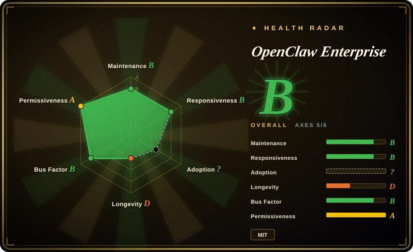
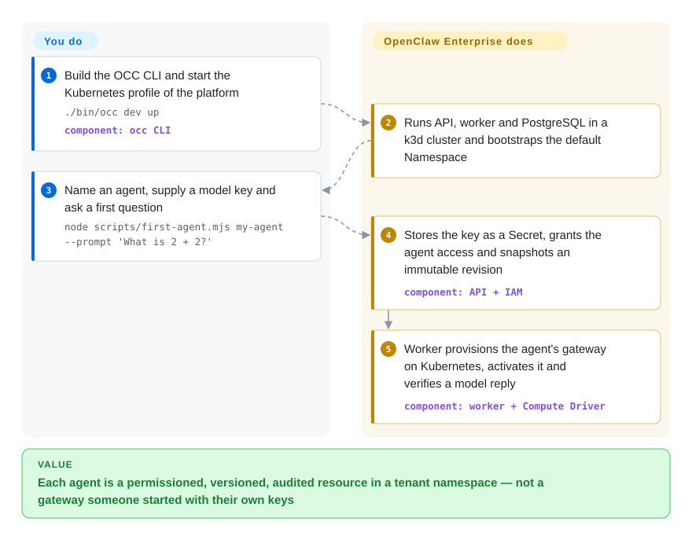

# OpenClaw Enterprise

One OpenClaw assistant on one laptop is fine; forty of them for different teams means forty hand-edited config files, API keys pasted into each, no record of who changed what, and no way to say "support's agent may read this secret but marketing's may not". OpenClaw Enterprise is the multi-tenant control plane for that fleet: agents, secrets and permissions become API resources stored in PostgreSQL, and a worker rolls each agent out on Kubernetes as a versioned, audited deployment.

## When to use

You are the platform team at a company where OpenClaw (or Codex) agents have escaped the pilot. Five departments each want their own agent with its own model key, Slack workspace and file workspace; security asks who can read the key that the finance agent uses, and nobody can answer because each agent is a gateway process someone started with their own credentials. You reach for OpenClaw Enterprise when the missing piece is *governance around* agents you already know how to run: a Namespace per tenant, an IAM model (Roles, AccessBindings, deny-wins Restrictions) checked on every resource operation, Secrets that are delivered to one agent's runtime but never echoed back through the API, an immutable AgentRevision for every deploy, and audit records committed in the same transaction as the change. Against [kagent](kagent.md) you are not writing agents as CRDs and reviewing them through `kubectl` — the agent loop is stock OpenClaw or Codex, and the API/console with its own IAM is the interface. Against running [OpenClaw](../agent-runtimes/personal-assistants/openclaw.md) directly you trade a single-operator trust model for per-agent identities and tenant isolation, and pay for it with a Kubernetes cluster, PostgreSQL and a month-old project.

## How it works

Think of it as a building manager rather than a tenant: OpenClaw Enterprise does not reason or call models itself — each deployed agent still runs an ordinary OpenClaw gateway (the process that receives messages) and a Harness (the part that calls the model and runs tools), either together in one Pod ("embedded") or as a separate Codex workload ("dedicated"). What the project adds is the control plane (OCC): an HTTP API and browser console that authenticate the caller and check permissions on the exact resource, a PostgreSQL database holding agents, secrets, IAM policy, the work queue and audit events, and a separate worker that claims queued work, re-checks permissions, and calls pluggable Drivers — Kubernetes Compute, Kubernetes Secret, or SSH Compute — to create namespaces, Secrets and workloads. Deploying snapshots the agent's configuration into an immutable revision; editing a draft never touches the running agent until you deploy again. You supply the cluster, PostgreSQL, ingress, model keys and the agent configuration; it owns authorization, revisioning, provisioning order and audit.

<!-- flow-steps:begin (generated from flows/openclaw-enterprise.json by tools/flow_card.py — do not edit) -->

Text version of the flow

1. **You**: Build the OCC CLI and start the Kubernetes profile of the platform — `./bin/occ dev up` — component: `occ CLI`
2. **OpenClaw Enterprise**: Runs API, worker and PostgreSQL in a k3d cluster and bootstraps the default Namespace
3. **You**: Name an agent, supply a model key and ask a first question — `node scripts/first-agent.mjs my-agent --prompt 'What is 2 + 2?'`
4. **OpenClaw Enterprise**: Stores the key as a Secret, grants the agent access and snapshots an immutable revision — component: `API + IAM`
5. **OpenClaw Enterprise**: Worker provisions the agent's gateway on Kubernetes, activates it and verifies a model reply — component: `worker + Compute Driver`

**Value**: Each agent is a permissioned, versioned, audited resource in a tenant namespace — not a gateway someone started with their own keys

<!-- flow-steps:end -->

## When NOT to use

- **You are one person or one small team with one assistant.** The documented security boundary exists because OCC must not inherit the core gateway's single-operator trust assumptions; if there is only one operator, that machinery is pure cost. Run [OpenClaw](../agent-runtimes/personal-assistants/openclaw.md) directly.
- **You do not run Kubernetes.** The only path that deploys agents end-to-end is Kubernetes: the Docker/Podman Compose profile is a control-plane preview that its own docs say cannot deploy Agents, and SSH Compute runs embedded OpenClaw only, without dedicated Codex or OCC-managed model credentials. To coordinate a few agents without a cluster, use [Paperclip](../../agent-tooling/supervision-surfaces/paperclip.md).
- **You want agents as Kubernetes custom resources, reviewed through GitOps.** OCC resources live in PostgreSQL behind its own API and IAM, not in etcd; `kubectl get` will not show an Agent and Kubernetes RBAC does not replace its grants. Use [kagent](kagent.md).
- **You want to write the agent loop yourself.** The Harness choices are OpenClaw or Codex; there is no framework API for your own planner. Use [LangGraph](../agent-runtimes/agent-sdks/langgraph.md), then host it however you like.
- **Your sessions are mostly idle sandboxes and density is the bill.** OCE provisions one gateway per agent revision and keeps it running; it does not freeze and restore idle workloads. Use [AX](ax.md) on its density runtime.
- **You need credential-free model execution today.** The architecture page lists model mediation (an `InferenceDriver`, restricted egress, credential-free execution) and mutually authenticated workload transport as *remaining design work*; today the Harness receives the model key, and dedicated Codex talks to its Gateway over a capability-token `ws://` connection without mTLS. If keeping the key out of the sandbox is the requirement, evaluate NVIDIA NemoClaw (not indexed) with OpenShell's managed inference.
- **You need a released, installable artifact this quarter.** As of 2026-09-30 there are no GitHub releases or tags, `package.json` says 0.1.0, and the published controller/runtime images on GHCR need `read:packages` access — an anonymous pull-token request returned 401 when checked. Outside that access you build both images yourself (the local quickstart budgets ~20 GB of container storage for the first build). Stay on plain OpenClaw or kagent until a public release exists.
- **Your model provider is not OpenAI and you want the paved road.** The first-agent walkthrough needs an OpenAI key, the dedicated Codex Harness and the experimental ChatGPT Backend are OpenAI-specific, and Slack requires dedicated Codex because embedded revisions with external channels are rejected. Other providers go through native OpenClaw configuration, with less documentation [未验证].

## Comparison

| Alternative | In index | Our verdict | Tradeoff |
|---|---|---|---|
| [OpenClaw](../agent-runtimes/personal-assistants/openclaw.md) | ✅ | Choose plain OpenClaw when one operator owns the assistant and its credentials; choose OpenClaw Enterprise when many teams' OpenClaw agents need separate identities, secrets and audit on a shared cluster. | OCE runs OpenClaw underneath rather than replacing it; it adds IAM, revisions and tenant isolation, and costs a Kubernetes cluster, PostgreSQL and an immature control plane. |
| [kagent](kagent.md) | ✅ | Choose kagent when agents should be CRDs you review with `kubectl` and GitOps and you build them on its engine; choose OCE when the agents are stock OpenClaw/Codex and you want a console + API with its own fine-grained IAM. | kagent inherits Kubernetes RBAC and etcd; OCE keeps state in PostgreSQL behind its own IAM and audit, which Kubernetes tooling cannot see. |
| [AX](ax.md) | ✅ | Choose AX when a large fleet of short-lived, mostly idle sandboxed tasks must be declared and suspended; choose OCE when a smaller set of long-lived, named agents needs per-tenant governance. | AX optimizes density on Agent Substrate and brings no agent; OCE brings the agent runtime and governance but keeps each gateway running. |
| [Paperclip](../../agent-tooling/supervision-surfaces/paperclip.md) | ✅ | Choose Paperclip when a solo founder or small team needs a task board that wakes agents and caps their budget; choose OCE when an organization needs tenant isolation, IAM and audited deployment of agents. | Paperclip is light and runs without Kubernetes but has no tenant/IAM model; OCE has one and demands a cluster and operator skills. |
| NVIDIA NemoClaw | not indexed | Choose NemoClaw when the priority is running OpenClaw-style agents inside an OpenShell sandbox with managed inference so the agent never holds the model key; choose OCE when the priority is multi-tenant IAM, revisions and audit across many agents. Not added in this tab-intake batch. | NemoClaw focuses on the runtime sandbox and inference path; OCE's own docs say stock OpenShell cannot yet provide the credentials and workload identity its dedicated path needs. |

## Tech stack

- **Control plane:** Node.js ≥ 24 (`apps/controller/`: HTTP API, browser console at `/console/`, worker), TypeScript packages for contracts, lifecycle/work queue, IAM and audit (`packages/*`), pnpm workspace; Drizzle for PostgreSQL migrations (`drizzle.config.ts`, `migrations/`).
- **CLI:** Go (`cmd/occ`, `internal/occcli`, `internal/occclient`), built with `pnpm cli:build` into `bin/occ`.
- **Agent runtimes:** OpenClaw gateway with embedded Harness, or a gateway plus dedicated Codex Harness; experimental dedicated native OpenClaw via a Sandbox Driver.
- **Drivers:** Kubernetes Compute, Kubernetes Secret, SSH Compute, Docker/Podman Compute (preview), OpenShell Sandbox and Credential Gateway (experimental); optional ChatGPT Backend for service accounts.
- **Packaging:** Dockerfile, Compose files (Postgres, Podman, logging, metrics), Helm charts `openclaw-enterprise`, `openclaw-execution` and an observability demo under `deploy/helm/`.
- **Auth:** human sessions (administrator-enrolled GitHub or Google sign-in) and service API keys; native IAM Driver.

## Dependencies

- **Kubernetes 1.35+** with IPv4, a CNI that enforces NetworkPolicies, and a default `ReadWriteOnce` StorageClass for dedicated workspaces; separate trusted Gateway and untrusted Harness node pools are required by the design.
- **Envoy Gateway, Gateway API CRDs and cert-manager** installed beforehand — the chart does not install them, and it creates no public Ingress or TLS.
- **External PostgreSQL** with separate application and migration roles and verified TLS.
- **A container registry** the cluster can pull from, plus either GHCR `read:packages` access to the published images or a local build of both images.
- **Operator tooling:** Helm, `kubectl`, Python 3, `yq` v4, Bash, Node.js 24+, Docker and Git; locally also k3d and Go.
- **A model credential** (the documented first path is an OpenAI API key), plus Slack app tokens if you connect a channel.

## Ops difficulty

**High.** You operate a second control plane next to Kubernetes: API and worker Deployments, an external PostgreSQL with two roles, bootstrap service keys whose recovery has its own runbook, Envoy Gateway routing for workspaces, and per-tenant namespaces the worker creates on your cluster. The docs are unusually explicit that success is layered — a ready control plane does not prove an Agent can answer, and a successful deployment does not prove workspace access or a real model response — so each install needs its own verification pass. Controller credentials are trusted inside tenant namespaces (the design notes workload-write authority can expose Secrets indirectly), so the controller itself is a high-value target. At one month old with daily merges and no releases, every upgrade means tracking `main` and re-running migrations.

## Health & viability

- **Maintenance (2026-09-30).** Very active: 1,945 commits since the "Initial OpenClaw Enterprise release" commit on 2026-08-31, 477 merged PRs, last push 2026-09-30. No releases or tags; you track `main`.
- **Governance / bus factor (2026-09-30).** Lives under the `openclaw` org, but the LICENSE copyright holder is OpenAI and the top committers use `-openai` / `-oai` account suffixes (freeqaz/freeqaz-openai ~1,025 combined, kevinlin-openai 514, stevenlee-oai 115). A second group (mrunalp, russellb, sallyom, derekwaynecarr) contributes smaller amounts. The roadmap is visible as milestone issues M6–M8 (SPIFFE/SPIRE workload identity, a common sandbox policy language, a Secret Broker) opened 2026-09-10; an RFC process is documented in CONTRIBUTING.
- **Backing & Lindy (2026-09-30).** About one month old — Lindy gives no credit. The backing is a large vendor rather than a hobbyist, which lowers abandonment risk but means the roadmap follows that vendor's product plans; open issue #419 is titled "After DevDay: remove legacy RWX Harness workspace compatibility".
- **Adoption & ecosystem (2026-09-30).** ~112 stars, 12 forks, 1 watcher: essentially pre-adoption. No public package or image to count downloads against; images on GHCR require authenticated access.
- **Risk flags (2026-09-30).** MIT, no relicense history. Pre-release with daily breaking potential; key security features (external admission gateway, workload token authentication, credential-free inference, mTLS between Gateway and Harness) are documented as not yet implemented; the ChatGPT Backend and two-cluster profile are experimental; the native admin UI pilot bypasses per-command OCC authorization and audit.

## Caveats (unverified)

- [未验证] Whether published images will become publicly pullable; the private-access requirement is from `docs/guides/deploy/published-images.md` plus one anonymous token request (401) on 2026-09-30, not from a stated policy.
- [未验证] Non-OpenAI providers: `docs/reference/agents.md` mentions agents using an Anthropic API key, but no walkthrough for a non-OpenAI provider was found and none was deployed for this page.
- [推断] The OpenAI relationship is inferred from the LICENSE copyright ("Copyright (c) 2026 OpenAI") and contributor account names; no governance document stating ownership or support commitments was found.
- [推断] Contributor affiliations of the second group (mrunalp, russellb, sallyom, derekwaynecarr) were not checked against any source; the page treats them only as non-`-openai` accounts.
- [推断] The "OpenShell" Sandbox Driver targets NVIDIA's OpenShell project; the docs say "stock OpenShell" without a repository link in the files read.
- [未验证] The NemoClaw comparison is based on its GitHub description ("Run agents like Hermes, LangChain Deep Agents, and OpenClaw more securely inside NVIDIA OpenShell with managed inference"); its code was not read.
- [未验证] Scale limits (agents per Installation, worker throughput) are not documented and were not measured; the only stated number is the default of eight retained workers for dedicated native OpenClaw sessions.
