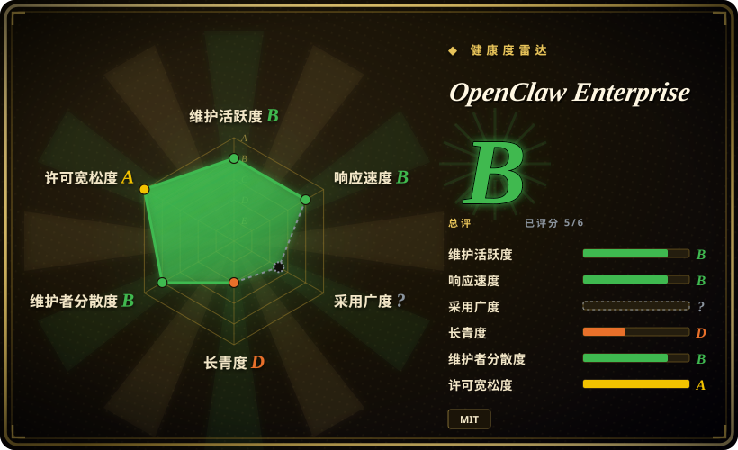
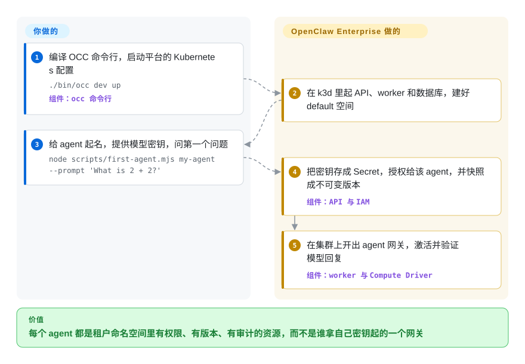

# OpenClaw Enterprise

一台笔记本上跑一个 OpenClaw 助手没问题；给不同部门跑四十个，就是四十份手改的配置、四十处粘进去的 API 密钥，谁改了什么没有记录，也没法规定“客服的 agent 能读这个密钥，市场部的不能”。OpenClaw Enterprise 是管这支队伍的多租户控制面：agent、密钥和权限变成存在 PostgreSQL 里的 API 资源，由 worker 把每个 agent 以带版本、可审计的部署方式发到 Kubernetes 上。

## 何时使用

你是一家公司的平台团队，OpenClaw（或 Codex）agent 已经走出了试点。五个部门都要自己的 agent，各配各的模型密钥、Slack 工作区和文件工作区；安全团队问“财务 agent 用的那把密钥谁能读”，没人答得上来，因为每个 agent 都是某个人拿自己凭据起的一个网关进程。当你缺的是**围绕 agent 的治理**、而不是 agent 本身时，就会想到 OpenClaw Enterprise：每个租户一个 Namespace；一套在每次资源操作时都检查的 IAM 模型（Role、AccessBinding，以及优先拒绝的 Restriction）；Secret 只投递到某个 agent 的运行时，API 永远不回显它的值；每次部署生成一个不可变的 AgentRevision；审计记录和变更在同一个事务里提交。和 [kagent](kagent.zh.md) 比，你不是把 agent 写成 CRD、用 `kubectl` 评审——agent 循环就是原版 OpenClaw 或 Codex，界面是自带 IAM 的 API 和控制台。和直接跑 [OpenClaw](../agent-runtimes/personal-assistants/openclaw.zh.md) 比，你用单操作者的信任模型换来每个 agent 独立身份和租户隔离，代价是一个 Kubernetes 集群、一套 PostgreSQL，以及一个才一个月大的项目。

## 怎么用起来

把它想成物业，而不是住户：OpenClaw Enterprise 自己不推理、也不调模型——每个部署出来的 agent 仍然跑一个普通的 OpenClaw 网关（接收消息的进程）和一个 Harness（调模型、跑工具的部分），两者要么装在同一个 Pod 里（embedded，内嵌），要么拆成一个独立的 Codex 工作负载（dedicated，专用）。项目新增的是控制面 OCC：一个 HTTP API 和浏览器控制台，负责认出调用者、按具体资源检查权限；一个 PostgreSQL，存 agent、密钥、IAM 策略、工作队列和审计事件；还有一个独立的 worker，领走排队的工作、再查一遍权限，然后调用可插拔的 Driver（驱动：Kubernetes Compute、Kubernetes Secret 或 SSH Compute）去建命名空间、Secret 和工作负载。部署时，agent 的配置被快照成不可变版本；改草稿不会碰正在运行的 agent，直到你再部署一次。集群、PostgreSQL、入口网关、模型密钥和 agent 配置由你提供；授权、版本、开通顺序和审计由它负责。

<!-- flow-steps:begin (generated from flows/openclaw-enterprise.json by tools/flow_card.py — do not edit) -->

流程文字版

1. **你**：编译 OCC 命令行，启动平台的 Kubernetes 配置 — `./bin/occ dev up` — 组件：`occ 命令行`
2. **OpenClaw Enterprise**：在 k3d 里起 API、worker 和数据库，建好 default 空间
3. **你**：给 agent 起名，提供模型密钥，问第一个问题 — `node scripts/first-agent.mjs my-agent --prompt 'What is 2 + 2?'`
4. **OpenClaw Enterprise**：把密钥存成 Secret，授权给该 agent，并快照成不可变版本 — 组件：`API 与 IAM`
5. **OpenClaw Enterprise**：在集群上开出 agent 网关，激活并验证模型回复 — 组件：`worker 与 Compute Driver`

**价值**：每个 agent 都是租户命名空间里有权限、有版本、有审计的资源，而不是谁拿自己密钥起的一个网关

<!-- flow-steps:end -->

## 何时不用

- **你只有一个人或一个小团队、一个助手。** 文档专门强调 OCC 不能沿用核心网关“单操作者”的信任假设，这套机制正是为多操作者准备的；只有一个操作者时它纯属成本。直接跑 [OpenClaw](../agent-runtimes/personal-assistants/openclaw.zh.md)。
- **你不跑 Kubernetes。** 能端到端部署 agent 的只有 Kubernetes 路径：Docker／Podman 的 Compose 配置只是控制面预览，官方文档明说它不能部署 Agent；SSH Compute 只能跑内嵌 OpenClaw，没有专用 Codex，也没有 OCC 托管的模型凭据。没有集群、只想协调几个 agent，用 [Paperclip](../../agent-tooling/supervision-surfaces/paperclip.zh.md)。
- **你要把 agent 做成 Kubernetes 自定义资源、走 GitOps 评审。** OCC 的资源存在 PostgreSQL 里、挡在它自己的 API 和 IAM 后面，不在 etcd 里；`kubectl get` 看不到 Agent，Kubernetes RBAC 也替代不了它的授权。用 [kagent](kagent.zh.md)。
- **你要自己写 agent 循环。** Harness 只能选 OpenClaw 或 Codex，没有给你写规划器的框架 API。用 [LangGraph](../agent-runtimes/agent-sdks/langgraph.zh.md)，再按需托管。
- **你的会话大多是闲着的沙箱，账单花在密度上。** OCE 给每个 agent 版本开一个网关并一直运行，不会把空闲工作负载冻住再恢复。用跑在密度运行时上的 [AX](ax.zh.md)。
- **你现在就要“不给沙箱模型密钥”的执行方式。** 架构页把模型中介（`InferenceDriver`、受限出站、无凭据执行）和双向认证的工作负载通信列为“剩余设计工作”；目前 Harness 会拿到模型密钥，专用 Codex 和网关之间走的是带能力令牌的 `ws://`，没有 mTLS。如果硬要求密钥不进沙箱，评估 NVIDIA NemoClaw（未收录）和 OpenShell 的托管推理。
- **你这个季度就要一个正式发布、能直接安装的版本。** 截至 2026-09-30，仓库没有 GitHub release 也没有 tag，`package.json` 写的是 0.1.0，GHCR 上发布的控制器／运行时镜像需要 `read:packages` 权限——匿名申请拉取令牌时返回了 401。没有这个权限，就得自己构建两个镜像（本地快速上手文档为首次构建预留约 20 GB 容器存储）。在公开发布之前，继续用原版 OpenClaw 或 kagent。
- **你的模型提供方不是 OpenAI，又想走铺好的路。** 首个 agent 的教程要求 OpenAI 密钥，专用 Codex Harness 和实验性的 ChatGPT Backend 都是 OpenAI 专属；Slack 必须用专用 Codex，因为开了外部渠道的内嵌版本会被拒绝。其他提供方要走 OpenClaw 原生配置，文档少得多 [未验证]。

## 横向对比

| 替代品 | 是否收录 | 我们的评价 | 取舍 |
|---|---|---|---|
| [OpenClaw](../agent-runtimes/personal-assistants/openclaw.zh.md) | ✅ | 助手和它的凭据归一个操作者管，选原版 OpenClaw；多个团队的 OpenClaw agent 要在共享集群上各有身份、密钥和审计，选 OpenClaw Enterprise。 | OCE 在底下跑的就是 OpenClaw，不是替代它；多出来的是 IAM、版本和租户隔离，代价是 Kubernetes 集群、PostgreSQL 和一个还不成熟的控制面。 |
| [kagent](kagent.zh.md) | ✅ | agent 要做成用 `kubectl` 和 GitOps 评审的 CRD、并在它的引擎上开发，选 kagent；agent 就是原版 OpenClaw／Codex、你要的是带细粒度 IAM 的控制台和 API，选 OCE。 | kagent 继承 Kubernetes RBAC 和 etcd；OCE 把状态放在 PostgreSQL、用自己的 IAM 和审计，Kubernetes 工具看不见。 |
| [AX](ax.zh.md) | ✅ | 一大批短命、大多空闲的沙箱任务要声明和挂起，选 AX；数量较少、长期存在、有名字的 agent 需要按租户治理，选 OCE。 | AX 在 Agent Substrate 上优化密度、不带 agent；OCE 带 agent 运行时和治理，但每个网关一直开着。 |
| [Paperclip](../../agent-tooling/supervision-surfaces/paperclip.zh.md) | ✅ | 独立创业者或小团队要一块能唤醒 agent、给它们封顶预算的任务板，选 Paperclip；组织要给 agent 做租户隔离、IAM 和可审计部署，选 OCE。 | Paperclip 轻、不需要 Kubernetes，但没有租户和 IAM 模型；OCE 有，但要求集群和运维能力。 |
| NVIDIA NemoClaw | 未收录 | 重点是把 OpenClaw 类 agent 放进 OpenShell 沙箱、用托管推理让 agent 拿不到模型密钥，选 NemoClaw；重点是跨多个 agent 的多租户 IAM、版本和审计，选 OCE。本批次标签页收录未添加。 | NemoClaw 聚焦运行时沙箱和推理路径；OCE 自己的文档说，原版 OpenShell 目前给不了它专用路径所需的凭据和工作负载身份。 |

## 技术栈

- **控制面：** Node.js ≥ 24（`apps/controller/`：HTTP API、`/console/` 浏览器控制台、worker），合约、生命周期／工作队列、IAM 和审计各是一个 TypeScript 包（`packages/*`），pnpm 工作区；PostgreSQL 迁移用 Drizzle（`drizzle.config.ts`、`migrations/`）。
- **命令行：** Go（`cmd/occ`、`internal/occcli`、`internal/occclient`），用 `pnpm cli:build` 编出 `bin/occ`。
- **agent 运行时：** OpenClaw 网关加内嵌 Harness，或网关加专用 Codex Harness；专用原生 OpenClaw 通过 Sandbox Driver 提供，属实验性质。
- **Driver：** Kubernetes Compute、Kubernetes Secret、SSH Compute、Docker／Podman Compute（预览）、OpenShell Sandbox 和 Credential Gateway（实验性）；可选的 ChatGPT Backend 管服务账号。
- **打包：** Dockerfile、多份 Compose 文件（Postgres、Podman、日志、指标），`deploy/helm/` 下的 Helm chart：`openclaw-enterprise`、`openclaw-execution` 和一个可观测性演示。
- **认证：** 人类会话（由管理员登记的 GitHub 或 Google 登录）和服务 API 密钥；原生 IAM Driver。

## 依赖

- **Kubernetes 1.35 及以上**，IPv4，能强制执行 NetworkPolicy 的网络插件，专用工作区需要支持 `ReadWriteOnce` 的默认 StorageClass；设计要求把受信的网关节点池和不受信的 Harness 节点池分开。
- **事先装好 Envoy Gateway、Gateway API CRD 和 cert-manager**——chart 不装它们，也不创建公网 Ingress 和 TLS。
- **外部 PostgreSQL**，应用角色和迁移角色分开，并启用经过校验的 TLS。
- **一个集群能拉取的镜像仓库**，外加 GHCR 的 `read:packages` 权限去拉发布镜像，或者自己本地构建两个镜像。
- **运维工具：** Helm、`kubectl`、Python 3、`yq` v4、Bash、Node.js 24+、Docker 和 Git；本地还要 k3d 和 Go。
- **一把模型凭据**（文档里的首条路径是 OpenAI API 密钥）；接 Slack 还要 Slack 应用令牌。

## 运维难度

**高。** 你要在 Kubernetes 旁边再运维一套控制面：API 和 worker 两个 Deployment，一个带两个角色的外部 PostgreSQL，引导用的服务密钥（其恢复有单独的运行手册），给工作区用的 Envoy Gateway 路由，以及 worker 在你集群里建出来的各租户命名空间。文档特别坦白，成功是分层的——控制面就绪不代表 Agent 能回答，部署成功也不代表工作区能访问、模型能真的回复——所以每次安装都要单独验一遍。控制器凭据在租户命名空间内是受信的（设计文档写明，有工作负载写权限就可能间接拿到 Secret），控制器本身就是高价值目标。项目才一个月，每天都在合并、没有发布版本，每次升级都意味着跟 `main` 并重跑迁移。

## 健康度与可持续性

- **维护（2026-09-30）。** 非常活跃：自 2026-08-31 的“Initial OpenClaw Enterprise release”提交以来共 1945 个提交、477 个已合并 PR，最后推送于 2026-09-30。没有 release 也没有 tag，只能跟 `main`。
- **治理与巴士系数（2026-09-30）。** 仓库在 `openclaw` 组织下，但 LICENSE 的版权人是 OpenAI，主要提交者的账号带 `-openai`／`-oai` 后缀（freeqaz 与 freeqaz-openai 合计约 1025、kevinlin-openai 514、stevenlee-oai 115）。另一组账号（mrunalp、russellb、sallyom、derekwaynecarr）贡献量较小。路线图以里程碑 issue M6–M8 公开（SPIFFE／SPIRE 工作负载身份、统一沙箱策略语言、Secret Broker），开于 2026-09-10；CONTRIBUTING 写了 RFC 流程。
- **背书与 Lindy（2026-09-30）。** 大约一个月大——Lindy 先验不给加分。背后是大厂而不是个人爱好者，被弃坑的风险低一些，但路线图跟着这家厂商的产品计划走；未关闭的 issue #419 标题是“After DevDay: remove legacy RWX Harness workspace compatibility”。
- **采用与生态（2026-09-30）。** 约 112 星、12 个 fork、1 个 watcher：基本处于采用之前。没有公开的包或镜像可以统计下载量，GHCR 镜像需要认证访问。
- **风险信号（2026-09-30）。** MIT，没有改许可证的历史。尚未发布、随时可能破坏兼容；关键安全能力（外部准入网关、工作负载令牌认证、无凭据推理、网关与 Harness 之间的 mTLS）在文档里写明尚未实现；ChatGPT Backend 和双集群配置是实验性的；原生管理界面试点绕过了 OCC 对每条命令的授权和审计。

## 存疑（未验证）

- [未验证] 发布镜像以后会不会公开可拉：需要私有权限这一点来自 `docs/guides/deploy/published-images.md`，加上 2026-09-30 一次匿名令牌请求返回 401，并非来自明确的政策声明。
- [未验证] 非 OpenAI 提供方：`docs/reference/agents.md` 提到 agent 可以用 Anthropic API 密钥，但没找到针对非 OpenAI 提供方的教程，本页也没有实际部署验证。
- [推断] 与 OpenAI 的关系是从 LICENSE 版权行（“Copyright (c) 2026 OpenAI”）和贡献者账号名推出来的；没有找到说明归属或支持承诺的治理文档。
- [推断] 第二组贡献者（mrunalp、russellb、sallyom、derekwaynecarr）的所属机构没有对照任何来源核实，本页只把他们当作不带 `-openai` 后缀的账号。
- [推断] “OpenShell” Sandbox Driver 指向的是 NVIDIA 的 OpenShell 项目；读过的文件里只写了“stock OpenShell”，没有给出仓库链接。
- [未验证] 与 NemoClaw 的对比依据是它的 GitHub 描述（“Run agents like Hermes, LangChain Deep Agents, and OpenClaw more securely inside NVIDIA OpenShell with managed inference”），没有读它的代码。
- [未验证] 规模上限（每个 Installation 能有多少 agent、worker 吞吐）没有文档，也没有实测；唯一写明的数字是专用原生 OpenClaw 会话默认保留 8 个 worker。
