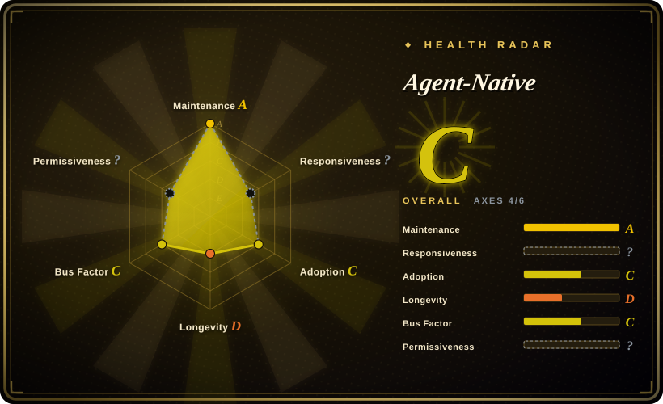
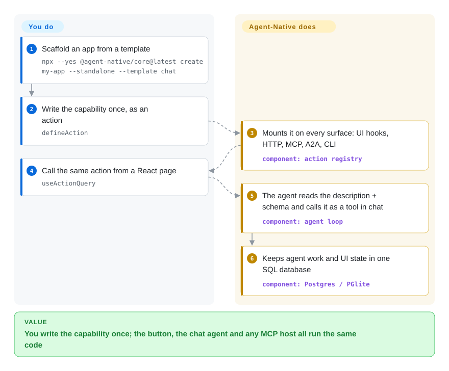

# Agent-Native

You want the agent inside your product to actually *do* the work — answer the ticket, build the slide deck, move the record — and the moment you build that, every capability has to be wired twice: once for the button the user clicks, once for the tool the model calls, with the two drifting apart. Agent-Native defines each capability once as an **action**, and that single function is what both the UI and the agent run.

## When to use

You are shipping a product — internal tool or customer-facing SaaS — where AI should complete tasks rather than chat beside them: triage the inbox, generate the deck, update the CRM record, run the nightly report. The work already has a home in your app; the missing piece is that the agent can perform it. Left to itself, that means a second, agent-only integration into your backend, which then drifts from whatever the UI calls, and every capability you add has to be built twice.

Reach for Agent-Native when you are willing to let one TypeScript app own the whole stack — React front end, its own server, PostgreSQL — and you want the agent's capabilities to *be* the app's own operations. That is the deciding difference from its nearest substitutes. Code-first agent SDKs ([LangChain](langchain.md), [LangGraph](../agent-runtimes/agent-sdks/langgraph.md)) hand you the agent and leave the application to you, so you still owe the UI, auth, database and the double-wiring. Visual platforms ([Dify](dify.md), [Langflow](langflow.md)) put the logic in a canvas rather than in code you review and version. Agent-Native trades both away: you give it ownership of the app, and in exchange the UI and the agent cannot disagree, because there is only one implementation.

## Q&A

Questions that came up reading this page, with short answers:

- **Is it a from-scratch framework, or can it go into an existing system?** Both exist, with a caveat. It can own a new app end-to-end (`create`), drop only its chat panel (`<AgentSidebar>`, `<AgentPanel>`, `sendToAgentChat()`) into an existing React app, or run as an "embedded sidecar" beside an existing SaaS. But in every mode it brings its own server and its own PostgreSQL/PGlite tables — it does not run inside your existing backend. [推断]
- **How does the chat side learn my capabilities — MCP, skills, or something else?** Directly from the actions. The built-in agent loop takes the app's registered actions as tools; there is no separate registration step. MCP and A2A are *additional outlets* over that same action registry (for external hosts), and skills are on-demand instructions, not the capability wiring.
- **My chatbot is built on a different runtime — how do I wire that?** If that runtime speaks MCP, point it at the app's `/mcp` and the actions appear as tools. If it doesn't, write an ordinary tool on that side that calls the action's HTTP endpoint (`POST /_agent-native/actions/<name>`). Agent-Native does not inject tools into a foreign runtime. Concretely, Pi-Mono ships no MCP client by design, so a chatbot built on it would still need an MCP extension or an HTTP tool on its side.
- **Isn't "one action per capability" a hard abstraction?** The definition is small — `description`, `schema`, `run` — and the awkward cases have built-in knobs (`needsApproval`, `authorize`, `chatUI`, `endsTurn`, `deferLoading`). The genuinely hard part is *granularity*: one action per user intent, not one per button, so the model neither drowns in tools nor gets a block too coarse to compose.

## How it works

Every capability lives in one file under `actions/`, and the framework auto-discovers it at startup — you never register anything by hand. An action is a `defineAction({ description, schema, run })`: `description` is what the model reads to decide *when* to call it, `schema` is a typed contract (Zod by default) that validates the input on every caller and doubles as the JSON Schema in the tool definition, and `run` is the implementation. From that one definition the framework mounts a UI hook (`useActionQuery` / `useActionMutation`), an HTTP route at `/_agent-native/actions/<name>`, an MCP tool, an A2A tool and a CLI command — so the button and the agent tool are literally the same function. MCP and A2A are the standard protocols that let *other* agents call your app; here they are extra doors onto that same registry, not a separate integration to maintain. The app you get is more than a loop: chat, authentication, durable SQL-backed sessions, skills and memory rows, and automations all ship, and agent work lands in the same tables the UI reads, so the two views stay one state.

<!-- flow-steps:begin (generated from flows/agent-native.json by tools/flow_card.py — do not edit) -->

Text version of the flow

1. **You**: Scaffold an app from a template — `npx --yes @agent-native/core@latest create my-app --standalone --template chat`
2. **You**: Write the capability once, as an action — `defineAction`
3. **Agent-Native**: Mounts it on every surface: UI hooks, HTTP, MCP, A2A, CLI — component: `action registry`
4. **You**: Call the same action from a React page — `useActionQuery`
5. **Agent-Native**: The agent reads the description + schema and calls it as a tool in chat — component: `agent loop`
6. **Agent-Native**: Keeps agent work and UI state in one SQL database — component: `Postgres / PGlite`

**Value**: You write the capability once; the button, the chat agent and any MCP host all run the same code

<!-- flow-steps:end -->

## When NOT to use

- **You already run a non-JS backend you are not replacing.** Agent-Native wants to own the server (Nitro) and the database (PostgreSQL). A Go/Java/Python service on MySQL or a different relational store is not where it plugs in — adopting it means a second application stack and a second database, not a library you call. If the agent must live *inside* your existing service, use a code-first SDK such as [LangGraph](../agent-runtimes/agent-sdks/langgraph.md) or [LangChain](langchain.md) instead.
- **You only want a chat panel in an existing React app, nothing more.** `<AgentSidebar>` does drop in, but it still assumes its own server is running the agent-chat plugin; if the app, auth and agent loop are already yours, a UI-only library (Vercel AI SDK or assistant-ui — neither indexed) is lighter. Reach for the embedded sidecar only when you also want the durable agent state it brings.
- **You need API stability or semver discipline.** `@agent-native/core` went from 0.1.0 to 0.186.0 in roughly six months, its Nitro dependency is a beta build, and releases land many times a day (per-package changesets). Pin a version and budget for churn; if stable contracts matter more than the app scaffolding, pick a more settled framework.
- **License must be unambiguous before commercial distribution.** The README and the npm package say MIT, but the repository has **no `LICENSE` file** and the root `package.json` declares `ISC` — three signals, no authoritative text. Get legal sign-off, or choose a repo with a checkable license. This is the sharpest disqualifier. [未验证]
- **You want no-code or visual composition.** The capability lives in TypeScript you review; if the team's entry point must be a canvas, use [Dify](dify.md), [Langflow](langflow.md) or Flowise.
- **You are betting a long-lived platform on it today.** Created 2026-03, so roughly six months old — see Health. Treat the Lindy prior accordingly and keep an exit path.

## Comparison

| Alternative | In index | Our verdict | Tradeoff |
|---|---|---|---|
| [LangChain](langchain.md) | ✅ | Choose LangChain when the agent belongs inside your existing Python/TS service and you want the widest integration ecosystem, leaving the app itself to you. | You keep full control of the stack and gain integrations, but you build (and keep in sync) the UI, auth and database yourself — the exact work Agent-Native absorbs. |
| [LangGraph](../agent-runtimes/agent-sdks/langgraph.md) | ✅ | Choose LangGraph when the hard part is durable, resumable, graph-shaped agent state inside your own process, not the product around it. | Best-in-class orchestration control with no opinion about your app; Agent-Native gives you a runnable app but a more prescriptive shape (actions + its server + Postgres). |
| [Dify](dify.md) | ✅ | Choose Dify when a non-coding team must compose and operate agentic workflows from a visual console with built-in RAG. | Far lower barrier and an operator UI, but logic lives in a canvas that is harder to diff, review and version than TypeScript — the trade Agent-Native makes in the other direction. |
| [Langflow](langflow.md) | ✅ | Choose Langflow when you want a drag-and-drop builder that still emits callable APIs and MCP servers for the flows you draw. | Visual iteration is fast, but complex logic gets awkward to maintain in a graph; Agent-Native keeps capabilities as ordinary reviewed code. |
| CopilotKit | 未收录 | Choose CopilotKit when you must keep your current React app and only want to layer agent UI plus shared app state onto it. | It assumes your own backend and does not hand you a server, database or action registry — the part Agent-Native adds. Real repository, deliberately not added in this batch (comparison backlog). |
| Vercel AI SDK | 未收录 | Choose Vercel AI SDK when you are adding model calls and streaming UI to an app you already own and do not want a framework owning the stack. | A library, not an application framework: no agent chat surface, SQL state or capability registry out of the box. Real repository, deliberately not added in this batch (comparison backlog). |

## Tech stack

- **Language:** TypeScript; a pnpm monorepo (packages plus template apps).
- **Front end:** React 19 with React Router 7.
- **Server:** Nitro (a beta build in the dependency set), with Drizzle ORM.
- **Database:** PostgreSQL in production; PGlite (an in-process Postgres) for local development when `DATABASE_URL` is unset.
- **Auth:** better-auth, with SCIM/SSO packages present.
- **Agent plumbing:** the framework's own agent loop, plus MCP, A2A and AG-UI runtime adapters; Zod/Standard Schema for action contracts.
- **Shells in-repo:** an Electron desktop app and a mobile app, alongside the web templates.

## Dependencies

- **Node.js ≥ 22.22 and pnpm ≥ 10** (`corepack enable`) to scaffold and build.
- **A PostgreSQL database for production.** Locally nothing external is required — the default is PGlite on disk.
- **An LLM connection.** The getting-started flow offers Builder.io free credits, a custom Anthropic/OpenAI key, or a local Ollama model.
- **Nothing extra for external-agent access** — the MCP endpoint mounts automatically once the app runs.

## Ops difficulty

**Medium to high**, and the difficulty is mostly weight rather than exotic moving parts. The repository is large (21 packages; the `core` package alone pulls 85 dependencies; the checkout is hundreds of MB), and deploying means running a Nitro app against a real PostgreSQL — so you are operating a full web application, not embedding a library. Because the project is pre-1.0 and releasing many times a day, upgrades and dependency bumps need active management; you should pin and treat version bumps as a maintenance task. Standing it up locally is easy (one command, PGlite, no external DB), which is why the ramp is comfortable but the long-run cost is higher than the install suggests.

## Health & viability

- **Age & Lindy prior (2026-09-24).** Created **2026-03-12**, so about **six months old**. By the Lindy prior that is young: the ~6.7k stars are a *risk flag to weigh*, not evidence of durability, because a young repo with fast star growth has not been tested by time. [推断]
- **Maintenance.** Very active — pushed the day this was verified, thousands of commits on `main`, and roughly 100 releases in the trailing 30 days across its packages. If anything the cadence is faster than an adopter can track. [推断]
- **Governance / bus factor.** Owned by **BuilderIO** (an organization with a track record across Builder.io, Qwik and Mitosis), which lowers abandonment risk, and about 69 contributors were active over the trailing year. But contribution is concentrated: the top contributor (`steve8708`) accounts for roughly two-thirds of commits in that window, so the roadmap leans on one person. [推断]
- **Adoption.** ~6.7k stars, ~605 forks, and ~177,070 monthly npm downloads on `@agent-native/core` (~47k in the week ending 2026-09-15) — real usage for a six-month-old project, with a template gallery and Discord behind it.
- **Risk flags.** The **license is ambiguous** (no `LICENSE` file; README/npm say MIT, root `package.json` says ISC) — the single most important flag for commercial adopters. Pre-1.0 with beta and fast-moving dependencies. Some advertised app surfaces live on the vendor's site, and it is not clear which of those are the open-source templates versus hosted demos. [未验证]

## Caveats (unverified)

- [未验证] **License:** the repository root has no `LICENSE` file (GitHub's license API returns 404 and a code search finds only font/vendor licenses), while `README.md` says MIT, `packages/core/package.json` says MIT, and the root `package.json` says `ISC`. The absence is verified; the maintainers' intended license is not.
- [未验证] Star, fork and npm-download figures, and the release cadence, are point-in-time readings on 2026-09-24 — star counts are unreliable and dated; re-check before citing.
- [推断] The bus-factor reading comes from contributor counts, not from governance documents; a concentrated top contributor is a signal, not a proven single point of failure.
- [未验证] "Nitro is a beta build" is read from the resolved dependency (`nitro 3.0.260610-beta`); whether the project intends to ship production on a beta and when it will settle is not confirmed.
- [推断] The claim that all embedding modes (drop-in panel, embedded sidecar) work cleanly against a foreign backend is from the project's docs; it was not run, and the docs state a server prerequisite that implies its own service is still required.
- [未验证] Which surfaces of the advertised app gallery (`agent-native.com/apps`) are the open-source templates versus hosted-only demos is not established from the repository.
- [未验证] The security posture of provider-URL handling was not assessed here; a related SSRF report was opened and closed in September 2026, and its fix was not verified.
